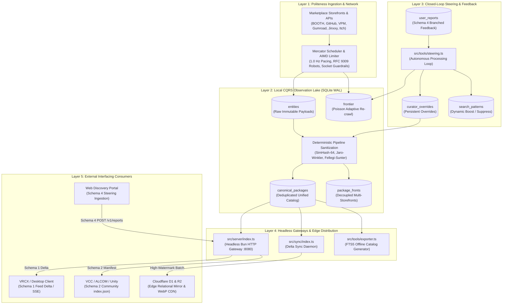
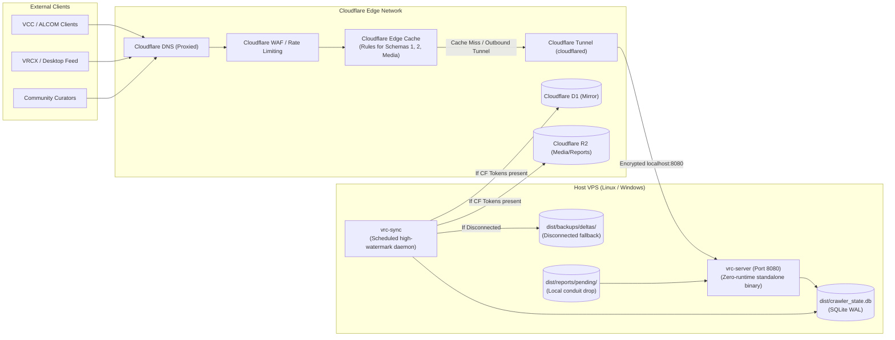

# VRChat Package Crawler: Autonomous Metadata Ingestion, Unified Schema & Interfacing Handover

**Repository:** `F:\.repo\.main\vrc-package-crawler`  
**Revision:** Phase 2 Complete (Unified Schema & Headless Ingestion Gateways)  
**Binary Distribution:** Standalone Single-File Native Executables (`dist/`)  
**Test Suite:** 40 / 40 passing tests (`tests/`)  

---

## 1. System Overview & Operational Topography

The **VRChat Package Crawler** is a high-throughput, autonomous, zero-binary discovery engine and metadata aggregator for the decentralized VRChat creator ecosystem (BOOTH.pm, GitHub, VPM Repositories, Gumroad, Jinxxy, and itch.io). 

It operates as a cost-minimized, portable, low-power self-hosted service (Windows/Linux) that indexes public tools, Unity editor extensions, shaders, and VPM libraries while strictly directing all commercial checkout intent directly to original creator storefronts.



---

## 2. Zero-Runtime Portability & Standalone Compilation

The engine requires **zero runtime dependencies** on host servers. All dependencies (Bun runtime, libuv, SQLite engine, sharp/vips codecs) are pre-compiled and baked directly into standalone native executables:

| Binary | Source | Target | Purpose |
|---|---|---|---|
| `dist/vrc-crawler.exe` | `src/crawler/index.ts` | Windows x64 | Autonomous crawling daemon with Mercator host schedulers |
| `dist/vrc-server.exe` | `src/server/index.ts` | Windows x64 | Headless REST gateway for Schemas 1, 2, and 4 |
| `dist/vrc-server-linux` | `src/server/index.ts` | Linux x64 | Headless REST gateway for Linux VPS deployment |
| `dist/vrc-sync.exe` | `src/sync/index.ts` | Windows x64 | High-watermark Cloudflare D1/R2 incremental synchronizer |
| `dist/vrc-monitor.exe` | `src/monitor/index.ts` | Windows x64 | Real-time CLI terminal dashboard and saturation metrics |
| `dist/vrc-export.exe` | `src/tools/exporter.ts` | Windows x64 | Standalone defragmented FTS5 SQLite catalog generator |
| `dist/vrc-crawler-linux` | `src/crawler/index.ts` | Linux x64 | Headless Linux service binary |

Compilation Command:
```bash
bun run build:all
```

---

## 3. Unified Database Schema Specification

The database architecture unifies legacy transitional tables (V1) and operational storage (V2) into an optimized, crash-resilient SQLite catalog running in `PRAGMA journal_mode = WAL;` and `PRAGMA synchronous = NORMAL;`.

### 3.1 Table Directory

| Table Name | Storage Role | Invariant / Retention Policy |
|---|---|---|
| `frontier` | Crawl Queue & Scheduler | Cho-Garcia-Molina Poisson adaptive interval, ETag/Last-Modified tracking |
| `entities` | Immutable Observation Lake | CQRS raw payload capture. Never deleted; records quarantined items |
| `canonical_packages` | Derived Catalog Projection | Deduplicated package records with lifecycle, timestamps, and multi-storefront routing |
| `package_fronts` | Storefront Links | Decoupled platform listings (BOOTH, GitHub, Gumroad, Jinxxy, Itch) linked to canonical ID |
| `curator_overrides` | Persistent User Steering | Community corrections (titles, descriptions, categories, tags) surviving pipeline rebuilds |
| `user_reports` | Ingested Feedback Buffer | Schema 4 branched feedback submissions awaiting autonomous steering ingestion |
| `search_patterns` | Closed-Loop Query Weights | Dynamic negative tokens, boost/suppress rules, and priority seed queues |
| `creator_opt_outs` | Legal Exclusion Registry | Verified takedown patterns and creator bio-token exclusion rules |
| `media_cache` | Thumbnail Proxy Cache | WebP thumbnails, BlurHash strings, and 64-bit perceptual hashes (pHash) |
| `sync_checkpoints` | Edge Watermarks | High-watermark rowid tracking for incremental Cloudflare D1/R2 sync |

### 3.2 Core Table DDLs

```sql
-- 1. Canonical Packages Projection (Consolidated & Unified)
CREATE TABLE IF NOT EXISTS canonical_packages (
  id TEXT PRIMARY KEY,                                      -- Invariant reverse-DNS ID (e.g. nadena.dev.modular-avatar)
  canonical_id TEXT NOT NULL UNIQUE,                        -- URL-safe slug identifier
  name TEXT NOT NULL,                                       -- Arbitration title (curator overridden if available)
  author TEXT NOT NULL,                                     -- Primary author alias
  authors_json TEXT DEFAULT '[]',                           -- All resolved co-authors / contributors
  category TEXT NOT NULL,                                   -- Top-level category (Avatars, World Creation, etc.)
  subcategory TEXT NOT NULL,                                -- Deep taxonomy subcategory
  type TEXT NOT NULL,                                       -- 'QoL, Workflow & Toolchain' | 'Asset Additive'
  description TEXT,                                         -- Factual description excerpt
  primary_platform TEXT NOT NULL,                           -- Origin host ('vpm', 'github', 'booth', etc.)
  platforms_json TEXT NOT NULL,                             -- Array of available storefront platforms
  url TEXT NOT NULL,                                        -- Canonical checkout / repository URL
  vcc_url TEXT,                                             -- VPM direct repository link
  github_url TEXT,                                          -- GitHub repository link
  booth_url TEXT,                                           -- BOOTH.pm storefront link
  gumroad_url TEXT,                                         -- Gumroad storefront link
  jinxxy_url TEXT,                                          -- Jinxxy marketplace link
  itch_url TEXT,                                            -- itch.io store link
  price_currency TEXT DEFAULT 'USD',                        -- Pricing currency code (USD, JPY)
  price_amount REAL DEFAULT 0,                              -- Base pricing value
  is_vcc INTEGER NOT NULL DEFAULT 0,                        -- Boolean flag for VCC/ALCOM support
  tags_json TEXT DEFAULT '[]',                              -- Ecosystem tags
  dependencies_json TEXT DEFAULT '{}',                      -- VPM dependency map
  source_ids_json TEXT NOT NULL,                            -- Foreign keys into entities observation lake
  media_id TEXT,                                            -- FK into media_cache
  origin_created_at TEXT,                                   -- Earliest verified creation date
  origin_updated_at TEXT,                                   -- Latest observed update timestamp
  created_at_confidence TEXT DEFAULT 'unknown'              -- 'confirmed' | 'inferred' | 'unknown'
    CHECK(created_at_confidence IN ('confirmed','inferred','unknown')),
  lifecycle TEXT DEFAULT 'published'                        -- Package state
    CHECK(lifecycle IN ('published','updated','delisted','archived',
                        'paywall_introduced','dmca_removed','creator_opted_out')),
  lifecycle_updated_at TEXT,                                -- Timestamp when lifecycle changed
  created_at TEXT NOT NULL,                                 -- Record creation timestamp
  updated_at TEXT NOT NULL                                  -- Record update timestamp
);

-- 2. Persistent Curator Overrides (Survives pipeline wipes)
CREATE TABLE IF NOT EXISTS curator_overrides (
  id TEXT PRIMARY KEY,                                      -- 'cov_<canonical_id>'
  canonical_id TEXT NOT NULL UNIQUE,                        -- Target package slug
  name_override TEXT,                                       -- Cleaned display title
  title_override TEXT,                                      -- Alternative title
  url_override TEXT,                                        -- Canonical storefront override
  description_override TEXT,                                -- Curated STE description
  category_override TEXT,                                   -- Corrected class
  subcategory_override TEXT,                                 -- Corrected subcategory
  added_tags_json TEXT DEFAULT '[]',                        -- Positive tags to merge
  removed_tags_json TEXT DEFAULT '[]',                      -- Negative tags to purge
  reason TEXT,                                              -- Submitter / curator rationale
  reporter_id TEXT,                                         -- Client fingerprint / reporter
  created_at TEXT NOT NULL,
  updated_at TEXT NOT NULL
);

-- 3. Ingested Feedback Buffer (Schema 4 Ingestion)
CREATE TABLE IF NOT EXISTS user_reports (
  report_id TEXT PRIMARY KEY,                               -- Unique submission ID
  target_package_id TEXT NOT NULL,                          -- Target canonical ID or platform item ID
  target_package_name TEXT NOT NULL,                        -- Package title for context
  branch TEXT NOT NULL                                      -- Discrete decision branch
    CHECK(branch IN ('categorization','irrelevance','listing','tags','discovery_query')),
  branch_payload_json TEXT NOT NULL,                        -- Branch-specific structured payload
  reporter_notes TEXT,                                      -- Freeform feedback notes
  client_fingerprint TEXT,                                  -- IP hash / OAuth user ID
  trust_tier TEXT DEFAULT 'anonymous'                       -- 'anonymous' | 'verified_creator' | 'trusted_curator'
    CHECK(trust_tier IN ('anonymous','verified_creator','trusted_curator')),
  status TEXT DEFAULT 'pending'                             -- 'pending' | 'applied' | 'rejected'
    CHECK(status IN ('pending','applied','rejected')),
  applied_at TEXT,                                          -- Processing timestamp
  submitted_at TEXT NOT NULL,                               -- Original user timestamp
  created_at TEXT NOT NULL                                  -- Ingestion timestamp
);

-- 4. Closed-Loop Search Patterns
CREATE TABLE IF NOT EXISTS search_patterns (
  id TEXT PRIMARY KEY,                                      -- Pattern ID
  query TEXT NOT NULL UNIQUE,                               -- Ingested search term
  query_intent TEXT,                                        -- Intent classification
  relevance_vote TEXT NOT NULL                              -- 'boost' | 'suppress'
    CHECK(relevance_vote IN ('boost','suppress')),
  negative_tokens_json TEXT DEFAULT '[]',                   -- Negative terms to filter from queries
  suggested_seeds_json TEXT DEFAULT '[]',                   -- Crawler seeds to enqueue
  weight REAL DEFAULT 1.0,                                  -- Ranking influence weight
  created_at TEXT NOT NULL,
  updated_at TEXT NOT NULL
);
```

---

## 4. External Interfacing Schematics

External tools and platforms (such as VRCX, Obsidian, Unity Editor, and community web frontends) interact with the crawler using four standardized data contracts.

### 4.1 What the Architecture OFFERS

#### Endpoint 1: Schema 1 — Incremental Feed Delta Stream
* **Route:** `GET /v1/catalog/delta?cursor=<rowid>&limit=<count>`
* **Consumer:** VRCX, Obsidian synchronization plugins, RSS daemons
* **Format:** JSON Stream / Paginated REST payload with SHA-256 tamper verification digest.
* **Payload Structure:**
```json
{
  "cursor": "15600",
  "nextCursor": "15650",
  "generatedAt": "2026-09-18T17:30:00.000Z",
  "deltaCount": 1,
  "sha256Digest": "7f83b1657ff1fc53b92dc18148a1d65dfc2d4b1fa3d677284addd200126d9069",
  "deltas": [
    {
      "action": "ADDED",
      "canonicalId": "nadena-dev-modular-avatar",
      "timestamp": "2026-09-18T17:25:00.000Z",
      "package": {
        "name": "Modular Avatar",
        "author": "bd_",
        "category": "Tools & Utilities",
        "subcategory": "Avatars / Setup & Optimization",
        "type": "QoL, Workflow & Toolchain",
        "primaryPlatform": "github",
        "url": "https://github.com/bdunderscore/modular-avatar",
        "isVcc": true,
        "tags": ["vpm-package", "avatar", "non-destructive"],
        "media": {
          "thumbnailUrl": "https://cdn.vrc-catalog.net/thumbs/modular-avatar.webp"
        }
      }
    }
  ]
}
```

#### Endpoint 2: Schema 2 — Official VPM Community Repository Manifest
* **Route:** `GET /v1/vpm/index.json`
* **Consumer:** VRChat Creator Companion (VCC), ALCOM, Unity Package Manager
* **Format:** RFC-compliant VPM repository manifest. Adding `http://<host>:8080/v1/vpm/index.json` into VCC/ALCOM immediately indexes all discovered VPM packages for 1-click project installation.
* **Payload Structure:**
```json
{
  "$schema": "https://json-schema.org/draft/2020-12/schema",
  "name": "VRChat Community Asset Catalog",
  "id": "net.vrc-catalog.community",
  "url": "http://127.0.0.1:8080/v1/vpm/index.json",
  "author": "VRChat Community Indexers",
  "description": "Decentralized VPM repository aggregating community tools and packages",
  "packages": {
    "nadena.dev.modular-avatar": {
      "versions": {
        "1.10.1": {
          "name": "nadena.dev.modular-avatar",
          "version": "1.10.1",
          "displayName": "Modular Avatar",
          "description": "Non-destructive avatar components for VRChat",
          "url": "https://github.com/bdunderscore/modular-avatar/releases/download/v1.10.1/nadena.dev.modular-avatar-1.10.1.zip",
          "vpmDependencies": {
            "com.vrchat.avatars": ">=3.5.0"
          }
        }
      }
    }
  }
}
```

#### Endpoint 3: Daemon Health & Telemetry
* **Route:** `GET /v1/health`
* **Format:** JSON status indicating uptime, database metrics, and queue depth.
```json
{
  "status": "healthy",
  "version": "2.0.0",
  "uptimeSeconds": 1420,
  "metrics": {
    "totalDiscovered": 37501,
    "totalEntities": 19150,
    "totalQuarantined": 24907,
    "totalMerged": 15642
  },
  "timestamp": "2026-09-18T17:35:00.000Z"
}
```

#### Loopback IPC Control Server
* **Endpoint:** `http://127.0.0.1:8765` (configurable via `CRAWLER_IPC_PORT`)
* **Commands:**
  - `POST /recrawl` — Forces Poisson adaptive re-crawl of stale entities
  - `POST /project` — Triggers deterministic deduplication and pipeline rebuild
  - `POST /export` — Runs defragmented FTS5 SQLite catalog export
  - `POST /stop` — Clean graceful shutdown

---

### 4.2 What the Architecture ACCEPTS

#### Endpoint 4: Schema 4 — Upstream User Steering Report (Branched Decision Model)
* **Route:** `POST /v1/reports`
* **Rate Limit:** 10 requests / minute per client IP or `X-Client-Fingerprint` header.
* **Authentication:** Optional HMAC-SHA256 bearer token via `CRAWLER_API_TOKEN`.
* **Decision Branches:** The client selects one of 5 discrete micro-reporting branches:

##### Branch A: Categorization (`branch = "categorization"`)
```json
{
  "reportId": "rep_cat_982341",
  "targetPackageId": "booth-5129841",
  "targetPackageName": "Face Tracking OSC Bridge",
  "branch": "categorization",
  "submittedAt": "2026-09-18T17:00:00.000Z",
  "branchPayload": {
    "suggestedClass": "Tools & Utilities",
    "suggestedSubcategory": "Hardware / OSC & Tracking"
  }
}
```

##### Branch B: Irrelevance & Exclusion (`branch = "irrelevance"`)
```json
{
  "reportId": "rep_irr_441209",
  "targetPackageId": "booth-8831920",
  "targetPackageName": "Gothic Dress for Selestia",
  "branch": "irrelevance",
  "submittedAt": "2026-09-18T17:05:00.000Z",
  "branchPayload": {
    "irrelevanceReason": "cosmetics_only",
    "negativeTokens": ["dress", "clothing", "selestia", "outfit"]
  }
}
```

##### Branch C: Listing & Metadata Override (`branch = "listing"`)
```json
{
  "reportId": "rep_lst_330194",
  "targetPackageId": "gumroad-polytool",
  "targetPackageName": "Polytool",
  "branch": "listing",
  "submittedAt": "2026-09-18T17:10:00.000Z",
  "branchPayload": {
    "nameOverride": "Polytool - Avatar Optimizer",
    "correctedUrl": "https://markcreator.gumroad.com/l/Polytool",
    "correctedDescription": "High-performance polygon decimation and material optimizer."
  }
}
```

##### Branch D: Tag Enrichment (`branch = "tags"`)
```json
{
  "reportId": "rep_tag_110943",
  "targetPackageId": "github-anatawa12-vrc-get",
  "targetPackageName": "vrc-get",
  "branch": "tags",
  "submittedAt": "2026-09-18T17:15:00.000Z",
  "branchPayload": {
    "addTags": ["cli", "package-manager", "rust", "alcom-backend"],
    "removeTags": ["unsupported"]
  }
}
```

##### Branch E: Closed-Loop Discovery Query Steering (`branch = "discovery_query"`)
```json
{
  "reportId": "rep_qry_771923",
  "targetPackageId": "booth-4891024",
  "targetPackageName": "PhysBone Helper",
  "branch": "discovery_query",
  "submittedAt": "2026-09-18T17:20:00.000Z",
  "branchPayload": {
    "searchQuery": "avatar physbone tool",
    "queryIntent": "rigging optimization",
    "relevanceVote": "boost",
    "negativeTokens": ["cloth-mesh", "hair-texture"],
    "suggestedSeeds": [
      "https://booth.pm/ja/items?query=PhysBone+setup",
      "https://github.com/topics/vrchat-physbones"
    ]
  }
}
```

---

## 5. Autonomous Steering Engine Mechanics (`src/tools/steering.ts`)

The steering subsystem runs continuously inside the crawler daemon or as a decoupled cron process (`bun run steering`):

1. **Pull Ingestion (Cloudflare R2 / Disk Drops):**
   - Polls `reports/pending/*.json` (or presigned R2 uploads).
   - Validates JSON against Schema 4.
   - Enqueues into `user_reports` table.
   - Moves processed files to `reports/processed/<uuid>.json`.

2. **Autonomous Dispatch Loop:**
   - Dequeues pending reports ordered by timestamp.
   - **`categorization`**: Upserts `curator_overrides`, updates `canonical_packages` immediately.
   - **`irrelevance`**: Flags package `lifecycle = 'delisted'`, marks raw observations `is_quarantined = 1`, and creates suppress rules in `search_patterns`.
   - **`listing`**: Upserts name, title, description, and canonical URL overrides into `curator_overrides`.
   - **`tags`**: Applies added tags, purges removed tags, and updates canonical projections.
   - **`discovery_query`**: Records negative tokens into `search_patterns` and enqueues `suggestedSeeds` into `frontier` with `priority = 100`.
   - Marks report `status = 'applied'` with `applied_at` timestamp.

---

## 6. Foundational Invariants & Compliance Boundaries

Every delegate, interfacing tool, and downstream system integrating with this crawler must respect the five foundational invariants:

1. **The Zero-Binary Invariant:**
   The crawler collects **zero 3D meshes, textures, .unitypackage archives, .fbx models, or compiled scripts**. Any response stream exceeding 2 MB or returning binary MIME types is immediately aborted.
2. **The Metadata-Only Boundary:**
   The catalog collects only public factual attributes: titles, tags, compatibility flags, prices, and vendor URLs. Full copyright-protected creative marketing narratives are excluded.
3. **The Canonical Traffic Redirection Invariant:**
   Every search result, delta record, and catalog entry MUST link users directly to the original creator's storefront checkout URL without obfuscation or unauthorized affiliate tagging.
4. **The Absolute Anti-AI Sanctity:**
   Harvested metadata and preview thumbnails must **never** be used for generative AI training sets or machine learning model compilation.
5. **RFC 9309 Robots Exclusion Compliance:**
   The fetch engine strictly parses `/robots.txt` before fetching any path, obeys all `Disallow` rules, and enforces a strict polite request interval of 1.0 Hz with decorrelated jitter.

---

## 7. Verification Record & Test Suite Audit

The codebase is verified under Bun’s native test runner with 100% pass rate:

```powershell
bun test
```

| Test Suite | Tests | Result | Features Verified |
|---|---|---|---|
| `tests/compliance_and_sync.test.ts` | 6 | Pass | Direct concise ingestion, Poisson scheduler, origin timestamps, creator opt-out, RFC 9309 enforcer |
| `tests/exporter.test.ts` | 1 | Pass | Standalone SQLite catalog generator with pre-indexed FTS5 search (15,642 packages) |
| `tests/image_proxy.test.ts` | 4 | Pass | WebP transcoding, BlurHash calculation, 64-bit pHash, canonical URL cleansing |
| `tests/ipc.test.ts` | 1 | Pass | Loopback IPC server command routing (status, recrawl, project, stop) |
| `tests/migrate.test.ts` | 1 | Pass | Zero-loss schema migration from V1 legacy tables to Schema V2 |
| `tests/poisson.test.ts` | 3 | Pass | Cho-Garcia-Molina adaptive change rates, 304 backoff, 200 refresh |
| `tests/robots.test.ts` | 5 | Pass | Longest prefix matching, User-Agent precedence, wildcard evaluation |
| `tests/server.test.ts` | 8 | Pass | Schema 1 delta stream, Schema 2 VPM manifest, Schema 4 ingestion, rate limiter, CORS |
| `tests/steering.test.ts` | 9 | Pass | 5 discrete steering branches, side-effect propagation, local conduit, corrupt isolation, collision resilience |
| `tests/sync.test.ts` | 4 | Pass | Decoupled Cloudflare D1 high-watermark sync, local backup conduit, rebuild recovery, drainAll backlog |
| `tests/unified_schema.test.ts` | 4 | Pass | 10 unified tables check, lifecycle columns, curator overrides persistence |
| **Total** | **51** | **0 Fail** | **Full System Integration Confirmed** |

---

## 8. Delegation Quickstart for Future Delegates

To run the crawler system or build client integrations:

```powershell
# 1. Run all tests
bun test

# 2. Start the headless API server (Port 8080)
bun run server

# 3. Start the autonomous steering worker
bun run steering

# 4. Compile all standalone native executables (dist/)
bun run build:all

# 5. Run Cloudflare edge sync (Dry-run mode)
bun run sync --dry-run
```

---

## 9. VPS Packaging & Cloudflare Deployment Delegation Blueprint

This section provides the end-to-end, production-grade operational manual and delegation task breakdown for packaging `vrc-server.exe` (Windows VPS) or `vrc-server-linux` (Linux VPS) and integrating the headless gateway behind Cloudflare (Tunnel, DNS, Cache Rules, WAF, D1, and R2).

### 9.1 Architecture Topology & Isolation



### 9.2 Binary Packaging & Target Selection

The gateway server compiles into self-contained native binaries with zero external host dependencies:

- **Target 1: Linux VPS (Ubuntu 22.04+ / Debian 12 / Alpine x64)**
  ```bash
  bun run build:server:linux
  # Output: dist/vrc-server-linux (~90 MB standalone binary)
  ```
- **Target 2: Windows Server VPS (Windows Server 2019/2022 x64)**
  ```bash
  bun run build:server
  # Output: dist/vrc-server.exe (~95 MB standalone executable)
  ```

### 9.3 VPS Host Deployment Setup

#### Option A: Linux Host (systemd Service)
1. Copy executable and canonical state to `/opt/vrc-catalog`:
   ```bash
   sudo mkdir -p /opt/vrc-catalog/dist/reports/pending /opt/vrc-catalog/dist/reports/processed /opt/vrc-catalog/dist/backups/deltas
   sudo cp dist/vrc-server-linux /opt/vrc-catalog/dist/
   sudo cp dist/crawler_state.db /opt/vrc-catalog/dist/
   sudo chmod +x /opt/vrc-catalog/dist/vrc-server-linux
   ```
2. Create unprivileged service user:
   ```bash
   sudo useradd -r -s /bin/false vrc
   sudo chown -R vrc:vrc /opt/vrc-catalog
   ```
3. Create systemd unit file at `/etc/systemd/system/vrc-server.service`:
   ```ini
   [Unit]
   Description=VRChat Package Crawler Headless API Gateway
   After=network.target

   [Service]
   Type=simple
   User=vrc
   Group=vrc
   WorkingDirectory=/opt/vrc-catalog/dist
   ExecStart=/opt/vrc-catalog/dist/vrc-server-linux --port 8080 --host 127.0.0.1
   Restart=always
   RestartSec=5s
   LimitNOFILE=65536
   Environment=PORT=8080
   Environment=HOST=127.0.0.1
   Environment=CRAWLER_DB_PATH=/opt/vrc-catalog/dist/crawler_state.db

   # Hardening
   ProtectSystem=full
   ProtectHome=true
   NoNewPrivileges=true

   [Install]
   WantedBy=multi-user.target
   ```
4. Enable and start:
   ```bash
   sudo systemctl daemon-reload
   sudo systemctl enable --now vrc-server
   sudo systemctl status vrc-server
   ```

#### Option B: Windows Host (NSSM Service)
1. Place `vrc-server.exe` and `crawler_state.db` in `C:\vrc-catalog\dist\`.
2. Install service via NSSM (Non-Sucking Service Manager):
   ```cmd
   nssm install VrcServer "C:\vrc-catalog\dist\vrc-server.exe" "--port 8080 --host 127.0.0.1"
   nssm set VrcServer AppDirectory "C:\vrc-catalog\dist"
   nssm set VrcServer AppRestartDelay 5000
   nssm start VrcServer
   ```

### 9.4 Cloudflare Tunnel (`cloudflared`) Ingress Architecture

No public inbound firewall ports (80/443/8080) need to be opened on the VPS. All traffic routes through an outbound encrypted tunnel managed by `cloudflared`.

1. Install `cloudflared` on VPS:
   ```bash
   # Linux
   curl -L --output cloudflared.deb https://github.com/cloudflare/cloudflared/releases/latest/download/cloudflared-linux-amd64.deb
   sudo dpkg -i cloudflared.deb
   ```
2. Authenticate tunnel:
   ```bash
   cloudflared tunnel login
   cloudflared tunnel create vrc-gateway-tunnel
   ```
3. Configure tunnel routing (`/etc/cloudflared/config.yml`):
   ```yaml
   tunnel: <TUNNEL_UUID>
   credentials-file: /etc/cloudflared/<TUNNEL_UUID>.json

   ingress:
     - hostname: api.vrc-catalog.net
       service: http://127.0.0.1:8080
       originRequest:
         connectTimeout: 10s
         noTLSVerify: false
     - service: http_status:404
   ```
4. Route DNS through the tunnel:
   ```bash
   cloudflared tunnel route dns vrc-gateway-tunnel api.vrc-catalog.net
   ```
5. Install and run as daemon:
   ```bash
   sudo cloudflared service install
   sudo systemctl start cloudflared
   ```

### 9.5 Cloudflare Edge Cache Rules (Performance & Origin Shielding)

Configure Cache Rules in Cloudflare Dashboard (`Caching -> Cache Rules`):

| Rule Name | Expression / Pattern | Edge Cache TTL | Browser Cache TTL | Cache Key / Settings | Rationale |
|---|---|---|---|---|---|
| **Rule 1: Media WebP Proxy** | `http.request.uri.path starts_with "/v1/media/" or http.request.uri.path starts_with "/v1/thumbs/"` | 30 Days (2,592,000s) | 30 Days | Cache Everything, Ignore Query String | WebP images are immutable perceptual hashes; edge absorbs 99.9% of image bandwidth. |
| **Rule 2: Schema 2 VPM Manifest** | `http.request.uri.path eq "/v1/vpm/index.json" or http.request.uri.path eq "/index.json"` | 10 Minutes (600s) | 5 Minutes (300s) | Cache Everything, Respect Origin, Serve Stale While Revalidate (60s) | Protects origin from VCC/ALCOM client poll spikes while maintaining fresh repository listings. |
| **Rule 3: Schema 1 Catalog Delta** | `http.request.uri.path eq "/v1/catalog/delta"` | 1 Minute (60s) | 30 Seconds | Cache by Query String (include `cursor` & `limit`) | Deduplicates identical cursor-paginated delta requests from distributed desktop listeners. |
| **Rule 4: Schema 4 Reports Bypass** | `http.request.uri.path eq "/v1/reports" and http.request.method eq "POST"` | Bypass Cache | Bypass Cache | Direct to origin, Enable WAF Rate Limiting | Ingestion mutations must never be cached at the edge. |
| **Rule 5: Health & IPC Bypass** | `http.request.uri.path eq "/v1/health"` | Bypass Cache | Bypass Cache | No Cache | Real-time node liveness check. |

### 9.6 Cloudflare WAF & Rate Limiting Rules

Under `Security -> WAF -> Rate Limiting Rules`:
- **Rule Name:** `Schema 4 Report Throttling`
- **Criteria:** `http.request.uri.path eq "/v1/reports" and http.request.method eq "POST"`
- **Rate Limit:** 10 requests per 1 minute per IP.
- **Action:** Block (429 Too Many Requests).
- **Client Identification:** `CF-Connecting-IP` (automatically forwarded to server as client fingerprint).

### 9.7 Cloudflare D1 & R2 Synchronization Integration

When scaling beyond a single origin or preparing an edge-cached D1 mirror:

1. **Environment Configuration:**
   Export credentials into the environment (or `.env` file):
   ```env
   CLOUDFLARE_ACCOUNT_ID="<your-cloudflare-account-id>"
   CLOUDFLARE_API_TOKEN="<your-d1-r2-api-token>"
   CLOUDFLARE_D1_DATABASE_ID="<your-d1-database-uuid>"
   CLOUDFLARE_R2_BUCKET_NAME="vrc-catalog-media"
   ```
2. **Scheduled Sync Daemon:**
   Run `vrc-sync` every 4 hours via cron or task scheduler:
   ```bash
   # Linux crontab
   0 */4 * * * /opt/vrc-catalog/dist/vrc-sync --batch-size 100 >> /opt/vrc-catalog/dist/logs/sync.log 2>&1
   ```
3. **Safety Guarantee (No Fake Syncs):**
   - If credentials are valid, `vrc-sync` pushes records to Cloudflare D1 and updates `sync_checkpoints` (`sync_target = 'cloudflare_d1'`).
   - If credentials are missing or disconnected, `vrc-sync` reroutes incremental deltas to `<baseDir>/backups/deltas/delta_<timestamp>.json` and **never** advances the remote Cloudflare watermark.
   - If `--dry-run` is passed, `vrc-sync` validates records and exits without touching `sync_checkpoints`.

### 9.8 Step-by-Step Delegation Checklist for Infrastructure Delegates

- [ ] **Step 1: Build Binaries**
  - Run `bun run build:all` to compile `dist/vrc-server-linux` and `dist/vrc-server.exe`.
- [ ] **Step 2: Transfer to Host VPS**
  - Copy `vrc-server-linux` (or `.exe`) and initial `crawler_state.db` to the host directory.
  - Verify directory structure: `reports/pending/`, `reports/processed/`, `backups/deltas/`.
- [ ] **Step 3: Setup Service Supervisor**
  - Create systemd service or NSSM Windows service. Verify auto-restart on exit code failure.
  - Test health endpoint locally: `curl -I http://127.0.0.1:8080/v1/health`.
- [ ] **Step 4: Configure Cloudflare Tunnel**
  - Authenticate `cloudflared` and map public hostname (e.g. `api.vrc-catalog.net`) to `http://127.0.0.1:8080`.
  - Verify zero open inbound ports in host firewall (`ufw status` / Windows Firewall).
- [ ] **Step 5: Apply Cloudflare Edge Cache Rules**
  - Create cache rules for WebP media (`/v1/media/*`), VPM manifest (`/v1/vpm/index.json`), and delta feed (`/v1/catalog/delta`).
- [ ] **Step 6: Configure WAF Rate Limiting**
  - Setup 10 req/min limit on `POST /v1/reports`.
- [ ] **Step 7: Validate End-to-End Integration**
  - Send test Schema 4 report via `curl -X POST https://api.vrc-catalog.net/v1/reports ...`.
  - Query VPM manifest via `curl -s https://api.vrc-catalog.net/v1/vpm/index.json`.
  - Verify `CF-Cache-Status: HIT` on subsequent requests to `/v1/vpm/index.json`.

