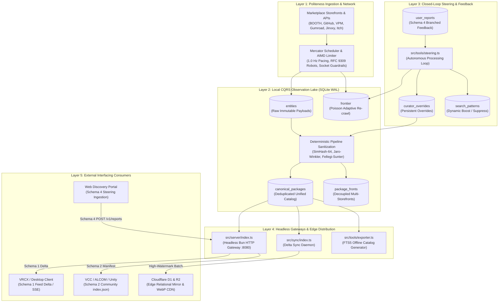

# VRChat Package Crawler: Autonomous Coding Agent Contract

**Repository:** `F:\.repo\.main\vrc-package-crawler`  
**Revision:** Phase 2 Complete (Autonomous Coding Agent Contract & Engineering Reality Baseline)  
**Binary Distribution:** Standalone Single-File Native Executables (`dist/`)  
**Test Suite Baseline:** 57 passing tests across 12 files (276 assertions, `bun test`)  

---

## 1. System Overview & Operational Topography

The VRChat Package Crawler will operate as an autonomous discovery engine and metadata aggregator. It will index tools, Unity editor extensions, shaders, and VPM libraries for the VRChat creator ecosystem. Supported platforms will include BOOTH.pm, GitHub, VPM Repositories, Gumroad, Jinxxy, and itch.io.

The engine will run as a portable, low-power background service on Windows and Linux. It will collect zero binary files. It will route all commercial transactions directly to original creator storefronts.



---

## 2. Standalone Compilation & Binary Distribution

The engine will compile into standalone executables with zero external host runtime dependencies. Native binaries will package the Bun runtime, SQLite engine, and Sharp/libvips image codecs:

| Binary | Source | Target | Operational Role |
|---|---|---|---|
| `dist/vrc-crawler.exe` | `src/crawler/index.ts` | Windows x64 | Background harvesting daemon with single-instance lock |
| `dist/vrc-crawler-linux` | `src/crawler/index.ts` | Linux x64 | Linux background service binary |
| `dist/vrc-monitor.exe` | `src/monitor/index.ts` | Windows x64 | Interactive console monitor and CLI control interface |
| `dist/vrc-server.exe` | `src/server/index.ts` | Windows x64 | Headless REST API gateway (Schemas 1, 2, and 4) |
| `dist/vrc-server-linux` | `src/server/index.ts` | Linux x64 | Linux headless REST API gateway |
| `dist/vrc-sync.exe` | `src/sync/index.ts` | Windows x64 | High-watermark Cloudflare D1 and R2 synchronizer |
| `dist/vrc-export.exe` | `src/tools/exporter.ts` | Windows x64 | Standalone defragmented FTS5 SQLite catalog exporter |

Compilation command:
```bash
bun run build:all
```

---

## 3. Database Schema Specification

The database will run in SQLite WAL mode (`PRAGMA journal_mode = WAL;`) with normal synchronization (`PRAGMA synchronous = NORMAL;`). The primary file will reside at `dist/crawler_state.db`.

### 3.1 Table Directory

| Table Name | Storage Role | Invariant & Retention Policy |
|---|---|---|
| `frontier` | Crawl Queue & Scheduler | Cho-Garcia-Molina Poisson adaptive interval, ETag and Last-Modified tracking |
| `entities` | Immutable Observation Lake | Raw payload capture. Items are never deleted. Quarantine flags isolate invalid entries |
| `canonical_packages` | Derived Catalog Projection | Deduplicated package records with lifecycle, timestamps, and multi-storefront routing |
| `package_fronts` | Storefront Links | Decoupled platform listings (BOOTH, GitHub, Gumroad, Jinxxy, Itch) linked to canonical ID |
| `curator_overrides` | Persistent User Steering | Community corrections (titles, descriptions, categories, tags) surviving pipeline rebuilds |
| `user_reports` | Ingested Feedback Buffer | Schema 4 branched feedback submissions awaiting autonomous steering ingestion |
| `search_patterns` | Closed-Loop Query Weights | Dynamic negative tokens, boost or suppress rules, and priority seed queues |
| `creator_opt_outs` | Legal Exclusion Registry | Verified takedown patterns and creator bio-token exclusion rules |
| `media_cache` | Thumbnail Proxy Cache | WebP thumbnails, BlurHash strings, and 64-bit perceptual hashes (pHash) |
| `sync_checkpoints` | Edge Watermarks | High-watermark rowid tracking for incremental Cloudflare D1 and R2 sync |

### 3.2 Core Table DDLs

```sql
-- 1. Canonical Packages Projection (Consolidated & Unified)
CREATE TABLE IF NOT EXISTS canonical_packages (
  id TEXT PRIMARY KEY,                                      -- Invariant reverse-DNS ID (e.g. nadena.dev.modular-avatar)
  canonical_id TEXT NOT NULL UNIQUE,                        -- URL-safe slug identifier
  name TEXT NOT NULL,                                       -- Arbitration title (curator overridden if available)
  author TEXT NOT NULL,                                     -- Primary author alias
  authors_json TEXT DEFAULT '[]',                           -- All resolved co-authors / contributors
  category TEXT NOT NULL,                                   -- Top-level category (Avatars, World Creation, etc.)
  subcategory TEXT NOT NULL,                                -- Deep taxonomy subcategory
  type TEXT NOT NULL,                                       -- 'QoL, Workflow & Toolchain' | 'Asset Additive'
  description TEXT,                                         -- Factual description excerpt
  primary_platform TEXT NOT NULL,                           -- Origin host ('vpm', 'github', 'booth', etc.)
  platforms_json TEXT NOT NULL,                             -- Array of available storefront platforms
  url TEXT NOT NULL,                                        -- Canonical checkout / repository URL
  vcc_url TEXT,                                             -- VPM direct repository link
  github_url TEXT,                                          -- GitHub repository link
  booth_url TEXT,                                           -- BOOTH.pm storefront link
  gumroad_url TEXT,                                         -- Gumroad storefront link
  jinxxy_url TEXT,                                          -- Jinxxy marketplace link
  itch_url TEXT,                                            -- itch.io store link
  price_currency TEXT DEFAULT 'USD',                        -- Pricing currency code (USD, JPY)
  price_amount REAL DEFAULT 0,                              -- Base pricing value
  is_vcc INTEGER NOT NULL DEFAULT 0,                        -- Boolean flag for VCC/ALCOM support
  tags_json TEXT DEFAULT '[]',                              -- Ecosystem tags
  dependencies_json TEXT DEFAULT '{}',                      -- VPM dependency map
  source_ids_json TEXT NOT NULL,                            -- Foreign keys into entities observation lake
  media_id TEXT,                                            -- FK into media_cache
  origin_created_at TEXT,                                   -- Earliest verified creation date
  origin_updated_at TEXT,                                   -- Latest observed update timestamp
  created_at_confidence TEXT DEFAULT 'unknown'              -- 'confirmed' | 'inferred' | 'unknown'
    CHECK(created_at_confidence IN ('confirmed','inferred','unknown')),
  lifecycle TEXT DEFAULT 'published'                        -- Package state
    CHECK(lifecycle IN ('published','updated','delisted','archived',
                        'paywall_introduced','dmca_removed','creator_opted_out')),
  lifecycle_updated_at TEXT,                                -- Timestamp when lifecycle changed
  created_at TEXT NOT NULL,                                 -- Record creation timestamp
  updated_at TEXT NOT NULL                                  -- Record update timestamp
);

-- 2. Persistent Curator Overrides (Survives pipeline wipes)
CREATE TABLE IF NOT EXISTS curator_overrides (
  id TEXT PRIMARY KEY,                                      -- 'cov_<canonical_id>'
  canonical_id TEXT NOT NULL UNIQUE,                        -- Target package slug
  name_override TEXT,                                       -- Cleaned display title
  title_override TEXT,                                      -- Alternative title
  url_override TEXT,                                        -- Canonical storefront override
  description_override TEXT,                                -- Curated STE description
  category_override TEXT,                                   -- Corrected class
  subcategory_override TEXT,                                -- Corrected subcategory
  added_tags_json TEXT DEFAULT '[]',                        -- Positive tags to merge
  removed_tags_json TEXT DEFAULT '[]',                      -- Negative tags to purge
  reason TEXT,                                              -- Submitter / curator rationale
  reporter_id TEXT,                                         -- Client fingerprint / reporter
  created_at TEXT NOT NULL,
  updated_at TEXT NOT NULL
);

-- 3. Ingested Feedback Buffer (Schema 4 Ingestion)
CREATE TABLE IF NOT EXISTS user_reports (
  report_id TEXT PRIMARY KEY,                               -- Unique submission ID
  target_package_id TEXT NOT NULL,                          -- Target canonical ID or platform item ID
  target_package_name TEXT NOT NULL,                        -- Package title for context
  branch TEXT NOT NULL                                      -- Discrete decision branch
    CHECK(branch IN ('categorization','irrelevance','listing','tags','discovery_query')),
  branch_payload_json TEXT NOT NULL,                        -- Branch-specific structured payload
  reporter_notes TEXT,                                      -- Freeform feedback notes
  client_fingerprint TEXT,                                  -- IP hash / OAuth user ID
  trust_tier TEXT DEFAULT 'anonymous'                       -- 'anonymous' | 'verified_creator' | 'trusted_curator'
    CHECK(trust_tier IN ('anonymous','verified_creator','trusted_curator')),
  status TEXT DEFAULT 'pending'                             -- 'pending' | 'applied' | 'rejected'
    CHECK(status IN ('pending','applied','rejected')),
  applied_at TEXT,                                          -- Processing timestamp
  submitted_at TEXT NOT NULL,                               -- Original user timestamp
  created_at TEXT NOT NULL                                  -- Ingestion timestamp
);

-- 4. Closed-Loop Search Patterns
CREATE TABLE IF NOT EXISTS search_patterns (
  id TEXT PRIMARY KEY,                                      -- Pattern ID
  query TEXT NOT NULL UNIQUE,                               -- Ingested search term
  query_intent TEXT,                                        -- Intent classification
  relevance_vote TEXT NOT NULL                              -- 'boost' | 'suppress'
    CHECK(relevance_vote IN ('boost','suppress')),
  negative_tokens_json TEXT DEFAULT '[]',                   -- Negative terms to filter from queries
  suggested_seeds_json TEXT DEFAULT '[]',                   -- Crawler seeds to enqueue
  weight REAL DEFAULT 1.0,                                  -- Ranking influence weight
  created_at TEXT NOT NULL,
  updated_at TEXT NOT NULL
);
```

---

## 4. External Interfacing Contracts

External applications will communicate with the crawler through four standardized endpoints.

### 4.1 Ingress & Egress Endpoints

#### Endpoint 1: Schema 1 (Feed Delta Stream)
- **Route:** `GET /v1/catalog/delta?cursor=<rowid>&limit=<count>`
- **Consumer:** VRCX, Obsidian synchronization plugins, RSS readers
- **Format:** JSON stream with SHA-256 tamper verification digest.
- **Payload Structure:**
```json
{
  "cursor": "15600",
  "nextCursor": "15650",
  "generatedAt": "2026-09-18T17:30:00.000Z",
  "deltaCount": 1,
  "sha256Digest": "7f83b1657ff1fc53b92dc18148a1d65dfc2d4b1fa3d677284addd200126d9069",
  "deltas": [
    {
      "action": "ADDED",
      "canonicalId": "nadena-dev-modular-avatar",
      "timestamp": "2026-09-18T17:25:00.000Z",
      "package": {
        "name": "Modular Avatar",
        "author": "bd_",
        "category": "Tools & Utilities",
        "subcategory": "Avatars / Setup & Optimization",
        "type": "QoL, Workflow & Toolchain",
        "primaryPlatform": "github",
        "url": "https://github.com/bdunderscore/modular-avatar",
        "isVcc": true,
        "tags": ["vpm-package", "avatar", "non-destructive"],
        "media": {
          "thumbnailUrl": "https://cdn.vrc-catalog.net/thumbs/modular-avatar.webp"
        }
      }
    }
  ]
}
```

#### Endpoint 2: Schema 2 (VPM Community Repository Manifest)
- **Route:** `GET /v1/vpm/index.json`
- **Consumer:** VRChat Creator Companion (VCC), ALCOM, Unity Package Manager
- **Format:** RFC-compliant VPM repository manifest.
- **Payload Structure:**
```json
{
  "$schema": "https://json-schema.org/draft/2020-12/schema",
  "name": "VRChat Community Asset Catalog",
  "id": "net.vrc-catalog.community",
  "url": "http://127.0.0.1:8080/v1/vpm/index.json",
  "author": "VRChat Community Indexers",
  "description": "Decentralized VPM repository aggregating community tools and packages",
  "packages": {
    "nadena.dev.modular-avatar": {
      "versions": {
        "1.10.1": {
          "name": "nadena.dev.modular-avatar",
          "version": "1.10.1",
          "displayName": "Modular Avatar",
          "description": "Non-destructive avatar components for VRChat",
          "url": "https://github.com/bdunderscore/modular-avatar/releases/download/v1.10.1/nadena.dev.modular-avatar-1.10.1.zip",
          "vpmDependencies": {
            "com.vrchat.avatars": ">=3.5.0"
          }
        }
      }
    }
  }
}
```

#### Endpoint 3: Daemon Health & Telemetry
- **Route:** `GET /v1/health`
- **Format:** JSON status object indicating uptime, memory, and database metrics.
```json
{
  "status": "healthy",
  "version": "2.0.0",
  "uptimeSeconds": 1420,
  "metrics": {
    "totalDiscovered": 37501,
    "totalEntities": 19150,
    "totalQuarantined": 24907,
    "totalMerged": 15642
  },
  "timestamp": "2026-09-18T17:35:00.000Z"
}
```

#### Endpoint 4: Schema 4 (Upstream User Steering Report)
- **Route:** `POST /v1/reports`
- **Rate Limit:** 10 requests per minute per client IP.
- **Authentication:** Bearer token via `API_SECRET_TOKEN` environment variable.
- **Security Invariant:** Coding agents must make sure `POST /v1/reports` checks `API_SECRET_TOKEN`. Delisting branches must enter a human review queue (`needs_review`). Autonomous delisting without review is forbidden.

Decision branches for Schema 4:
- `branch = "categorization"`: Suggested class and subcategory updates.
- `branch = "irrelevance"`: Irrelevance reasons and negative tokens for query filtering.
- `branch = "listing"`: Title, description, and canonical URL overrides.
- `branch = "tags"`: Positive tags to merge and negative tags to purge.
- `branch = "discovery_query"`: Search query steering, intent, relevance vote, and seed URLs.

#### Loopback IPC Control Server
- **Endpoint:** `http://127.0.0.1:8765`
- **Access Policy:** Bound strictly to loopback interface. Administrative commands will dispatch via `vrc-monitor.exe`.
- **Supported IPC Endpoints:**
  - `GET /status`: Retrieves active worker metrics.
  - `GET /recrawl`: Triggers Poisson freshness sweep on stale URLs.
  - `GET /project`: Triggers canonical projection synthesis.
  - `GET /sync`: Triggers Cloudflare edge synchronization pass.
  - `GET /steering`: Triggers feedback ingestion pass.
  - `GET /export`: Triggers SQLite catalog export.
  - `GET /stop`: Initiates graceful daemon shutdown.

---

## 5. Ground-Truth Test Suite & Verification Baseline

Coding agents must verify that all 57 tests pass across 12 test files before submitting changes.

Command:
```powershell
bun test
```

### Verified Test Matrix (57 Tests / 12 Files / 276 Assertions)

| Test File | Test Count | Status | Subsystems Verified |
|---|---|---|---|
| `tests/compliance_and_sync.test.ts` | 6 | Pass | Ingestion bounds, Poisson scheduler, origin dates, opt-outs, RFC 9309 enforcer |
| `tests/exporter.test.ts` | 1 | Pass | Standalone SQLite catalog generator with FTS5 search (asserts count > 0) |
| `tests/gumroad_driver.test.ts` | 1 | Pass | Gumroad discovery driver extraction and pagination parsing |
| `tests/image_proxy.test.ts` | 4 | Pass | WebP transcoding, BlurHash calculation, 64-bit pHash, URL cleansing |
| `tests/ipc.test.ts` | 1 | Pass | Loopback IPC command routing (status, recrawl, project, stop) |
| `tests/poisson.test.ts` | 3 | Pass | Cho-Garcia-Molina change rates, HTTP 304 backoff, HTTP 200 refresh |
| `tests/robots.test.ts` | 5 | Pass | RFC 9309 prefix matching, User-Agent precedence, wildcard rules |
| `tests/schema_unification.test.ts` | 1 | Pass | Auto-upgrade from legacy tables to unified tables without data loss |
| `tests/server.test.ts` | 9 | Pass | Schema 1 delta stream, Schema 2 VPM, Schema 4 ingestion, rate limiter, CORS |
| `tests/steering.test.ts` | 10 | Pass | 5 steering branches, side-effect propagation, local conduit, corruption isolation |
| `tests/sync.test.ts` | 5 | Pass | Cloudflare D1 high-watermark sync, local backup conduit, rebuild recovery |
| `tests/unified_schema.test.ts` | 11 | Pass | 10 unified tables, lifecycle states, curator overrides, umbrella tags |
| **Total** | **57** | **0 Fail** | **Ground Truth Verification Confirmed** |

> [!IMPORTANT]
> The obsolete test file `tests/migrate.test.ts` was renamed to `tests/schema_unification.test.ts`. Coding agents must never reference `tests/migrate.test.ts`.

---

## 6. Code-Reality Gap Index (Active Agent Invariants)

Autonomous coding agents must obey the 13 verified engineering reality constraints:

### CR-1: Poisson Scheduler Mutability Feedback Loop
- `poissonScheduler.requeueStaleUrls()` runs actively on monitor cycles (`src/crawler/index.ts` line 760) and IPC `/recrawl` (line 955).
- The mutability feedback loop `PoissonScheduler.adjustAfterFetch` has zero callers in `src/`.
- True signature:
  `adjustAfterFetch(url: string, isModified: boolean, etag?: string | null, lastModifiedHeader?: string | null)`
- Workers currently invoke `db.markStatus()`, which assigns a fixed 24-hour constant (`+86400 seconds`).
- **Agent Rule:** When connecting workers to the Poisson scheduler, pass the correct 4-parameter signature. Do not invent a 3-parameter signature.

### CR-2: Canonical Authentication Secret
- The server expects `process.env.API_SECRET_TOKEN` (`src/server/index.ts` line 130).
- `CRAWLER_API_TOKEN` was a hallucinated name.
- When `API_SECRET_TOKEN` is unset in `.env`, the authentication check is bypassed.
- **Agent Rule:** Always use `API_SECRET_TOKEN`. Quarantine `POST /v1/reports` delisting into human review (`needs_review`).

### CR-3: Full-Wipe Projection & Edge Sync Watermark Loss
- `pipeline_sanitize.ts` runs `DELETE FROM canonical_packages; DELETE FROM package_fronts;` on every cycle. This resets SQLite rowids to 1.
- In `src/sync/index.ts` line 130, watermark reset triggers only if `watermarkRowId > maxRowInDb`.
- If the rebuilt table contains more rows than the previous watermark, the reset fails. Rows 1 through the watermark are skipped from Cloudflare D1.
- **Agent Rule:** Use incremental upserts or track checkpoints with UUIDs and generation epochs rather than mutable rowids.

### CR-4: VPM Seeding Gate Lockout Bug
- In `src/crawler/index.ts` line 82, the gate condition `metrics.platformStats["vpm"].done < 50` halts re-seeding once 50 VPM URLs complete.
- Because `done` increases monotonically, the gate locks permanently after initial crawls.
- **Agent Rule:** Replace the absolute count check with a temporal staleness check (such as re-seed if last VPM seed was older than 7 days).

### CR-5: Timestamp Confidence Rubric
- `docs/DISCOVERY_RULES.md` Sec 4.2 mandates `origin_created_at = null` and `createdAtConfidence = 'unknown'` when no upstream date exists.
- `src/tools/pipeline_sanitize.ts` substituted local crawl fetch times as `'inferred'`.
- **Agent Rule:** Never substitute local crawl times for missing upstream dates. Set `origin_created_at` to null.

### CR-6: YouTube Embed URL Ingestion
- `src/drivers/jinxxy.ts` iterated Next.js media arrays without type filtering, passing YouTube embeds to the image proxy.
- `src/utils/image_proxy.ts` skipPatterns lacked YouTube domain filters.
- **Agent Rule:** Filter YouTube embed URLs at both the driver extraction layer and the image proxy skipPatterns guard. Route them to `youtube_urls`.

### CR-7: Conditional HTTP Headers
- `src/drivers/github.ts` captures raw ETags but does not transmit `If-None-Match`.
- No driver transmits `If-Modified-Since`.
- **Agent Rule:** Transmit conditional headers on re-crawl requests. Handle HTTP 304 by refreshing timestamps without parsing payloads.

### CR-8: Opt-Out API Routing
- `db.registerOptOut()` exists in `src/db.ts` lines 551 to 578.
- The function has zero API routes and zero CLI callers.
- **Agent Rule:** Implement `POST /v1/opt-out` with cryptographic or DNS validation.

### CR-9: Test Baseline Drift
- Documentation claimed 40 or 51 tests. The actual baseline is 57 tests across 12 files.
- **Agent Rule:** Always verify tests against the 57-test baseline.

### CR-10: File Duplication
- `AGENT.md` and `DELEGATES.md` were duplicate files.
- **Agent Rule:** Maintain strict role isolation. `AGENT.md` will guide coding agents. `DELEGATES.md` will guide VPS deployment engineers.

### CR-11: Schema Column Duplication
- Overlapping columns exist: flat columns (`github_url`, `booth_url`), `platforms_json`, and rows in `package_fronts`.
- `curator_overrides` contains both `name_override` and `title_override`.
- **Agent Rule:** Use strict DTO typing in `src/db.ts` to prevent naming drift.

### CR-12: Structured Logging & Archival
- `src/logger.ts` uses flat append streams without session prefixes or daily gzip sweeps.
- **Agent Rule:** Format log streams with session prefixes (`session_<pid>_<iso>.log`) and schedule idle-time compression.

### CR-13: CLI Subcommand Dispatch
- `vrc-crawler.exe` contains zero CLI subcommand parsing. Invoking it with arguments attempts to launch a second daemon and crashes on `ProcessLock`.
- All CLI commands must be dispatched through `vrc-monitor.exe` (or `bun run src/monitor/index.ts <action>`).
- **Agent Rule:** Route all administrative commands through `vrc-monitor.exe`.

---

## 7. SQLite Test Concurrency & Locking Invariants

Coding agents must understand database concurrency before adding or modifying tests:

1. **Shared Database File:**
   Seven test files read from `dist/crawler_state.db` (357 MB database containing 49,438 entities).
2. **Busy Timeout vs Test Timeout:**
   In `src/db.ts` line 248, `PRAGMA busy_timeout = 10000;` waits up to 10 seconds for locks. Bun test runner has a default 5,000ms per-test timeout.
3. **Lock Contention Failure Mode:**
   When `tests/exporter.test.ts` acquires an exclusive transaction lock, concurrent tests enter busy wait. If SQLite waits longer than 5 seconds, Bun aborts the test with a timeout.
4. **Mandatory Test Isolation:**
   New test suites must instantiate ephemeral in-memory databases (`:memory:`) or dedicated fixture databases. Never attach new tests to `dist/crawler_state.db`.

---

## 8. Development & Verification Commands

```powershell
# Run full test suite (57 tests across 12 files)
bun test

# Run type checker
bun x tsc --noEmit

# Run headless API server in development mode
bun run server

# Run autonomous steering loop
bun run steering

# Build all standalone binaries
bun run build:all

# Run edge sync in dry-run validation mode
bun run sync --dry-run
```
