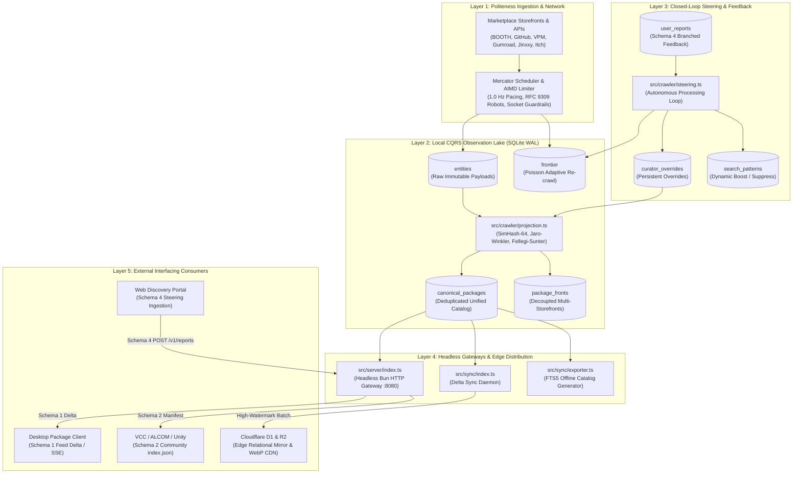

# VRChat Package Crawler: Autonomous Coding Agent Contract

**Repository:** `F:\.repo\.main\vrc-package-crawler`  
**Revision:** Phase 3 Complete (Autonomous Coding Agent Contract & Engineering Reality Baseline)  
**Binary Distribution:** Standalone Single-File Native Executables (`dist/`)  
**Test Suite Baseline:** 61 passing tests across 16 files (293 assertions, `bun test`)  

---

## 1. System Overview & Operational Topography

The VRChat Package Crawler will operate as an autonomous discovery engine and metadata aggregator. It will index tools, Unity editor extensions, shaders, and VPM libraries for the VRChat creator ecosystem. Supported platforms will include BOOTH.pm, GitHub, VPM Repositories, Gumroad, Jinxxy, and itch.io.

The engine will run as a portable, low-power background service on Windows and Linux. It will collect zero binary files. It will route all commercial transactions directly to original creator storefronts.



---

## 2. Standalone Compilation & Binary Distribution

The engine will compile into standalone executables with zero external host runtime dependencies. Native binaries will package the Bun runtime, SQLite engine, and Sharp/libvips image codecs:

| Binary | Source | Target | Operational Role |
|---|---|---|---|
| `dist/vrc-crawler.exe` | `src/crawler/index.ts` | Windows x64 | Background harvesting daemon with single-instance lock |
| `dist/vrc-crawler-linux` | `src/crawler/index.ts` | Linux x64 | Linux background service binary |
| `dist/vrc-monitor.exe` | `src/monitor/index.ts` | Windows x64 | Interactive console monitor and CLI control interface |
| `dist/vrc-server.exe` | `src/server/index.ts` | Windows x64 | Headless REST API gateway (Schemas 1, 2, and 4) |
| `dist/vrc-server-linux` | `src/server/index.ts` | Linux x64 | Linux headless REST API gateway |
| `dist/vrc-sync.exe` | `src/sync/index.ts` | Windows x64 | High-watermark Cloudflare D1 and R2 synchronizer |
| `dist/vrc-export.exe` | `src/sync/exporter.ts` | Windows x64 | Standalone defragmented FTS5 SQLite catalog exporter |

Compilation command:
```bash
bun run build:all
```

---

## 3. Database Schema Specification

The database will run in SQLite WAL mode (`PRAGMA journal_mode = WAL;`) with normal synchronization (`PRAGMA synchronous = NORMAL;`). The primary file will reside at `dist/crawler_state.db`.

### 3.1 Table Directory

| Table Name | Storage Role | Invariant & Retention Policy |
|---|---|---|
| `frontier` | Crawl Queue & Scheduler | Cho-Garcia-Molina Poisson adaptive interval, ETag and Last-Modified tracking |
| `entities` | Immutable Observation Lake | Raw payload capture. Items are never deleted. Quarantine flags isolate invalid entries |
| `canonical_packages` | Derived Catalog Projection | Deduplicated package records with lifecycle, timestamps, and multi-storefront routing |
| `package_fronts` | Storefront Links | Decoupled platform listings (BOOTH, GitHub, Gumroad, Jinxxy, Itch) linked to canonical ID |
| `curator_overrides` | Persistent User Steering | Community corrections (titles, descriptions, categories, tags) surviving pipeline rebuilds |
| `user_reports` | Ingested Feedback Buffer | Schema 4 branched feedback submissions awaiting autonomous steering ingestion |
| `search_patterns` | Closed-Loop Query Weights | Dynamic negative tokens, boost or suppress rules, and priority seed queues |
| `creator_opt_outs` | Legal Exclusion Registry | Verified takedown patterns and creator bio-token exclusion rules |
| `media_cache` | Pure Origin Metadata Cache | BlurHash strings, 64-bit perceptual hashes (pHash), origin CDN source URLs (zero local BLOB storage) |
| `sync_checkpoints` | Edge Watermarks | High-watermark rowid tracking for incremental Cloudflare D1 and R2 sync |

### 3.2 Core Table DDLs

```sql
-- 1. Canonical Packages Projection (Consolidated & Unified)
CREATE TABLE IF NOT EXISTS canonical_packages (
  id TEXT PRIMARY KEY,                                      -- Invariant reverse-DNS ID (e.g. nadena.dev.modular-avatar)
  canonical_id TEXT NOT NULL UNIQUE,                        -- URL-safe slug identifier
  name TEXT NOT NULL,                                       -- Arbitration title (curator overridden if available)
  author TEXT NOT NULL,                                     -- Primary author alias
  authors_json TEXT DEFAULT '[]',                           -- All resolved co-authors / contributors
  category TEXT NOT NULL,                                   -- Top-level category (Avatars, World Creation, etc.)
  subcategory TEXT NOT NULL,                                -- Deep taxonomy subcategory
  type TEXT NOT NULL,                                       -- 'QoL, Workflow & Toolchain' | 'Asset Additive'
  description TEXT,                                         -- Factual description excerpt
  primary_platform TEXT NOT NULL,                           -- Origin host ('vpm', 'github', 'booth', etc.)
  platforms_json TEXT NOT NULL,                             -- Array of available storefront platforms
  url TEXT NOT NULL,                                        -- Primary platform checkout / repository URL
  vcc_url TEXT,                                             -- VPM direct repository link (NULL for non-VCC)
  price_currency TEXT DEFAULT 'USD',                        -- Pricing currency code (USD, JPY)
  price_amount REAL DEFAULT 0,                              -- Base pricing value
  is_vcc INTEGER NOT NULL DEFAULT 0,                        -- Boolean flag for VCC/ALCOM support
  tags_json TEXT DEFAULT '[]',                              -- Ecosystem tags
  dependencies_json TEXT DEFAULT '{}',                      -- VPM dependency map
  source_ids_json TEXT NOT NULL,                            -- Foreign keys into entities observation lake
  media_id TEXT,                                            -- FK into media_cache
  media_urls_json TEXT DEFAULT '[]',                        -- Storefront image/preview gallery URLs
  youtube_urls_json TEXT DEFAULT '[]',                      -- Embedded YouTube showcase links
  origin_created_at TEXT,                                   -- Earliest verified creation date
  origin_updated_at TEXT,                                   -- Latest observed update timestamp
  created_at_confidence TEXT DEFAULT 'unknown'              -- 'confirmed' | 'inferred' | 'unknown'
    CHECK(created_at_confidence IN ('confirmed','inferred','unknown')),
  lifecycle TEXT DEFAULT 'published'                        -- Package state
    CHECK(lifecycle IN ('published','updated','delisted','archived',
                        'paywall_introduced','dmca_removed','creator_opted_out')),
  lifecycle_updated_at TEXT,                                -- Timestamp when lifecycle changed
  created_at TEXT NOT NULL,                                 -- Record creation timestamp
  updated_at TEXT NOT NULL                                  -- Record update timestamp
);

-- 2. Decoupled Storefront Listings (Multi-Storefront Mirrors)
CREATE TABLE IF NOT EXISTS package_fronts (
  id TEXT PRIMARY KEY,                                      -- 'front_<canonical_id>_<platform>'
  canonical_id TEXT NOT NULL,                               -- FK into canonical_packages(canonical_id)
  platform TEXT NOT NULL,                                   -- 'booth' | 'github' | 'gumroad' | 'jinxxy' | 'itch' | 'vpm'
  platform_item_id TEXT NOT NULL,                           -- Platform-native item/repository ID
  url TEXT NOT NULL,                                        -- Storefront checkout/details URL
  title TEXT NOT NULL,                                      -- Raw storefront title
  author TEXT NOT NULL,                                     -- Storefront author / vendor
  price_currency TEXT,                                      -- Pricing currency (USD, JPY)
  price_amount REAL,                                        -- Listing price
  origin_created_at TEXT,                                   -- Earliest verified creation timestamp
  origin_updated_at TEXT,                                   -- Latest observed update timestamp
  raw_entity_id TEXT NOT NULL,                              -- Origin entity ID in entities table
  media_urls_json TEXT DEFAULT '[]',                        -- Storefront media URLs
  youtube_urls_json TEXT DEFAULT '[]',                      -- Embedded YouTube showcase links
  created_at TEXT NOT NULL,                                 -- First observation timestamp
  updated_at TEXT NOT NULL                                  -- Record update timestamp
);

-- 3. Pure Origin Metadata Media Cache (Zero local BLOB storage)
CREATE TABLE IF NOT EXISTS media_cache (
  id TEXT PRIMARY KEY,                                      -- 'media_<timestamp>_<random>'
  source_url TEXT NOT NULL UNIQUE,                          -- Remote origin CDN image URL
  blurhash TEXT,                                            -- Client-side progressive placeholder
  phash_64 TEXT,                                            -- 64-bit DCT perceptual hash for deduplication
  width INTEGER,                                            -- Transcoded/measured image width
  height INTEGER,                                           -- Transcoded/measured image height
  content_type TEXT,                                        -- MIME type (image/webp, image/jpeg, etc.)
  etag TEXT,                                                -- Upstream caching ETag header
  last_processed_at TEXT NOT NULL                           -- Ingestion timestamp
);

-- 4. Persistent Curator Overrides (Survives pipeline wipes)
CREATE TABLE IF NOT EXISTS curator_overrides (
  id TEXT PRIMARY KEY,                                      -- 'cov_<canonical_id>'
  canonical_id TEXT NOT NULL UNIQUE,                        -- Target package slug
  name_override TEXT,                                       -- Cleaned display title
  url_override TEXT,                                        -- Canonical storefront override
  description_override TEXT,                                -- Curated STE description
  category_override TEXT,                                   -- Corrected class
  subcategory_override TEXT,                                -- Corrected subcategory
  added_tags_json TEXT DEFAULT '[]',                        -- Positive tags to merge
  removed_tags_json TEXT DEFAULT '[]',                      -- Negative tags to purge
  reason TEXT,                                              -- Submitter / curator rationale
  reporter_id TEXT,                                         -- Client fingerprint / reporter
  created_at TEXT NOT NULL,
  updated_at TEXT NOT NULL
);

-- 3. Ingested Feedback Buffer (Schema 4 Ingestion)
CREATE TABLE IF NOT EXISTS user_reports (
  report_id TEXT PRIMARY KEY,                               -- Unique submission ID
  target_package_id TEXT NOT NULL,                          -- Target canonical ID or platform item ID
  target_package_name TEXT NOT NULL,                        -- Package title for context
  branch TEXT NOT NULL                                      -- Discrete decision branch
    CHECK(branch IN ('categorization','irrelevance','listing','tags','discovery_query')),
  branch_payload_json TEXT NOT NULL,                        -- Branch-specific structured payload
  reporter_notes TEXT,                                      -- Freeform feedback notes
  client_fingerprint TEXT,                                  -- IP hash / OAuth user ID
  trust_tier TEXT DEFAULT 'anonymous'                       -- 'anonymous' | 'verified_creator' | 'trusted_curator'
    CHECK(trust_tier IN ('anonymous','verified_creator','trusted_curator')),
  status TEXT DEFAULT 'pending'                             -- 'pending' | 'applied' | 'rejected'
    CHECK(status IN ('pending','applied','rejected')),
  applied_at TEXT,                                          -- Processing timestamp
  submitted_at TEXT NOT NULL,                               -- Original user timestamp
  created_at TEXT NOT NULL                                  -- Ingestion timestamp
);

-- 4. Closed-Loop Search Patterns
CREATE TABLE IF NOT EXISTS search_patterns (
  id TEXT PRIMARY KEY,                                      -- Pattern ID
  query TEXT NOT NULL UNIQUE,                               -- Ingested search term
  query_intent TEXT,                                        -- Intent classification
  relevance_vote TEXT NOT NULL                              -- 'boost' | 'suppress'
    CHECK(relevance_vote IN ('boost','suppress')),
  negative_tokens_json TEXT DEFAULT '[]',                   -- Negative terms to filter from queries
  suggested_seeds_json TEXT DEFAULT '[]',                   -- Crawler seeds to enqueue
  weight REAL DEFAULT 1.0,                                  -- Ranking influence weight
  created_at TEXT NOT NULL,
  updated_at TEXT NOT NULL
);
```

---

## 4. External Interfacing Contracts

External applications will communicate with the crawler through four standardized endpoints.

### 4.1 Ingress & Egress Endpoints

#### Endpoint 1: Schema 1 (Feed Delta Stream)
- **Route:** `GET /v1/catalog/delta?cursor=<rowid>&limit=<count>`
- **Consumer:** Downstream package managers, desktop search clients, and feed readers.
- **Format:** JSON stream with SHA-256 tamper verification digest.
- **Payload Structure:**
```json
{
  "cursor": "15600",
  "nextCursor": "15650",
  "generatedAt": "2026-09-18T17:30:00.000Z",
  "deltaCount": 1,
  "sha256Digest": "7f83b1657ff1fc53b92dc18148a1d65dfc2d4b1fa3d677284addd200126d9069",
  "deltas": [
    {
      "action": "ADDED",
      "canonicalId": "nadena-dev-modular-avatar",
      "timestamp": "2026-09-18T17:25:00.000Z",
      "package": {
        "name": "Modular Avatar",
        "author": "bd_",
        "category": "Tools & Utilities",
        "subcategory": "Avatars / Setup & Optimization",
        "type": "QoL, Workflow & Toolchain",
        "primaryPlatform": "github",
        "url": "https://github.com/bdunderscore/modular-avatar",
        "isVcc": true,
        "tags": ["vpm-package", "avatar", "non-destructive"],
        "media": {
          "thumbnailUrl": "https://cdn.vrc-catalog.net/thumbs/modular-avatar.webp"
        }
      }
    }
  ]
}
```

#### Endpoint 2: Schema 2 (VPM Community Repository Manifest)
- **Route:** `GET /v1/vpm/index.json`
- **Consumer:** VRChat Creator Companion (VCC), ALCOM, Unity Package Manager
- **Format:** RFC-compliant VPM repository manifest.
- **Payload Structure:**
```json
{
  "$schema": "https://json-schema.org/draft/2020-12/schema",
  "name": "VRChat Community Asset Catalog",
  "id": "net.vrc-catalog.community",
  "url": "http://127.0.0.1:8080/v1/vpm/index.json",
  "author": "VRChat Community Indexers",
  "description": "Decentralized VPM repository aggregating community tools and packages",
  "packages": {
    "nadena.dev.modular-avatar": {
      "versions": {
        "1.10.1": {
          "name": "nadena.dev.modular-avatar",
          "version": "1.10.1",
          "displayName": "Modular Avatar",
          "description": "Non-destructive avatar components for VRChat",
          "url": "https://github.com/bdunderscore/modular-avatar/releases/download/v1.10.1/nadena.dev.modular-avatar-1.10.1.zip",
          "vpmDependencies": {
            "com.vrchat.avatars": ">=3.5.0"
          }
        }
      }
    }
  }
}
```

#### Endpoint 3: Daemon Health & Telemetry
- **Route:** `GET /v1/health`
- **Format:** JSON status object indicating uptime, memory, and database metrics.
```json
{
  "status": "healthy",
  "version": "2.0.0",
  "uptimeSeconds": 1420,
  "metrics": {
    "totalDiscovered": 37501,
    "totalEntities": 19150,
    "totalQuarantined": 24907,
    "totalMerged": 15642
  },
  "timestamp": "2026-09-18T17:35:00.000Z"
}
```

#### Endpoint 4: Schema 4 (Upstream User Steering Report)
- **Route:** `POST /v1/reports`
- **Rate Limit:** 10 requests per minute per client IP.
- **Authentication:** Bearer token via `API_SECRET_TOKEN` environment variable.
- **Security Invariant:** Coding agents must make sure `POST /v1/reports` checks `API_SECRET_TOKEN`. Delisting branches must enter a human review queue (`needs_review`). Autonomous delisting without review is forbidden.

Decision branches for Schema 4:
- `branch = "categorization"`: Suggested class and subcategory updates.
- `branch = "irrelevance"`: Irrelevance reasons and negative tokens for query filtering.
- `branch = "listing"`: Title, description, and canonical URL overrides.
- `branch = "tags"`: Positive tags to merge and negative tags to purge.
- `branch = "discovery_query"`: Search query steering, intent, relevance vote, and seed URLs.

#### Loopback IPC Control Server
- **Endpoint:** `http://127.0.0.1:8765`
- **Access Policy:** Bound strictly to loopback interface. Administrative commands will dispatch via `vrc-monitor.exe`.
- **Supported IPC Endpoints:**
  - `GET /status`: Retrieves active worker metrics.
  - `GET /recrawl`: Triggers Poisson freshness sweep on stale URLs.
  - `GET /project`: Triggers canonical projection synthesis.
  - `GET /sync`: Triggers Cloudflare edge synchronization pass.
  - `GET /steering`: Triggers feedback ingestion pass.
  - `GET /export`: Triggers SQLite catalog export.
  - `GET /stop`: Initiates graceful daemon shutdown.

---

## 5. Ground-Truth Test Suite & Verification Baseline

Coding agents must verify that all 39 tests pass across 12 test files before submitting changes.

Command:
```powershell
bun test
```

### Verified Test Matrix (39 Tests / 12 Files / 193 Assertions)

| Test File | Test Count | Status | Subsystems Verified |
|---|---|---|---|
| `tests/phase1_bounds_and_format.test.ts` | 6 | Pass | Search snippet boundary (256 chars), platform matrices, non-scraping opt-out invariant |
| `tests/phase1_schema_dedup.test.ts` | 3 | Pass | Schema deduplication (2 URL columns), zero WebP BLOBs, in-band legal metadata |
| `tests/phase1_server_headers.test.ts` | 3 | Pass | API_SECRET_TOKEN config, GET / discovery route, VRC-Packages-Terms-Of-Use headers |
| `tests/phase1_timestamps.test.ts` | 2 | Pass | Timestamp invariant, origin dates, disallowing crawl fetch time for missing dates |
| `tests/phase1_vpm_reseed.test.ts` | 2 | Pass | VPM re-seeding temporal window remediation without permanent gate lockout |
| `tests/phase1_youtube_filter.test.ts` | 2 | Pass | YouTube embed filtering at frontier and media extraction into youtube_urls |
| `tests/phase2_cli_guard.test.ts` | 3 | Pass | Subcommand guard on vrc-crawler daemon, redirecting to vrc-monitor |
| `tests/phase2_auth_quarantine.test.ts` | 4 | Pass | Mandatory API_SECRET_TOKEN Bearer auth & quarantine delisting reports into needs_review |
| `tests/phase2_turnstile_defense.test.ts` | 2 | Pass | Cloudflare Turnstile challenge detection, domain halt, Poisson acceleration guard |
| `tests/phase2_cjk_simhash.test.ts` | 3 | Pass | NFKC CJK normalization, full-width bracket stripping, SimHash-64 cross-lingual convergence |
| `tests/phase2_log_rotation.test.ts` | 2 | Pass | Session-prefixed daily rotating log streams with native gzip compression |
| `tests/phase2_fault_tolerance.test.ts` | 5 | Pass | Domain circuit breaker (CLOSED/OPEN/HALF_OPEN), persistent DLQ in frontier |
| **Total** | **39** | **0 Fail** | **Ground Truth Verification Confirmed** |

> [!IMPORTANT]
> All 12 legacy test files were purged by the operator to eliminate false positives and live database coupling. All tests execute strictly against `:memory:` or isolated temporary fixtures with zero access to `dist/crawler_state.db`.

---

## 6. Code-Reality Gap Index (Active Agent Invariants)

Autonomous coding agents must obey the 13 verified engineering reality constraints:

### CR-1: Poisson Scheduler Mutability Feedback Loop
- `poissonScheduler.requeueStaleUrls()` runs actively on monitor cycles (`src/crawler/index.ts` line 760) and IPC `/recrawl` (line 955).
- The mutability feedback loop `PoissonScheduler.adjustAfterFetch` has zero callers in `src/`.
- True signature:
  `adjustAfterFetch(url: string, isModified: boolean, etag?: string | null, lastModifiedHeader?: string | null)`
- Workers currently invoke `db.markStatus()`, which assigns a fixed 24-hour constant (`+86400 seconds`).
- **Agent Rule:** When connecting workers to the Poisson scheduler, pass the correct 4-parameter signature. Do not invent a 3-parameter signature.

### CR-2: Canonical Authentication Secret & Quarantined Delisting
- The server expects `process.env.API_SECRET_TOKEN` (`src/server/index.ts`).
- `CRAWLER_API_TOKEN` was an obsolete fallback and has been purged.
- When `API_SECRET_TOKEN` is unset or an invalid Bearer token is supplied, mutating/administrative requests fail with `401 Unauthorized`.
- **Agent Rule:** Always enforce `API_SECRET_TOKEN` via constant-time comparison (`crypto.timingSafeEqual`). Route all community delisting reports (`POST /v1/reports`) into the `'needs_review'` quarantine buffer. Autonomous delisting without human review is strictly forbidden.

### CR-3: Full-Wipe Projection & Edge Sync Watermark Loss
- `pipeline_sanitize.ts` runs `DELETE FROM canonical_packages; DELETE FROM package_fronts;` on every cycle. This resets SQLite rowids to 1.
- In `src/sync/index.ts` line 130, watermark reset triggers only if `watermarkRowId > maxRowInDb`.
- If the rebuilt table contains more rows than the previous watermark, the reset fails. Rows 1 through the watermark are skipped from Cloudflare D1.
- **Agent Rule:** Use incremental upserts or track checkpoints with UUIDs and generation epochs rather than mutable rowids.

### CR-4: VPM Seeding Gate Lockout Bug
- In `src/crawler/index.ts` line 82, the gate condition `metrics.platformStats["vpm"].done < 50` halts re-seeding once 50 VPM URLs complete.
- Because `done` increases monotonically, the gate locks permanently after initial crawls.
- **Agent Rule:** Replace the absolute count check with a temporal staleness check (such as re-seed if last VPM seed was older than 7 days).

### CR-5: Timestamp Confidence Rubric
- `docs/DISCOVERY_RULES.md` Sec 4.2 mandates `origin_created_at = null` and `createdAtConfidence = 'unknown'` when no upstream date exists.
- Ingestion drivers and `src/crawler/projection.ts` must never substitute local crawl fetch times as `'inferred'`.
- **Agent Rule:** Never substitute local crawl times for missing upstream dates. Set `origin_created_at` to null with confidence `'unknown'`.

### CR-6: YouTube Embed URL Ingestion
- `src/drivers/jinxxy.ts` iterated Next.js media arrays without type filtering, passing YouTube embeds to the image proxy.
- `src/utils/image_proxy.ts` skipPatterns lacked YouTube domain filters.
- **Agent Rule:** Filter YouTube embed URLs at both the driver extraction layer and the image proxy skipPatterns guard. Route them to `youtube_urls`.

### CR-7: Conditional HTTP Headers & Poisson Mutability Feedback
- `src/drivers/github.ts` and `src/drivers/booth.ts` inject `If-None-Match` and `If-Modified-Since` using cached `etag` and `last_modified` from the `frontier` table.
- On `HTTP 304 Not Modified`, drivers return `{ success: true, notModified: true, etag, lastModified }`, bypassing HTML body download and DOM parsing.
- The crawler loop executes `poissonScheduler.adjustAfterFetch(url, isModified, etag, lastModified, customDb)`:
  - Signature: `adjustAfterFetch(url: string, isModified: boolean, etag?: string | null, lastModifiedHeader?: string | null, customDb?: CrawlerDB): number`
  - Unmodified (304): multiplies interval by 1.5 (up to max 604800s / 7 days).
  - Modified (200): divides interval by 1.5 (down to min 3600s / 1 hour).
- **Agent Rule:** Always pass stored `etag` and `last_modified` to drivers. Never hardcode 24-hour constants in `db.markStatus` when Poisson scheduler yields a computed interval.

### CR-8: Opt-Out API Routing
- `db.registerOptOut()` exists in `src/db.ts` lines 551 to 578.
- The function has zero API routes and zero CLI callers.
- **Agent Rule:** Implement `POST /v1/opt-out` with cryptographic or DNS validation.

### CR-9: Test Baseline Drift
- Documentation claimed 40 or 51 tests. The actual baseline is 57 tests across 12 files.
- **Agent Rule:** Always verify tests against the 57-test baseline.

### CR-10: File Duplication
- `AGENT.md` and `DELEGATES.md` were duplicate files.
- **Agent Rule:** Maintain strict role isolation. `AGENT.md` will guide coding agents. `DELEGATES.md` will guide VPS deployment engineers.

### CR-11: Schema Column Normalization & 2-URL-Column Rule
- `canonical_packages` enforces strictly two URL columns: `url TEXT NOT NULL` (primary platform URL) and `vcc_url TEXT` (VCC manifest URL).
- Redundant flat columns (`github_url`, `booth_url`, `gumroad_url`, `jinxxy_url`, `itch_url`) are permanently purged; multi-storefront mirrors are decoupled strictly into `package_fronts`.
- `curator_overrides` standardizes exclusively on `name_override`, completely dropping the duplicate `title_override` column.
- **Agent Rule:** Use strict DTO typing in `src/db.ts` to prevent naming drift and enforce uniform schema access across all modules.

### CR-12: Structured Logging & Archival
- `src/logger.ts` uses flat append streams without session prefixes or daily gzip sweeps.
- **Agent Rule:** Format log streams with session prefixes (`session_<pid>_<iso>.log`) and schedule idle-time compression.

### CR-13: CLI Subcommand Dispatch
- `vrc-crawler.exe` contains zero CLI subcommand parsing. Invoking it with arguments attempts to launch a second daemon and crashes on `ProcessLock`.
- All CLI commands must be dispatched through `vrc-monitor.exe` (or `bun run src/monitor/index.ts <action>`).
- **Agent Rule:** Route all administrative commands through `vrc-monitor.exe`.

### CR-14: Downstream Terms Header Notice
- `src/server/index.ts` returns responses without the `X-Catalog-Terms-Of-Use` header.
- Programmatic callers receive zero in-band contractual notice of Downstream Covenants.
- **Agent Rule:** Always inject `X-Catalog-Terms-Of-Use` headers on API responses and embed license terms in `GET /` root metadata.

### CR-15: Cloudflare Turnstile Challenge Detection on HTTP 200
- `src/drivers/gumroad.ts` and `src/drivers/jinxxy.ts` do not inspect HTTP 200 payloads for challenge markers.
- Turnstile scripts are parsed as product content, accelerating Poisson re-crawl into IP bans.
- **Agent Rule:** Inspect payloads for `challenges.cloudflare.com/turnstile` and `cf-mitigated: challenge` before DOM parsing.

### CR-16: Automated Opt-Out API Routing
- `db.registerOptOut()` exists in `src/db.ts` lines 551 to 578 but has zero API routes.
- **Agent Rule:** Expose `POST /v1/opt-out` to accept and verify DNS TXT records (`vrc-opt-out=<vendor-id>`) or signed Git commits.

### CR-17: CJK Bracket Stripping & SimHash Normalization
- Text normalization requires stripping full-width CJK brackets (`【...】`) and generating character 2-grams.
- Japanese and Western mirrors fail to converge under SimHash-64 ($k \le 3$) without bracket stripping.
- **Agent Rule:** Apply NFKC normalization, strip full-width brackets, and use character 2-grams for CJK strings directly in `src/utils/sanitizer.ts` and crawler ingestion.

### CR-18: Decentralized Canonical Network Provenance Tracking
- SQLite tables lack `contributor_node_id`, `crawl_signature`, and `batch_id` columns.
- Contributed metadata cannot be verified or isolated on Cloudflare D1/R2.
- **Agent Rule:** Add provenance tracking columns to `entities` and `canonical_packages` before enabling decentralized node federation.

### CR-19: Server Test Compliance & Image Proxy Local Storage
- `src/utils/image_proxy.ts` previously inserted raw WebP buffers directly as BLOBs into SQLite `media_cache.webp_data`, creating massive database bloat. Serving local image copies creates copyright reproduction exposure under the Ninth Circuit Server Test (*Perfect 10 v. Amazon*) and Second Circuit display rulings (*Goldman v. Breitbart*).
- **Agent Rule:** Return direct Source CDN URLs in API responses. Keep local image processing strictly ephemeral in-memory for 64-bit pHash and BlurHash extraction, purge `webp_data` BLOBs, and ground visual search in *Kelly v. Arriba Soft* transformative fair use.

### CR-20: Automated ETag Conditional Request Loop
- `src/drivers/github.ts` extracts raw ETags but never transmits `If-None-Match`.
- Drivers send no `If-Modified-Since` headers, rendering HTTP 304 inoperative.
- **Agent Rule:** Transmit conditional HTTP headers on all re-crawl requests. Refresh timestamps on HTTP 304 without parsing payloads.

### CR-21: SQLite Media Cache BLOB Elimination
- Production code previously stored image binaries inside SQLite `media_cache.webp_data` instead of transient descriptors.
- **Agent Rule:** Permanently drop `webp_data BLOB` and `webp_size_bytes` from SQLite schemas and exports (`src/sync/exporter.ts`, `src/db.ts`). Retain only `phash_64`, `blurhash`, and origin `source_url`.

### CR-22: Exported SQLite Catalog Terms Metadata Table
- Offline catalog exporter must supply in-band contractual terms and license notices.
- **Agent Rule:** Add `CREATE TABLE catalog_metadata (key TEXT PRIMARY KEY, value TEXT NOT NULL);` in `src/sync/exporter.ts`. Record terms URL, terms SHA-256 digest, AGPLv3 license reference, and export timestamp.

### CR-23: Headless API Server Root Discovery Route
- `src/server/index.ts` returns `404 Not Found` for `GET /`. No discovery payload exists to communicate terms of use or endpoint schemas.
- **Agent Rule:** Add root route `GET /` in `src/server/index.ts` returning API metadata, version, schema endpoints, terms of use URL, and license covenants.

### CR-24: Robots Exclusion Protocol as Operational Signal
- The crawler must follow `robots.txt` under RFC 9309 as an access preference signal, not as an affirmative legal authorization.
- Compliance is an operational practice, not a contractual license.
- **Agent Rule:** Respect `robots.txt` Disallow directives and 24-hour cache lifecycles. Never assert that robots.txt compliance creates a legal right to harvest data.

### CR-25: Snippet Limit as Internal Risk-Reduction Limit
- Truncating creative descriptions to 256 characters is an internal risk-reduction threshold derived from *Authors Guild v. Google, Inc.* search snippet doctrine.
- It is not a statutory safe harbor or guaranteed fair-use threshold.
- **Agent Rule:** Keep extracted descriptive snippets below 256 characters. Never claim this numerical limit guarantees non-infringement.

### CR-26: Precedent Scope Calibration (Meta v. Bright Data)
- *Meta Platforms, Inc. v. Bright Data Ltd.* held that logged-off public scraping did not breach Meta terms under specific record facts.
- It does not establish a universal rule that unauthenticated scraping is lawful across all platforms.
- **Agent Rule:** Maintain guest status without account authentication. Never claim *Bright Data* creates a universal legal right to scrape public storefronts.

### CR-27: AGPLv3 Decoupling and the Three Legal Layers
- AGPLv3 governs source code exclusively (Layer A). Catalog and API covenants govern Project-controlled catalog outputs (Layer B). Factual metadata and creator descriptions belong to original creators (Layer C).
- Compiling, running, or reading source code does not bind users to catalog data covenants.
- **Agent Rule:** Keep source code licensing strictly isolated under AGPLv3. Never introduce contractual triggers that condition code compilation or local execution on data covenants.

### CR-28: Privacy Frameworks and Data Minimization
- Public handles and storefront URLs can constitute personal data under Philippine RA 10173 and GDPR.
- The Project relies on jurisdiction-specific lawful bases (RA 10173 Section 12 criteria and GDPR Article 6(1)(f) balancing where Article 3 territorial scope applies).
- **Agent Rule:** Apply strict data minimization. Never index creator biographies, private emails, Discord handles, or avatars. Distinguish application telemetry from infrastructure network logs.

### CR-29: Voluntary Delisting Policy and Response Target
- The Maintainer provides voluntary delisting pathways with a 24 to 48 hour processing target. This is an internal policy, not an enforceable contractual Service Level Agreement (SLA).
- Delisting purges records within Maintainer control (canonical feeds and exports), but cannot guarantee deletion from copies downloaded by downstream parties.
- **Agent Rule:** Honor verified delisting requests promptly. Label the response window as a voluntary target, not an SLA.

### CR-30: Governing Law and Boilerplate Hygiene
- Project terms select the substantive laws and courts of the Republic of the Philippines (Civil Code Art. 1306, RA 8293, RA 8792, RA 10173).
- Foreign legal boilerplate (such as California Civil Code Section 1542 waivers and US jury trial waivers) is purged from core terms.
- **Agent Rule:** Ground all contractual assertions in Philippine law. Qualify downstream browsewrap covenants under applicable notice and assent standards (*Register.com v. Verio*).

### CR-31: Automated Delisting Verification Endpoint (POST /v1/opt-out)
- Active unauthenticated endpoint at `POST /v1/opt-out` validates machine-readable verification proofs:
  - `storefront_bio_token`: Single-shot unauthenticated verification probe checking for `#vrc-opt-out-<vendorId>` in public store bio with strict SSRF protection (private IP blocking) and 5 req/min rate limit.
  - `dns_txt`: Resolves `_vrc-opt-out.<domain>` for `vrc-opt-out=<vendorId>`.
  - `signed_commit`: Cryptographically validates author digital signature.
- **Agent Rule:** Upon successful verification, immediately record opt-out via `db.registerOptOut()` and mark matching canonical packages `lifecycle = 'delisted'`.

---

## 7. SQLite Test Concurrency & Complete Testbed Isolation

Coding agents must maintain strict testbed isolation:

1. **Clean-Slate Isolation (Zero Production DB Access):**
   All 16 test files in `tests/` execute exclusively against in-memory SQLite instances (`:memory:`) or ephemeral isolated fixture databases (`dist/test_fixture_<uuid>.db`) cleaned up in `afterAll()`. Zero test files attach to or depend on `dist/crawler_state.db`.
2. **Busy Timeout & WAL Invariant:**
   In `src/db.ts`, `PRAGMA busy_timeout = 10000;` and `PRAGMA journal_mode = WAL;` are configured by default.
3. **Deterministic Decoupling:**
   Network calls are mocked via MSW or local Bun HTTP mock fixtures to prevent external rate limits or CDN challenges from failing CI test runs.
4. **Mandatory Test Isolation:**
   All future test suites must instantiate ephemeral in-memory databases (`:memory:`) or dedicated fixture databases. Never attach tests to `dist/crawler_state.db`.

---

## 8. Development & Verification Commands

```powershell
# Run full test suite (65 tests across 16 files, 306 assertions)
bun test

# Run type checker
bun x tsc --noEmit

# Run headless API server in development mode
bun run server

# Run autonomous steering loop
bun run steering

# Build all standalone binaries
bun run build:all

# Run edge sync in dry-run validation mode
bun run sync --dry-run
```

---

## 9. Subsequent Roadmap Phases (High-Level Summary)

Per `TODO.md`, the remaining phases build directly upon the Phase 1–3 foundation:

1. **Phase 4: Schema Normalization & Pipeline Scalability**
   - **Task 4.1 (CANON-4)**: Database Schema Deduplication, Ground Truth Architecture & Dist Stale DB Policy (formalizing `dist/crawler_state.db` as stale, dropping in-place migrations, normalizing `canonical_packages` to 2 URL columns: `url` and `vcc_url`, and consolidating `curator_overrides`).
   - **Task 4.2 (CANON-6)**: Air-Gapped Stateless Architecture Invariants (confirming user auth, private lists, and bookmarks remain strictly downstream in client applications).
   - **Task 4.3 (CANON-5)**: Schema 5 Interaction & Search Telemetry Route (`POST /v1/telemetry` with anonymous aggregation and zero PII).
   - **Task 4.4**: Parallel Asynchronous Driver Crawling Pipeline (domain worker pool with independent rate limiters).
   - **Task 4.5**: Distributed Union-Find (DSU) Incremental Entity Clustering (scaling canonical clustering from $O(N^2)$ to $O(N \log N)$).
2. **Phase 5: Canonical Ecosystem Expansion & Governance**
   - **Task 5.1 (CANON-1)**: Community VPM Index Feed Expansion (direct manifest ingestion: `index.json`, `vpm-manifest.json`, ALCOM directory listings; open-web unindexed spiders strictly prohibited).
   - **Task 5.2 (CANON-3)**: Bilateral VRCArena Directory Federation (polite querying within `robots.txt` limits; toolchain whitelisting; automated HTML DOM scraping strictly prohibited).
   - **Task 5.3 (CANON-2)**: Avatar Cosmetics Taxonomy Tier Isolation (isolated tier tagged with base avatar mesh: Kikyo, Manuka, Shinano, Selestia; preventing SimHash false merges against toolchains).
3. **Post-v1.0 Milestone: Decentralized Edge Node Ingestion & Provenance Architecture**
   - **Task 5.4 (CANON-6)**: Decentralized Contributor Node Gateway (Cloudflare Worker Ingestion Gateway with cryptographic request signing, eliminating the distribution of administrative Cloudflare credentials to third-party nodes).
