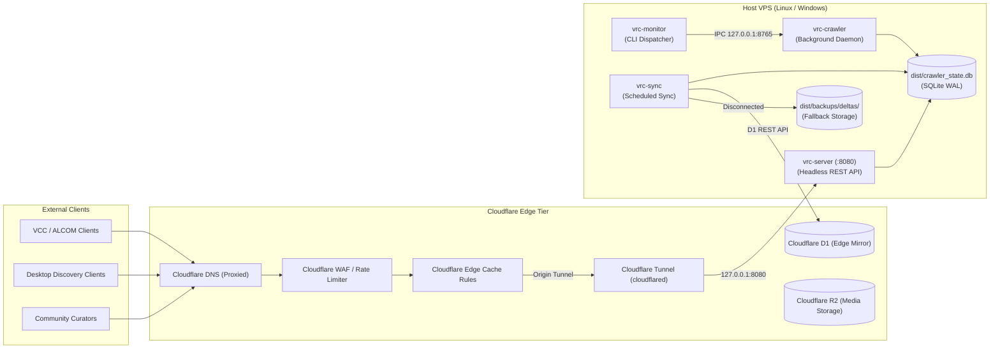

# VRChat Package Crawler: Production Deployment Runbook & SRE Guide

**Target Audience:** Site Reliability Engineers (SRE), Infrastructure Delegates, and Systems Operators  
**Revision:** Phase 2 Complete (Production Deployment, Supervisor Management & Edge Distribution)  
**Binary Distribution:** Standalone Single-File Native Executables (`dist/`)  

---

## 1. Operational Topography & Architectural Isolation

The deployment architecture will run the headless crawler engine on dedicated hosts. The engine will connect to edge services through encrypted outbound tunnels.



---

## 2. Binary Topography & Execution Rules

The build process will produce standalone native binaries in `dist/`. Operators must understand the operational boundaries of each binary:

| Binary | Source Path | Target Platform | Operational Role |
|---|---|---|---|
| `dist/vrc-crawler.exe` | `src/crawler/index.ts` | Windows x64 | 24/7 background harvesting daemon. Acquires single-instance `ProcessLock`. Contains zero CLI subcommand parsing. |
| `dist/vrc-crawler-linux` | `src/crawler/index.ts` | Linux x64 | Linux background service binary. Run under systemd. |
| `dist/vrc-monitor.exe` | `src/monitor/index.ts` | Windows x64 | Primary CLI control binary and terminal monitor. All IPC commands must be dispatched through this binary. |
| `dist/vrc-server.exe` | `src/server/index.ts` | Windows x64 | Headless REST API server for Schemas 1, 2, and 4. |
| `dist/vrc-server-linux` | `src/server/index.ts` | Linux x64 | Linux headless REST API server. |
| `dist/vrc-sync.exe` | `src/sync/index.ts` | Windows x64 | Incremental edge synchronization utility for Cloudflare D1. |

> [!CAUTION]
> Never execute subcommands directly on `vrc-crawler.exe` (such as `vrc-crawler.exe status` or `stop`). The crawler binary will interpret arguments as a command to start a new daemon. It will crash with a `ProcessLock` collision. Always send commands through `vrc-monitor.exe`.

### Correct IPC Command Dispatch Reference

| Desired Action | Correct Command | Target Service |
|---|---|---|
| Check Daemon Status | `dist/vrc-monitor.exe status` | Crawler Daemon IPC (`127.0.0.1:8765`) |
| Stop Daemon Cleanly | `dist/vrc-monitor.exe stop` | Crawler Daemon IPC (`127.0.0.1:8765`) |
| Trigger Poisson Recrawl | `dist/vrc-monitor.exe recrawl` | Crawler Daemon IPC (`127.0.0.1:8765`) |
| Force Projection Build | `dist/vrc-monitor.exe project` | Crawler Daemon IPC (`127.0.0.1:8765`) |
| Trigger Edge Sync | `dist/vrc-monitor.exe sync` | Crawler Daemon IPC (`127.0.0.1:8765`) |
| Export SQLite Catalog | `dist/vrc-monitor.exe export` | Exporter Subsystem |

---

## 3. Environment & Security Configuration

Create the runtime configuration file at `dist/.env`.

### Production Template (`dist/.env`)

```env
# Network and Gateway Configuration
PORT=8080
HOST=127.0.0.1
CRAWLER_IPC_PORT=8765

# Security Secret (Mandatory for administrative reports)
API_SECRET_TOKEN=replace_with_a_secure_random_64_character_hex_token

# Storefront Tokens (Optional but recommended)
GITHUB_TOKEN=ghp_your_github_personal_access_token_here

# Cloudflare Edge Sync Credentials
CLOUDFLARE_ACCOUNT_ID=your_cloudflare_account_id
CLOUDFLARE_API_TOKEN=your_cloudflare_api_token
CLOUDFLARE_D1_DATABASE_ID=your_d1_database_uuid
CLOUDFLARE_R2_BUCKET_NAME=vrc-catalog-media

# Path Overrides (Defaults resolve to dist/ if unset)
CRAWLER_DB_PATH=dist/crawler_state.db
CRAWLER_LOGS_DIR=dist/logs
```

> [!IMPORTANT]
> The server will read `API_SECRET_TOKEN` from the environment. Do not use the legacy name `CRAWLER_API_TOKEN`. If `API_SECRET_TOKEN` is unset, the authentication check will be bypassed. Always set a strong secret in production.

---

## 4. Host Service Supervision

Production hosts will run services under supervised process managers with automatic restarts.

### 4.1 Linux Host Setup (systemd)

1. Create target deployment directory and service user:
   ```bash
   sudo mkdir -p /opt/vrc-catalog/dist/reports/pending
   sudo mkdir -p /opt/vrc-catalog/dist/reports/processed
   sudo mkdir -p /opt/vrc-catalog/dist/backups/deltas
   sudo mkdir -p /opt/vrc-catalog/dist/logs
   sudo useradd -r -s /bin/false vrc
   ```

2. Copy binaries and database into place:
   ```bash
   sudo cp dist/vrc-server-linux /opt/vrc-catalog/dist/
   sudo cp dist/vrc-crawler-linux /opt/vrc-catalog/dist/
   sudo cp dist/crawler_state.db /opt/vrc-catalog/dist/
   sudo cp dist/.env /opt/vrc-catalog/dist/
   sudo chmod +x /opt/vrc-catalog/dist/vrc-server-linux /opt/vrc-catalog/dist/vrc-crawler-linux
   sudo chown -R vrc:vrc /opt/vrc-catalog
   ```

3. Create systemd unit for API gateway (`/etc/systemd/system/vrc-server.service`):
   ```ini
   [Unit]
   Description=VRChat Package Crawler Headless API Gateway
   After=network.target

   [Service]
   Type=simple
   User=vrc
   Group=vrc
   WorkingDirectory=/opt/vrc-catalog/dist
   ExecStart=/opt/vrc-catalog/dist/vrc-server-linux --port 8080 --host 127.0.0.1
   Restart=always
   RestartSec=5s
   LimitNOFILE=65536
   EnvironmentFile=/opt/vrc-catalog/dist/.env

   # Hardening
   ProtectSystem=full
   ProtectHome=true
   NoNewPrivileges=true

   [Install]
   WantedBy=multi-user.target
   ```

4. Create systemd unit for background crawler (`/etc/systemd/system/vrc-crawler.service`):
   ```ini
   [Unit]
   Description=VRChat Package Crawler 24/7 Harvesting Daemon
   After=network.target

   [Service]
   Type=simple
   User=vrc
   Group=vrc
   WorkingDirectory=/opt/vrc-catalog/dist
   ExecStart=/opt/vrc-catalog/dist/vrc-crawler-linux
   Restart=always
   RestartSec=10s
   LimitNOFILE=65536
   EnvironmentFile=/opt/vrc-catalog/dist/.env

   ProtectSystem=full
   ProtectHome=true
   NoNewPrivileges=true

   [Install]
   WantedBy=multi-user.target
   ```

5. Enable and start services:
   ```bash
   sudo systemctl daemon-reload
   sudo systemctl enable --now vrc-server vrc-crawler
   sudo systemctl status vrc-server vrc-crawler
   ```

### 4.2 Windows Host Setup (NSSM)

1. Place binaries and `crawler_state.db` in `C:\vrc-catalog\dist\`.
2. Install the API Gateway service via NSSM:
   ```cmd
   nssm install VrcServer "C:\vrc-catalog\dist\vrc-server.exe" "--port 8080 --host 127.0.0.1"
   nssm set VrcServer AppDirectory "C:\vrc-catalog\dist"
   nssm set VrcServer AppRestartDelay 5000
   nssm start VrcServer
   ```
3. Install the Background Crawler service via NSSM:
   ```cmd
   nssm install VrcCrawler "C:\vrc-catalog\dist\vrc-crawler.exe" ""
   nssm set VrcCrawler AppDirectory "C:\vrc-catalog\dist"
   nssm set VrcCrawler AppRestartDelay 10000
   nssm start VrcCrawler
   ```

---

## 5. Cloudflare Tunnel & Edge Routing

Operators will not open inbound public firewall ports. All public traffic will pass through an outbound encrypted Cloudflare Tunnel.

1. Authenticate `cloudflared` on the host:
   ```bash
   cloudflared tunnel login
   cloudflared tunnel create vrc-gateway-tunnel
   ```

2. Configure tunnel ingress (`/etc/cloudflared/config.yml`):
   ```yaml
   tunnel: <TUNNEL_UUID>
   credentials-file: /etc/cloudflared/<TUNNEL_UUID>.json

   ingress:
     - hostname: api.vrc-catalog.net
       service: http://127.0.0.1:8080
       originRequest:
         connectTimeout: 10s
         noTLSVerify: false
     - service: http_status:404
   ```

3. Route DNS through the tunnel:
   ```bash
   cloudflared tunnel route dns vrc-gateway-tunnel api.vrc-catalog.net
   ```

4. Install `cloudflared` as a service:
   ```bash
   sudo cloudflared service install
   sudo systemctl start cloudflared
   ```

---

## 6. Cloudflare Edge Cache & WAF Rules

Operators will configure cache and security rules in the Cloudflare dashboard.

### 6.1 Edge Cache Rules (`Caching -> Cache Rules`)

| Rule Name | Expression | Edge Cache TTL | Browser TTL | Settings |
|---|---|---|---|---|
| Rule 1: Media Proxy | `http.request.uri.path starts_with "/v1/media/"` | 30 Days | 30 Days | Cache Everything, Ignore Query String |
| Rule 2: VPM Manifest | `http.request.uri.path eq "/v1/vpm/index.json"` | 10 Minutes | 5 Minutes | Cache Everything, Respect Origin, SWR 60s |
| Rule 3: Feed Delta | `http.request.uri.path eq "/v1/catalog/delta"` | 1 Minute | 30 Seconds | Cache by Query String (`cursor`, `limit`) |
| Rule 4: Reports Bypass | `http.request.uri.path eq "/v1/reports"` | Bypass | Bypass | Bypass Cache, Direct to Origin |
| Rule 5: Health Check | `http.request.uri.path eq "/v1/health"` | Bypass | Bypass | Bypass Cache |

### 6.2 WAF Rate Limiting (`Security -> WAF -> Rate Limiting`)

- **Rule Name:** `Schema 4 Ingestion Throttling`
- **Condition:** `http.request.uri.path eq "/v1/reports" and http.request.method eq "POST"`
- **Rate Limit:** 10 requests per 1 minute per IP.
- **Action:** Block with HTTP 429 response.

---

## 7. Edge Sync Watermark Verification & Recovery

The `vrc-sync` utility will push incremental records to Cloudflare D1.

### Scheduled Cron Job
Run edge sync every 4 hours:
```bash
0 */4 * * * /opt/vrc-catalog/dist/vrc-sync --batch-size 100 >> /opt/vrc-catalog/dist/logs/sync.log 2>&1
```

### Watermark Recovery After Table Rebuilds
The canonical projection engine runs `DELETE FROM canonical_packages` during full rebuilds. This resets SQLite rowids to 1.

If the rebuilt table contains more rows than the previous high-watermark, `vrc-sync` will skip rows 1 through the watermark. Operators must run a forced watermark reset:

```bash
/opt/vrc-catalog/dist/vrc-sync --reset-watermark
```

### High-Watermark Verification Query
Verify watermark alignment between local SQLite and remote Cloudflare D1:

```sql
-- Check local maximum rowid in SQLite:
SELECT MAX(rowid) AS local_max_rowid FROM canonical_packages;

-- Check recorded checkpoint for Cloudflare D1:
SELECT checkpoint_value, updated_at 
FROM sync_checkpoints 
WHERE checkpoint_key = 'cloudflare_d1_canonical_packages';
```

If `checkpoint_value` exceeds `local_max_rowid`, reset the checkpoint to zero.

---

## 8. Database Schema Topography, Column Normalization & Logistics Slimming

Operators and infrastructure delegates must observe the following schema boundaries and data invariants:

### 8.1 The 2-URL-Column Standard & Flat Column Purge
To eliminate redundant columns and prevent mock-reality drift:
- `canonical_packages` retains exactly **two** URL columns:
  1. `url TEXT NOT NULL`: Primary storefront / repository URL corresponding to `primary_platform`.
  2. `vcc_url TEXT`: VPM/VCC manifest deep link (`vcc://vpm/addRepo?url=...`).
- Redundant flat columns (`github_url`, `booth_url`, `gumroad_url`, `jinxxy_url`, `itch_url`) are **permanently removed**.
- Individual per-platform storefront details are decoupled into the normalized `package_fronts` table (`id`, `canonical_id`, `platform`, `platform_item_id`, `url`, `title`, `author`, `price_currency`, `price_amount`, `origin_created_at`, `origin_updated_at`, `raw_entity_id`, `media_urls_json`, `youtube_urls_json`).
- `curator_overrides` removes the duplicate `title_override` column, standardizing exclusively on `name_override`.

### 8.2 Operator Query Guide for Normalized Schema

```sql
-- Query package primary platform and URL:
SELECT canonical_id, name, primary_platform, url, vcc_url 
FROM canonical_packages 
WHERE canonical_id = 'modular-avatar';

-- Query all decoupled storefront links, pricing, and origin entity across platforms:
SELECT platform, platform_item_id, url, price_currency, price_amount, raw_entity_id 
FROM package_fronts 
WHERE canonical_id = 'modular-avatar';

-- Check high-watermark row count on normalized table:
SELECT count(*), max(rowid) FROM canonical_packages;

-- Inspect pure origin media metadata (zero BLOB storage):
SELECT source_url, blurhash, phash_64, content_type 
FROM media_cache 
LIMIT 10;
```

### 8.3 Logistics Slimming: Elimination of Standalone Tool Scripts
In v1.0, standalone manual scripts in `tools/` (`requeue_gumroad.ts`, `requeue_media.ts`, `pipeline_sanitize.ts`, `exporter.ts`, `steering.ts`, `discover_vpm.ts`) have been **completely deleted** rather than maintained as fragile shims. Their operations are dissolved natively into:
- Early driver ingestion (`src/drivers/vpm_index.ts`, `src/drivers/gumroad.ts`)
- Front-stage sanitization (`src/utils/sanitizer.ts`)
- Native projection engine (`src/crawler/projection.ts` / `vrc-crawler`)
- Edge export engine (`src/sync/exporter.ts` / `vrc-export`)
- Continuous monitor loop (`src/crawler/steering.ts` / `vrc-monitor`)

Operators must never attempt to invoke scripts in `tools/`. All operations run through supervised binaries (`dist/vrc-crawler.exe`, `dist/vrc-monitor.exe`, `dist/vrc-sync.exe`).

### 8.4 Media Table Slimming & Pure Origin Pointer Architecture
Per `LEGAL.md` §7.2(c), the pipeline deprecates SQLite WebP BLOB storage (`media_cache.webp_data`), eliminating over 350 MB of database bloat. Both primary SQLite (`dist/crawler_state.db`), exported catalogs (`dist/vrc_catalog.db`), and Cloudflare D1 edge sync records carry direct origin URL arrays (`media_urls_json`), BlurHash strings, and 64-bit pHash digests without binary BLOB storage. The server media proxy (`GET /v1/media/:id`) issues HTTP 302 redirects directly to origin CDNs (*Perfect 10 v. Amazon* Server Test compliance).

### 8.5 Version 0 Ground-Truth Policy & Dead Migration Removal
This system is version 0. Deprecation shims, backward-compatibility type aliases, and automatic runtime table rename loops (`_v2` -> clean name) are permanently dropped. Delegates and operators are instructed to:
- Never execute in-place column-by-column migration scripts against legacy stale databases in `dist/`.
- Rebuild fresh canonical state cleanly from raw `entities` event logs or fresh crawler seeding (`bun run project`).
- Treat code DDL (`src/db.ts`) as Ground Truth.

---

## 9. Log Management & Archival

The logging subsystem (`src/logger.ts`) provides native session-prefixed daily rotating log streams with automatic gzip (`.log.gz`) compression:
- **Session Prefixes**: File paths follow `dist/logs/session_<pid>_<sessionId>_<YYYY-MM-DD>.log`.
- **Daily Rotation & Gzip**: At UTC midnight turnover, active file handles are closed, prior day log files are compressed via native zlib gzip (`level: 9`) to `.log.gz`, uncompressed originals are purged, and fresh stream handles are opened.
- **External Log Management**: Optional external rotation configurations below may still be used if host OS retention policies are desired.

### Linux logrotate Configuration (`/etc/logrotate.d/vrc-catalog`)

```
/opt/vrc-catalog/dist/logs/*.log {
    daily
    missingok
    rotate 14
    compress
    delaycompress
    notifempty
    copytruncate
}
```

### Windows Log Sweep (PowerShell Scheduled Task)

```powershell
Get-ChildItem -Path "C:\vrc-catalog\dist\logs\*.log" | Where-Object { $_.LastWriteTime -lt (Get-Date).AddDays(-1) } | ForEach-Object {
    $zipPath = "$($_.FullName).$((Get-Date).ToString('yyyyMMdd')).zip"
    Compress-Archive -Path $_.FullName -DestinationPath $zipPath -Update
    Clear-Content $_.FullName
}
```

---

## 9. SRE Production Checklist

- [ ] Compile native binaries via `bun run build:all`.
- [ ] Transfer binaries and initial database to host directory.
- [ ] Configure `dist/.env` with random `API_SECRET_TOKEN` and credentials.
- [ ] Verify `ProcessLock` activates when starting crawler daemon.
- [ ] Install and verify supervisor services (systemd or NSSM).
- [ ] Confirm IPC commands respond via `vrc-monitor.exe status`.
- [ ] Establish Cloudflare Tunnel and verify zero open inbound firewall ports.
- [ ] Apply Edge Cache Rules and WAF rate limits in Cloudflare dashboard.
- [ ] Execute `vrc-sync --dry-run` to verify Cloudflare D1 connectivity.
- [ ] Confirm health endpoint responds: `curl -I http://127.0.0.1:8080/v1/health`.
