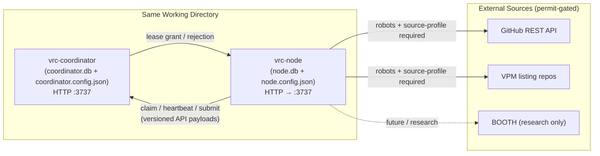

# VRChat Package Crawler: Pre-Production Runbook

**Target Audience:** Operators and infrastructure delegates running the pre-production two-binary local stack  
**Revision:** Version 0 pre-production (refactor/v0 baseline)  
**Status:** Local simulation only — no Cloudflare account, API key, or deployed Worker required

> [!IMPORTANT]
> This runbook supersedes the Phase 4 draft that described `vrc-crawler`, `vrc-server`, `vrc-monitor`, `vrc-sync`, and Cloudflare D1/R2 sync. Those binaries and the associated IPC, sync scripts, and `dist/.env` configuration are **permanently retired**. Do not attempt to run them.

---

## 1. Current Architecture

The system is two separately runnable binaries communicating over loopback HTTP:


```mermaid
flowchart LR
    subgraph "Same Working Directory"
        COORD["vrc-coordinator\n(coordinator.db + coordinator.config.json)\nHTTP :3737"]
        NODE["vrc-node\n(node.db + node.config.json)\nHTTP → :3737"]
    end

    NODE -->|"claim / heartbeat / submit\n(versioned API payloads)"| COORD
    COORD -->|"lease grant / rejection"| NODE

    subgraph "External Sources (permit-gated)"
        GITHUB["GitHub REST API"]
        VPM["VPM listing repos"]
        BOOTH["BOOTH (research only)"]
    end

    NODE -->|"robots + source-profile required"| GITHUB
    NODE -->|"robots + source-profile required"| VPM
    NODE -.->|"future / research"| BOOTH
```

| Binary | Entry Point | Config File | Database |
|---|---|---|---|
| `dist/local-coordinator/vrc-coordinator.exe` | `src-crawler/src/worker/main.ts` | `coordinator.config.json` | `coordinator.db` |
| `dist/local-node/vrc-node.exe` | `src-crawler/src/node/main.ts` | `node.config.json` | `node.db` |

Both files are emitted in the binary's **working directory** — typically the directory you launch from.

---

## 2. Build

```bash
# From src-crawler/
bun run build
```

Produces:
- `dist/local-coordinator/vrc-coordinator.exe` (Windows x64)
- `dist/local-node/vrc-node.exe` (Windows x64)
- `dist/worker/` (Cloudflare Worker bundle — for future use only)

---

## 3. Pre-Production Launch (Two-Binary Local Simulation)

### 3.1 Automated smoke (recommended)

```bash
bun run smoke:continuous
```

This script (`src-crawler/scratch/smoke_preprod_continuous.ts`):
1. Builds both binaries
2. Launches both concurrently in a temporary working directory
3. Operator-issues a node credential via `POST /v1/operator/nodes`
4. Provisions scoped source-access profiles
5. Runs sustained background daemon execution — autonomous job pickup, real VPM fetches, Poisson-paced scheduling
6. Verifies zero SQLite lock collisions between `coordinator.db` and `node.db`
7. Cleanly shuts down both processes

### 3.2 Manual launch

Open two terminals in the **same working directory**:

**Terminal A — coordinator:**
```bash
./dist/local-coordinator/vrc-coordinator.exe
```

**Terminal B — node:**
```bash
./dist/local-node/vrc-node.exe
```

On first run, each binary writes its own config file. The coordinator will print the operator token to stdout on first boot. Copy it before continuing.

### 3.3 Operator bootstrap (issue a node token)

```bash
# Issue a node credential (replace <OPERATOR_TOKEN> with what the coordinator printed)
curl -s -X POST http://127.0.0.1:3737/v1/operator/nodes \
  -H "Authorization: Bearer <OPERATOR_TOKEN>" \
  -H "Content-Type: application/json" \
  -d '{"nodeId":"local-node-1","capabilities":["vpm","github","booth","curated"],"reason":"pre-production local node"}'
```

Copy the `token` from the response and add it to `node.config.json` as `"coordinatorToken"`.

---

## 4. Source Access — Permit Gate

A queued URL does **not** authorize a live fetch. Every job requires:

1. An active scoped **source-access profile** (`POST /v1/operator/source-profiles`)
2. A successful **robots.txt preflight** (coordinator-coordinated, origin-paced)
3. A **lease grant** at claim time, re-validated at heartbeat and submission

Nodes fetch only coordinator-leased jobs. Coordinator unavailability stops new fetches. Disable a source profile to immediately revoke all new lease grants for that origin.

```bash
# Create a source-access profile for github.com
curl -s -X POST http://127.0.0.1:3737/v1/operator/source-profiles \
  -H "Authorization: Bearer <OPERATOR_TOKEN>" \
  -H "Content-Type: application/json" \
  -d '{
    "origin": "https://github.com",
    "allowedPurposes": ["metadata"],
    "rateFloorMs": 60000,
    "rationale": "VPM package metadata; reviewed exact paths only",
    "expiresAt": null
  }'
```

See `docs/decisions/current/SOURCE_ACCESS_AND_SAFETY.md` for current source-policy decisions per platform.

---

## 5. Operator API Reference

The coordinator exposes two API layers over loopback HTTP:

| Layer | Port | Auth |
|---|---|---|
| Node protocol (claim/heartbeat/submit) | `:3737` | Node bearer token (issued by operator) |
| Operator control | `:3737/v1/operator/*` | Operator bearer token (printed on first boot) |

Key operator routes:

| Route | Purpose |
|---|---|
| `GET /v1/operator/leads` | List discovered pending leads for review |
| `POST /v1/operator/leads/:id/queue` | Promote a pending lead to a queued job |
| `POST /v1/operator/auto-queue-rules` | Create a rule to auto-promote matching leads |
| `GET /v1/operator/source-profiles` | List source-access profiles |
| `POST /v1/operator/source-profiles` | Create a scoped source-access profile |
| `DELETE /v1/operator/source-profiles/:id` | Disable a profile and revoke open leases |
| `POST /v1/operator/nodes` | Issue a node credential |
| `GET /v1/operator/catalog` | List canonical packages (paginated) |

Full schema is in `src-crawler/src/shared/operator_protocol.ts` and documented in `docs/decisions/current/OPERATOR_CONTROL_API.md`.

---

## 6. GitHub Token Usage

The existing GitHub token in `bin/` may be used **only** for its intended scoped GitHub REST metadata role. It must not be:
- Copied into documentation or output
- Used as a coordinator registration key
- Used as an operator bearer token
- Used for any non-GitHub API

Set it as `GITHUB_TOKEN` in the node's environment or `node.config.json`.

---

## 7. Database Layout

Both processes run in the same working directory without lock collisions:

| File | Owner | Purpose |
|---|---|---|
| `coordinator.db` | coordinator | Source items, versions, events, identity links, canonical packages, leases, leads, operator audit log |
| `coordinator.config.json` | coordinator | Coordinator bind address, operator token hash, robots pacing config |
| `node.db` | node | Local node runs, task telemetry, outcome records |
| `node.config.json` | node | Coordinator URL, node ID, issued node token, capabilities |

> [!CAUTION]
> `bin/crawler_state.db` is a legacy prototype database from Phase 1–4. It uses the old CrawlerDB schema. Do not operate on it with the new binaries. Tests are isolated from it.

---

## 8. Tests and Verification

```bash
# Run all tests (offline, hermetic)
bun test

# Type-check
bun run typecheck

# Build all targets
bun run build

# Check documentation links
bun run check:docs

# Continuous pre-production simulation (real data, two binaries)
bun run smoke:continuous

# GitHub live metadata smoke (opt-in, real network)
bun run smoke:github:live
```

Current baseline: **161 tests, 0 failures, 1344 assertions** (2026-09-30).

---

## 9. Cloudflare Simulation

The local pre-production stack **simulates** the eventual Cloudflare Worker/coordinator split using loopback HTTP. No Cloudflare account, tunnel, D1 database, R2 bucket, API token, or Worker deployment is required for this milestone.

The `dist/worker/` bundle is built but not deployed. See `docs/research/SPIKES.md` for the portability assessment.

---

## 10. Pre-Production Operator Checklist

- [ ] `bun run build` completes without errors
- [ ] `bun test` passes (161 tests, 0 failures)
- [ ] `bun run typecheck` passes (0 errors)
- [ ] Both binaries launch in the same working directory without lock collisions
- [ ] Coordinator prints operator token on first boot
- [ ] Node credential issued via `POST /v1/operator/nodes`
- [ ] At least one source-access profile created and verified before any live fetch attempt
- [ ] `bun run smoke:continuous` passes end-to-end
- [ ] No credentials appear in logs, databases, or output files
