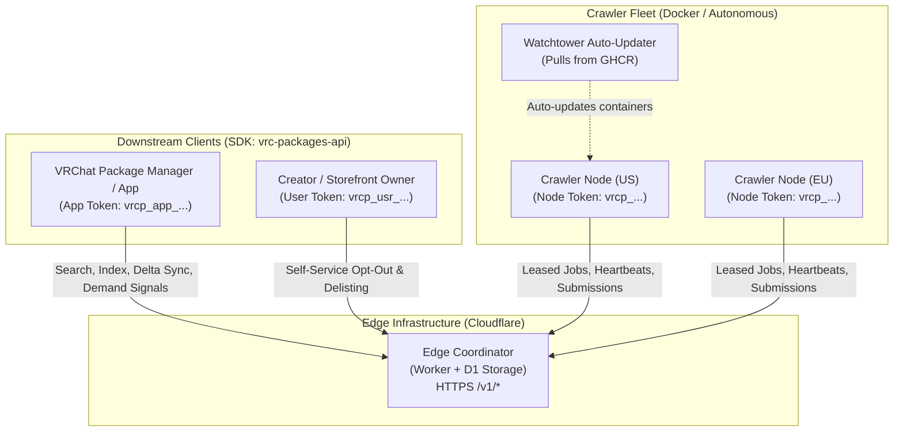

# VRChat Package Crawler: Downstream Delegate & Integrator Runbook

**Target Audience:** Downstream application developers, package managers, community tooling authors, and crawler node operators.  
**SDK Package:** `vrc-packages-api` (`src-package/`)  
**Coordinator Architecture:** API-only Cloudflare Worker (`src-web/src/worker/`) with D1 storage. Local tests use Wrangler/workerd, not a coordinator binary.

**Crawler Architecture:** Standalone leased crawler node (`src-crawler/src/main.ts`) with functional folders under `src-crawler/src/`. Docker fleet/update checks remain open.

---

## 1. System Topology & Architecture

The VRChat Package Crawler ecosystem separates concerns into three distinct roles:


```mermaid
flowchart TD
    subgraph "Edge Infrastructure (Cloudflare)"
        COORD["Edge Coordinator\n(Worker + D1 Storage)\nHTTPS /v1/*"]
    end

    subgraph "Downstream Clients (SDK: vrc-packages-api)"
        APP["VRChat Package Manager / App\n(App Token: vrcp_app_...)"]
        CREATOR["Creator / Storefront Owner\n(User Token: vrcp_usr_...)"]
    end

    subgraph "Crawler Fleet (Docker / Autonomous)"
        NODE1["Crawler Node (US)\n(Node Token: vrcp_...)"]
        NODE2["Crawler Node (EU)\n(Node Token: vrcp_...)"]
        WATCH["Watchtower Auto-Updater\n(Pulls from GHCR)"]
    end

    APP -->|"Search, Index, Delta Sync, Demand Signals"| COORD
    CREATOR -->|"Self-Service Opt-Out & Delisting"| COORD
    NODE1 -->|"Leased Jobs, Heartbeats, Submissions"| COORD
    NODE2 -->|"Leased Jobs, Heartbeats, Submissions"| COORD
    WATCH -.->|"Auto-updates containers"| NODE1
```

1. **Edge Coordinator**: Stateless Cloudflare Worker with D1 SQLite storage managing source access profiles, RFC 9309 robots snapshots, leased job dispatching, canonical package projection, and downstream public/authenticated APIs.
2. **Downstream Clients**: Third-party package managers, web apps, or desktop clients that consume the catalog via the strongly-typed `vrc-packages-api` client SDK (`src-package/`).
3. **Crawler Nodes**: Autonomous worker nodes running in Docker containers that claim leases, respect origin pacing, extract facts from approved sources, and submit observations without holding write access to the coordinator database.

---

## 2. Downstream Integration Guide (`src-package` / `vrc-packages-api`)

Downstream developers integrate via the official TypeScript SDK (`vrc-packages-api`).

### 2.1 Installation & Client Initialization

```typescript
import { VrcPackagesClient } from "vrc-packages-api";

// Public unauthenticated access (catalog browsing)
const publicClient = new VrcPackagesClient({
  baseUrl: "https://coordinator.example.com"
});

// Authenticated application access (search, demand feedback, delta streaming)
const appClient = new VrcPackagesClient({
  baseUrl: "https://coordinator.example.com",
  appToken: "vrcp_app_0123456789abcdef..."
});

// Authenticated user access (delisting, self-service node registration)
const userClient = new VrcPackagesClient({
  baseUrl: "https://coordinator.example.com",
  userToken: "vrcp_usr_abcdef0123456789..."
});
```

---

### 2.2 Registering a Downstream Application (`client.app.register`)

Every downstream application issues its own unique `vrcp_app_` token to access bounded search and demand feedback:

```typescript
const appRegistration = await publicClient.app.register({
  schemaVersion: 1,
  appName: "MyVrcPackageManager",
  contactEmail: "dev@example.com",
  description: "Desktop package manager for VRChat avatars and tools"
});

console.log("App ID:", appRegistration.appId);
console.log("App Token:", appRegistration.appToken); // Persist securely (vrcp_app_<64-hex>)
```

---

### 2.3 Querying the Public Package Index (`client.catalog.list`)

Downstream applications can read canonical packages with keyset pagination:

```typescript
const page = await publicClient.catalog.list({
  limit: 50,
  cursor: null // null for first page
});

for (const pkg of page.packages) {
  console.log(`[${pkg.umbrella}] ${pkg.displayName} (${pkg.category})`);
  console.log("  Canonical ID:", pkg.canonicalId);
  console.log("  VPM ID:", pkg.vpmId);
  console.log("  Published:", pkg.publishedAt, "Confidence:", pkg.timestampConfidence);
  for (const front of pkg.fronts) {
    console.log(`  Front (${front.platform}): ${front.storefrontUrl} - ${front.price ?? 0} ${front.currency ?? ""}`);
  }
}

// Fetch next page if available
if (page.nextCursor) {
  const nextPage = await publicClient.catalog.list({ limit: 50, cursor: page.nextCursor });
}
```

---

### 2.4 Synchronizing Incremental Deltas (`client.catalog.syncDeltas`)

Rather than re-fetching the full catalog, clients synchronize incremental changes using the delta stream:

```typescript
let cursor: string | null = loadSavedDeltaCursor();

const deltaResponse = await publicClient.catalog.syncDeltas({
  cursor,
  limit: 100
});

for (const delta of deltaResponse.deltas) {
  if (delta.action === "upsert" && delta.package) {
    saveLocalPackage(delta.package);
  } else if (delta.action === "delist") {
    removeLocalPackage(delta.canonicalId);
  }
}

saveDeltaCursor(deltaResponse.nextCursor);
```

---

### 2.5 Bounded Search & Bulk Tag Queries (`client.app.search`)

Search requires an application token and explicit query attribution (`user_authored` vs. `app_automated`). Bulk tag queries mandate canonical timestamp ordering:

```typescript
const searchResults = await appClient.app.search({
  queryOrigin: "user_authored",
  tags: ["avatar_tool", "modular_avatar"],
  umbrella: "tools",
  limit: 25
});

// Results are ordered by canonical release timestamp:
// 1. confirmed (authoritative publisher release dates)
// 2. inferred (media/3rd party metadata)
// 3. observed (first seen fallback, updated on digest change)
for (const item of searchResults.items) {
  console.log(`${item.displayName} - Published: ${item.publishedAt} (${item.timestampConfidence})`);
}
```

---

### 2.6 Downstream Demand Feedback & Issue Reporting (`client.app.submitReport`)

Clients report zero-hit search misses or demand signals to dynamically orient crawler workforce distribution:

```typescript
// 1. Demand Signal: Search Miss (triggers crawler redistribution toward missing package)
await appClient.app.submitReport({
  schemaVersion: 1,
  reportType: "demand_signal",
  signalKind: "search_miss",
  query: "novel-audio-link-addon",
  zeroHits: true
});

// 2. Issue Report: Metadata defect or broken storefront link
await appClient.app.submitReport({
  schemaVersion: 1,
  reportType: "issue_report",
  reportKind: "broken_link",
  targetUrl: "https://booth.pm/ja/items/0000000",
  canonicalId: "com.example.broken-addon"
});
```

---

### 2.7 Creator Self-Service Opt-Out & Delisting (`client.user.delist`)

Creators can delist packages without administrative intervention using verifiable proofs:

```typescript
// Unauthenticated delisting using a storefront bio verification token
const delistResult = await publicClient.user.delist({
  schemaVersion: 1,
  targetUrl: "https://booth.pm/ja/items/1234567",
  reason: "Creator requested removal from public indexing",
  proofKind: "storefront_bio_token",
  proofValue: "#vrc-opt-out-myvendorid",
  contactEmail: "creator@example.com"
});

console.log("Takedown Status:", delistResult.status); // "accepted"
```

---

## 3. Crawler Node Operation & Fleet Management

Crawler nodes run as autonomous containerized processes claiming leases from the coordinator over HTTPS.

### 3.1 Docker Compose Fleet Deployment

```yaml
version: "3.8"

services:
  crawler-node:
    image: ghcr.io/slamdragon/vrc-package-crawler-node:latest
    container_name: vrc-crawler-node
    restart: unless-stopped
    environment:
      - COORDINATOR_URL=https://coordinator.example.com
      - NODE_ID=node-worker-us-01
      - NODE_TOKEN=vrcp_0123456789abcdef0123456789abcdef0123456789abcdef0123456789abcdef001f
      - MAX_CONCURRENT_JOBS=2
      - METRICS_PORT=9090
    ports:
      - "9090:9090"

  watchtower:
    image: containrrr/watchtower
    container_name: vrc-watchtower
    restart: unless-stopped
    volumes:
      - /var/run/docker.sock:/var/run/docker.sock
    command: --interval 300 --cleanup vrc-crawler-node
```

### 3.2 Automated Watchtower Updates

- Every commit pushed to `main` triggers `.github/workflows/docker-publish.yml`, building and pushing multi-platform images to GHCR (`ghcr.io/slamdragon/vrc-package-crawler-node:latest`).
- Watchtower polls GHCR every 300 seconds, gracefully restarting the node container when a new image digest is available without disrupting active job leases.

---

## 4. Protocol Reference & HTTP Wire Endpoints

| Endpoint | Method | Auth | Description |
|---|---|---|---|
| `/v1/app/index` | `GET` | None | Public catalog keyset pagination (`limit`, `cursor`) |
| `/v1/app/index/delta` | `GET` | None | Real-time delta update stream (`limit`, `cursor`) |
| `/v1/app/index/search` | `POST` | App Bearer (`vrcp_app_`) | Bounded search, bulk tags, timestamp ordering |
| `/v1/app/index/random` | `GET` | App Bearer (`vrcp_app_`) | Random catalog discovery sampling |
| `/v1/app/register` | `POST` | None | Self-service application token issuance |
| `/v1/app/report` | `POST` | App Bearer (`vrcp_app_`) | Consolidated demand signal & issue reporting |
| `/v1/user/token` | `POST` | None | User bearer token issuance (`vrcp_usr_`) |
| `/v1/user/nodes` | `POST` | User Bearer (`vrcp_usr_`) | Self-service capability-encoded node token issuance |
| `/v1/user/delist` | `POST` | Optional User Bearer | Creator opt-out and unified package delisting |
| `/v1/node/jobs/claim` | `POST` | Node Bearer (`vrcp_...`) | Leased job claim under active access profiles |
| `/v1/node/heartbeat` | `POST` | Node Bearer (`vrcp_...`) | Lease renewal heartbeat |
| `/v1/node/jobs/submit` | `POST` | Node Bearer (`vrcp_...`) | Completed crawl observation & lead submission |
| `/v1/operator/init` | `POST` | Operator Bearer | Coordinator schema bootstrap and seeding |
| `/v1/operator/nodes` | `POST` | Operator Bearer | Administrative capability node issuance |
| `/v1/operator/takedowns` | `GET` | Operator Bearer | Review takedown and delisting audit records |

### Standard HTTP Response Headers
All public API responses emit:
- `VRC-Packages-Terms-Of-Use: https://coordinator.example.com/LEGAL.md`
- `VRC-Packages-Terms-Version: 2026-09-28`
- `Link: <https://coordinator.example.com/LEGAL.md>; rel="terms-of-service"`
