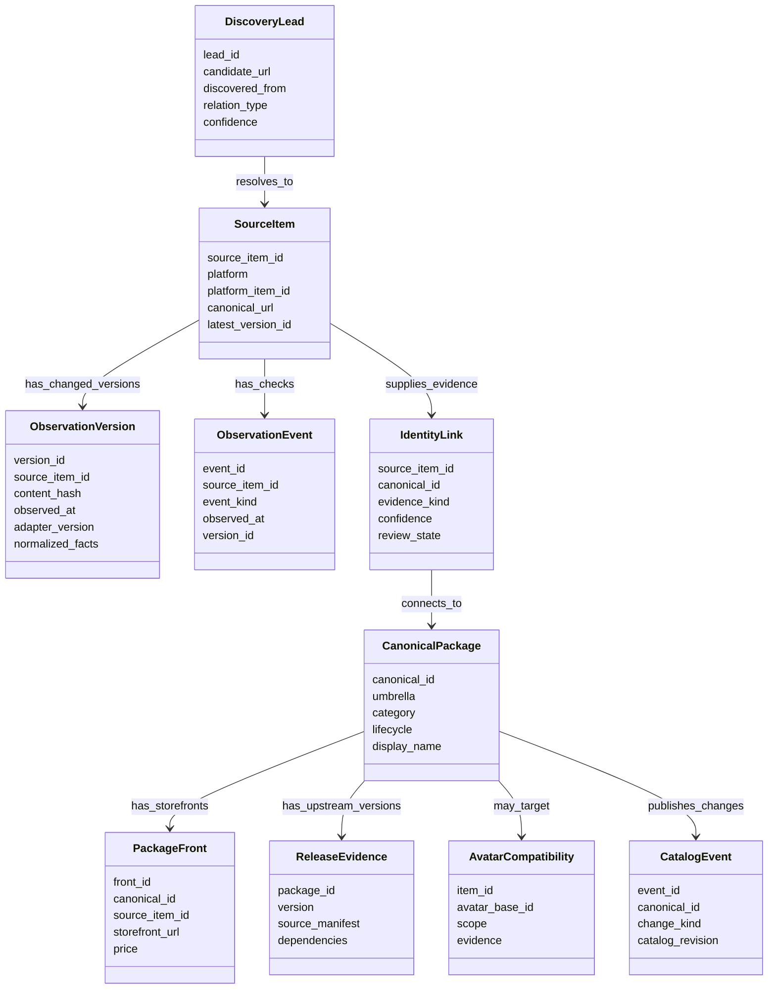
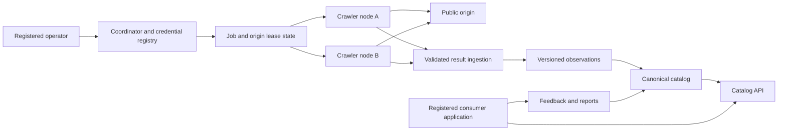

# Implementation plan: capability gates toward the canonical catalog

> **Status:** Implementation proposal derived from the owner's comments in `DIRECTION.md` on 2026-09-27. This is a work plan, not a claim that the capabilities exist. `DIRECTION.md` retains the owner's wording and unresolved choices.
>
> **Release rule:** A gate closes only when its observable acceptance conditions pass on production code paths. The historic completion of Phases 1–4 remains recorded, while any new defect is tracked against a current capability gate.

## 1. Product decisions now driving the work

| Decision | Implementation consequence | Remaining qualification |
| --- | --- | --- |
| `canonical_packages` is the final accepted, deduplicated catalog bucket | Keep one public catalog identity. Add an umbrella field with **Tools**, **Assets**, and **Avatars**, plus category-specific subtype data and relationships | Research the vocabulary against a labeled sample; platform tags are evidence, not the taxonomy itself |
| Tools include world/avatar creation tools, scripts, VPM/UPM; Assets include shaders, props, models, gimmicks; Avatars include bases and cosmetics | Discovery and classification may use umbrella-specific paths, but all accepted items reach the same final catalog | Some items cross umbrellas; define multi-label handling rather than silently choosing one |
| Cosmetics and avatar bases are in scope | Replace blanket asset rejection with an umbrella-aware decision tree; record avatar compatibility and universal applicability | Humanoid/furry and named avatar bases require an evidence-backed vocabulary |
| Broad discovery is a goal | Admit curated lists, dependencies, creator links, search results, and manifests as typed leads | Each lead still needs a supported source and evidence before publication |
| Historical changes and an event log are wanted | Store a new source version only when meaningful content changes; log each fetch/check and state transition without duplicating unchanged payloads | Full raw-content retention and deletion exceptions need source-specific research |
| The project indexes and links to authoritative VPM repositories | Preserve upstream package IDs, versions, dependencies, and repository URLs as evidence; do not fabricate installable releases | Decide whether `/v1/vpm/index.json` has any valid role after this change |
| Jinxxy driver is available during research/development | Add explicit execution profiles and source switches. The production profile checks a recorded source approval before scheduling it | Permission is being pursued; current terms require official API use or written permission for automated access ([Jinxxy Terms §23.2](https://jinxxy.com/terms-of-service)) |
| Distributed crawler nodes and a Cloudflare coordinator are the intended destination | Define node/job/result contracts early; exercise them in a local simulator before deployment | Cloudflare storage/coordination choices follow a workload and limits spike |
| Capability gates replace a simple Phase 5 percentage | Make dependencies, exit tests, and open research visible; map old Phase 5 tasks into gates | Retain historical task IDs as references, not as the new order of execution |

**Status of this table:** The first column reflects the owner's comments. The second column is the proposed implementation translation. A research qualification remains open even when the product direction is settled.

## 2. Logical data flow and ownership

The diagram is a logical class map. Table names and exact columns are proposed and may change after the Gate 2 schema spike.

### 2.1 Data logistics rules

1. A lead is a reason to inspect a destination, never proof that its copied title, price, or version is correct. Store the lead's source and relation type so later source ranking is possible.
2. A source item represents one upstream listing, manifest, repository, or product. It has a stable source identity even when its URL, title, or fetched representation changes.
3. On a successful fetch, normalize meaningful fields, compute a digest over canonical serialized content, and compare it to the latest version. A hash identifies a change; it does **not** compress or replace the historical payload. Insert a version when content changes. Record a lightweight check event for unchanged content, `304`, errors, challenges, and policy blocks.
4. In one transaction, insert the changed version/event and advance `SourceItem.latest_version_id`. The latest pointer may change; historical version rows remain intact under the applicable retention policy.
5. The final `CanonicalPackage` uses a stable opaque ID for non-VPM items. Preserve upstream VPM identifiers and previous aliases separately. Keep a merge/split history so a mistaken match can be reversed without reusing IDs.
6. Similarity methods, including SimHash and pHash, propose identity links. Publication requires stronger signals appropriate to the umbrella: upstream package ID, creator-declared cross-link, matching source repository, or reviewed storefront relationship. Visual similarity alone cannot attach a BOOTH front to an unrelated VPM package.
7. `PackageFront` remains relational internally because each storefront has its own URL, price, availability, and update history. The API may serialize the fronts as a JSON array inside a canonical package. Keeping `platforms_json` as a second authoritative store would create drift.
8. Avatar bases are canonical items. A cosmetic or tool can relate to zero, one, or multiple bases; `universal` is an explicit compatibility scope, not a fake avatar name. Compatibility claims retain their source and uncertainty.
9. `ReleaseEvidence` comes from real upstream VPM manifests or other verified release sources. The catalog can display version history while linking users to the origin repository. It must not synthesize `1.0.0` to make an index look like a package repository.
10. Opt-out creates a crawl exclusion and a public suppression event immediately. Observed disappearance or repeated `404` creates a lifecycle review or archived state according to policy. History retention/deletion is resolved separately from public suppression; downstream consumers receive a tombstone either way.
11. A projection is the currently published interpretation of evidence. The owner may call this the *canonical catalog view* in public documentation. Replay or rebuild is needed only when taxonomy, identity links, overrides, or source policy changes; ordinary crawls update affected catalog items incrementally.
12. The local export is a test and isolation product unless a separate consumer need is accepted. The canonical publication path is the API/edge catalog. One typed contract should generate or validate both outputs.

Catalog deltas should be driven by a monotonic `CatalogEvent` sequence covering additions, updates, front changes, merges, splits, and tombstones. A catalog **generation** changes only when an incompatible replay/reset requires every consumer to reload; a normal projection run with no changed output must not create a new generation. This avoids relying on SQLite row IDs that may be reused after rebuilds.

For creator delisting, the owner's preferred path is the API with bio or product-description token verification; signed Git commits should be removed from the target workflow unless a separate need emerges. A verified opt-out blocks future crawl jobs, not just public display. A missing product should not be treated as a creator request: require source-specific evidence and repeated checks before calling it delisted. The historical record remains private unless a reviewed deletion obligation applies.

Origin publication time may be **confirmed** by the source or **inferred** from related evidence such as a release, image, or video. Preserve the evidence and confidence level. `observed_at` and the time the canonical catalog last changed remain separate, so consumer applications can sort without mistaking crawl time for original publication time.

### 2.2 Field transformation example

| Input | Stored evidence | Catalog decision | Public field |
| --- | --- | --- | --- |
| Storefront page title | Source item version with URL and timestamp | Clean display name; record cleanup rule/version | `displayName` |
| VPM manifest ID and version | Verified package/release evidence | Link to stable canonical item if identity signals pass | `vpmId`, available versions, origin repository link |
| Storefront price | Time-stamped front evidence | Keep price on that front; do not overwrite prices on other fronts | `fronts[].price` |
| Avatar compatibility claim | Creator/platform text or structured tag with source | Normalize avatar alias; mark named, universal, or uncertain | `compatibility[]` |
| Description body | Source text and parsed segments, subject to source retention policy | Extract actual description apart from headers, dividers, social links, and boilerplate; produce public summary under reviewed policy | `summary` and origin link |
| User feedback | Report with application identity and trust state | Suggest, review, or apply an override according to an explicit authority rule | Revision plus visible provenance where appropriate |

## 3. Capability gates and order of work

The gates are ordered by dependency. Research tasks may run while earlier implementation proceeds, but a gate cannot close with an unresolved decision that changes its schema or public behavior.

| Gate | Deliverable | Main work | Exit evidence |
| --- | --- | --- | --- |
| **G0 — Decision baseline** | Accepted product vocabulary and contract map | Incorporate the owner's comments into explicit decisions; define Tools/Assets/Avatars, source tiers, node/operator/application identities, and document roles. Audit `DISAGREEMENTS.md` against current split-driver files and link all 30 FIXMEs to gate work | Owner-readable decision record; every current discrepancy marked open/resolved/stale; no contradictory active Phase 5 instructions |
| **G1 — Safe current operation** | Reliable single-node baseline | Remove default admin secret; correct recrawl exclusions; centralize challenge/429 outcome handling; handle opt-out redirects with per-hop SSRF checks; stop unused WebP work; fix `media_id` absence; make tests hermetic | Missing secret cannot authorize protected routes; blocked/opted-out URLs stay blocked after recrawl; challenge never becomes product data; 429 respects bounded backoff; compiled smoke tests run |
| **G2 — Data logistics** | Versioned source evidence and stable catalog identity | Define schema and relationship diagram; choose DB abstraction after a small spike; introduce source items, change-only versions, events, identity links, catalog revisions, fronts, compatibility, and tombstones; separate public summaries from source text | Change/unchanged/deleted/renamed/merged/split fixtures replay correctly; one changed item produces one version and one catalog delta; no wrong storefront merge in labeled corpus |
| **G3 — Adapter and discovery contracts** | Narrow, testable platform adapters | Shared driver runtime, fetch interface, parser primitives, validation, lead graph, source-specific access profiles, dependency traversal, creator links, and curated-list source tracing | Same fixtures produce typed leads/observations for all drivers; no adapter writes catalog tables directly; ambiguous links remain leads; source switches work per profile |
| **G4 — Classification and publication** | Unified catalog under three umbrellas | Empirical taxonomy corpus; umbrella-specific classifier and dedup policy; avatar-base aliases and compatibility; real VPM version evidence; source field ranking; incremental public catalog, fronts, and epoch-aware deltas | Representative multilingual tools/assets/avatars classified with measured errors; cosmetic and tool false merges rejected; API/export agree on same catalog revision; consumers recover after reset |
| **G5 — Coordinator simulation** | Local Worker-like coordinator plus two or more crawler nodes | Define registration, per-driver capability grants, job pull/lease, origin pacing, idempotent result submission, heartbeat, credential rotation/revocation, and delisting propagation; run against local SQLite/in-memory services first | Concurrent nodes never exceed one origin's configured rate; revoked or wrong-scope tokens fail; duplicate result submissions do not duplicate evidence; coordinator loss stops new fetches; delisting blocks all nodes |
| **G6 — Cloudflare and release conformance** | Cloudflare adapter and deployment evidence | Map coordinator contracts to Worker/D1 and a coordination store if required; measure limits/cost; stage end-to-end; rebuild target docs and separate implementation conformance evidence | Staging meets G5 tests, compiled node tests, database recovery, cursor reset, source switches, and documented operational runbook; `LEGAL.md` target clauses have a corresponding conformance state |

The present process lock remains useful while a node runs as a local single instance. Gate 5 should verify that the lock protects local duplicate starts, while leases protect the distributed origin from excess requests. These mechanisms solve different problems.

### 3.1 Clarifications from the owner's comments

| Comment | Concrete plan response |
| --- | --- |
| Why keep `package_fronts` when canonical packages can carry JSON? | Store independently changing storefront records once, then assemble the JSON view for consumers. A front's price, URL, or availability can change without rewriting the identity of the whole canonical item. |
| What does the delta cursor problem mean? | A client might ask for changes after record 15,000. If a catalog rebuild restarts numbering at 1, the client sees “no new records” forever. Bind its cursor to a catalog generation and use a monotonic event sequence for ordinary changes; instruct clients to reload only when the generation becomes incompatible. This concerns consumer sync, separately from node job leasing. |
| What does the media proxy do? | A direct image URL can fail in a browser when an origin restricts hotlinking. The proxy fetches an allowed image and streams it to the requesting client without saving the bytes. Gate 1 removes the separate crawl-time WebP conversion whose output is discarded; Gate 4 researches whether proxy transformation remains necessary. |
| Was BlurHash removed? | No. Current `image_proxy.ts` still computes/stores BlurHash text and pHash metadata. The removed storage was the persistent WebP image BLOB. Gate 1 verifies and documents the actual media path. |
| Why consider an IP parsing package? | The server hand-parses IPv4/IPv6 ranges for its opt-out and media fetch SSRF checks. A package can validate address syntax/ranges; DNS pinning and redirect checks remain project policy. This is a correctness spike, not a change to which websites are discovered. |
| Why was IANA fetched? | `IanaRegistry` is used while accepting or classifying external domains linked to packages. Gate 3 tests real domains and special-use suffixes, then chooses whether an offline public-suffix package is more reliable than the current live fetch/fallback. |
| How will versions and names stay consistent? | Add one version/contract registry (a checked-in JSON or typed module) for application build, public API, catalog schema, report schema, and terms notice. Upstream package versions remain data, never configuration. Canonical display names can change while stable IDs and aliases remain. |
| What happens to logging? | Gate 1 evaluates a small logger package against the existing one and implements one active `latest.log`, with prior session/day files moved to an archive. Rotation and shutdown behavior get compiled-binary tests; do not replace the logger merely to add a package. |
| Can saturation be reused? | Rename the existing `done/discovered` value to queue completion. Gate 4 may add source-specific coverage measures where the denominator is known. No unknown ecosystem-wide “percent indexed” or stop threshold should be inferred. |
| Can indirect feedback refine ranking? | Add typed, aggregate signals from consumer applications only after the application credential and report authority model is settled. Ranking signals can suggest review or alter a documented score; they cannot silently rewrite creator-claimed identity, links, or source evidence. |
| Can VRCArena help identify avatar bases? | Treat its catalog as a research comparison or discovery lead if access and terms permit. Validate base identity and compatibility against creator-controlled or other accepted source evidence before publication. |

### 3.2 Small database abstraction comparison

| Approach | Main benefit | Main cost | Gate 2 trial |
| --- | --- | --- | --- |
| Centralized raw SQL plus typed repositories | Transparent SQLite behavior, minimal dependencies, straightforward Bun runtime | Types and migrations need careful manual discipline | Implement source version transaction, fronts, and catalog revision with one schema owner |
| Typed query builder | Types for queries and joins without fully hiding SQL | Additional tooling and generated types; Bun compilation needs validation | Implement the same slice and compare schema drift/error reporting |
| Full ORM | One model can describe relations and migrations; potentially faster broad schema changes in version 0 | Abstraction leakage for FTS5, bulk upserts, and SQLite-specific behavior; larger dependency surface | Use only if the trial demonstrably simplifies the actual queries and compiled artifact |

The choice should be based on a written comparison of the same vertical slice, rather than database size or the existing code's line count alone.

### 3.3 Immediate defect placement

| Existing item | Gate | Acceptance focus |
| --- | --- | --- |
| TODO Task 2.3, Turnstile FIXME | G1 | Header and body challenge detection; no success accounting; retry/backoff state |
| `DISAGREEMENTS.md` OVERLOOKED-11, -12, -14, -16 | G1 | Dead WebP work, recrawl safety, redirect validation, null media identity |
| OVERLOOKED-13 and -17 | G4 | Epoch-bound delta cursor and all public fronts |
| OVERLOOKED-15 | G4 | No fabricated VPM SemVer |
| OVERLOOKED-18 | G6 | Bounded/batched edge publication |
| OVERLOOKED-19 | G0/G2 | Define report review state separately from package lifecycle; remove or use the enum accordingly |
| TODO 5.1 (federated VPM discovery) | G3/G4 | Leads to authoritative manifests, real package/version evidence |
| TODO 5.2 (cosmetics) | G2/G4 | Avatar base and compatibility model, then discovery/classification |
| TODO 5.3 (temporal provenance) | G2/G4 | Versioned observations, event log, field evidence, lifecycle |
| TODO 5.4 (crawler nodes) | G5/G6 | Protocol simulation before Cloudflare deployment |

## 4. Network boundary to simulate

The operator's credential registers and manages nodes. A node credential is scoped to allowed drivers/origins and operations; a per-job lease further limits what may be fetched and reported. Consumer application credentials permit catalog/report functions according to separate scopes. None of these are Cloudflare account or D1 administration tokens. Origin websites still receive transparent unauthenticated crawler requests unless a particular origin explicitly provides another permitted access method.

The local coordinator should enforce origin leases and shared backoff so adding nodes increases source coverage without increasing any one origin's request rate. A `429` changes the origin's retry state and uses `Retry-After` when present; it does not permanently disable a driver. Challenge responses and platform objections have distinct outcomes. Coordinator unavailability prevents new job claims. Result submission uses job IDs and idempotency keys so retries are safe; [Cloudflare Queues documents at-least-once delivery](https://developers.cloudflare.com/queues/reference/delivery-guarantees/) if Queues later become part of the implementation.

Cloudflare is the target hosting environment, but the storage mapping remains a measured decision: D1 suits relational catalog data, while a strongly consistent coordinator store may be needed for per-origin leases. Cloudflare documents [transactional, strongly consistent Durable Object storage](https://developers.cloudflare.com/durable-objects/concepts/what-are-durable-objects/) and [D1 query/size limits](https://developers.cloudflare.com/d1/platform/limits/). G5 will test the protocol locally before selecting the production combination.

## 5. Research and policy gates

| Topic | Concrete investigation | Decision produced | Blocks |
| --- | --- | --- | --- |
| Jinxxy | Review current terms, official API availability, written permission status, robots paths, and accessible public data; preserve dated evidence | Source profile for development and production, allowed endpoints, retention, and stop conditions | Production Jinxxy switch in G6 |
| Gumroad/BOOTH retention | Review current primary terms and the exact representations retained: normalized facts, full text, raw payload, history, BlurHash, proxy output | Per-source retention/publication policy | Source evidence schema and production enablement |
| Description/copyright | Build a corpus of real descriptions and identify boilerplate, creator prose, links, changelogs, and technical facts; obtain legal review for public excerpt policy | Text segmentation, summary rule, and retained/public fields; remove the arbitrary 256-character claim unless justified | Public summary contract in G4 |
| Deletion/delisting | Compare creator opt-out, platform objection, observed removal, copyright notice, and privacy request | Immediate crawl/public suppression, archival retention, and deletion exceptions | G2 lifecycle and G4 tombstones |
| VRChat/VPM ecosystem | Inspect official VPM manifest/repository formats, version semantics, dependencies, and common creator distribution patterns | Source-specific version model and discovery seeds | G3/G4 VPM work |
| Avatar taxonomy | Sample actual listings across languages and avatar communities, including humanoid/furry, bundles, universal items, and named bases | Umbrella/subtype vocabulary and compatibility confidence rules | G2 compatibility and G4 classification |
| Deduplication | Label false merges and true mirrors, including reported wrong BOOTH-to-VPM links; evaluate exact IDs, declared links, text, and pHash separately | Match thresholds and human review boundary | G2 identity and G4 publication |
| Feedback/modeling | Compare deterministic rules with a small supervised model on a labeled, rights-cleared corpus; inspect anti-training covenants before any training | Whether semantic correction is useful and allowed; initially advisory only and never authoritative for creator-claimed data | Optional after G4 |
| Packages | Spike parser, validator, public suffix/IP/robots, resilience, BlurHash, and logger candidates in Bun compiled binaries; inspect licenses and maintenance | Adopt/retain decision with parity tests and rationale | Relevant G1/G3 changes |
| Database abstraction | Implement the same small source-version/front/revision slice using raw SQL with centralized schema and one typed alternative | Choice based on clarity, schema drift, transaction safety, Bun support, and generated types | G2 implementation |

The current [Gumroad terms](https://gumroad.com/terms) describe a revocable public-search-index exception that excludes caches or archives. This is why retaining complete source text and historical payloads needs a specific review before becoming a general production rule. The rule for the whole project cannot be inferred from one platform.

## 6. Documentation changes at each gate

| Document | Planned role and change |
| --- | --- |
| `DIRECTION.md` | Keep owner comments and accepted decisions. Link to the specific gate/decision once resolved; do not rewrite comments into assistant conclusions |
| `TODO.md` | Preserve Phases 1–4 as delivery history; replace Phase 5 percentage language with gate IDs, work items, and observable exits; move legal research and historical audit prose to their proper documents |
| `DISAGREEMENTS.md` | Revalidate old paths and each OVERLOOKED item; keep open defects with reproduction/evidence, mark resolved or stale items explicitly |
| `LEGAL.md` | Retain the owner's desired projected post-v1.0 covenants. Make their effective scope clear, with a separate conformance record for current implementation. Present tense may state target obligations; it cannot serve as evidence that code already conforms |
| New `CONFORMANCE.md` | Clause/requirement → current code path → test or live evidence → status → gap/gate. `TODO.md` says what to build; this file says what has been demonstrated |
| `README.md` and `docs/` | One concise purpose and pipeline explanation; current build/run instructions; target architecture linked separately; remove repeated stale metrics, deleted paths, and ambiguous jargon |
| `AGENT.md` / `DELEGATES.md` | Tell future agents which files define decisions, how to add dependencies, how to avoid false tests, and how to report a new disagreement without adding a parallel design |

The requested present-tense legal target can be drafted as an operative specification for the future service while clearly identifying when it becomes effective. Claiming that unimplemented protections are already operating would mislead users and would weaken the code-to-policy verification the project needs.

## 7. First implementation slice after plan review

The first code slice should be narrow enough to validate the architecture before broad migration:

1. Build a local coordinator contract with one source policy and one mock node, including a scoped token, origin lease, job ID, and idempotent result.
2. Feed one existing VPM manifest and one storefront fixture through a shared fetch outcome and adapter result type.
3. Persist a changed observation version, an unchanged check event, one source-to-canonical identity link, and one catalog revision in an isolated SQLite database.
4. Expose the canonical item with its fronts through a versioned delta contract and prove a cursor reset after a catalog rebuild.
5. Expand only after the slice demonstrates correct replay, no false cross-umbrella merge, policy-driven driver enablement, and a compiled Bun smoke run.

This slice gives concrete evidence for the database, driver, and coordinator choices before replacing the current implementations across every platform.
