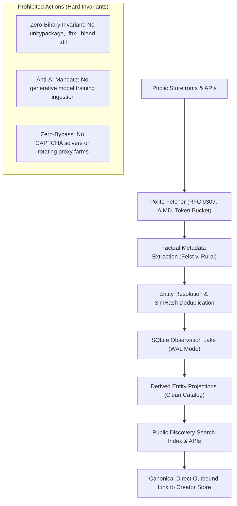
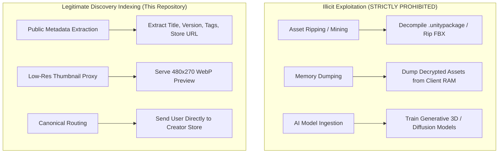

# Legal Notices, Compliance Charter, and Trademark Disclaimers

**Project:** `vrc-package-crawler`  
**Software License:** GNU Affero General Public License v3.0 ([LICENSE.md](LICENSE.md))  
**Designated Agent:** SlamTheDragon (`slamthedragon@gmail.com`)  
**Project Repository:** [https://github.com/SlamTheDragon/vrc-package-crawler](https://github.com/SlamTheDragon/vrc-package-crawler)  
**Identification:** `User-Agent: VRCDiscoveryBot/1.0 (+https://github.com/SlamTheDragon/vrc-package-crawler; slamthedragon@gmail.com)`  

---

> [!IMPORTANT]
> **NO LEGAL ADVICE PROVIDED**  
> This document and all documentation in this repository are published for informational, educational, and transparency purposes only and **do not constitute legal advice**. Neither the maintainers nor any contributors are attorneys. The legal theories, statutory references, and fair use analyses presented herein reflect our technical design objectives and good-faith adherence to public search engine jurisprudence. Users, deployers, and downstream consumers are advised to consult their own qualified legal counsel regarding compliance with local and international laws.

> [!NOTE]
> **RELATIONSHIP TO SOFTWARE LICENSE**  
> This document (`LEGAL.md`) sets forth the compliance policies, community covenants, non-affiliation disclosures, trademark notices, and takedown procedures governing this project. It serves as a supplemental operational and regulatory charter. Software copying, modification, and redistribution rights remain governed exclusively by the **GNU Affero General Public License v3.0** set forth in [LICENSE.md](LICENSE.md).

---

## 1. Non-Affiliation and Non-Endorsement Disclaimers

This project is an independent, non-commercial, community-driven open-source software utility.

- **VRChat Inc.**: This project is **not** affiliated with, authorized, maintained, sponsored, or endorsed by VRChat Inc. "VRChat" is a registered trademark of VRChat Inc.
- **Unity Technologies**: This project is **not** affiliated with, authorized, maintained, sponsored, or endorsed by Unity Technologies or Unity Software Inc. "Unity" is a registered trademark of Unity Technologies.
- **pixiv Inc. / BOOTH.pm**: This project is **not** affiliated with, authorized, maintained, sponsored, or endorsed by pixiv Inc. "BOOTH", "pixiv", and related marks are trademarks of pixiv Inc.
- **Gumroad, Inc.**: This project is **not** affiliated with, authorized, maintained, sponsored, or endorsed by Gumroad, Inc. "Gumroad" is a trademark of Gumroad, Inc.
- **Jinxxy LLC**: This project is **not** affiliated with, authorized, maintained, sponsored, or endorsed by Jinxxy LLC. "Jinxxy" is a trademark of Jinxxy LLC.
- **itch corp. / itch.io**: This project is **not** affiliated with, authorized, maintained, sponsored, or endorsed by itch corp. "itch.io" is a trademark of itch corp.
- **GitHub, Inc. / Microsoft Corporation**: This project is **not** affiliated with, authorized, maintained, sponsored, or endorsed by GitHub, Inc. or Microsoft Corporation. "GitHub" is a registered trademark of GitHub, Inc.

Any references to third-party products, services, platforms, organizations, or trademarks are made solely for identification, descriptive compatibility, and nominative purposes.

---

## 2. Third-Party Trademarks and Nominative Fair Use

All third-party trademarks, service marks, trade names, trade dress, product names, and logos appearing on this site, in this codebase, or within generated catalogs are the property of their respective owners.

- **Nominative Fair Use**: The use of trademarks such as "VRChat", "Unity", "BOOTH", "Gumroad", "Jinxxy", "itch.io", and "GitHub" throughout this repository is strictly nominative fair use under 15 U.S.C. § 1125(c)(3)(A) and equivalent international trademark doctrines. These marks are utilized solely to:
  1. Accurately designate software compatibility (e.g., "VRChat Package Manager compatible", "Unity Editor extension").
  2. Truthfully identify the external commercial origin and storefront home of indexed public listings.
  3. Enable users to locate official distribution pages operated by original artists and vendors.
- **Zero Endorsement or Confusion**: Nothing in this project or its documentation is intended to imply endorsement, partnership, sponsorship, or certification by any trademark holder. Maintainers make no claim to any third-party intellectual property.

---

## 3. Project Purpose and Core Architectural Invariants

The `vrc-package-crawler` exists to solve asset discovery fragmentation within the virtual reality creator ecosystem. It acts as an open search directory directing prospective buyers and developers to creator storefronts without hosting, redistributing, or monetizing third-party creative files.

To maintain integrity and prevent legal exposure, all components must observe three foundational invariants:



### 3.1. The Zero-Binary Invariant
The crawler, server, and synchronization layers will **never** download, store, unpack, mirror, or redistribute proprietary compiled 3D meshes, textures, `.unitypackage` bundles, `.fbx` models, `.blend` project files, audio clips, or executable binary libraries (`.dll`, `.exe`).
- Streaming socket guardrails inspect HTTP `Content-Type` headers and URL extensions before payload transfer. Any response matching binary archives or exceeding strict payload thresholds (5 MB) is terminated immediately at the TCP socket layer.
- The project provides discovery pointers, not binary file hosting.

### 3.2. The Metadata-Only Boundary
The engine collects and indexes exclusively public, factual attributes:
- Reverse-DNS package identifiers (e.g., `com.vrchat.tool`)
- Product listing titles, version strings, release timestamps, and platform compatibility tags (e.g., `PhysBones`, `Quest`, `VCC`, `Kikyo-compatible`)
- Public pricing, vendor display names, and canonical storefront URLs
- Truncated descriptions and structured tags

In accordance with *Feist Publications, Inc. v. Rural Telephone Service Co.* (499 U.S. 340, 1991), factual specifications and product titles lack copyright protection. Creative marketing copy, storytelling, and lore are intentionally truncated to prevent copyright appropriation and avoid tortious interference claims.

### 3.3. The Canonical Traffic Invariant
All search results, manifest feeds, and API responses route users **directly to the original creator's storefront** (BOOTH.pm, Gumroad, Jinxxy, itch.io, or GitHub) for transaction, download, and licensing.
- The engine strips referral tracking and affiliate hijacking parameters (`sanitizeOutboundUrl`).
- The engine does not process payments, does not take platform fees, and creates zero rivalrous distribution channels. It functions strictly as a top-of-funnel traffic driver for artists and developers.

---

## 4. Statutory Legal Foundations and Judicial Precedents

The operational architecture of `vrc-package-crawler` is grounded in established statutory legal frameworks and judicial precedents across multiple jurisdictions:

### 4.1. Non-Copyrightability of Factual Specifications (*Feist v. Rural*)
Under United States copyright law (17 U.S.C. § 102), copyright protection extends only to original works of authorship, not to objective facts or raw data. In *Feist Publications, Inc. v. Rural Telephone Service Co.*, 499 U.S. 340 (1991), the Supreme Court affirmed that factual listings and directories devoid of creative expression cannot be copyrighted. The indexing of public product names, versions, compatibility requirements, prices, and vendor URLs constitutes non-infringing extraction of factual data.

### 4.2. Public Web Indexing and the Computer Fraud and Abuse Act (CFAA)
In *hiQ Labs, Inc. v. LinkedIn Corp.*, 31 F.4th 1180 (9th Cir. 2022) and *Van Buren v. United States*, 141 S. Ct. 1638 (2021), federal courts established that accessing publicly available, logged-out web data does not constitute access "without authorization" or "exceeding authorized access" under the Computer Fraud and Abuse Act (18 U.S.C. § 1030). Because `vrc-package-crawler` crawls exclusively public, logged-out storefront pages without bypassing authentication gates, paywalls, or password prompts, its operation complies fully with the CFAA.

### 4.3. Enforceability of Browse-Wrap Terms Against Logged-Out Crawlers (*Meta v. Bright Data*)
In *Meta Platforms, Inc. v. Bright Data Ltd.*, No. 3:23-cv-00077-EMC (N.D. Cal. Jan. 23, 2024), the court held that website terms of service prohibiting automated data collection do not bind visitors who access public data without logging into an account, as unauthenticated visitors do not manifest affirmative assent to browse-wrap contracts. While platforms retain the technical right to protect their perimeters, logged-out indexing of public data does not constitute a breach of contract under this precedent.

### 4.4. Fair Use for Low-Resolution Search Thumbnails (*Kelly v. Arriba Soft* & *Perfect 10*)
Under 17 U.S.C. § 107, the creation and display of low-resolution thumbnail images by a visual search engine constitutes transformative Fair Use:
- In *Kelly v. Arriba Soft Corp.*, 336 F.3d 811 (9th Cir. 2003), the Ninth Circuit ruled that indexing visual search thumbnails serves an entirely different functional purpose than the original artistic images, directing traffic to the original source without superseding the market for the original works.
- In *Perfect 10, Inc. v. Amazon.com, Inc.*, 508 F.3d 1146 (9th Cir. 2007), this principle was reaffirmed for search engine thumbnail caches.

To adhere to this doctrine:
- Images processed by `ImageProxyService` are strictly transcoded into reduced-resolution WebP thumbnails ($480 \times 270$ maximum dimension, quality 75) accompanied by BlurHash strings and 64-bit Discrete Cosine Transform perceptual hashes (pHash).
- Ephemeral in-memory streaming is prioritized to prevent persistent re-hosting of artistic cover images.
- Thumbnails serve solely to allow users to identify packages in search results and click through to original storefronts.

### 4.5. Japanese Copyright Law Compliance (BOOTH.pm / pixiv Inc.)
BOOTH.pm operates under pixiv Inc. within the jurisdiction of Japan. Japanese copyright law does not maintain an open-ended fair use doctrine identical to U.S. law. However:
- **Article 47-5 of the Copyright Act of Japan** (amended 2018) provides a specific statutory limitation on copyright for search, indexing, and information retrieval engines. It explicitly permits the collection, text extraction, and display of minor thumbnail images and text excerpts incidental to information retrieval services.
- **Article 47-5 Proviso**: The statutory exception applies provided that such use does not unreasonably prejudice the economic interests of the copyright holder. `vrc-package-crawler` satisfies this requirement by enforcing conservative human pacing (3.0 to 5.0-second delay per host), never hotlinking or redistributing high-resolution master assets, and routing 100% of commercial intent directly to the artist's BOOTH store.

---

## 5. Community Norms, Asset Ripping, and the Anti-AI Mandate



### 5.1. Semantic Distinction: Discovery Indexing vs. "Asset Ripping"
Within the VRChat creator community, the terms **"scraping"** and **"asset mining"** commonly denote digital asset theft: purchasing or acquiring an avatar package and using software (e.g., AssetRipper, Blender scripts) to extract modular meshes (hair, clothing, sculpts) without purchasing individual commercial licenses from original artists.

**`vrc-package-crawler` is not an asset ripping tool.**
- It contains **zero** code to decompile Unity packages, inspect client RAM, or manipulate 3D geometry.
- It is an open-source web search indexer, analogous to Google or DuckDuckGo, indexing public web page metadata to help creators and buyers locate software tools and packages.

### 5.2. The Absolute Anti-AI Mandate
VRChat creators and digital sculptors broadly reject generative machine learning ingestion. Commercial marketplace listings across BOOTH, Gumroad, and Jinxxy feature explicit anti-AI licensing covenants prohibiting the training of artificial intelligence or machine learning models on their creative outputs.

**The Anti-AI Mandate of this project is absolute and non-negotiable:**
1. No data, metadata, text summaries, or image thumbnails cataloged by this software may ever be compiled into datasets for training generative artificial intelligence, neural networks, diffusion models, or large language models.
2. Any downstream consumer, developer, or API client that utilizes this project's database, delta streams, or endpoints to train generative AI models is in direct violation of this Charter and loses all rights to access the service or software.

---

## 6. Creator Sovereignty, Opt-Out, and Statutory DMCA Notice-and-Takedown Policy

We respect creator autonomy over their digital presence. Any creator or rights holder possesses an absolute, unilateral right to delist their packages and storefront links from this index.

### 6.1. DMCA Notice-and-Takedown Procedure (17 U.S.C. § 512)
If you are a copyright owner or an authorized agent thereof and believe that any metadata, summary excerpt, or thumbnail image indexed by this software infringes your copyright, you may submit a formal notification pursuant to the Digital Millennium Copyright Act (17 U.S.C. § 512(c)(3)) to our Designated Copyright Agent:

- **Designated Agent:** SlamTheDragon
- **Email:** `slamthedragon@gmail.com`
- **Subject Line:** `[DMCA Takedown Request] <Storefront or Package Name>`

To be legally effective under 17 U.S.C. § 512(c)(3), your notice must include substantially the following:
1. A physical or electronic signature of a person authorized to act on behalf of the owner of an exclusive right that is allegedly infringed.
2. Identification of the copyrighted work claimed to have been infringed, or, if multiple works are covered by a single notification, a representative list of such works.
3. Identification of the material that is claimed to be infringing or to be the subject of infringing activity and that is to be removed or access to which is to be disabled, including specific URLs or package identifiers.
4. Information reasonably sufficient to permit the service provider to contact you, such as an address, telephone number, and email address.
5. A statement that you have a good-faith belief that use of the material in the manner complained of is not authorized by the copyright owner, its agent, or the law.
6. A statement that the information in the notification is accurate, and under penalty of perjury, that you are authorized to act on behalf of the owner of an exclusive right that is allegedly infringed.

### 6.2. Turnaround SLA and Automated Ingestion Pipeline
All verified takedown notices and creator delist requests are processed within **24 to 48 hours**.

The crawler infrastructure maintains an automated legal exclusion pipeline:
- **Registry Table**: `creator_opt_outs` in the SQLite observation database stores verified takedown patterns, regex filters, and author signatures.
- **Immediate Delisting**: Upon recording an opt-out, the database transitions matching records to `lifecycle = 'delisted'`.
- **Projection Purge**: Delisted entities are purged from public search views (`canonical_packages`), Schema 1 delta streams, Schema 2 VCC repositories, and offline SQLite exports.
- **Programmatic Opt-Out Endpoint**: The headless server exposes `POST /v1/opt-out` to allow creators to verify ownership and record delistings programmatically via DNS TXT records or signed Git commits.

---

## 7. Crawler Etiquette, Politeness, and Anti-Abuse Standards

To prevent origin server disruption and uphold internet technical standards:

### 7.1. RFC 9309 Robots Exclusion Protocol
The crawler embeds an RFC 9309-compliant robots parser (`src/crawler/robots.ts`):
- `/robots.txt` files are parsed and cached with a 24-hour time-to-live.
- All `Disallow` directives are strictly honored, including wildcard rules and longest-prefix precedence.
- Sensitive endpoints—such as user carts, checkout funnels, account dashboards, and internal search query loops—are bypassed entirely.

### 7.2. Transparent Identification
Every HTTP request emitted by the crawler carries an honest, transparent `User-Agent` header containing project documentation and administrator contact information:
```http
User-Agent: VRCDiscoveryBot/1.0 (+https://github.com/SlamTheDragon/vrc-package-crawler; slamthedragon@gmail.com)
```
Platform administrators can easily identify the bot, inspect its code repository, or contact maintainers directly.

### 7.3. Additive Increase / Multiplicative Decrease (AIMD) Rate Limiting
- **Host Queues**: Network traffic is strictly serialized per target hostname through Mercator politeness queues.
- **AIMD Dynamics**: The engine adapts request rates dynamically based on server feedback (HTTP `429 Too Many Requests`, `503 Service Unavailable`, or `Retry-After` headers).
- **Hard Delay Ceilings**:
  - Closed commercial storefronts (BOOTH.pm, Jinxxy): Strictly paced with a minimum inter-request delay of **3.0 to 5.0 seconds** plus randomized decorrelated jitter.
  - Public developer APIs (GitHub, open VPM endpoints): 1.0 Hz pacing with conditional `ETag` and `If-Modified-Since` cache revalidation (HTTP 304).

### 7.4. The Zero-Bypass Invariant
If a storefront edge security firewall challenges the crawler (e.g., Cloudflare Managed Challenge, cryptographic proof-of-work, or IP rate block):
- The crawler treats the challenge as a definitive refusal of service.
- The crawler **will never** deploy CAPTCHA-solving bypass farms, headless browser credential forgery, session cookie theft, or residential proxy rotation to circumvent security perimeters.

---

## 8. Storefront-Specific Compliance Policies

| Platform | Crawling Approach | Rate Limit / Pacing | Security Respect | Anti-AI Adherence |
|---|---|---|---|---|
| **BOOTH.pm** (pixiv Inc.) | Unauthenticated public HTML metadata parsing | 3.0 – 5.0s serialized delay + jitter | Honors Cloudflare challenges; no bypass; ephemeral proxying | Strict adherence to pixiv anti-AI terms |
| **GitHub** | Official REST & GraphQL APIs; raw manifests | Token quotas (up to 5,000 req/hr); ETag validation | Official Personal Access Tokens (PAT); no UI scraping | Complies with GitHub Acceptable Use |
| **Gumroad** | Seller REST API v2 where authorized; polite HTML fallback | Paced 1.0 – 3.0s delay; no image hotlinking | Respects edge rate limits and signed HMAC tokens | Honors creator listing licenses |
| **Jinxxy** | Official REST API integration | Strict adherence to API rate caps | Respects ToS Section 6.7 | Strict adherence to Purchase Agreement Section 8.3 |
| **itch.io** | Public catalog and REST endpoints | Polite 1.0 – 2.0s delay; RFC 9309 robots | Respects CDN challenge gates and server stability rules | Honors creator listing licenses |
| **VRCArena** | Static catalog federation / Bilateral API only | Zero automated DOM scraping | Bypasses SSR strain; respects volunteer community infrastructure | Preserves community curation tags |

---

## 9. Operator Responsibility and Risk Allocation

> [!WARNING]
> **OPERATOR RESPONSIBILITY**  
> Anyone who downloads, compiles, runs, deploys, modifies, or hosts instances of `vrc-package-crawler` (including `vrc-crawler.exe`, `vrc-server.exe`, or `vrc-sync.exe`) acts as an independent software operator and assumes full legal responsibility for:
> 1. Ensuring their crawling configuration, target lists, and network pacing comply with all applicable local, national, and international laws (including computer fraud, trespass to chattels, copyright, and database protection directives).
> 2. Respecting third-party acceptable use policies and terms of service.
> 3. Any network impact, bandwidth consumption, or infrastructure load imposed on origin hosts.
> 4. Maintaining an active, responsive contact address in outgoing `User-Agent` headers and honoring creator delist requests.

The authors and contributors of this software maintain no control over independent deployments and disclaim all liability for actions undertaken by independent third-party operators.

---

## 10. Data Privacy and Personal Data (GDPR / CCPA)

The `vrc-package-crawler` indexes exclusively public business listings, public creator storefront handles, and open-source software packages.

- **No Consumer Personal Data**: The crawler does not collect, index, or store private personal information, individual end-user identity records, consumer transaction histories, email addresses of buyers, physical addresses, or financial data.
- **Creator Profiles**: Only publicly listed vendor names, creator handles, and links to public profiles (as displayed on commercial storefronts) are recorded to establish catalog authorship.
- **Privacy Delisting**: Any individual creator may request the removal of their public handle or storefront listing from the index by contacting `slamthedragon@gmail.com`.

---

## 11. Downstream Consumer and Redistributor Obligations

Third-party applications, desktop clients (e.g., VCC, ALCOM), community web portals, and external developers that ingest data from `vrc-package-crawler` (via Schema 1 delta streams, Schema 2 VCC indexes, Schema 4 reports, or exported SQLite databases) agree to be bound by the following conditions:

1. **Uphold Foundational Invariants**: Downstream consumers must not distribute binary asset archives or facilitate unauthorized extraction of proprietary 3D geometry.
2. **Canonical Redirection**: Downstream user interfaces must present prominent, direct links directing end users to the original storefront for transactions and downloads. Consumers must not create intermediary purchasing mechanisms that bypass creator stores.
3. **Opt-Out Propagation**: Downstream applications must honor delisting signals emitted in delta streams and immediately purge delisted entities from their local caches and displays.
4. **Anti-AI Covenant**: Downstream consumers are expressly forbidden from feeding aggregated metadata, summaries, or preview media into artificial intelligence training datasets.

---

## 12. Disclaimer of Warranties and Limitation of Liability

The software and all indexed catalog data are provided under the terms of the **GNU Affero General Public License v3.0**, specifically:

- **Section 15 (Disclaimer of Warranty)**: The software is provided "AS IS", without warranty of any kind, either expressed or implied, including, but not limited to, the implied warranties of merchantability and fitness for a particular purpose. The entire risk as to the quality and performance of the program is with you.
- **Section 16 (Limitation of Liability)**: In no event unless required by applicable law or agreed to in writing will any copyright holder or contributor be liable to you for damages, including any general, special, incidental, or consequential damages arising out of the use or inability to use the program (including loss of data or damages sustained by you or third parties).

---

## 13. Contact Information

For legal inquiries, copyright takedown notices, or compliance questions:

- **Designated Agent:** SlamTheDragon
- **Email:** `slamthedragon@gmail.com`
- **Issue Tracker:** [https://github.com/SlamTheDragon/vrc-package-crawler/issues](https://github.com/SlamTheDragon/vrc-package-crawler/issues)
- **Repository:** [https://github.com/SlamTheDragon/vrc-package-crawler](https://github.com/SlamTheDragon/vrc-package-crawler)
