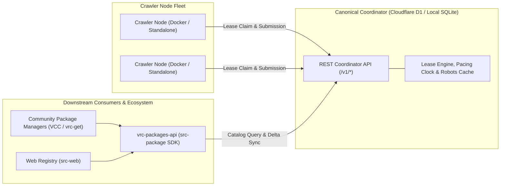

# VRC Package Crawler

An open-source, polite discovery and indexing engine for public VRChat creator packages (Tools, Assets, Avatars).

The project indexes public package metadata from VPM community repositories, GitHub releases, and creator storefronts, routing downstream users directly to original creator storefronts and repositories. It categorically excludes downloading, caching, or redistributing proprietary asset binaries (`.zip`, `.unitypackage`, `.vpmz`, `.fbx`).

---

## Architecture Overview

The system operates across three decoupled operational domains:



1. **Coordinator (`src-crawler/src/worker/`)**:
   - Manages origin-wide AIMD pacing clocks, RFC 9309 robots caching, and scoped crawler job leases.
   - Verifies observation receipts, extracts outbound discovery leads, and enforces canonical provenance hierarchies.
   - Dual-runtime design: deploys as a Cloudflare Worker on D1 or runs locally via SQLite.
2. **Crawler Nodes (`src-crawler/src/node/`)**:
   - Headless, standalone workers executing coordinator-leased jobs.
   - Containerized deployment via Docker with automated rolling updates using Watchtower.
   - Features DNS-pinned HTTPS transport, 10 MB payload socket abort guardrails, and continuous 5-second lease validity checks.
3. **Consumer SDK (`src-package/`)**:
   - Published as `vrc-packages-api` for downstream application developers.
   - Provides strongly-typed TypeScript clients for catalog search, cursor-based keyset pagination, continuous delta synchronization, and creator delisting.
4. **Web Surface (`src-web/`)**:
   - Downstream catalog browser and operator management surface built with SvelteKit.

---

## Repository Layout

```
vrc-package-crawler/
  .agents/                    Agent specifications, operational rules, and link auditing tools
  src-crawler/                Crawler node engine, coordinator service, and worker adapter
    src/
      node/                   Standalone crawler node, observation adapters, and runtime config
      worker/                 Coordinator request router, operator API, and D1/SQLite stores
      shared/                 Versioned API protocol schemas (Zod) and platform definitions
      utils/                  Pacing clock, robots cache, logger, and DNS guardrails
    dist/                     Compiled binaries and Worker bundles
    config.json               Baseline pre-production configuration and protocol versioning
  src-package/                Downstream client SDK (`vrc-packages-api`) and shared wire schemas
    src/
      client/                 VrcPackagesClient implementation with HTTP retry and rate limiting
      schemas/                Canonical package, delta sync, search, and report schemas
      types/                  Domain entities, taxonomy, and token formats
  src-web/                    Downstream registry web UI (SvelteKit)
  docs/                       Authoritative documentation
    scratch/                  Minimal scratch footprint (`IMPLEMENTATION_PLAN.md`, `task_tracker.md`)
    research/                 Platform access matrices, robots analysis, and market research
    source/                   Architecture specifications (`API_ROUTES.md`, `DATABASE_SCHEMAS.md`)
  tests/                      Root pre-production layout and contract conformance tests
  AGENTS.md                   Agent entry point and operational boundaries
  DELEGATES.md                Downstream developer runbook & Docker node operations manual
  LEGAL.md                    Legal notices, operational covenants, and terms of service
  LICENSE.md                  GNU Affero General Public License v3.0 (AGPL-3.0)
```

---

## Prerequisites & Development

- **Bun** >= 1.4.0 (required for runtime, compilation, and testing)
- **Docker** & **Docker Compose** (optional, for running crawler node fleets)

### Testing & Verification

The repository maintains strict test suites ensuring zero regression across protocol schemas, node adapters, coordinator leasing, and SDK methods:

```powershell
# Run root layout and contract conformance tests
bun test tests

# Run coordinator and crawler engine tests (296 tests across 32 files)
cd src-crawler
bun test

# Run consumer client SDK tests (33 tests across 4 files)
cd ../src-package
bun test
```

> **Test Suite Status**: **333 tests passing / 0 failing** across 37 test files.

### Typechecking & Builds

```powershell
# Typecheck crawler engine and coordinator
cd src-crawler
bun run typecheck

# Typecheck consumer SDK
cd ../src-package
bun run typecheck

# Build compiled coordinator, standalone node, and Cloudflare Worker bundle
cd ../src-crawler
bun run build
```

---

## Deployment & Operations

### 1. Downstream Integration (`vrc-packages-api`)

Downstream package managers (such as VCC or `vrc-get`), search tools, and community registries consume the catalog using the `vrc-packages-api` SDK:

```typescript
import { VrcPackagesClient } from "vrc-packages-api";

const client = new VrcPackagesClient({
  baseUrl: "https://api.vrc-packages.net",
  appToken: "vrcp_app_0123456789abcdef...",
});

// Full-text search with bulk tag filtering and canonical timestamp ordering
const results = await client.app.search({
  query: "PhysBones",
  tags: ["tool", "avatar"],
  queryOrigin: "MyVpmManager/1.0.0",
});

// Resumable delta synchronization for local caches
const deltas = await client.catalog.syncDeltas({
  since: "2026-10-01T00:00:00.000Z",
  limit: 100,
});
```

See [DELEGATES.md](DELEGATES.md) for full SDK documentation, registration procedures, and keyset pagination guides.

### 2. Running Crawler Nodes via Docker

Community node operators run containerized workers with automated rolling updates using Watchtower:

```bash
docker compose up -d
```

For configuration options, capability encoding, and environment templates, consult the [DELEGATES.md Docker Runbook](DELEGATES.md#operating-crawler-nodes-via-docker).

---

## Legal & Compliance Covenants

The Project operates under strict technical and legal covenants to safeguard creator rights and target infrastructure:

- **Zero-Binary Invariant**: The crawler never fetches, stores, or mirrors binary archives (`.unitypackage`, `.vpmz`, `.zip`, `.rar`, executables, or 3D model files).
- **Mandatory Outbound Routing**: Downstream APIs and applications must provide direct outbound links to the original creator storefront or repository.
- **RFC 9309 Robots Compliance**: Honors `robots.txt` directives with conservative origin-wide AIMD rate pacing.
- **Creator Delisting & Bio-Token Verification**: Creators can delist packages or assert ownership using non-invasive public bio-tokens or DNS TXT records.
- **Anti-AI Model Training Restrictions**: Catalog compilations are restricted from use in training generative AI models.

Review [LEGAL.md](LEGAL.md) for full operational covenants, governing law, and public terms of service.

---

## License

This project is licensed under the **GNU Affero General Public License v3.0** (AGPL-3.0) — see [`LICENSE.md`](LICENSE.md) for details.
