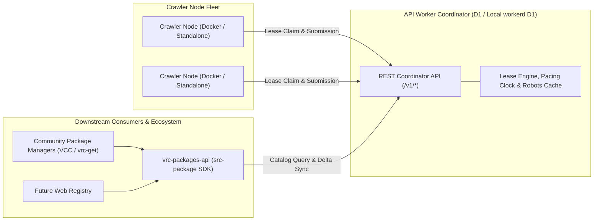

# VRCP Package Crawler

An open-source, polite discovery and indexing engine for public VRChat creator packages (Tools, Assets, Avatars).

The project develops metadata discovery from VPM repositories, GitHub and creator storefronts. Catalog records link to original publisher fronts. Real-source fleet ingestion remains a pre-production gate. The policy excludes archive and executable downloads (`.zip`, `.unitypackage`, `.vpmz`, `.fbx`).

---

## Architecture Overview

The system operates across three decoupled operational domains:



1. **Coordinator (`src-worker/src/`, entry `worker_entry.ts`)**:
   - Manages origin-wide AIMD pacing clocks, RFC 9309 robots caching, and scoped crawler job leases.
   - Validates observation receipts, records discovery leads and projects canonical packages from source evidence. Publication-rights enforcement remains under review.
   - Runs locally through Wrangler/workerd with D1. There is no coordinator binary. The SQLite comparator lives under Worker test support.
2. **Crawler Nodes (`src-crawler/src/`, entry `main.ts`)**:
   - Headless, standalone workers executing coordinator-leased jobs.
   - Includes a standalone binary build and Docker configuration. Fleet updates and restart-safe result submission still need checks.
   - Uses DNS-pinned HTTPS transport, a 2,000,000-byte metadata limit and default 5-second coordinator authority checks.
3. **Consumer SDK (`src-package/`)**:
   - Named `vrc-packages-api` for downstream application developers. Historical isolated tarball checks passed before the recent changes. Current artifact verification, owner API review and registry release remain open.
   - Supplies typed clients for catalog search, delta synchronization, app registration, owned app views and operator controls. Removal reports remain pending review.
4. **Web Surface (`src-web/`)**:
   - Separate Astro site with Svelte integration. The current page is starter content. SDK, authentication and operator panels are not wired.
5. **Crawler Client (`src-crawler-client/`)**:
   - Tauri/Svelte starter shell. It does not yet bundle, configure or supervise the crawler node.

---

## Repository Layout

```
vrc-package-crawler/
  .agents/                    Agent specifications, operational rules, and link auditing tools
  src-crawler/                Standalone crawler node
    src/
      main.ts                 Node CLI and daemon entry
      adapters/               Observation extraction
      client/                 Internal coordinator lease client
      config/                 Node runtime configuration
      runner/                 Daemon and lease execution
      storage/                Node-local SQLite telemetry
      shared/                 Versioned API protocol schemas (Zod) and platform definitions
      utils/                  Pacing clock, robots cache, logger, and DNS guardrails
    dist/                     Compiled node binaries
  src-package/                Downstream client SDK (`vrc-packages-api`) and shared wire schemas
    src/
      client.ts               Downstream API client
      protocol/               Consumer and operator wire schemas
      types/                  Domain entities and token formats
      taxonomy/               Fixed umbrella wire schema, not indexed tag values
  src-worker/                 API-only Worker project
    src/                      Worker entry, API handlers, D1 storage and classification
    test/                     Worker contract tests and native D1 smoke
      integration/            Cross-runtime protocol tests
      support/                Test-only SQLite comparator and helpers
  src-web/                    Separate Astro/Svelte website starter
  src-crawler-client/         Separate Tauri/Svelte desktop starter
    src-tauri/                Rust shell and desktop configuration
  docs/                       Source drafts, research and decision ledgers
    scratch/                  Exactly three lifecycle documents
    research/                 Platform access matrices, robots analysis, and market research
    source/                   Architecture specifications (`API_ROUTES.md`, `DATABASE_SCHEMAS.md`)
  tests/                      Root layout and shared test helpers
  AGENTS.md                   Agent entry point and operational boundaries
  DELEGATES.md                Downstream developer runbook & Docker node operations manual
  LEGAL.md                    Legal notices, operational covenants, and terms of service
  LICENSE.md                  GNU Affero General Public License v3.0 (AGPL-3.0)
```

---

## Prerequisites & Development

- **Bun** >= 1.4.0 (required for runtime, compilation, and testing)
- **Node.js** (required for root version commands and the native Worker test harness)
- **Docker** & **Docker Compose** (optional, for running crawler node fleets)

### Testing & Verification

Tests cover protocol schemas, adapters, leases and SDK methods. Passing fixtures do not prove complete fleet readiness.

```powershell
# Run root layout and contract conformance tests
bun test tests

# Run node-owned tests
cd src-crawler
bun test

# Run Worker-owned tests
cd ../src-worker
bun run test

# Run consumer SDK tests
cd ../src-package
bun test
```

Current measurements and known failures live in [the active tracker](docs/scratch/task_tracker.md). The migration does not prove isolated remote builds or live-source ingestion.

### Typechecking & Builds

```powershell
# Typecheck the crawler node
cd src-crawler
bun run typecheck

# Typecheck consumer SDK
cd ../src-package
bun run typecheck

# Build the standalone node
cd ../src-crawler
bun run build

# Check and build the API Worker without deploying
cd ../src-worker
bun run check
bun run build

# Run the isolated native D1 HTTP smoke (requires Node.js)
bun run test:runtime
```

---

## Deployment & Operations

### 1. Downstream Integration (`vrc-packages-api`)

Downstream applications can use the SDK's public contracts. No integration with VCC or `vrc-get` is claimed.

```typescript
import { VRCPackageClient } from "vrc-packages-api";

// Backend example: supply the issued credential through protected runtime configuration.
const applicationCredential = process.env.VRCP_APP_TOKEN;
if (!applicationCredential) throw new Error("Missing application credential");

const client = new VRCPackageClient({
  baseUrl: "https://coordinator.example.com",
  appToken: applicationCredential,
});

// Bounded authenticated search. Indexed dynamic tag filtering remains open.
const results = await client.index.search({
  query: "PhysBones",
  queryOrigin: "user_authored",
});

// Resumable delta synchronization for local caches
const deltas = await client.index.syncDeltas({
  limit: 100,
});
```

See [DELEGATES.md](DELEGATES.md) for full SDK documentation, registration procedures, and keyset pagination guides.

The example environment variable is a backend convention, not an SDK requirement. The Worker accepts queryOrigin but does not record or apply search attribution. Do not treat that field as implemented attribution or auditing.

### 2. Running Crawler Nodes via Docker

The node has a Dockerfile and a proposed fleet configuration. Image publication, restart recovery and automatic updates remain unverified.

```bash
docker compose -f src-crawler/docker-compose.yml config
```

Review the [Docker runbook](DELEGATES.md#3-crawler-node-operation--fleet-management) before starting containers. The compose file grants Watchtower access to the host Docker socket.

### 3. Cloudflare Build Setup

The owner moved the API build root from `src-web` to `src-worker`. The latest supplied build log confirms the `src-worker` package ran remotely. `src-web` now builds the separate static site.

Use the [panel setup checklist](docs/research/CRAWLER_DEPENDENCY_RESEARCH.md#cloudflare-panel-setup-checklist). Dependency distribution, repeatable installation and environment isolation remain release gates. No panel configuration is inferred from local files.

---

## Legal & Compliance Covenants

The Project operates under strict technical and legal covenants to safeguard creator rights and target infrastructure:

- **Zero-Binary Invariant**: The crawler never fetches, stores, or mirrors binary archives (`.unitypackage`, `.vpmz`, `.zip`, `.rar`, executables, or 3D model files).
- **Mandatory Outbound Routing**: Downstream APIs and applications must provide direct outbound links to the original creator storefront or repository.
- **RFC 9309 Robots Compliance**: Honors `robots.txt` directives with conservative origin-wide AIMD rate pacing.
- **Removal Review**: App-authenticated removal reports are recorded without automatic delisting. DNS/bio ownership verification remains unimplemented.
- **Anti-AI Model Training Restrictions**: Catalog compilations are restricted from use in training generative AI models.

Review [LEGAL.md](LEGAL.md) for full operational covenants, governing law, and public terms of service.

---

## License

This project is licensed under the **GNU Affero General Public License v3.0** (AGPL-3.0) — see [`LICENSE.md`](LICENSE.md) for details.
