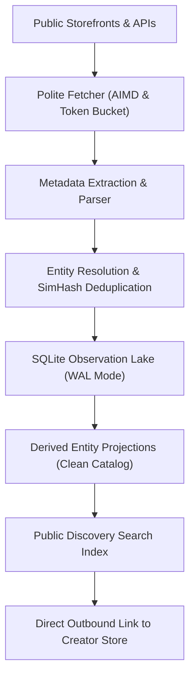
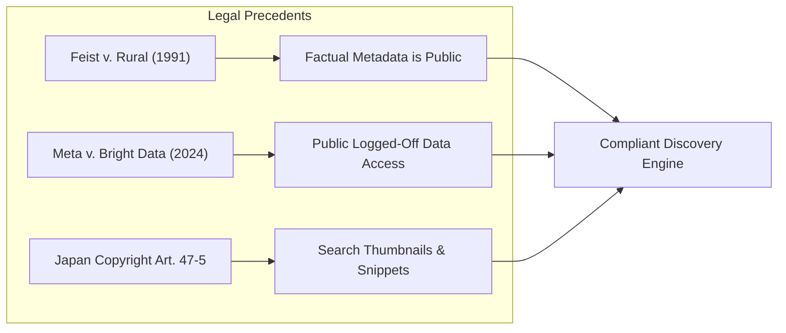
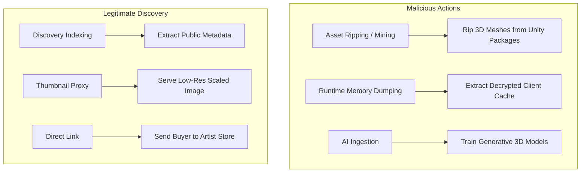

# Architecture and Legal Compliance Guide for VRChat Asset Discovery Indexers
This guide defines the systems architecture, legal boundaries, and community norms for indexing VRChat assets across digital storefronts.

***

## 1. Executive Summary and Foundational Invariants

Virtual reality (VR) content discovery requires careful balance. Creators produce 3D avatars, clothing items, shaders, and development tools. These assets reside across fragmented marketplaces: BOOTH.pm, Gumroad, Jinxxy, itch.io, and GitHub.

A compliant discovery engine indexes metadata to help users find tools and assets. The engine does not harvest or mirror proprietary creative files.

To operate within legal bounds and maintain community trust, indexers must obey three foundational invariants:

1. **The Zero-Binary Invariant**: The indexer never downloads, caches, or redistributes compiled 3D meshes, textures, `.unitypackage` bundles, `.fbx` models, or executable scripts.
2. **The Metadata-Only Boundary**: The engine collects only public factual attributes: titles, tags, prices, platform compatibility flags, and store URLs.
3. **The Canonical Traffic Invariant**: All outbound clicks must route users directly to the original creator storefront for transactions.



The system preserves creator economic rights and directs commercial intent to artists[^1].

---

## 2. Cross-Platform Contractual and Technical Terms

Every commercial storefront enforces distinct acceptable use policies and security defenses[^2].

| Platform | Contractual Crawling Policy | API Access Model | Perimeter Defense | Policy on Machine Learning Datasets |
| :--- | :--- | :--- | :--- | :--- |
| **Jinxxy** | Prohibited without written consent | Official REST API required | Automated IP throttling and rate caps | Expressly prohibited in all tiers |
| **Gumroad** | Prohibited in Terms of Service | REST API v2 for sellers | Edge rate limits and bot challenges | Restricted by creator licenses |
| **BOOTH.pm** | Article 14 bars unapproved use | Closed; no public read API | Cloudflare Managed Challenges | Prohibited across pixiv services |
| **GitHub** | Scraping web UI banned | High-throughput REST and GraphQL APIs | Strict token rate quotas | User code protected by Terms |
| **itch.io** | Service disruption terms apply | REST API available | CDN challenge gates and throttling | Governed by creator licenses |

### Jinxxy
Jinxxy operates a specialized marketplace for VRChat avatars and accessories. Section 6.7 of the Jinxxy Terms of Service prohibits automated data collection without written authorization[^3]. Scraping platform HTML pages triggers rate limits and IP bans.

Jinxxy requires developers to query its official REST API. Developers must register their application and obey rate limits.

Section 8.3 of the Jinxxy Purchase Agreement explicitly bans the use of platform assets for artificial intelligence or machine learning training[^4]. Crawling Jinxxy to assemble model training data is a direct contractual breach.

### Gumroad
Gumroad serves creators who sell digital 3D models and Unity tools. The Gumroad Terms of Service prohibit accessing services via automated scrapers or spiders[^5].

Gumroad supplies a REST API v2. This API supports creator inventory management and order verification. Third-party crawlers that scrape public seller profiles encounter edge firewalls and IP blocks. Indexers must pace requests and use official seller tokens where available.

### BOOTH.pm (pixiv Inc.)
BOOTH.pm hosts the largest collection of 3D anime avatars and accessories. Pixiv administers BOOTH under its Master Terms of Use. Article 14 classifies unauthorized reproduction of site content as prohibited conduct[^6]. Pixiv guidelines ban automated spiders and crawlers.

Pixiv protects BOOTH with Cloudflare Managed Challenges. Automated HTTP requests encounter browser integrity checks and cryptographic proofs of work. BOOTH does not offer an open read API for third parties.

Indexers that study public metadata must maintain strict serialization, rates below 1 request per second, and respectful User-Agent headers.

### GitHub
GitHub hosts open-source VRChat tools, shaders, and VRChat Package Manager (VPM) repositories. GitHub Terms of Service prohibit scraping the web interface for commercial purposes[^7].

GitHub supplies high-throughput REST and GraphQL APIs. Authenticated requests permit 5,000 requests per hour. Developers must pass personal access tokens, handle HTTP 304 cache validation with ETag headers, and download raw manifests (`package.json`) from `raw.githubusercontent.com`.

### itch.io
Itch.io hosts indie tools, shaders, and procedural worlds. Itch.io permits open distribution but enforces server stability rules[^8]. Crawlers must respect `robots.txt` directives and avoid server strain. Aggressive automated requests trigger CDN rate limits.

---

## 3. Statutory Legal Foundations and Judicial Precedents



### The Non-Copyrightability of Factual Metadata
Under United States copyright law, pure product specifications are non-copyrightable facts. In *Feist Publications, Inc. v. Rural Telephone Service Co.*, the Supreme Court ruled that facts lack original authorship[^9].

Product titles, prices, release dates, and compatibility tags (such as "PhysBones", "Quest", or "Kikyo compatible") are objective facts. Indexing factual metadata does not violate copyright law.

Creative text descriptions, marketing copy, and lore remain protected by copyright. Discovery engines must not mirror full descriptions. Engines should extract structured tags and display short summaries that link to the source.

### The Computer Fraud and Abuse Act (CFAA)
In *hiQ Labs, Inc. v. LinkedIn Corp.*, the Ninth Circuit confirmed that accessing public web data does not breach the CFAA[^10]. The court ruled that when a website is open to the public, automated access does not bypass an authorization gate. The Supreme Court reinforced this principle in *Van Buren v. United States*[^11].

In *Meta Platforms, Inc. v. Bright Data Ltd.* (2024), the court granted summary judgment for Bright Data[^12]. The court ruled that platform terms prohibiting automated access do not bind users who collect public data without logging into user accounts.

These rulings protect the collection of public metadata. But crawlers must never bypass authentication gates, exploit software bugs, or overwhelm origin servers.

### Thumbnail Caching Under US and Japanese Law
Displaying preview imagery requires careful copyright compliance:
- In the United States, *Kelly v. Arriba Soft Corp.* and *Perfect 10, Inc. v. Amazon.com, Inc.* established that low-resolution search thumbnails qualify as fair use[^13],[^14].
- In Japan, Article 47-5 of the Copyright Act gives a statutory exception for search and indexing engines[^15]. Search engines can show small thumbnails and text excerpts incidental to information retrieval.

Direct hotlinking to storefront CDNs wastes origin bandwidth. Compliant engines generate downscaled, low-resolution thumbnail proxies hosted on independent infrastructure.

---

## 4. Creator Norms, Asset Ripping, and the Anti-AI Mandate

Engineers must understand the community distinction between discovery indexing and asset ripping:



### The Semantic Boundary: Indexing Versus Ripping
In software engineering, "scraping" means reading text via HTTP requests. In the VRChat community, "scraping" or "ripping" describes the theft of 3D assets:
- **Asset Ripping**: Extracting compiled 3D meshes, textures, and armatures from `.unitypackage` archives to bypass commercial license fees.
- **Runtime Dumping**: Intercepting decrypted assets directly from VRChat client RAM.
- **Discovery Indexing**: Cataloging public product listings to direct commercial buyers to the vendor.

Legitimate discovery platforms host zero 3D geometry and zero binary archives.

### The Absolute Anti-AI Mandate
VRChat creators broadly reject generative machine learning ingestion[^16]. Storefront licenses contain explicit anti-AI clauses. Creators forbid using their geometry, textures, or renders in training sets.

A discovery indexer must never feed harvested images or descriptions into artificial intelligence pipelines. Breaching this norm destroys community goodwill and triggers legal action.

### Frictionless Self-Service Opt-Out Systems
Indexers must supply creators with immediate, self-service tools to remove listings:
1. **Bio Token Verification**: The creator places a unique cryptographic code in their storefront bio.
2. **Automated Check**: The indexer queries the public profile, verifies the code, and confirms store ownership.
3. **Instant Purge**: The database purges all cached metadata, thumbnails, and links for that vendor.

Notice-and-takedown requests must be resolved within 24 to 48 hours.

---

## 5. Systems Architecture for Compliant Crawling

Compliant discovery pipelines use polite request dispatchers, rate limits, and structured storage.

### The Mercator Two-Level Queue Architecture
To prevent rate-limit bans, the engine implements two-level priority and politeness queues[^17].
1. **Priority Queues (F-Queues)**: Order discovery by graph depth and content relevance.
2. **Politeness Queues (B-Queues)**: Group URLs strictly by target host (`booth.pm`, `gumroad.com`, `api.github.com`).
3. **Host Min-Heap**: Workers pop requests from a host queue only when that host is ready.

$$\Delta \tau_{\text{host}} = \max(\text{min\_delay}, \text{retry\_after}) + \text{jitter}$$

For storefronts without explicit delay directives, the minimum delay is 1,000 milliseconds (1.0 Hz).

### RFC 9309 Robots Exclusion Protocol
The crawler checks `/robots.txt` before fetching any URL path[^18]. The parser honors all `Disallow` rules. It skips user carts, checkout funnels, and private account pages.

### Transparent Identification
The crawler must send a transparent `User-Agent` string:
```http
User-Agent: VRCDiscoveryBot/1.0 (+https://github.com/SlamTheDragon/vrc-package-crawler; slamthedragon@gmail.com)
```
This header identifies the project and gives site administrators a direct contact email.

### Multi-Platform Entity Resolution
Software tools often exist on multiple storefronts simultaneously. The indexer resolves duplicates using a three-tier hierarchy[^19], [^20].
1. **Primary Anchor**: Invariant reverse-DNS package identifier (such as `com.vrchat.tool`).
2. **Secondary Anchor**: Canonical Git repository URL (`github.com/author/repo`).
3. **Tertiary Anchor**: 64-bit SimHash document fingerprints and Jaro-Winkler title similarity.

### Two-Stage Hydration and Head-of-Line Blocking Prevention
Discovery search APIs return shallow summaries with limited metadata and single thumbnails.
To capture full galleries and YouTube links, the crawler schedules deep product page fetches.
Because platforms like Gumroad enforce 3.0-second request serialization, pending search URLs can cause head-of-line blocking.
The crawler applies priority escalation (`priority = 10`) to detail product URLs.
This mechanism schedules detail hydration ahead of generic pagination, keeping the catalog fresh.

### Canonical Slug and Redirect Reconciliation
Marketplaces permit creators to configure custom vanity slugs that redirect from invariant product identifiers.
Crawlers deriving entity IDs strictly from requested URLs risk database fragmentation and duplicate records.
The engine reconciles URLs by extracting invariant platform keys (such as `p.permalink` in Gumroad Inertia payloads or numeric IDs in BOOTH).
The crawler stores the invariant identifier as the primary entity ID (`gumroad:{permalink}`).
The engine preserves the creator vanity URL for user-facing presentation and search indexing.

***

## References

[^1]: BOOTHPLORER, "A directory for VRChat assets on BOOTH," boothplorer.com, 2024. [Online]. Available: https://boothplorer.com

[^2]: VRChat Creator Community, "Indexing the VRChat Asset Ecosystem Across Platform Policies, Crawler Protocols, and Creator Norms," Technical Guidance Specification, 2024.

[^3]: Jinxxy, "Jinxxy Terms of Service," Section 6.7, 2024. [Online]. Available: https://jinxxy.com/terms-of-service

[^4]: Jinxxy, "Jinxxy Purchase Agreement," Section 8.3, 2024. [Online]. Available: https://jinxxy.com/purchase-agreement

[^5]: Gumroad, "Gumroad Terms of Service Agreement," 2024. [Online]. Available: https://gumroad.com/terms

[^6]: pixiv Inc., "pixiv Master Terms of Use," Article 14, 2024. [Online]. Available: https://policies.pixiv.net

[^7]: GitHub, "GitHub Acceptable Use Policies," 2024. [Online]. Available: https://docs.github.com/en/site-policy/acceptable-use-policies

[^8]: itch.io, "Terms of Service," 2024. [Online]. Available: https://itch.io/docs/legal/terms

[^9]: U.S. Supreme Court, *Feist Publications, Inc. v. Rural Telephone Service Co.*, 499 U.S. 340, 1991.

[^10]: U.S. Court of Appeals for the Ninth Circuit, *hiQ Labs, Inc. v. LinkedIn Corp.*, 31 F.4th 1180, 2022.

[^11]: U.S. Supreme Court, *Van Buren v. United States*, 141 S. Ct. 1638, 2021.

[^12]: U.S. District Court for the Northern District of California, *Meta Platforms, Inc. v. Bright Data Ltd.*, Case No. 3:23-cv-00077-EMC, Jan. 23, 2024.

[^13]: U.S. Court of Appeals for the Ninth Circuit, *Kelly v. Arriba Soft Corp.*, 336 F.3d 811, 2003.

[^14]: U.S. Court of Appeals for the Ninth Circuit, *Perfect 10, Inc. v. Amazon.com, Inc.*, 508 F.3d 1146, 2007.

[^15]: Agency for Cultural Affairs of Japan, "Copyright Act of Japan," Article 47-5, amended 2018.

[^16]: Automaton Media, "pixiv to tackle the issue of AI art misuse, imitation, data collection," May 2023. [Online]. Available: https://automaton-media.com/en/nongaming-news/20230511-18820/

[^17]: A. Heydon and M. Najork, "Mercator: A scalable, extensible Web crawler," *World Wide Web*, vol. 2, no. 4, pp. 219-229, Dec. 1999.

[^18]: M. Koster, G. Illyes, H. Zeller, and L. Sassman, "Robots Exclusion Protocol," IETF Standards Track RFC 9309, Sep. 2022. [Online]. Available: https://www.rfc-editor.org/info/rfc9309

[^19]: I. P. Fellegi and A. B. Sunter, "A Theory for Record Linkage," *Journal of the American Statistical Association*, vol. 64, no. 328, pp. 1183-1210, Dec. 1969.

[^20]: G. S. Manku, A. Jain, and A. Das Sarma, "Detecting Near-Duplicates for Web Crawling," in *Proc. 16th Int. Conf. World Wide Web (WWW)*, Banff, Alberta, Canada, 2007, pp. 141-150.
