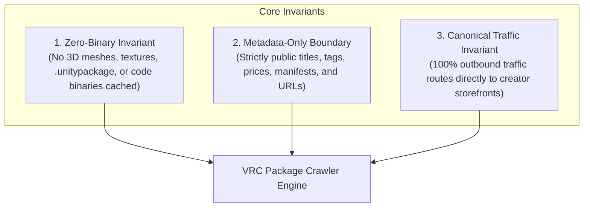
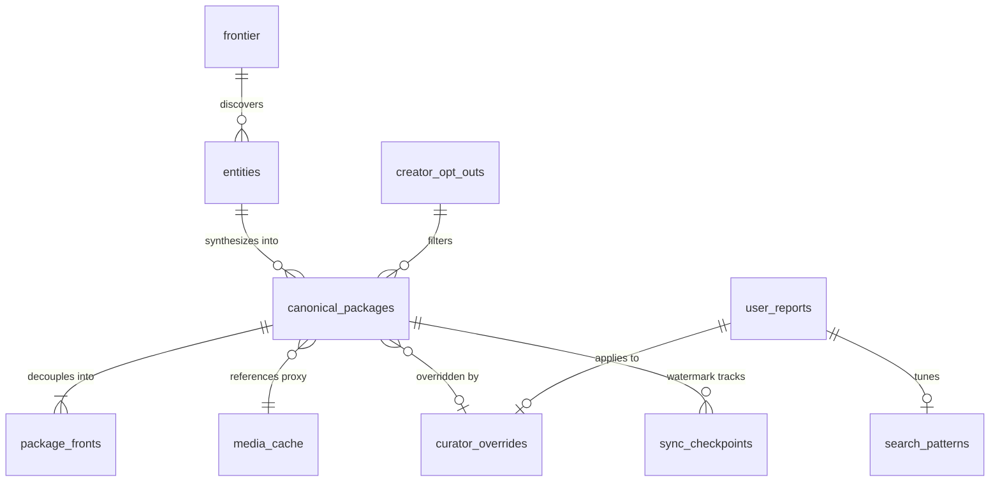
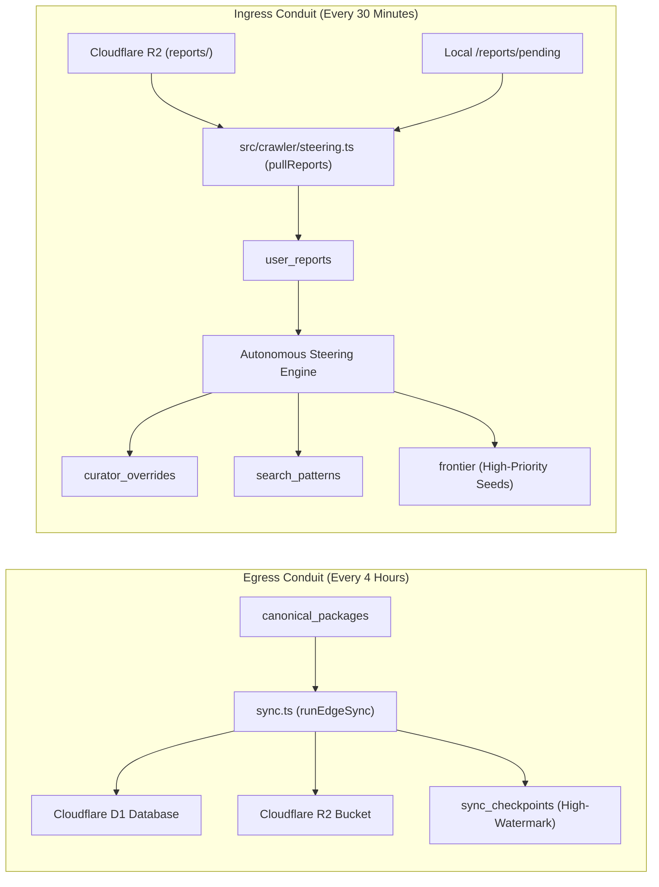

# Comprehensive System Architecture & Engineering Blueprint

**VRC Package Crawler: Autonomous Multi-Domain Discovery, Deduplication & Edge Distribution Engine**

---

## 1. Executive Overview & System Origins

### 1.1 Inception & Purpose
The VRChat development ecosystem is fragmented across isolated marketplaces:
- **BOOTH.pm**: Japanese creative community hub (3D avatars, clothing, props, shaders).
- **GitHub**: Open-source Unity tools, editor extensions, shaders, and VPM repositories.
- **Gumroad & Jinxxy**: Western creator hubs specializing in avatar mechanics and frameworks.
- **itch.io**: Indie procedural systems, shader packages, and world-building kits.
- **Community VPM Repositories**: Decentralized JSON manifests powering the VRChat Creator Companion (VCC).

The VRC Package Crawler will run as an autonomous, polite crawling and catalog synthesis engine. It will continuously index, deduplicate, and classify the complete ecosystem without human intervention.

### 1.2 Core Foundational Invariants
The engine will enforce three immutable architectural principles:

1. **The Zero-Binary Invariant**: The indexer will not download, cache, or redistribute compiled 3D meshes, textures, `.unitypackage` archives, `.fbx` models, or binary scripts.
2. **The Metadata-Only Boundary**: The engine will collect only public factual attributes: titles, tags, prices, platform compatibility flags, and store URLs.
3. **The Canonical Traffic Invariant**: All outbound clicks will route users directly to the original creator storefront for transactions.

---

## 2. Unified Database Architecture (CQRS & Schema Unification)

### 2.1 Schema Unification
The database layer will run on a unified schema. All 10 tables will operate under clean identifiers:

| Unified Table | Architectural Role | Invariant & Key Mechanics |
| :--- | :--- | :--- |
| `frontier` | Crawl Queue & Scheduler | Cho-Garcia-Molina Poisson adaptive interval, ETag and Last-Modified tracking |
| `entities` | CQRS Observation Lake | Immutable raw payload capture. Items are never deleted. Quarantine flags isolate invalid entries |
| `canonical_packages` | Derived Catalog Projection | Deduplicated unified package records with 2 URL columns (url, vcc_url), lifecycle, timestamps, and multi-storefront routing |
| `package_fronts` | Decoupled Storefront Listings | Individual storefront instances (BOOTH, GitHub, Gumroad, Jinxxy, Itch) linked to canonical ID |
| `creator_opt_outs` | Legal Exclusion Registry | Verified takedown patterns and creator bio-token exclusion rules with regex matching |
| `media_cache` | Pure Origin Metadata Cache | BlurHash strings, 64-bit perceptual hashes (pHash), origin CDN source URLs (zero local BLOB storage) |
| `curator_overrides` | Persistent User Steering | Community corrections (name_override, descriptions, categories, tags) surviving pipeline rebuilds |
| `user_reports` | Ingested Feedback Buffer | Schema 4 branched feedback submissions awaiting autonomous steering ingestion |
| `search_patterns` | Closed-Loop Query Weights | Dynamic negative tokens, boost or suppress rules, and priority seed queues |
| `sync_checkpoints` | Edge Synchronization State | High-watermark tracking for incremental synchronization to Cloudflare D1 and R2 |

### 2.2 CQRS Observation Lake Pattern
The system will separate writes from reads:
- **Observation Lake (`entities`)**: Every crawl event captures raw JSON responses, scraped HTML attributes, origin dates, and HTTP headers. Quarantined items will receive flag `is_quarantined = 1` while remaining available for regression auditing.
- **Catalog Projections (`canonical_packages`, `package_fronts`)**: A deterministic projection pipeline will run every 15 minutes. It will synthesize, deduplicate, and classify raw observations into an optimized catalog.

---

## 3. 24/7 Daemon Architecture & Resilience

### 3.1 Uninterrupted Continuous Harvesting
The crawler daemon will run continuously:
- **Saturation as a Health Metric**: Saturation ($S = \frac{\text{Done}}{\text{Discovered}}$) will be monitored continuously without triggering process termination.
- **Adaptive Low-Queue Replenishment**: When pending queues drop below 25 URLs, the Cho-Garcia-Molina Poisson scheduler will re-enqueue stale entries for freshness checks.
- **Interruptible Workers**: All workers will run asynchronous loops checked by `sleepOrInterrupt()` (150ms slices).

### 3.2 Power Loss & Crash Recovery
The engine will guarantee database crash resilience:
1. **SQLite WAL Invariants**: The engine will operate with `PRAGMA journal_mode = WAL;`, `PRAGMA synchronous = NORMAL;`, and `PRAGMA busy_timeout = 10000;`.
2. **Startup Verification**: On launch, the engine will execute `PRAGMA wal_checkpoint(TRUNCATE);` and verify database integrity with `PRAGMA quick_check;`.
3. **In-Flight Task Rollback**: Any URL left in the `'fetching'` state from an ungraceful crash will be restored to `'pending'` via `db.resetStaleFetching()`.
4. **Process Concurrency Lock**: `ProcessLock` will enforce a single active crawler instance per directory.

---

## 4. Freshness, Re-Auditing & Adaptive Scheduling

### 4.1 Cho-Garcia-Molina Poisson Refresh Formulation
The crawler will model document change intervals using a Poisson process:

$$\lambda = \begin{cases} \lambda \times 0.85 & \text{if unchanged (HTTP 304)} \\ \min(1.0, \lambda \times 1.4) & \text{if modified (HTTP 200)} \end{cases}$$

$$\tau = \text{round}\left(\frac{-\ln(0.05)}{\max(0.001, \lambda)}\right) \times 86400$$

- **Operational Baseline**: `poissonScheduler.requeueStaleUrls()` will actively re-enqueue stale URLs during monitor cycles and IPC `/recrawl` requests.
- **Mutability Feedback Integration**: Domain workers will pass response headers into `adjustAfterFetch(url, isModified, etag, lastModifiedHeader)`. This call will adjust re-crawl intervals based on content mutability.
- **Conditional Headers**: The engine will send `If-None-Match` and `If-Modified-Since` on supported endpoints (GitHub API, BOOTH, Jinxxy) to support HTTP 304 validation.

### 4.2 Autonomous Re-Crawl Auditing
Entries will be audited regularly to capture:
- Newly released package versions and updated manifest schemas.
- Modified pricing or commercial model shifts.
- Storefront cross-links.
- Delisted, deleted, or DMCA-takedown storefront listings.

---

## 5. Entry & Exit Architecture (Cloudflare Edge Sync & Steering)

### 5.1 Ingress: Autonomous Steering & Feedback Ingestion
Community feedback will operate via **Schema 4** branched reports:
1. **Pull Ingestion**: Every 30 minutes (or via IPC `/steering`), the engine will pull incoming feedback JSON reports from Cloudflare R2 and local directories.
2. **Discrete Branch Processing**:
   - `categorization`: Upserts `curator_overrides` and adjusts category projections.
   - `irrelevance`: Enters a human review queue (`needs_review`) before applying delisting mutations.
   - `listing`: Updates title, description, and canonical creator URLs in `curator_overrides`.
   - `tags`: Adds or prunes specific tags in persistent overrides.
   - `discovery_query`: Records negative tokens into `search_patterns` and enqueues `suggestedSeeds` into `frontier`.
3. **Administrative Authentication**: `POST /v1/reports` will require `API_SECRET_TOKEN` bearer authentication.

### 5.2 Egress: Periodic Cloudflare Edge Sync
Every 4 hours (or via IPC `/sync`), the engine will push canonical updates to Cloudflare D1:
1. **High-Watermark Tracking**: Reads `last_synced_rowid` from `sync_checkpoints`.
2. **Incremental Extraction**: Queries rows where `rowid > watermark`.
3. **Edge Shipping**: Batches records into Cloudflare D1 SQL queries.
4. **Watermark Reset**: When projections are rebuilt from scratch, `vrc-sync --reset-watermark` will reset the checkpoint to 0 to prevent data omission.

---

## 6. Taxonomy, Clustering & Unrestricted Tagging

### 6.1 Unrestricted Tagging with Guaranteed Core Umbrella Tags
The engine will avoid destructive tag pruning:
- **Unrestricted Community Tags**: Preserves creator tags, Japanese Kanji and Kana keywords, and avatar compatibility identifiers.
- **Empirical Core Umbrella Tags**: Automatically calculates umbrella tags on all canonical packages:
  - Canonical Category slug (such as `avatars`, `worlds`, `shaders`, `tools`)
  - Canonical Subcategory slug
  - Semantic Type (`workflow-tool` vs `asset-additive`)
  - Constituent Platforms (`booth`, `github`, `gumroad`, `jinxxy`, `itch`, `vpm`)
  - Ecosystem Core (`vrchat`, `unity`)
  - Package Standard (`vcc`, `vpm`)

### 6.2 Deterministic Tool Classification
The classifier will categorize items using structural rules:
- `QoL, Workflow & Toolchain`: Editors, builders, optimizers, avatar setup tools (Modular Avatar, VRCFury, AAO), uploaders, and utilities.
- `Asset Additive`: Prefabs, gimmicks, toys, particle shaders, clothing toggles, and audio props.

### 6.3 SimHash-64 Clustering & Deduplication
To merge storefronts across platforms into a single canonical package:
1. **Primary ID Matching**: Direct reverse-DNS matching (`com.anatawa12.avatar-optimizer`) and GitHub repository linking.
2. **SimHash-64 Locality-Sensitive Hashing**: Computes 64-bit fingerprint of normalized title and description. Items within Hamming distance $\le 3$ with matching author signatures will be evaluated for unification.
3. **Dependency Anti-Merge Invariant**: If entity B is declared as a dependency of entity A, the cluster engine will not merge them.

---

## 7. Compliant Media Pipeline & Perceptual Hashing

### 7.1 Media Processing and Legal Posture
Direct hotlinking of images from storefront CDNs strains creator bandwidth:
- **United States Fair Use and Server Test Doctrines**: *Kelly v. Arriba Soft Corp.* (336 F.3d 811) held under specific facts that search thumbnails were transformative fair use, and *Perfect 10 v. Amazon.com* (508 F.3d 1146) adopted the Server Test. However, other courts have rejected the Server Test (*Goldman*, *Nicklen*), creating jurisdictional uncertainty for media display.
- **Japanese Copyright Act Art. 47-5**: Recognizes a statutory exception for minor exploitation incidental to computerized information retrieval, on condition that use does not unreasonably prejudice the copyright owner. It does not confer an affirmative contractual license against platform terms.

### 7.2 Media Processing Standards
The `ImageProxyService` executes an automated pipeline:
1. **Transcoding**: Downscales images to low-resolution WebP format ($480 \times 270$ resolution, quality 75).
2. **BlurHash Generation**: Calculates RFC-compliant BlurHash strings from a $32 \times 32$ RGB grid for client progressive loading.
3. **64-bit DCT Perceptual Hashing (pHash)**: Computes a 16-character hexadecimal hash from a $32 \times 32$ discrete cosine transform to detect visual duplicates.
4. **Local Headless Serving**: Serves cached WebP thumbnails via `GET /v1/media/:id`.
5. **Architectural Direction**: Deprecation of persistent SQLite BLOB caching in favor of ephemeral in-memory proxying and direct URL pointers is tracked in AGENT.md CR-19/CR-21.

---

## 8. Guardrails Operational Audit

| Policy & Safeguard | Implementation Mechanism | Implementation Status |
| :--- | :--- | :--- |
| **Binary Package Exclusion** | Regex filters discard `.unitypackage`, `.zip`, `.fbx`, `.dll`. Only metadata recorded. | **Implemented (Filter Rules)** |
| **Factual Metadata Public Lake** | Stores factual titles, prices, tags, manifests, and author names (*Feist v. Rural*). | **Implemented (Lake Schema)** |
| **Canonical Creator Routing** | `sanitizeOutboundUrl` strips tracking tokens; outbound links route directly to artist. | **Implemented (URL Sanitizer)** |
| **Polite Crawling & RFC 9309** | `robotsEnforcer` evaluates full RFC 9309 rules, token priority, and longest match. | **Implemented (RFC 9309)** |
| **Adaptive AIMD Rate Limiting** | Dynamic additive increase, multiplicative decrease per storefront domain. | **Implemented (AIMD Limiter)** |
| **Creator Delisting Pathways** | Verified non-scraping takedown engine in `creator_opt_outs` with voluntary target. | **Implemented (Opt-Out Engine)** |
| **Media Processing & Hashing** | Independent $480 \times 270$ WebP thumbnails with BlurHash and 64-bit pHash. | **Implemented (Local Cache; Deprecation Queued)** |
| **Headless Discovery Gateway** | Schemas 1 (Delta Stream), 2 (VCC Index), 4 (Reports), and `/media/:id`. Protected by `API_SECRET_TOKEN`. | **Implemented (REST Gateway)** |
| **Continuous 24/7 Operation** | Workers loop indefinitely; saturation monitored without process termination. | **Implemented (Worker Loop)** |
| **Crash & Interruption Recovery** | SQLite WAL truncation check, quick_check, and `resetStaleFetching` on boot. | **Implemented (WAL Integrity)** |
| **Periodic 4h Edge Sync** | Incremental Cloudflare D1 and R2 push with high-watermark checkpointing. | **Implemented (Edge Sync)** |
| **Pull-Based Steering** | Scheduled 30m pull and loopback IPC `/steering` trigger for community reports. | **Implemented (Steering Loop)** |
| **Multi-Taxonomy Mapping** | Full community tag retention and empirical umbrella tag mappings. | **Implemented (Taxonomy Engine)** |
