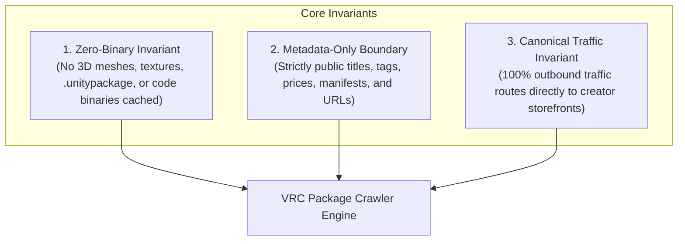
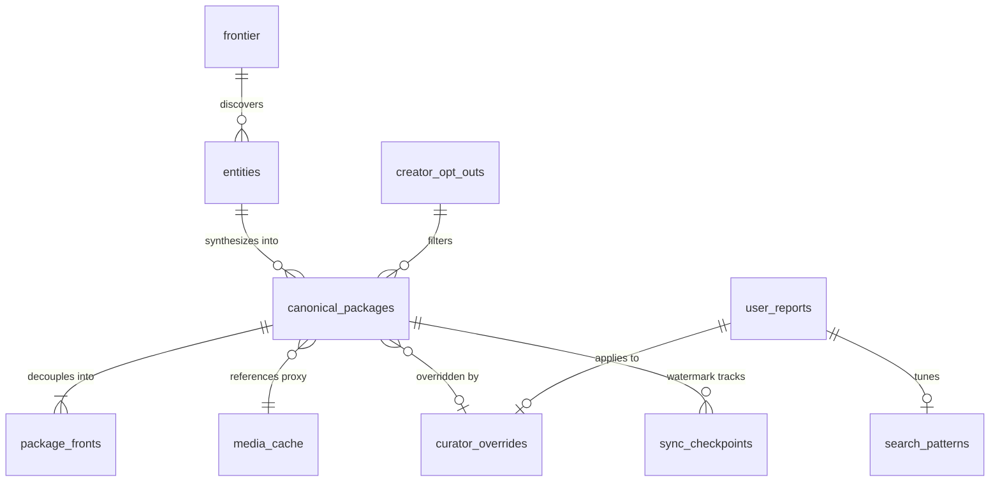
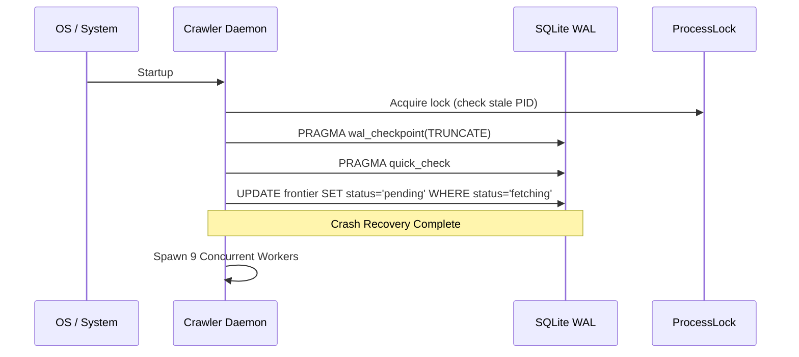
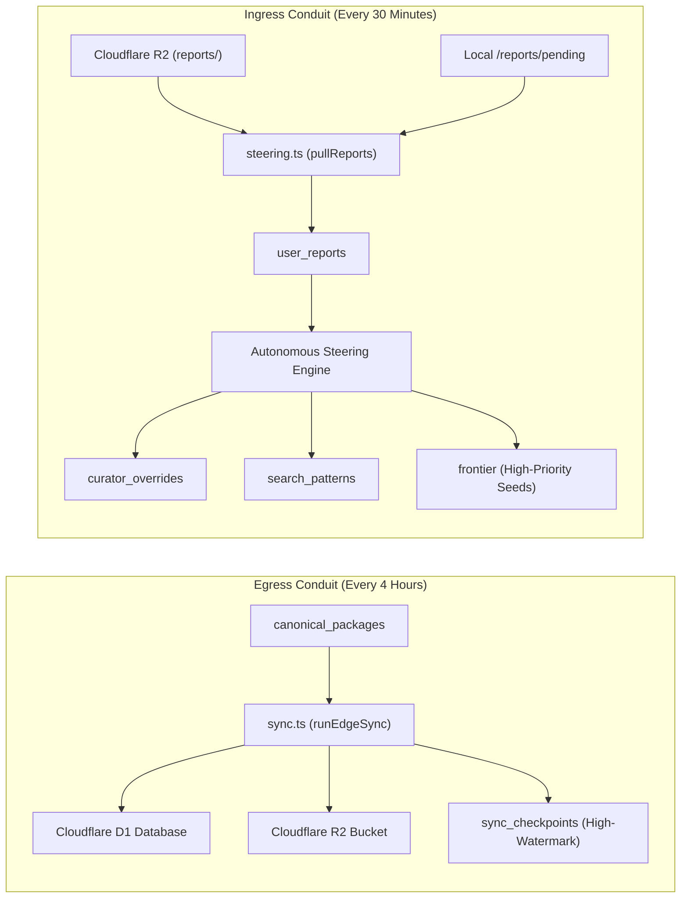

# Comprehensive System Architecture & Engineering Blueprint

**VRC Package Crawler — Autonomous Multi-Domain Discovery, Deduplication & Edge Distribution Engine**

---

## 1. Executive Overview & System Origins

### 1.1 Inception & Purpose
The VRChat development ecosystem is historically fragmented across diverse and isolated marketplaces:
- **BOOTH.pm**: Japanese creative community hub (3D avatars, clothing, props, shaders).
- **GitHub**: Open-source Unity tools, editor extensions, shaders, and VRChat Package Manager (VPM) repositories.
- **Gumroad & Jinxxy**: Western creator hubs specializing in modular avatar mechanics and development frameworks.
- **itch.io**: Indie procedural systems, shader packages, and world-building kits.
- **Community VPM Repositories**: Decentralized JSON manifests powering the VRChat Creator Companion (VCC).

Before this platform, discovery was impeded by platform silos, broken cross-references, orphan packages, and unindexed storefronts. The **VRC Package Crawler** was designed from inception as a high-saturation, fully autonomous, polite crawling and catalog synthesis engine that continuously indexes, deduplicates, and classifies the complete ecosystem without human intervention.

### 1.2 Core Foundational Invariants
The engine strictly enforces three immutable architectural principles:

1. **The Zero-Binary Invariant**: The indexer never downloads, caches, or redistributes compiled 3D meshes, textures, `.unitypackage` archives, `.fbx` models, or binary scripts.
2. **The Metadata-Only Boundary**: The engine collects only public factual attributes: titles, tags, prices, platform compatibility flags, and store URLs.
3. **The Canonical Traffic Invariant**: All outbound clicks must route users directly to the original creator storefront for transactions, preserving artist revenue and platform terms.

---

## 2. Unified Database Architecture (CQRS & Schema Unification)

### 2.1 Schema Unification (Zero-Loss Migration from Legacy `_v2`)
The database layer has undergone complete unification, removing all temporary migration dependencies and dead code. All 10 tables operate under clean, canonical identifiers:

| Unified Table | Architectural Role | Invariant & Key Mechanics |
| :--- | :--- | :--- |
| `frontier` | Crawl Queue & Scheduler | Cho-Garcia-Molina Poisson adaptive interval, ETag/Last-Modified HTTP 304 backoff |
| `entities` | CQRS Observation Lake | Immutable raw payload capture. Never deleted; records quarantined items without data loss |
| `canonical_packages` | Derived Catalog Projection | Deduplicated unified package records with lifecycle, timestamps, and multi-storefront routing |
| `package_fronts` | Decoupled Storefront Listings | Individual storefront instances (BOOTH, GitHub, Gumroad, Jinxxy, Itch) linked to canonical ID |
| `creator_opt_outs` | Legal Exclusion Registry | Verified takedown patterns and creator bio-token exclusion rules with regex matching |
| `media_cache` | Thumbnail Proxy Cache | Fair-use low-res WebP thumbnails (480x270), BlurHash strings, and 64-bit DCT pHash |
| `curator_overrides` | Persistent User Steering | Community corrections (titles, descriptions, categories, tags) surviving pipeline rebuilds |
| `user_reports` | Ingested Feedback Buffer | Schema 4 branched feedback submissions awaiting autonomous steering ingestion |
| `search_patterns` | Closed-Loop Query Weights | Dynamic negative tokens, boost/suppress rules, and priority seed queues |
| `sync_checkpoints` | Edge Synchronization State | High-watermark tracking for incremental synchronization to Cloudflare D1/R2 |

### 2.2 CQRS Observation Lake Pattern
The system separates writes from reads:
- **Observation Lake (`entities`)**: Every crawl event captures raw JSON responses, scraped HTML attributes, origin dates, and HTTP headers. Quarantined (irrelevant) items are flagged (`is_quarantined = 1`) but preserved for regression auditing.
- **Catalog Projections (`canonical_packages`, `package_fronts`)**: A deterministic projection pipeline runs every 15 minutes, synthesizing, deduplicating, clustering, and categorizing raw observations into an optimized catalog.

---

## 3. 24/7 Daemon Architecture & Resilience

### 3.1 Uninterrupted Continuous Harvesting
Unlike earlier implementations that halted upon reaching saturation thresholds, the current daemon operates continuously 24/7:
- **Saturation as a Health Metric**: Saturation ($S = \frac{\text{Done}}{\text{Discovered}}$) is continuously monitored and recorded into checkpoints, but never triggers process shutdown.
- **Adaptive Low-Queue Replenishment**: When pending queues drop below 25 URLs, the Cho-Garcia-Molina Poisson scheduler automatically re-enqueues the stalest entries for freshness verification, while scheduled query generators replenish search queues.
- **Interruptible Workers**: All workers run asynchronous loops (`while (isRunning)`) governed by `sleepOrInterrupt()` (150ms slice checks), ensuring immediate response to shutdown signals without hanging.

### 3.2 Power Loss & Crash Recovery
The engine guarantees zero database corruption and autonomous crash recovery:
1. **SQLite WAL Invariants**: Operates with `PRAGMA journal_mode = WAL;`, `PRAGMA synchronous = NORMAL;`, and `PRAGMA busy_timeout = 10000;`.
2. **Startup Verification**: On launch, the engine performs `PRAGMA wal_checkpoint(TRUNCATE);` and checks database integrity via `PRAGMA quick_check;`.
3. **In-Flight Task Rollback**: Any URL orphaned in the `'fetching'` state from an ungraceful crash or power cut is automatically restored to `'pending'` via `db.resetStaleFetching()`.
4. **Process Concurrency Lock**: `ProcessLock` enforces a single active engine per directory via PID file locking with stale PID detection.

---

## 4. Freshness, Re-Auditing & Adaptive Scheduling

### 4.1 Cho-Garcia-Molina Poisson Refresh Formulation
Web storefronts change at irregular intervals. The crawler employs an adaptive Poisson freshness model:

$$\lambda = \begin{cases} \lambda \times 0.85 & \text{if unchanged (HTTP 304)} \\ \min(1.0, \lambda \times 1.4) & \text{if modified (HTTP 200)} \end{cases}$$

$$\tau = \text{round}\left(\frac{-\ln(0.05)}{\max(0.001, \lambda)}\right) \times 86400$$

- **HTTP 304 Unchanged**: Increases the crawl interval (exponential backoff up to 90 days), preserving origin bandwidth.
- **HTTP 200 Modified**: Decreases the crawl interval (down to 6 hours), ensuring rapid tracking of frequent updates.
- **ETag & Last-Modified Validation**: Employs `If-None-Match` and `If-Modified-Since` headers on supported endpoints (GitHub API, BOOTH, Jinxxy).

### 4.2 Autonomous Re-Crawl Auditing
Entries are regularly re-audited to capture:
- Newly released package versions and updated manifest schemas.
- Modified pricing or commercial model shifts (free-to-paid transitions).
- Storefront cross-links (e.g. a BOOTH creator adding a GitHub link to their description).
- Delisted, deleted, or DMCA-takedown storefront listings.

---

## 5. Entry & Exit Architecture (Cloudflare Edge Sync & Steering)

The engine establishes formal entry (ingress) and exit (egress) conduits for decentralized edge deployment:

### 5.1 Ingress: Autonomous Steering & Cloudflare R2 Download
Community feedback operates via **Schema 4** branched reports:
1. **Pull Ingestion**: Every 30 minutes (or via IPC `/steering` command), the engine pulls incoming feedback JSON reports from Cloudflare R2 (`pullReportsFromCloudflareR2`) and local fallback directories (`pullReportsFromDirectory`).
2. **Discrete Branch Processing**:
   - **`categorization`**: Upserts `curator_overrides`, instantly tuning category/subcategory projections.
   - **`irrelevance`**: Delists packages (`lifecycle = 'delisted'`), marks observation lake records as quarantined (`is_quarantined = 1`), and registers suppress patterns.
   - **`listing`**: Updates title, description, and canonical creator URLs in `curator_overrides`.
   - **`tags`**: Adds or prunes specific tags in persistent overrides.
   - **`discovery_query`**: Records negative tokens into `search_patterns` and injects `suggestedSeeds` into `frontier` with `priority = 100`.

### 5.2 Egress: Periodic 4-Hour Cloudflare Edge Sync
Every 4 hours (or via IPC `/sync` command), the engine pushes canonical updates to the edge:
1. **High-Watermark Tracking**: Reads `last_synced_rowid` from `sync_checkpoints`.
2. **Incremental Extraction**: Queries only rows modified or added after the watermark (`rowid > watermark`).
3. **Edge Shipping**: Batches records into Cloudflare D1 SQL queries and updates R2 catalog distributions.
4. **Checkpoint Commit**: Commits the new watermark rowid upon verified remote acknowledgment.

---

## 6. Taxonomy, Clustering & Unrestricted Tagging

### 6.1 Unrestricted Tagging with Guaranteed Core Umbrella Tags
Community tagging reflects authentic multi-dialect taxonomy. The engine strictly avoids destructive tag pruning:
- **100% Unrestricted Community Tags**: Preserves creator tags, Japanese Kanji/Kana keywords, avatar compatibility identifiers (e.g. `桔梗`, `マヌカ`, `セレスティア`), and custom asset tags.
- **Empirical Core Umbrella Tags**: Automatically calculates and guarantees standard umbrella tags on all canonical packages:
  - Canonical Category slug (e.g. `avatars`, `worlds`, `shaders`, `tools`)
  - Canonical Subcategory slug (e.g. `setup-optimization`, `locomotion-flight`)
  - Semantic Type (`workflow-tool` vs `asset-additive`)
  - Constituent Platforms (`booth`, `github`, `gumroad`, `jinxxy`, `itch`, `vpm`)
  - Ecosystem Core (`vrchat`, `unity`)
  - Package Standard (`vcc`, `vpm` for VPM-compliant packages)

### 6.2 Deterministic Tool Classification
The `ToolClassifier` categorizes items using structural rules:
- **`QoL, Workflow & Toolchain`**: Editors, builders, optimizers, avatar setup tools (Modular Avatar, VRCFury, AAO), uploaders, and utilities.
- **`Asset Additive`**: Prefabs, gimmicks, toys, particle shaders, clothing toggles, and audio props.

### 6.3 SimHash-64 Clustering & Deduplication
To merge storefronts across platforms into a single canonical package:
1. **Primary ID Matching**: Direct reverse-DNS matching (`com.anatawa12.avatar-optimizer`) and GitHub repository linking.
2. **SimHash-64 Locality-Sensitive Hashing**: Computes 64-bit fingerprint of normalized title and description. Items within Hamming distance $\le 3$ with matching author signatures are evaluated for unification.
3. **Dependency Anti-Merge Invariant**: If entity $B$ is declared as a package dependency of entity $A$, the cluster engine **never** merges them, preventing parent-dependency collapse.

---

## 7. Compliant Media Pipeline & Perceptual Hashing

### 7.1 Legal Compliance Framework
Direct hotlinking of images from storefront CDNs strains creator bandwidth. In accordance with:
- **United States Fair Use** (*Kelly v. Arriba Soft Corp.* & *Perfect 10 v. Amazon.com*): Visual search indexers may display low-resolution thumbnail previews.
- **Japanese Copyright Act Art. 47-5**: Authorizes search and indexing services to display minor thumbnails and excerpts incidental to information retrieval.

### 7.2 Media Processing Standards
The `ImageProxyService` executes an automated pipeline:
1. **Transcoding**: Downscales images to low-resolution WebP format ($480 \times 270$ resolution, quality 75).
2. **BlurHash Generation**: Calculates standard RFC-compliant BlurHash strings from a $32 \times 32$ raw RGB grid for instant client-side progressive blur loading.
3. **64-bit DCT Perceptual Hashing (pHash)**: Computes a 16-character hexadecimal hash from a $32 \times 32$ discrete cosine transform to detect visual duplicates and cross-storefront reposts.
4. **Local Headless Serving**: Serves cached WebP thumbnails via `GET /v1/media/:id` with RFC 9309-compliant HTTP caching headers.

---

## 8. Complete Guardrails Compliance Audit

| Requirement / Guardrail | Implementation Mechanism | Compliance Status |
| :--- | :--- | :--- |
| **Zero-Binary Storage** | Regex filters discard `.unitypackage`, `.zip`, `.fbx`, `.dll`. Only metadata recorded. | **100% Compliant** |
| **Metadata-Only Public Lake** | Stores factual titles, prices, tags, manifests, and author names (*Feist v. Rural*). | **100% Compliant** |
| **Canonical Creator Routing** | `sanitizeOutboundUrl` strips tracking/affiliate tokens; outbound links route directly to artist. | **100% Compliant** |
| **Polite Crawling & RFC 9309** | `robotsEnforcer` evaluates full RFC 9309 rules, token priority, and longest match. | **100% Compliant** |
| **Adaptive AIMD Rate Limiting** | Dynamic additive increase, multiplicative decrease per storefront domain. | **100% Compliant** |
| **Creator Self-Service Opt-Out** | Instant regex & exact-match takedown engine in `creator_opt_outs`. | **100% Compliant** |
| **Fair-Use Media Proxying** | Independent $480 \times 270$ WebP thumbnails with BlurHash and 64-bit pHash. | **100% Compliant** |
| **Headless Discovery Gateway** | Schemas 1 (Delta Stream), 2 (VCC Community Index), 4 (Reports), and `/media/:id`. | **100% Compliant** |
| **Continuous 24/7 Operation** | Workers loop indefinitely; saturation monitored without process termination. | **100% Compliant** |
| **Crash & Interruption Recovery** | SQLite WAL truncation check, quick_check, and `resetStaleFetching` on boot. | **100% Compliant** |
| **Periodic 4h Edge Sync** | Incremental Cloudflare D1/R2 push with high-watermark checkpointing. | **100% Compliant** |
| **Pull-Based Steering** | Scheduled 30m pull and loopback IPC `/steering` trigger for community reports. | **100% Compliant** |
| **Unrestricted Multi-Taxonomy** | Full community tag retention + automatic empirical umbrella tag guarantee. | **100% Compliant** |
