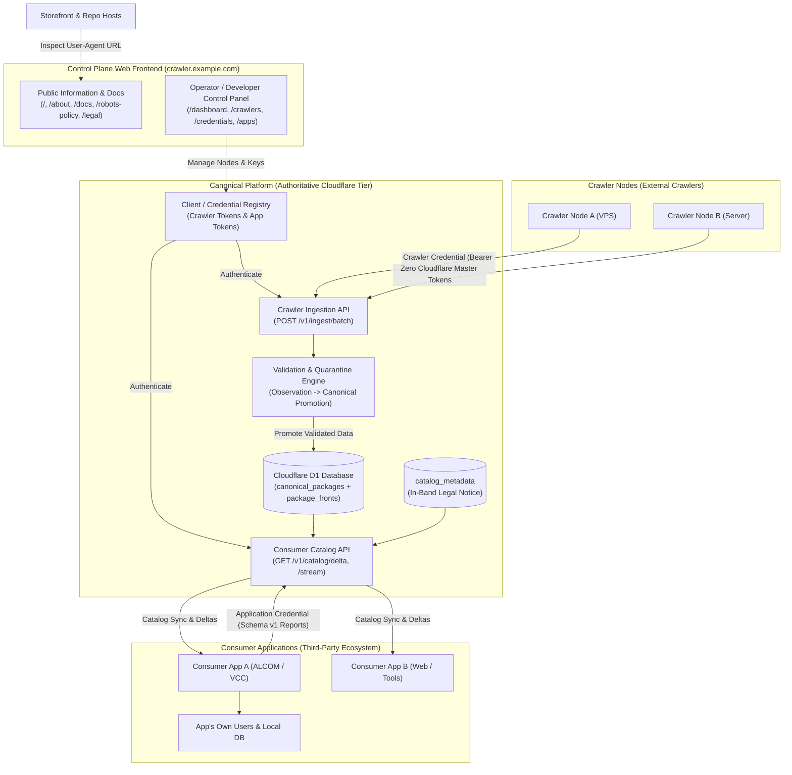

# Cloudflare Edge Synchronization and Scaling Guide

This guide describes how the system will configure Cloudflare edge synchronization and scale crawler workers. Follow these procedures to push local discoveries to Cloudflare D1 and R2.

---

## 1. Method Selection Matrix

| Operation Route | Data Target | Frequency | Recommended Tool | Network Overhead |
| :--- | :--- | :--- | :--- | :--- |
| Incremental Relational Sync | Cloudflare D1 | Every 15 min | `dist/vrc-sync.exe` | Low (< 50 KB / batch) |
| Local Backup Conduit | Local JSON Dump | On CF Disconnect | `dist/vrc-sync.exe` | Zero network (Disk write) |
| Offline Catalog Export | SQLite Client DB | Daily | `dist/vrc-monitor.exe export` | Zero (Local file generation) |
| Lake Snapshot Dump | Snapshot Archive | Weekly | `bun run export -- --lake` | Zero (Local file generation) |

---

## 2. Core Procedural Steps

### Step 1: Configure Cloudflare Credentials
Set your Cloudflare credentials in `dist/.env`:

```env
CLOUDFLARE_ACCOUNT_ID=your_account_id_here
CLOUDFLARE_API_TOKEN=your_api_token_here
CLOUDFLARE_D1_DATABASE_ID=your_d1_database_uuid_here
```
*(Note: Binary WebP thumbnail uploads to Cloudflare R2 have been deprecated under the Pure Media Pointer migration (Task 3.2). Edge distributions serve pure origin CDN URLs directly with zero binary object storage overhead).*

### Step 2: Test Synchronization in Dry-Run Mode
Validate your configuration without writing remote data:

```powershell
.\dist\vrc-sync.exe --dry-run
```

Expected terminal output:
```text
[EdgeSync] Initializing Cloudflare edge sync (Dry-run: true)...
[EdgeSync] High-watermark rowid: 0
[EdgeSync] Discovered 50 incremental records to synchronize.
[EdgeSync:DryRun] Validated batch of 50 packages for D1 push.
[EdgeSync] Edge synchronization complete: synced 50 records. New watermark: 50.
```

### Step 3: Run Live Synchronization
Execute live edge synchronization:

```powershell
.\dist\vrc-sync.exe
```

The tool will push new canonical packages to Cloudflare D1. It will also advance the local watermark checkpoint.

### Step 4: Schedule Periodic Execution on Windows
Create a scheduled task to run `vrc-sync.exe` every 15 minutes. Run PowerShell as Administrator:

```powershell
$action = New-ScheduledTaskAction -Execute "F:\.repo\.main\vrc-package-crawler\dist\vrc-sync.exe"
$trigger = New-ScheduledTaskTrigger -Once -At (Get-Date) -RepetitionInterval (New-TimeSpan -Minutes 15)
Register-ScheduledTask -TaskName "VRCEdgeSync" -Action $action -Trigger $trigger -Description "Periodic Cloudflare Edge Sync"
```

### Step 5: Schedule Periodic Execution on Linux
Add a cron job to execute the Linux binary every 15 minutes. Edit your crontab:

```bash
crontab -e
```

Add this line:

```cron
*/15 * * * * /opt/vrc-catalog/dist/vrc-sync >> /opt/vrc-catalog/dist/logs/sync.log 2>&1
```

---

---

## 3. Watermark Epoch Alignment & Recovery Mechanics (Task 3.4)

### The Table-Rebuild Watermark Vulnerability
In standard operation, `vrc-sync` tracks edge synchronization progress using SQLite auto-incrementing `rowid` values (`last_synced_rowid` in `sync_checkpoints`). However, when periodic catalog projection wipes and rebuilds `canonical_packages` (`DELETE FROM canonical_packages`), SQLite resets rowids back to 1. If the newly synthesized table contains more rows than the prior rebuild, naive watermark comparisons (`watermarkRowId > maxRowInDb`) fail to detect the wipe, causing rows `1..watermarkRowId` to be permanently skipped from syncing to Cloudflare D1.

### Deterministic Epoch Tracking Solution
To eliminate data loss, the system generates and persists a unique `projection_epoch` identifier (`epoch_<timestamp>_<rand>`) in `catalog_metadata` upon every projection completion.

1. **Epoch Detection during Sync**: When `runEdgeSync` initializes, it queries the current `projection_epoch` and compares it to the `projection_epoch` recorded on the latest successful checkpoint in `sync_checkpoints`.
2. **Automatic Watermark Realignment**: If an epoch change is detected (`currentEpoch !== lastCheckpoint.projection_epoch`), the synchronizer immediately logs a warning:
   ```text
   [WARN] [EdgeSync] Projection epoch change detected (epoch_old -> epoch_new). Watermark reset to 0 to prevent data omission.
   ```
   Watermark rowid resets to 0, ensuring all canonical packages in the new projection are comprehensively synchronized to Cloudflare D1 without manual intervention.
3. **Manual CLI Override**: If operators need to force an immediate full re-sync from rowid 0, invoke:
   ```powershell
   .\dist\vrc-sync.exe --reset-watermark
   # Or bun run sync -- --reset-watermark
   ```

---

## 4. Worker Operations and Process Control

Control the running crawler daemon using `vrc-monitor.exe`:

1. **Check Daemon Health:**
   ```powershell
   .\dist\vrc-monitor.exe status
   ```

2. **Trigger Freshness Re-crawl:**
   ```powershell
   .\dist\vrc-monitor.exe recrawl
   ```

3. **Force Immediate Catalog Projection:**
   ```powershell
   .\dist\vrc-monitor.exe project
   ```

4. **Stop Background Daemon Cleanly:**
   ```powershell
   .\dist\vrc-monitor.exe stop
   ```

---

## 5. Diagnostics and Troubleshooting

| Symptom | Root Cause | Resolution |
| :--- | :--- | :--- |
| `Cloudflare D1 HTTP 401: Unauthorized` | Invalid API token | Generate a Cloudflare API token with D1 Edit permissions. |
| `Cloudflare D1 HTTP 404: Database not found` | Incorrect `CLOUDFLARE_D1_DATABASE_ID` | Check database UUID in the Cloudflare dashboard. |
| `Could not connect to crawler daemon on 127.0.0.1:8765` | Background crawler is not running | Start `dist/vrc-crawler.exe` before sending IPC signals. |
| `EBUSY: resource busy or locked` | Multiple concurrent writers on database | Make sure `ProcessLock` is active. Only run one writer instance. |
| `Stream exceeded 2MB socket guardrail` | Source URL points to binary zip or mesh | Expected safeguard. The socket aborts automatically. |
| Edge sync skips newly rebuilt packages | Full-wipe projection reset SQLite rowids | Run `.\dist\vrc-sync.exe --reset-watermark` to reset high-watermark to 0 (or allow automatic epoch detection). |

---

## 6. Technical Specifications and Architecture (Reference)

### Deployment Topology & Single-Node v1.0 Perimeter (LEGAL.md §1.4 Alignment)
In accordance with **`LEGAL.md` §1.4** and **`TODO.md` CANON-6**, the version 1.0 Canonical Network operates strictly as a **single-node, maintainer-operated deployment**. Direct edge synchronization requires administrative Cloudflare credentials (`CLOUDFLARE_API_TOKEN`, `CLOUDFLARE_ACCOUNT_ID`), which cannot be safely distributed to untrusted third-party contributor nodes without credential leakage and edge tampering risks.

- **Version 1.0 Topology**: A single supervised daemon (`dist/vrc-crawler.exe`) performs localized ingestion and projection, and executes `dist/vrc-sync.exe` to push incremental deltas to Cloudflare D1 using administrative master credentials.
- **Post-v1.0 Tri-Domain Architecture & Control Plane (Task 5.4)**: Decouples into three strictly isolated domains plus a dedicated control plane:
  1. **Crawler Nodes**: Independent machines fetching VPM/storefront listings. Authenticate to the platform strictly using **`Crawler Credentials`** (`Authorization: Bearer <crawler-instance-token>` or Ed25519 signatures). Crawler nodes *never* receive Cloudflare infrastructure credentials.
  2. **Canonical Platform**: Authoritative Cloudflare-hosted infrastructure (`Crawler Ingestion API`, `Validation Engine`, `Client Registry`, `Cloudflare D1`, and public `Catalog API`). Enforces *Authorization $\neq$ Trust $\neq$ Authority* by validating observations prior to canonical promotion.
  3. **Consumer Applications**: Third-party applications (ALCOM, VCC, desktop tools) consuming the catalog via `Application Credentials` without exposing end-user identities (Alice, Bob). Submit versioned reports (`schema_version: 1`).
  4. **Control Plane Web Frontend (Post-v1.0 Blueprint)**: Lightweight web control plane planned for post-v1.0 deployment, exposing public transparency documentation (`/`, `/about`, `/robots-policy`, `/legal`, `/docs`) alongside an authenticated control panel for operator self-service credential lifecycle management (while current v1.0 operations continue to reference the canonical GitHub repository).



### High-Watermark Verification Query
Verify watermark alignment between local SQLite and remote Cloudflare D1:

```sql
-- Check local maximum rowid in SQLite:
SELECT MAX(rowid) AS local_max_rowid FROM canonical_packages;

-- Check recorded checkpoint and projection epoch for Cloudflare D1:
SELECT last_synced_rowid, projection_epoch, synced_at, status 
FROM sync_checkpoints 
WHERE sync_target = 'cloudflare_d1' 
ORDER BY id DESC LIMIT 1;
```

### Cloudflare D1 Table Schema DDL
Run this SQL script in the Cloudflare D1 console to initialize the remote catalog schema:

```sql
-- 1. Canonical Packages (Core Deduplicated Catalog)
CREATE TABLE IF NOT EXISTS canonical_packages (
  id TEXT PRIMARY KEY,
  canonical_id TEXT NOT NULL UNIQUE,
  name TEXT NOT NULL,
  author TEXT NOT NULL,
  authors_json TEXT DEFAULT '[]',
  category TEXT NOT NULL,
  subcategory TEXT NOT NULL,
  type TEXT NOT NULL,
  description TEXT,
  primary_platform TEXT NOT NULL,
  platforms_json TEXT NOT NULL,
  url TEXT NOT NULL,
  vcc_url TEXT,
  price_currency TEXT DEFAULT 'USD',
  price_amount REAL DEFAULT 0,
  is_vcc INTEGER NOT NULL DEFAULT 0,
  tags_json TEXT DEFAULT '[]',
  dependencies_json TEXT DEFAULT '{}',
  source_ids_json TEXT NOT NULL,
  media_id TEXT,
  media_urls_json TEXT DEFAULT '[]',
  youtube_urls_json TEXT DEFAULT '[]',
  origin_created_at TEXT,
  origin_updated_at TEXT,
  created_at_confidence TEXT DEFAULT 'unknown',
  lifecycle TEXT DEFAULT 'published',
  lifecycle_updated_at TEXT,
  created_at TEXT NOT NULL,
  updated_at TEXT NOT NULL
);

CREATE INDEX IF NOT EXISTS idx_remote_category ON canonical_packages(category);
CREATE INDEX IF NOT EXISTS idx_remote_type ON canonical_packages(type);
CREATE INDEX IF NOT EXISTS idx_remote_vcc ON canonical_packages(is_vcc);

-- 2. Decoupled Storefront Listings (Multi-Platform Mapping)
CREATE TABLE IF NOT EXISTS package_fronts (
  id TEXT PRIMARY KEY,
  canonical_id TEXT NOT NULL,
  platform TEXT NOT NULL,
  platform_item_id TEXT NOT NULL,
  url TEXT NOT NULL,
  title TEXT NOT NULL,
  author TEXT NOT NULL,
  price_currency TEXT,
  price_amount REAL,
  origin_created_at TEXT,
  origin_updated_at TEXT,
  raw_entity_id TEXT NOT NULL,
  media_urls_json TEXT DEFAULT '[]',
  youtube_urls_json TEXT DEFAULT '[]',
  created_at TEXT NOT NULL,
  updated_at TEXT NOT NULL
);

CREATE INDEX IF NOT EXISTS idx_remote_front_canonical ON package_fronts(canonical_id);
CREATE INDEX IF NOT EXISTS idx_remote_front_platform ON package_fronts(platform);

-- 3. In-Band Legal & Terms Metadata (LEGAL.md §10.7)
CREATE TABLE IF NOT EXISTS catalog_metadata (
  key TEXT PRIMARY KEY,
  value TEXT NOT NULL
);
```
