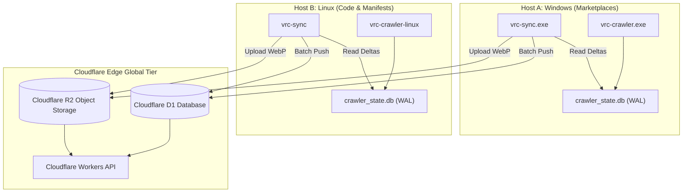

# Cloudflare Edge Synchronization and Scaling Guide

This guide describes how the system will configure Cloudflare edge synchronization and scale crawler workers. Follow these procedures to push local discoveries to Cloudflare D1 and R2.

---

## 1. Method Selection Matrix

| Operation Route | Data Target | Frequency | Recommended Tool | Network Overhead |
| :--- | :--- | :--- | :--- | :--- |
| Incremental Relational Sync | Cloudflare D1 | Every 15 min | `dist/vrc-sync.exe` | Low (< 50 KB / batch) |
| WebP Thumbnail Upload | Cloudflare R2 | Hourly | `dist/vrc-sync.exe` | Medium (10-25 KB / image) |
| Offline Catalog Export | SQLite Client DB | Daily | `dist/vrc-monitor.exe export` | Zero (Local file generation) |
| Lake Snapshot Dump | Snapshot Archive | Weekly | `bun run export -- --lake` | Zero (Local file generation) |

---

## 2. Core Procedural Steps

### Step 1: Configure Cloudflare Credentials
Set your Cloudflare credentials in `dist/.env`:

```env
CLOUDFLARE_ACCOUNT_ID=your_account_id_here
CLOUDFLARE_API_TOKEN=your_api_token_here
CLOUDFLARE_D1_DATABASE_ID=your_d1_database_uuid_here
CLOUDFLARE_R2_BUCKET_NAME=vrc-catalog-thumbnails
```

### Step 2: Test Synchronization in Dry-Run Mode
Validate your configuration without writing remote data:

```powershell
.\dist\vrc-sync.exe --dry-run
```

Expected terminal output:
```text
[EdgeSync] Initializing Cloudflare edge sync (Dry-run: true)...
[EdgeSync] High-watermark rowid: 0
[EdgeSync] Discovered 50 incremental records to synchronize.
[EdgeSync:DryRun] Validated batch of 50 packages for D1 push.
[EdgeSync] Edge synchronization complete: synced 50 records. New watermark: 50.
```

### Step 3: Run Live Synchronization
Execute live edge synchronization:

```powershell
.\dist\vrc-sync.exe
```

The tool will push new canonical packages to Cloudflare D1. It will also advance the local watermark checkpoint.

### Step 4: Schedule Periodic Execution on Windows
Create a scheduled task to run `vrc-sync.exe` every 15 minutes. Run PowerShell as Administrator:

```powershell
$action = New-ScheduledTaskAction -Execute "F:\.repo\.main\vrc-package-crawler\dist\vrc-sync.exe"
$trigger = New-ScheduledTaskTrigger -Once -At (Get-Date) -RepetitionInterval (New-TimeSpan -Minutes 15)
Register-ScheduledTask -TaskName "VRCEdgeSync" -Action $action -Trigger $trigger -Description "Periodic Cloudflare Edge Sync"
```

### Step 5: Schedule Periodic Execution on Linux
Add a cron job to execute the Linux binary every 15 minutes. Edit your crontab:

```bash
crontab -e
```

Add this line:

```cron
*/15 * * * * /opt/vrc-catalog/dist/vrc-sync >> /opt/vrc-catalog/dist/logs/sync.log 2>&1
```

---

## 3. Worker Operations and Process Control

Control the running crawler daemon using `vrc-monitor.exe`:

1. **Check Daemon Health:**
   ```powershell
   .\dist\vrc-monitor.exe status
   ```

2. **Trigger Freshness Re-crawl:**
   ```powershell
   .\dist\vrc-monitor.exe recrawl
   ```

3. **Force Immediate Catalog Projection:**
   ```powershell
   .\dist\vrc-monitor.exe project
   ```

4. **Stop Background Daemon Cleanly:**
   ```powershell
   .\dist\vrc-monitor.exe stop
   ```

---

## 4. Diagnostics and Troubleshooting

| Symptom | Root Cause | Resolution |
| :--- | :--- | :--- |
| `Cloudflare D1 HTTP 401: Unauthorized` | Invalid API token | Generate a Cloudflare API token with D1 Edit permissions. |
| `Cloudflare D1 HTTP 404: Database not found` | Incorrect `CLOUDFLARE_D1_DATABASE_ID` | Check database UUID in the Cloudflare dashboard. |
| `Could not connect to crawler daemon on 127.0.0.1:8765` | Background crawler is not running | Start `dist/vrc-crawler.exe` before sending IPC signals. |
| `EBUSY: resource busy or locked` | Multiple concurrent writers on database | Make sure `ProcessLock` is active. Only run one writer instance. |
| `Stream exceeded 2MB socket guardrail` | Source URL points to binary zip or mesh | Expected safeguard. The socket aborts automatically. |
| Edge sync skips newly rebuilt packages | Full-wipe projection reset SQLite rowids | Run `.\dist\vrc-sync.exe --reset-watermark` to reset high-watermark to 0. |

---

## 5. Technical Specifications and Architecture (Reference)

### Multi-Node Scaling Path
The crawler will run as a single-worker daemon per node. Scale horizontally by partitioning discovery domains across dedicated worker hosts:

1. **Node A (Host SlamROG16):** Crawls BOOTH and Gumroad storefronts.
2. **Node B (Cloud VPS):** Crawls GitHub repositories and VPM manifests.
3. **Synchronization Layer:** Both nodes execute `vrc-sync` independently. Cloudflare D1 handles deduplication via `INSERT OR REPLACE` on `canonical_id`.



### High-Watermark Verification Query
Verify watermark alignment between local SQLite and remote Cloudflare D1:

```sql
-- Check local maximum rowid in SQLite:
SELECT MAX(rowid) AS local_max_rowid FROM canonical_packages;

-- Check recorded checkpoint for Cloudflare D1:
SELECT checkpoint_value, updated_at 
FROM sync_checkpoints 
WHERE checkpoint_key = 'cloudflare_d1_canonical_packages';
```

### Cloudflare D1 Table Schema DDL
Run this SQL script in the Cloudflare D1 console to initialize the remote catalog schema:

```sql
CREATE TABLE IF NOT EXISTS canonical_packages (
  id TEXT PRIMARY KEY,
  canonical_id TEXT NOT NULL UNIQUE,
  name TEXT NOT NULL,
  author TEXT NOT NULL,
  authors_json TEXT DEFAULT '[]',
  category TEXT NOT NULL,
  subcategory TEXT NOT NULL,
  type TEXT NOT NULL,
  description TEXT,
  primary_platform TEXT NOT NULL,
  platforms_json TEXT NOT NULL,
  url TEXT NOT NULL,
  vcc_url TEXT,
  price_currency TEXT DEFAULT 'USD',
  price_amount REAL DEFAULT 0,
  is_vcc INTEGER NOT NULL DEFAULT 0,
  tags_json TEXT DEFAULT '[]',
  dependencies_json TEXT DEFAULT '{}',
  source_ids_json TEXT NOT NULL,
  media_id TEXT,
  media_urls_json TEXT DEFAULT '[]',
  youtube_urls_json TEXT DEFAULT '[]',
  origin_created_at TEXT,
  origin_updated_at TEXT,
  created_at_confidence TEXT DEFAULT 'unknown',
  lifecycle TEXT DEFAULT 'published',
  lifecycle_updated_at TEXT,
  created_at TEXT NOT NULL,
  updated_at TEXT NOT NULL
);

CREATE INDEX IF NOT EXISTS idx_remote_category ON canonical_packages(category);
CREATE INDEX IF NOT EXISTS idx_remote_type ON canonical_packages(type);
CREATE INDEX IF NOT EXISTS idx_remote_vcc ON canonical_packages(is_vcc);
```
