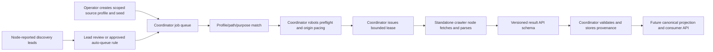

# Local pre-production pipeline responsibility map

Status: live-code map for the current version-0 local coordinator/node split,
not a claim that the whole roadmap is complete. Review this map whenever a
contract or entry point changes. `decisions/DIRECTION.md` owns product decisions;
`plans/IMPLEMENTATION_PLAN.md` owns gate order; `status/CONFORMANCE.md` owns measured exits;
`docs/decisions/DEFERRED_OWNER_DECISIONS.md` holds unresolved owner choices. This page
owns vocabulary and current responsibility mapping, not source-access approval.

## Plain-language flow

The diagram shows policy order, not all work as complete. The current
coordinator and node are separate processes over loopback HTTP. Tests also
exercise in-process handlers, but those still serialize and validate the
versioned wire payload. The coordinator selects the job; a node does not
self-assign URLs if the coordinator is down.

## Term-to-code truth table

| Term | Plain meaning | Pipeline stage and current code | What it does **not** mean |
| --- | --- | --- | --- |
| Platform capability | A node's declaration that it can handle a source kind, such as `vpm` or `github` | Claim/heartbeat contract in `src-crawler/src/shared/node_protocol.ts`; node execution in `src-crawler/src/node/lease_runner.ts` | Permission to contact every URL on that platform |
| Driver/adapter | Code that parses or discovers source-specific evidence | Fetch/parse in `src-crawler/src/node/observation_adapter.ts`; transitional v0 drivers still under `src-crawler/src/drivers/` | A self-scheduling crawler or independent access grant |
| Job | A specific URL, platform, purpose, and scheduling state in the coordinator | Queue/seed/lead stage in `src-crawler/src/worker/local_sqlite.ts`; CLI in `worker/main.ts` | A fetch authorization by itself |
| Source-access profile | Operator-reviewed, expiring permission for a platform, HTTPS origin, exact/directory path, GET, purpose, pacing, and evidence classes | Before lease: schema and matcher in `src-crawler/src/shared/source_access_profile.ts`; persistence and audit in `src-crawler/src/worker/local_sqlite.ts`; operator API in `src-crawler/src/worker/operator_handler.ts` | Approval for arbitrary paths, retention/publication outside named classes, or canonical authorship |
| Purpose | Whether the request seeks more URLs (`discovery`) or item facts (`metadata`) | Job/profile matching in `src-crawler/src/shared/source_access_profile.ts`; explicit lease field in `src-crawler/src/shared/node_protocol.ts`; BOOTH browse dispatch in `src-crawler/src/node/observation_adapter.ts` | Source role or evidence authority; a globally exclusive result kind (VPM metadata may reveal a recipe lead) |
| Source role | Whether a source is the publisher, a storefront/platform record, or a lead-only third-party index | Proposed provenance/identity policy; not yet a field in the source profile | A current, implemented lease check. Do not infer publisher authority from a matching profile |
| Robots preflight | A bounded request for an origin's `/robots.txt`, checked before content fetch | Policy preflight between profile-eligible queued job and content lease: `src-crawler/src/worker/robots_refresh_service.ts`, `src-crawler/src/shared/robots_retrieval.ts`, `src-crawler/src/worker/local_sqlite.ts` | Permission to retain/publish fetched data or to ignore source terms |
| Lease | Short-lived, centrally issued assignment of one approved job to one node, with origin-wide pacing | Claim/heartbeat/result API in `src-crawler/src/worker/handler.ts` and `src-crawler/src/shared/node_protocol.ts`; state in `src-crawler/src/worker/local_sqlite.ts` | A permanent grant, a message queue product, or permission to crawl links freely |
| Observation / lead | Parsed facts about a fetched item / a URL worth later review | Node result schema and release-shape predicate in `src-crawler/src/shared/node_protocol.ts`; parser in `src-crawler/src/node/observation_adapter.ts`; platform-bound validation and storage in `src-crawler/src/worker/local_sqlite.ts` | A canonical package, public listing, or installable VPM release merely because it was reported. VPM metadata can lack release proof; non-VPM jobs cannot submit it |
| Evidence class | Which kinds of result the profile may retain and separately publish | `src-crawler/src/shared/evidence_class.ts`, `src-crawler/src/shared/source_access_profile.ts` | Blanket permission to archive raw responses or copied prose |
| Canonical projection | A later decision about which observed fronts belong to one catalog item | Projection gate, not established by a fetch profile; see `decisions/DIRECTION.md` and `plans/IMPLEMENTATION_PLAN.md` | Safe automatic merge of similar titles or community-directory claims |

## Answers and open boundaries from owner review

1. **ACCESS-02 — robots belongs before content leasing.** Creating a source
   profile and a due job makes a narrowly scoped robots preflight eligible.
   A valid robots snapshot then participates in claim eligibility. This is a
   coordinator policy step, not a node driver or catalog projection step.
   Whether to allow a special unprofiled robots preflight is still an owner
   choice; the current implementation does not.
2. **ACCESS-04 — “migration” means local schema evolution, not a production
   legacy import.** This is version 0. The old prototype
   `bin/crawler_state.db` is read-only test material. Opening an older local
   coordinator schema clears unbound active leases/locks rather than granting
   them a profile. No broad data migration or rollback promise follows from
   that fixture test.
3. **ACCESS-05 — accepted.** A manually seeded VPM repository listing is
   `discovery`; a direct package manifest is `metadata`. The current seed CLI
   defaults to `metadata`, so the operator must supply `discovery` explicitly
   for that listing until a safer typed seed command exists.
4. **ACCESS-06 — exact matching location.**
   `sourceAccessProfileMatches` in `src-crawler/src/shared/source_access_profile.ts`
   compares platform, purpose, HTTPS origin, and exact path (or a
   slash-terminated directory scope). An optional ASCII `exactQuery` matches
   one exact path and query byte-for-byte; a canonical percent-encoded UTF-8
   path can only be an exact scope. Neither inherits a directory grant.
   The actual BOOTH category seed's `?page=1` fixture proves lease/no-lease
   boundaries offline. A purpose-directed node adapter now extracts only
   bounded product leads, and the coordinator rejects forged browse product
   observations and off-site leads. A loopback runner test reaches accepted
   pending leads without creating a product record or another fetch job.
   None of this creates a BOOTH approval or runs a live BOOTH request.
   General query policies, non-ASCII query values, and URL normalization by
   a remote server remain unreviewed.
5. **ACCESS-07 — profile controls a lease, source role controls evidence
   authority.** The former exists; the latter is still research/design.
   A lead-only directory may be fetched under a profile but cannot become a
   publisher's product claim or canonical cross-link merely from that fetch.
6. **IDENTITY-01 — owner proposal, not an implemented or legally cleared
   feature.** Keep ambiguous fronts unresolved. Downstream feedback about
   possible relationships could become a separately versioned steering
   signal after consent, abuse, retention, and legal review. Do not auto-train
   or silently merge because feedback is numerous.

## Gate-review use

For a changed row, inspect the production caller and callee, wire schema,
storage transition, negative path, and consumer consequence. Then run a
targeted test, transport-equivalence test where relevant, typecheck/build,
and diff review. If any path is not exercised, mark it open in `status/CONFORMANCE.md`.
Passing tests for one row do not close a gate or the owner's entire goal.
