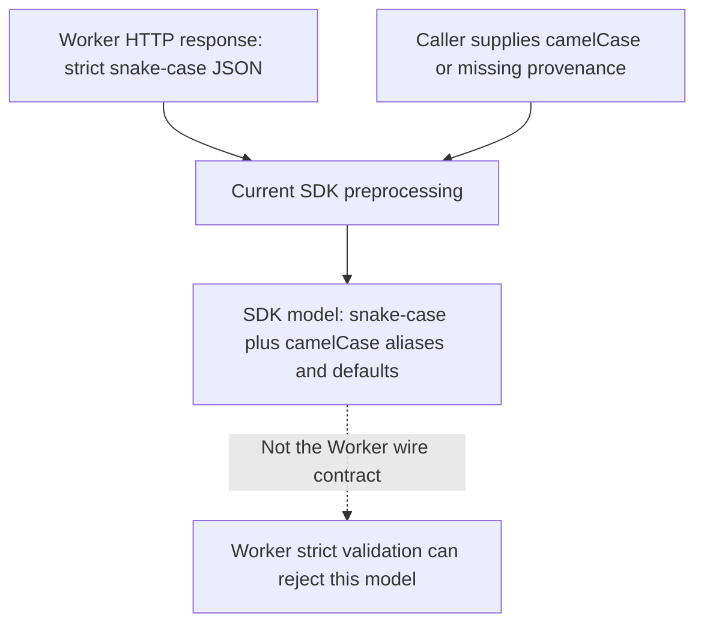
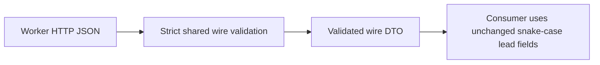

# API contract review — G15 owner review

Static review: 2026-10-04. Publication remains blocked. This review does not pass G15 or replace runtime tests.

The Worker has 26 method/path handlers. The SDK has methods for the 23 operator, user and app routes. Node routes intentionally stay outside the consumer SDK. Five user routes remain draft-only. Handler presence does not establish complete functionality.

## Evidence map

Paths below start at the repository root. Line numbers refer to this review's source snapshot.

- Dispatch: `src-worker/src/worker_entry.ts:26` and `:62`.
- Node routes: `src-worker/src/api/handler.ts:68`. Storage: `src-worker/src/storage/d1/coordinator.ts:274`, `:299`, `:406`.
- Operator routes: `src-worker/src/api/operator_handler.ts:84`. Storage: `src-worker/src/storage/d1/coordinator.ts:988`, `:1081` through `:1298`, and `:1468`.
- User routes: `src-worker/src/api/user_handler.ts:52`. Ownership query: `src-worker/src/storage/d1/coordinator.ts:2016`.
- App routes: `src-worker/src/api/downstream_handler.ts:58`. Storage: `src-worker/src/storage/d1/coordinator.ts:2003`, `:2031`, `:2060`, `:2077`, `:2109`.
- Public routes: `src-worker/src/api/public_handler.ts:48`. Projections: `src-worker/src/storage/d1/coordinator.ts:1402`, `:1427`.
- SDK methods: `src-package/src/client.ts:191` through `:497`. Schemas: `src-package/src/protocol/`.

## Complete route comparison

Auth labels: O = configured operator secret, U = active user token, A = active app token, N = active node credential. Public routes require no credential. Status codes below describe successful responses. Error behavior follows the table.

| Method and path | Auth | SDK method | Handler/storage reality | Disposition |
| --- | --- | --- | --- | --- |
| POST `/v1/node/jobs/claim` | N | None, by design | 200 leased or empty. Coordinator selects by capabilities, scoped profile, robots and origin pacing. | Keep lease-only allocation. Distributed node contracts remain G13. |
| POST `/v1/node/heartbeat` | N | None, by design | 200 alive. Checks active lease/profile/credential authority. | Keep fail-closed behavior. |
| POST `/v1/node/jobs/result` | N | None, by design | 200 accepted receipt. Checks lease and duplicate submission identity. | Keep idempotency. Restart-safe node outbox remains open. |
| POST `/v1/operator/init` | O | `operator.init` | 200 initialization receipt. Optional autoSeed queues candidates only. | Keep. Add to route/access tables, not only prose. |
| POST `/v1/operator/jobs` | O | `operator.jobs.enqueue` | 200 jobId. Audited manual candidate, not fetch approval or force refresh. | Keep. Add to route/access tables. |
| GET `/v1/operator/leads` | O | `operator.leads.list` | 200 strict snake-case rows, status-bound cursor. SDK adds aliases/defaults. | Decide wire/model separation before release. |
| POST `/v1/operator/leads/{leadKey}/approve` | O | `operator.leads.approve` | 200 leadKey/status/jobId. Wire requires reason, SDK supplies a default. Queue, pacing, approval and audit now share a batch. Some lead kinds cannot queue. | Review audit defaults. Rollback and retry fixtures are written, not run. |
| POST `/v1/operator/leads/{leadKey}/reject` | O | `operator.leads.reject` | 200 leadKey/status. Required reason. Approved leads cannot be rejected through this action. | Keep restriction. Decide SDK defaults. |
| GET `/v1/operator/source-profiles` | O | `operator.sourceProfiles.list` | 200 profiles/nextCursor. | Keep. No profile is a publication guarantee. |
| POST `/v1/operator/source-profiles` | O | `operator.sourceProfiles.create` | 201 profile. Requires method GET. Worker adds private-IP restrictions beyond SDK validation. | Document extra server policy. Never weaken it for parity. |
| POST `/v1/operator/source-profiles/{id}/disable` | O | `operator.sourceProfiles.disable` | 200 profile, not a status-only receipt. | Correct receipt. Publication revocation remains unresolved. |
| GET `/v1/operator/autoqueue-rules` | O | `operator.autoQueueRules.list` | 200 rules/nextCursor. | Keep. |
| POST `/v1/operator/autoqueue-rules` | O | `operator.autoQueueRules.create` | 201 rule. Rule can promote matching leads, not authorize fetching. | Keep separate source approval. |
| POST `/v1/operator/autoqueue-rules/{id}/disable` | O | `operator.autoQueueRules.disable` | 200 rule, not a status-only receipt. | Correct receipt. |
| POST `/v1/operator/nodes` | O | `operator.nodes.issue` | 201 credential once. Workforce selection can adjust capabilities. No user owner relation. Credential and issuance audit now share a batch. | Clarify ownership. Fresh issuance and rotation rollback fixtures are written, not run. |
| POST `/v1/operator/nodes/{nodeId}/revoke` | O | `operator.nodes.revoke` | 200 revoked. Credential/action writes share a batch. Origin reservation expires naturally. | Keep. Add missing access-matrix row. |
| GET `/v1/operator/catalog` | O | `operator.catalog.list` | 200 packages/nextCursor. Uses the same projection method as public index. | Do not claim extra operator evidence or editing controls. |
| GET `/v1/operator/takedowns` | O | `operator.takedowns.list` | 200 creator_opt_outs records. Does not list pending catalog_reports removal requests. | Review the disconnected moderation paths. |
| POST `/v1/operator/takedowns/{id}/verify` | O | `operator.takedowns.verify` | 200 verdict receipt. No automatic proof check. Rejection can restore catalog/job state and delete suppression. Actor is not persisted here. | Critical moderation/audit review before new removal controls. |
| GET `/v1/user/apps` | U | `user.apps.list` | 200 owned metadata, never credentials/hashes. UUID keyset pages. Includes revoked app metadata. | Keep ownership isolation. |
| GET `/v1/user/apps/{appId}` | U | `user.apps.get` | 200 owned metadata. Invalid, absent and unowned IDs return 404. | Keep. Detail currently accepts list-query fields but ignores them. |
| POST `/v1/app/register` | U or O | `app.register` | 201 one-time appToken. User ownership shares the registration batch. Operator apps remain unowned. Accepted description is not stored. | Keep auth/ownership. Decide description retention or removal. |
| GET `/v1/app/index` | Public | `index.query` | 200 schemaVersion/packages/nextCursor. Includes delisted rows. No total count or filters. | Keep bounded pages. Review publication rights and lifecycle exposure. |
| GET `/v1/app/index/delta` | Public | `index.syncDeltas` | 200 epoch/deltas/nextCursor from current rows, not an immutable event log. Hard deletion emits no tombstone. | Correct stream claims. Review replay, deletion and epoch-reset rules. |
| POST `/v1/app/index/search` | A | `index.search` | 200 items/nextCursor/totalEstimated. Substring search, heuristic tags, unused attribution. Wire cursor lacks SDK input. | Critical search contract review. |
| POST `/v1/app/report` | A | `reports.submit` | Demand/issue 200, removal 202. Removal is pending and non-destructive. Legacy feedback payload also accepted. | Keep singular route. Decide consolidated report/review model. |

## Draft-only and intentionally absent routes

| Method and path | Current state | Required owner disposition |
| --- | --- | --- |
| GET `/v1/user/nodes` | No handler, SDK method or ownership relation. | Decide explicit validated owner assignment during operator provisioning. Never infer an owner from an actor label. |
| GET `/v1/user/nodes/{nodeId}` | Same missing relation. | Use the same ownership decision. |
| GET `/v1/user` | No handler or SDK method. Firebase/profile service absent. | Decide profile fields and exposure. The aggregate draft is not an accepted response contract. |
| DELETE `/v1/user/nodes/{nodeId}` | No handler or SDK method. | Decide whether this belongs in self-service. Read-only collection approval does not settle detail revocation. |
| DELETE `/v1/user/apps/{appId}` | No handler or SDK method. | Decide self-service revocation and app-token lifecycle. |
| GET `/v1/node/jobs` | Intentionally absent. Claim assigns authorized work. | Do not add a queue browser or alternate fetch authority. Monitoring needs a separate accepted contract. |
| POST `/v1/user/apps`, POST `/v1/user/nodes` | Retired. Creation uses app/register or operator/nodes. | Keep absent. |
| POST `/v1/user/delist`, POST `/v1/app/reports`, GET `/v1/app/index/random` | Retired. | Keep absent. Removal reports do not directly delist. |

## Cross-route checks and release blockers

1. **Authorization is not permission enforcement.** App handlers authenticate active tokens but never check their permissions arrays. Storage returns catalog:read, catalog:search and demand:feedback. Define what limits report types and search access. Do not invent a new grant.
2. **Search promises differ from storage.** queryOrigin defaults to user_authored but storage ignores it. Tags match title/category/avatar text, not attached canonical tags. LIKE treats percent and underscore as patterns. Invalid cursor content silently removes pagination constraints. totalEstimated counts the remaining cursor-filtered rows. SDK search now forwards the existing nullable cursor and rejects limits outside 1–50 instead of clamping. Source and packed-consumer fixtures remain unrun. Decide the remaining search semantics before changing the contract.
3. **Reports lack a complete review path.** Demand and issue reports become demand signals. Issue reports default to refresh_demand. Their accepted reason now persists in metadata_json. It overrides a conflicting metadata reason. New persistence fixtures remain unrun. Removal reports use catalog_reports, but operator takedown routes read creator_opt_outs. No route lists, reviews or resolves pending removal reports. Keep pending removal non-destructive while deciding review transitions.
4. **Moderation can change unrelated state.** verifyTakedown rejects a notice by restoring delisted rows and removing URL suppression without checking which action caused that state. Direct submitDelistRequest still delists before proof. The verify actor argument is unused. Review competing notices, suppression reasons, audit and restoration rules together.
5. **Public projections need rights checks.** Existing publication-class gap remains R13-C3. Index includes delisted rows. Delta derives current state, cannot replay all intermediate events, and loses hard deletions. Epoch is returned but not bound into its cursor. Accepted identity links and all projected fronts require separate publication review.
6. **Transport/errors differ.** JSON bodies have a 256 KiB limit. Bad JSON returns 400, oversized bodies 413, unsupported media 415. Known routes generally reject invalid credentials with 401. Node payload validation runs before auth. Wrong methods return 404, not 405. Most handler errors include schemaVersion/code/error, but top-level init unauthorized, fallback and exception responses omit version/code. App handlers map storage conflicts to 500. Some errors expose storage messages. No shared stable error contract exists.
7. **Browser integration is incomplete.** Public/app responses have wildcard CORS, but no OPTIONS preflight handler or allowed authorization/content-type headers exist. User/operator responses lack CORS. A native SDK consumer is not proof of a browser dashboard. Decide approved frontend origins before adding authenticated CORS.
8. **Pagination is not uniform.** Public pages default to 50, operator pages to 100, owned apps to 50. Maximum is 100 except search at 50. Public/operator list handlers reject unknown and duplicate query keys. Mutation and node routes do not apply the same query policy. Search cursors accept up to 256 characters without semantic validation. Existing Unicode/long-ID cursor issue remains R49-C29.
9. **Package surface and installation remain open.** Direct-delisting schemas and user re-exports are removed. Export-absence fixtures are written, not run. Pending removal reports remain. All 14 SDK POST bodies now use existing request schemas before transport. Five operator action paths now validate identifiers with existing scalar schemas. Invalid-input/no-fetch fixtures are written, not run. This does not settle query validation or strict wire parity. Source-profile SDK validation is less strict than Worker policy. Owner-selected strict lead rows now reject aliases and unknown fields. Approval/rejection require explicit reasons. Their new fixtures remain unrun. Worker lacks a declared SDK dependency. Other consumers use file links, and tests import sibling sources. These violate independent-project delivery. Resolve internal contract distribution without moving node jobs into the consumer SDK.

Identifier follow-up, R53-C37: issuance now rejects dot/dot-dot node IDs. Node requests reuse that public operator schema through the SDK dependency. SDK and Worker UUID action paths normalize valid IDs before storage. Operator listings normalize decoded UUID fields after cursor validation. Raw user app UUID cursors also normalize case. Node IDs, timestamps and encoded cursor strings keep their original case. New fixtures remain unrun. Native D1 and packed-artifact checks still need to prove these paths.

The table covers all route handlers and current SDK methods. It does not establish all storage race/restart paths. Existing tests are historical evidence. No tests, typechecks, builds or publish commands ran for this review.

R53-C37 integrity follow-up: issuance and lead approval previously committed their main mutation before their audit. Both paths now use D1 batches. Lead promotion retains suppression, rule-expiry and lead-state guards. Approval retries do not add another approval audit. Native fixtures cover audit failure, existing leases and retry, but remain unrun. [D1 documents transactional batch rollback](https://developers.cloudflare.com/d1/worker-api/d1-database/). This design basis does not prove the current implementation passes.

## Lead contract visualization for owner decision

DTO means data transfer object: the JSON shape sent over HTTP.

Owner decision, 2026-10-04: strict wire DTOs, no convenience mapping. SDK preprocessing and reason defaults are removed. New parity and packed-consumer fixtures remain unrun. The following diagram records the previous defect, not current behavior. Owner comments below remain as review evidence.

| Example                 | Worker wire contract         | Current SDK behavior                    | Decision needed                                                 | author comments                                                                   |
| ----------------------- | ---------------------------- | --------------------------------------- | --------------------------------------------------------------- | --------------------------------------------------------------------------------- |
| lead_key / leadKey      | Only lead_key in a lead row. | Accepts either, then emits both.        | Keep wire data unchanged, or map after strict validation?       | use one naming convention only (snake_case preferred)                             |
| discovered_from_url     | Required, non-null string.   | Missing value becomes null.             | Do not erase required provenance during validation.             | proceed                                                                           |
| Extra row property      | Rejected by strict schema.   | Preprocessing drops unknown properties. | Should invalid wire data fail instead?                          | auto handle with best practices, i will only provide general top level directions |
| Approval without reason | Rejected.                    | Client supplies Operator approved.      | Require a caller reason, or retain a documented client default? | i dont know                                                                       |

Selected strict path, implemented but unverified:

This preserves one network contract. Convenience mapping changes names only after validation. It must not invent provenance or weaken source-access policy.

## G15 acceptance hold

The owner must review this complete inventory and its missing functionality. Resolve accepted changes before the release-check batch. Then check clean package installation, exports/declarations, malformed payloads, errors, auth/ownership, pagination and native Worker contracts. Check every src-* dependency boundary, registry identity, license and config-driven version.

The package now has private: true to prevent accidental npm publication. This guard is not evidence that G15 passed. Remove it only after verification and owner approval. No npm release, remote deployment or tag push is authorized by this review.

## Delegated creator removal — G15 proposal, 2026-10-04

Owner correction: downstream apps check creator challenges. The coordinator checks their authenticated attestations and applies authorized removal during the HTTP request. Neither the Worker nor the crawler fleet probes storefronts for this flow. Shared-secret authentication and SDK utilities remain design candidates. [Unmerged slices R54-C38A through C](../../scratch/UNMERGED_IMPLEMENTATION_PLAN.md) retain the remaining decisions.

| Question | Current evidence | Proposed boundary |
| --- | --- | --- |
| What does app authentication prove? | authenticateApp returns app identity and permissions. The handler does not enforce those permissions. | Authenticate the app and enforce a separate removal permission. Registration alone does not grant creator authority. |
| Does reporting remove records? | downstream_handler.ts calls recordRemovalReport. D1 stores a pending catalog_reports row and returns a receipt. | Keep ordinary reports non-destructive. A proof flow must link to this request without treating receipt acceptance as approval. |
| Does a proof verifier exist? | Proof kinds occur in stored notices and operator schemas. No attestation verifier or app-key registration appears in the inspected Worker path. | Define challenge production, app-side evidence checks, attestation acceptance and authorized action. No verification job enters the node fleet. Route names and SDK models need owner review. |
| Is internal moderation safe to reuse? | submitDelistRequest suppresses before checking proof. verifyTakedown rejection can restore unrelated suppressed records. Neither verifies external ownership. | Repair action-specific suppression and atomic audit before connecting these methods to delegated removal. |
| Does the legal draft match? | LEGAL.md sections 9.4–9.5 promise coordinator probes and direct routes. Sections 10.4–10.5 restrict downstream scraping and session use. | Describe delegated checks, approved verifier responsibility and a narrow verification-only access policy. This does not authorize broad downstream scraping or session relay. |

### Delegated responsibilities

See [the separate cryptographic delegation shelf](../topics/05_cryptographic_delegation.md) for authenticator codes, merchant-style events, scoped authorization and existing services. This audit retains the code-specific gaps.

| Party | Responsibility | Must not imply |
| --- | --- | --- |
| Creator | Place a fresh token on the relevant profile or prove control through another accepted method. | Control of a hosted marketplace domain or every canonical front. |
| Approved downstream backend | Check the challenge at its authoritative location. Authenticate the exact target, requested action and minimal verification outcome. | General app registration grants removal authority. |
| API-only Worker | Check app/key status, permission, target scope, message authentication, expiry and replay. Commit suppression, lifecycle and audit atomically. | The Worker independently observed the storefront or can recover an app's concealed false statement. |
| Crawler fleet | No role in this removal verification flow. | A new driver, source profile or leased verification job is needed. |

Successful validation can return an immediate committed-removal receipt. Generic reports and invalid attestations remain non-destructive. A cryptographic match alone is insufficient without the other checks. Duplicate requests return the same committed result. Record the consumed nonce and action in the same transaction to resist concurrent replay. Expiry, key revocation and current suppression must be checked at the write boundary.

HMAC is a keyed-hash message authentication code, not encryption. It authenticates the statement of a shared-key holder. See [RFC 2104](https://www.rfc-editor.org/rfc/rfc2104.html). HMAC-SHA-256 through Web Crypto is a candidate, not an accepted algorithm. [Workers Web Crypto](https://developers.cloudflare.com/workers/runtime-apis/web-crypto/) documents the platform primitive. Do not invent a cryptographic implementation.

A possible authenticated statement binds schemaVersion, appId, keyId, challenge reference, normalized target, action, evidence digest, nonce, audience and expiry. Define exact encoded bytes and reject unknown fields. [RFC 9421 sections 7.1–7.2](https://www.rfc-editor.org/rfc/rfc9421.html#section-7) explains coverage, TLS and replay checks. Authentication does not replace HTTPS or prove that the app actually observed the public token.

Current app credentials are bearer tokens stored as hashes. They are not attestation keys. A shared-secret design needs a separate secret per approved app, protected key storage, provisioning, rotation and revocation. Do not reuse a bearer token or its stored hash as a signing key. One global shared secret would let any holder impersonate other apps. Challenge production can occur in the approved app or use a cheap coordinator token endpoint. Neither requires coordinator storefront access. The issuer and token format remain undecided.

SDK candidate: a dedicated backend-only export for challenge construction, strict attestation schemas and message authentication. The consumer supplies key material at runtime. Do not publish secrets in npm, browser bundles, static sites or distributed desktop binaries. Those clients can guide creators but need a trusted backend for shared-key attestations. Scope any optional bio/DNS checker to approved verification methods, not crawler drivers. Worker implementation must consume a distributed contract artifact, never src-package source. Full G15 review still holds publication.

A bio token is public proof of fresh control, not a secret. Use a random, expiring, single-use challenge rather than the draft's predictable vendorId marker. Check it on the specific approved profile, not anywhere in a product page. Domain control does not prove ownership of every item under a hosted marketplace. Define front-to-creator mapping and delegation separately. A canonical product can have several creators or storefronts. Do not extend one front's proof to all fronts by inference.

Store a minimal verification outcome and digest. Do not send raw profiles, session cookies or unnecessary end-user identity. App-side fetch helpers need body limits, redirect rejection and DNS/private-address guards. Coordinator validation needs expiry, rate limits, permission and replay checks, but no external fetch. Revoking a verifier must stop new attestations. Define incident review and restoration for wrongful removal without undoing another valid suppression.

Sequence: settle verifier admission and target scope, define versioned contracts, repair moderation ownership, then wire the Worker and distributed SDK. Gate fixtures must cover tampered messages, wrong app/target, nonce races, revoked keys, concurrent notices and audit rollback. Also check zero coordinator/fleet verification egress. A rejected request must not undo another valid suppression. Full API_ROUTES.md owner review and artifact verification still precede v0.1.0 publication.
