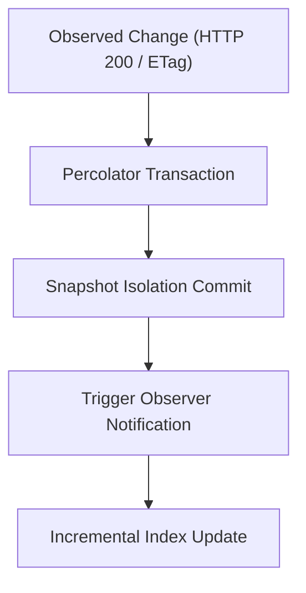

# Web Crawler Architectures: Frontier Design, Memory Hierarchy, and Incremental Processing
This guide will explain high-throughput crawler architectures, frontier queue management, and incremental processing pipelines.

***

## 1. Architectural Topologies: Centralized Versus Distributed

Web crawlers collect documents across network endpoints. System designers choose between centralized architectures and distributed clusters.

```mermaid
flowchart TD
    subgraph Centralized Pre-Production (Dual-Process Loopback)
        C1["Coordinator Process (vrc-coordinator)"] -->|Lease Grants & Origin Pacing| C2["Crawler Node (vrc-node)"]
        C2 -->|Lease Work Requests & Result DTOs| C1
        C1 --> C3["Coordinator DB (coordinator.db)"]
        C2 --> C4["Node DB (node.db)"]
        C2 --> C5["Scoped Observation Adapters (HTTP)"]
    end
    subgraph Distributed Multi-Node Cluster
        D1["Frontier Coordinator"] --> D2["Message Broker (Kafka / Redis)"]
        D2 --> D3["Worker Node 1"]
        D2 --> D4["Worker Node 2"]
        D3 & D4 --> D5["Distributed Store (Cassandra / Bigtable / D1)"]
    end
```

### Centralized Dual-Process Architecture (Version-0 Pre-Production)
A centralized crawler runs on a single host. It avoids cross-datacenter network serialization overhead and simplifies consistency for focused domain crawls (such as 50,000 package manifests).

In the version-0 pre-production architecture, the system separates roles into two distinct binaries communicating over loopback HTTP using validated versioned API payloads (Zod DTOs):
- `vrc-coordinator`: Governs frontier queue priorities, enforces active source-access profiles, caches RFC 9309 robots rules, serializes origin pacing, issues bounded-time exact-URL leases, and persists authoritative lake state into `coordinator.db` (SQLite WAL).
- `vrc-node`: Autonomous execution daemon that requests work leases from the coordinator over localhost HTTP, executes scoped observation adapters (`src/node/observation_adapter.ts`), validates output schemas, and records local execution telemetry into `node.db` (SQLite WAL).

The crawler node never performs unleased network fetches; loss of coordinator availability halts active fetching fail-closed. This dual-process separation eliminates legacy OS process lock collisions (`ProcessLock`), enforces exact protocol boundaries, and matches the target distributed contract locally before deploying edge workers.

### Distributed Multi-Node Clusters
Distributed crawlers partition the URL frontier across multiple physical or edge worker nodes. A central coordinator assigns URL hashes or partitions to specific nodes via distributed message brokers.

Distributed architectures suit web-scale crawls exceeding 100 million pages. However, distributed clusters require message brokers, coordination locks, partition rebalancing, and distributed storage, increasing operational and operational-consistency complexity.

| Architecture Dimension | Centralized Dual-Process (`vrc-coordinator` + `vrc-node`) | Distributed Cluster (e.g., Apache Nutch) |
| :--- | :--- | :--- |
| **Node Count** | 1 host (dual processes over loopback) | Multi-node cluster |
| **Throughput Ceiling** | 500 to 2,000 requests per second | 10,000+ requests per second |
| **Infrastructure Needs** | Local disk and RAM (`coordinator.db`, `node.db`) | ZooKeeper, Kafka, Hadoop/HDFS, or D1/Durable Objects |
| **Operational Cost** | Low (single host / development workstation) | High (multi-instance maintenance and cluster orchestration) |
| **Failure Recovery** | Automatic lease timeout, WAL recovery, idempotent replay | Node failover, lease re-election, and partition rebalancing |

---

## 2. The Mercator Frontier: Priority and Politeness Queues

The URL frontier will control crawl order. The frontier will balance two competing goals:
1. **Priority**: Crawling high-value, relevant documents first.
2. **Politeness**: Avoiding request bursts to any single origin host.

Allan Heydon and Marc Najork solved this dilemma in the Mercator crawler[^1].


### The Two-Level Queue Mechanism
Mercator splits frontier management into two tiers:

1. **FIFO Priority Queues (F-Queues)**:
   The crawler will assign newly discovered URLs to an F-Queue based on priority. High-priority feeds (such as root repository manifests) will enter high-priority queues. Cosmetic product listings will enter lower-priority queues.

2. **Per-Host Politeness Queues (B-Queues)**:
   The crawler will map URLs to B-Queues based on domain name (`booth.pm`, `gumroad.com`, `api.github.com`). Each B-Queue will hold URLs for exactly one host.

3. **The Ready Queue and Host Min-Heap**:
   A min-heap will store each active host along with its `next_fetch_time`. When a worker thread requests a URL, it will pop the top host from the heap. If `next_fetch_time` is in the future, the worker will sleep until the host is ready.

This mechanism gives a mathematical guarantee: the crawler will never fire concurrent requests to the same host[^2].

### VPM Registry Seeding and Temporal Staleness
To keep discovery queues populated, the engine will inject seed URLs from community package registries. 

Seeding gates must avoid monotonic counter traps. Gating seed injection on fixed counters (such as `done < 50`) will permanently halt re-seeding once initial tasks complete. Production crawlers will evaluate temporal staleness:
```typescript
const isStale = (Date.now() - lastVpmSeedAt) > 7 * 86400 * 1000;
if (pendingTasks < 10 && isStale) {
  await injectVpmSeeds();
}
```
This ensures long-running background daemons will discover newly published package feeds periodically.

---

## 3. Frontier Memory Hierarchy and Disk Buffering

Frontier queues for millions of URLs cannot fit in main memory. Najork and Heydon designed a two-level memory hierarchy[^2].

- **RAM Buffers**: Main memory will hold the head and tail of each B-Queue.
- **Disk Backing**: The body of each queue will reside in sequential append-only disk files.
- **Batch Transfer**: When a RAM buffer empties, the engine will read the next block of URLs from disk.

This design prevents random disk access. Disk I/O will remain sequential, preserving disk performance.

---

## 4. Incremental Crawling: The Google Caffeine Architecture

Traditional search engines used batch processing. The crawler fetched pages for weeks, saved them to disk, and ran batch MapReduce jobs.

In 2010, Daniel Peng and Frank Dabek published Percolator, the engine powering Google Caffeine[^3].



### The Percolator Model
Percolator replaced batch MapReduce with incremental notifications:
- **Distributed Transactions**: Percolator will add two-phase commits and snapshot isolation on top of Bigtable.
- **Observers**: Developers will write observer functions that trigger when table columns change.
- **Eventual Consistency**: When the crawler updates a package manifest, Percolator will trigger an observer. The observer will update search indexes in seconds.

Caffeine reduced average index document age by 50 percent[^3]. For VRChat package discovery, an incremental pipeline will update package versions immediately when a Git release publishes.

### Incremental Upserts Versus Full-Wipe Rebuilds
In production catalogs, running a periodic full-wipe projection (`DELETE FROM canonical_packages`) introduces two major failure modes:
1. **Clustering Computational Complexity**: Recomputing SimHash clusters across all 49,000 raw entities on every cycle creates an $O(n^2)$ CPU bottleneck that exceeds scheduled intervals.
2. **Auto-Increment RowID Resets**: Resetting local table rows to 1 breaks downstream replication checkpoints. Watermark-based sync workers will assume remote replicas are ahead and will skip rows.

Compliant production engines will implement incremental upserts keyed on `canonical_id`. The engine will track modifications using a `dirty_since` timestamp. It will recluster only modified records while preserving existing row identifiers.

***

## References

[^1]: A. Heydon and M. Najork, "Mercator: A scalable, extensible Web crawler," *World Wide Web*, vol. 2, no. 4, pp. 219-229, Dec. 1999.

[^2]: M. Najork and A. Heydon, "High-performance web crawling," Compaq Systems Research Center, Res. Rep. 173, Sep. 2001.

[^3]: D. Peng and F. Dabek, "Large-scale incremental processing using distributed transactions and notifications," in *Proc. 9th USENIX Symp. Operating Systems Design and Implementation (OSDI)*, Vancouver, BC, Canada, 2010, pp. 251-264.
