# Crawler Systems and Infrastructure: Frontier Scheduling, Politeness, Anti-Bot Perimeter, and Storage Engine Architecture

This guide explains high-throughput crawler architectures, frontier queue management, adaptive politeness, anti-bot perimeters, operational storage, and distributed edge delivery.

***

## 1. Architectural Topologies: Centralized Versus Distributed

Web crawlers collect documents across network endpoints. System designers choose between centralized architectures and distributed clusters.

```mermaid
flowchart TD
    subgraph Centralized Pre-Production (Dual-Process Loopback)
        C1["Coordinator Process (vrc-coordinator)"] -->|Lease Grants & Origin Pacing| C2["Crawler Node (vrc-node)"]
        C2 -->|Lease Work Requests & Result DTOs| C1
        C1 --> C3["Coordinator DB (coordinator.db)"]
        C2 --> C4["Node DB (node.db)"]
        C2 --> C5["Scoped Observation Adapters (HTTP)"]
    end
    subgraph Distributed Multi-Node Cluster
        D1["Frontier Coordinator"] --> D2["Message Broker (Kafka / Redis)"]
        D2 --> D3["Worker Node 1"]
        D2 --> D4["Worker Node 2"]
        D3 & D4 --> D5["Distributed Store (Cassandra / Bigtable / D1)"]
    end
```

### Centralized Dual-Process Architecture (Version-0 Pre-Production)

A centralized crawler runs on a single host. It avoids cross-datacenter network serialization overhead. It also simplifies data consistency for focused domain crawls.

In the version-0 pre-production architecture, the system separates roles into two distinct binaries. These processes communicate over loopback HTTP with validated versioned API payloads (Zod DTOs):

- `vrc-coordinator`: Governs frontier queue priorities. It enforces active source-access profiles and caches RFC 9309 robots rules. It also serializes origin pacing, issues bounded-time exact-URL leases, and persists authoritative lake state into `coordinator.db` (SQLite WAL).
- `vrc-node`: Autonomous execution daemon. It requests work leases from the coordinator over localhost HTTP. It executes scoped observation adapters (`src/node/observation_adapter.ts`), validates output schemas, and records local execution telemetry into `node.db` (SQLite WAL).

The crawler node never executes unleased network fetches. Loss of coordinator availability halts active fetching fail-closed. This dual-process separation eliminates legacy OS process lock collisions (`ProcessLock`). It enforces exact protocol boundaries. It also matches the target distributed contract locally before deploying edge workers.

### Distributed Multi-Node Clusters

Distributed crawlers partition the URL frontier across multiple physical or edge worker nodes. A central coordinator assigns URL hashes or partitions to specific nodes through distributed message brokers.

Distributed architectures suit web-scale crawls that exceed 100 million pages. But distributed clusters require message brokers, coordination locks, partition rebalancing, and distributed storage. These components increase operational complexity.

| Architecture Dimension | Centralized Dual-Process (`vrc-coordinator` + `vrc-node`) | Distributed Cluster (e.g., Apache Nutch) |
| :--- | :--- | :--- |
| **Node Count** | 1 host (dual processes over loopback) | Multi-node cluster |
| **Throughput Ceiling** | 500 to 2,000 requests per second | 10,000+ requests per second |
| **Infrastructure Needs** | Local disk and RAM (`coordinator.db`, `node.db`) | ZooKeeper, Kafka, Hadoop/HDFS, or D1/Durable Objects |
| **Operational Cost** | Low (single host or workstation) | High (multi-instance maintenance and cluster orchestration) |
| **Failure Recovery** | Automatic lease timeout, WAL recovery, idempotent replay | Node failover, lease re-election, and partition rebalancing |

***

## 2. The Mercator Frontier: Priority and Politeness Queues

The URL frontier controls crawl order. The frontier balances two competing goals:
1. **Priority**: Crawling high-value, relevant documents first.
2. **Politeness**: Avoiding request bursts to any single origin host.

Allan Heydon and Marc Najork solved this dilemma in the Mercator crawler[^1].

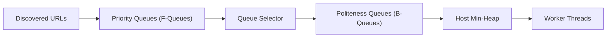

### The Two-Level Queue Mechanism

Mercator splits frontier management into two tiers:

1. **FIFO Priority Queues (F-Queues)**:
   The crawler assigns newly discovered URLs to an F-Queue based on priority. High-priority feeds (such as root repository manifests) enter high-priority queues. Cosmetic product listings enter lower-priority queues.

2. **Per-Host Politeness Queues (B-Queues)**:
   The crawler maps URLs to B-Queues based on domain name (`booth.pm`, `gumroad.com`, `api.github.com`). Each B-Queue holds URLs for exactly one host.

3. **The Ready Queue and Host Min-Heap**:
   A min-heap stores each active host along with its `next_fetch_time`. When a worker thread requests a URL, it pops the top host from the heap. If `next_fetch_time` is in the future, the worker sleeps until the host is ready.

This mechanism gives a mathematical guarantee: the crawler never fires concurrent requests to the same host[^2].

### VPM Registry Seeding and Temporal Staleness

To keep discovery queues populated, the engine injects seed URLs from community package registries. 

Seeding gates must avoid monotonic counter traps. Gating seed injection on fixed counters (such as `done < 50`) permanently halts re-seeding once initial tasks complete. Production crawlers evaluate temporal staleness:

```typescript
const isStale = (Date.now() - lastVpmSeedAt) > 7 * 86400 * 1000;
if (pendingTasks < 10 && isStale) {
  await injectVpmSeeds();
}
```

This logic makes sure long-running background daemons discover newly published package feeds periodically.

### Frontier Memory Hierarchy and Disk Buffering

Frontier queues for millions of URLs cannot fit in main memory. Najork and Heydon designed a two-level memory hierarchy[^2]:

- **RAM Buffers**: Main memory holds the head and tail of each B-Queue.
- **Disk Backing**: The body of each queue resides in sequential append-only disk files.
- **Batch Transfer**: When a RAM buffer empties, the engine reads the next block of URLs from disk.

This design prevents random disk access. Disk I/O remains sequential, preserving disk throughput.

***

## 3. Incremental Processing: The Google Caffeine Model

Traditional search engines used batch processing. The crawler fetched pages for weeks, saved them to disk, and ran batch MapReduce jobs.

In 2010, Daniel Peng and Frank Dabek published Percolator, the engine powering Google Caffeine[^3].

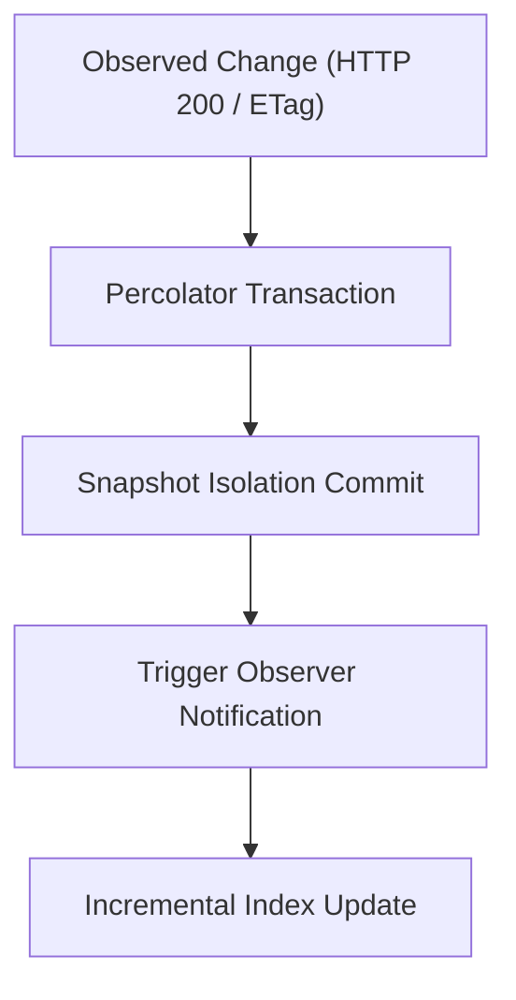

### The Percolator Model

Percolator replaced batch MapReduce with incremental notifications:
- **Distributed Transactions**: Percolator added two-phase commits and snapshot isolation on top of Bigtable.
- **Observers**: Developers wrote observer functions that trigger when table columns change.
- **Eventual Consistency**: When the crawler updates a package manifest, Percolator triggers an observer. The observer updates search indexes in seconds.

Caffeine reduced average index document age by 50 percent[^3]. For VRChat package discovery, an incremental pipeline updates package versions immediately when a Git release publishes.

### Incremental Upserts Versus Full-Wipe Rebuilds

In production catalogs, running a periodic full-wipe projection (`DELETE FROM canonical_packages`) introduces two major failure modes:
1. **Clustering Computational Complexity**: Recomputing SimHash clusters across all 49,000 raw entities on every cycle creates an $O(n^2)$ CPU bottleneck that exceeds scheduled intervals.
2. **Auto-Increment RowID Resets**: Resetting local table rows to 1 breaks downstream replication checkpoints. Watermark-based sync workers assume remote replicas are ahead and skip rows.

Compliant production engines implement incremental upserts keyed on `canonical_id`. The engine tracks modifications with a `dirty_since` timestamp. It reclusters only modified records while preserving existing row identifiers.

***

## 4. Politeness Dynamics and Adaptive Rate Limiting

Web crawlers request documents from remote web servers. Without rate limiting, a fast crawler can fire hundreds of parallel connections at an origin host.

This burst traffic causes server brownouts and degrades performance for human users[^1]. In response, edge firewalls and load balancers block the crawler with `HTTP 429 Too Many Requests` or `HTTP 403 Forbidden`.

A production crawler enforces the **Politeness Invariant**:
- At most one request is in flight to any host at any given millisecond.
- Inter-request delays match or exceed origin capacity.

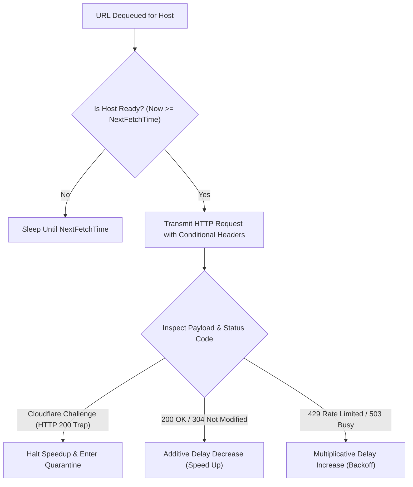

### Token Bucket and Leaky Bucket Algorithms

System designers use bucket algorithms to regulate request flow[^4].

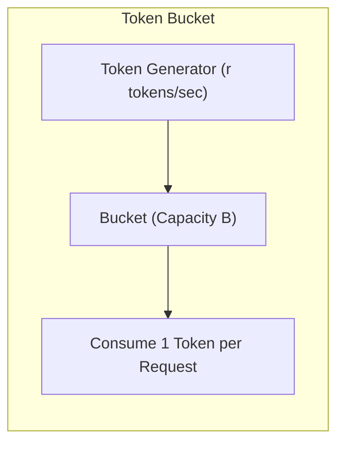

A token bucket permits small bursts while maintaining a strict average rate:
- Tokens accumulate in a bucket of capacity $B$ at rate $r$ tokens per second.
- To send an HTTP request, the worker consumes one token.
- If the bucket is empty, the worker waits for the next token.

For storefronts like BOOTH and Gumroad, the crawler sets capacity $B = 1$ and rate $r \le 0.33$ requests per second (at least 3.0 seconds between requests). Setting $B = 1$ eliminates burst traffic entirely.

A leaky bucket buffers requests in a FIFO queue and releases them at a constant speed. This algorithm eliminates request clumps. It produces a smooth stream of outgoing packets.

### Adaptive Congestion Control: AIMD and Poisson Freshness

Static delays cannot adapt to dynamic server load. The crawler adapts request rates using **Additive Increase / Multiplicative Decrease (AIMD)**[^5].

#### Additive Increase (Normal Health)
When the server returns successful status codes (`HTTP 200 OK` or `HTTP 304 Not Modified`), the crawler slightly decreases delay:

$$T_{\text{delay}} = \max\left(T_{\min}, T_{\text{delay}} - \delta\right)$$

- $T_{\min}$: Absolute floor (such as 1,000 milliseconds for storefronts, 200 milliseconds for GitHub raw CDN).
- $\delta$: Additive reduction step (such as 50 milliseconds).

#### Multiplicative Decrease (Congestion Detected)
When the server returns `HTTP 429 Too Many Requests` or `HTTP 503 Service Unavailable`, the crawler multiplies the delay:

$$T_{\text{delay}} = \min\left(T_{\max}, T_{\text{delay}} \times \beta\right)$$

- $\beta$: Multiplicative backoff factor (standard: $\beta = 2.0$).
- $T_{\max}$: Maximum delay ceiling (such as 300,000 milliseconds or 5 minutes).

#### The Cloudflare Managed Challenge Acceleration Trap
Edge firewalls like Cloudflare Turnstile return `HTTP 200 OK` containing an interactive HTML challenge payload.

An uninspected crawler interprets `HTTP 200` as successful content delivery. Under naive AIMD or Poisson scheduling, the crawler accelerates request frequency ($\lambda \times 1.4$). This causes the crawler to accelerate directly into an IP ban.

The crawler inspects response payloads for challenge signatures (`cf-mitigated: challenge`, `challenges.cloudflare.com/turnstile`) before calculating freshness. When detected, the engine halts acceleration immediately and marks the host as constrained.

#### Adaptive Poisson Re-Crawling and Conditional Headers
The engine schedules document revisits based on the Cho-Garcia-Molina Poisson distribution model[^6]. The scheduler maintains index freshness while respecting domain request quotas:
1. **Frontier Re-Queuing**: The coordinator periodically evaluates stale URLs during frontier scheduling passes.
2. **Conditional HTTP Requests**: Crawl drivers transmit `If-None-Match` (ETag) and `If-Modified-Since` headers.
3. **Freshness Feedback**: When an origin responds with `HTTP 304 Not Modified`, metadata updates without re-downloading the body:
   ```typescript
   poissonScheduler.adjustAfterFetch(url, isModified, etag, lastModifiedHeader);
   ```
   This computes the next fetch interval dynamically instead of applying a rigid 24-hour constant.

#### Exponential Backoff with Decorrelated Jitter
When multiple crawler workers run simultaneously, synchronized retry loops create thundering herd problems. Adding randomized jitter breaks synchronization[^7]:

$$\Delta \tau = \text{random\_between}\left(T_{\min}, T_{\text{delay}} \times 3\right)$$

Random jitter spreads requests across the timeline, allowing the origin server to recover smoothly.

***

## 5. RFC 9309 Robots Exclusion Protocol Compliance

In September 2022, the IETF published RFC 9309 as the official Internet standard for `robots.txt`[^8].

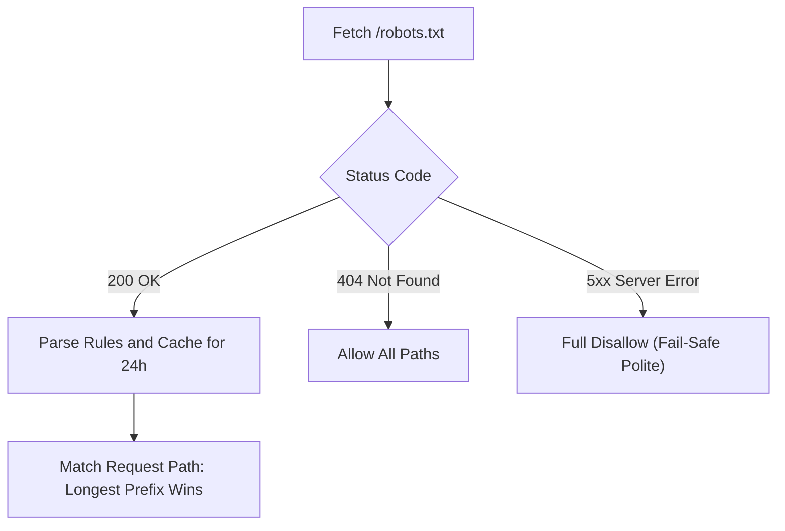

### Parsing Invariants under RFC 9309

A compliant crawler obeys these formal standard rules:

1. **Location and Name**:
   The exclusion file must reside at `/robots.txt` in the root of the URI authority. The filename must be all lowercase.
2. **User-Agent Matching**:
   The crawler matches product-specific product tokens (such as `VRCDiscoveryBot`). If no specific group matches, the crawler falls back to the wildcard group (`User-agent: *`).
3. **Longest Prefix Matching Rule**:
   When both `Allow` and `Disallow` rules match a path, the rule with the longer character length takes precedence:
   - `Allow: /items/free/` (12 characters)
   - `Disallow: /items/` (8 characters)
   - Result: `/items/free/model.json` is allowed.
4. **Cache Lifetime**:
   Crawlers refresh `/robots.txt` entries within 24 hours. If an origin server returns `HTTP 5xx`, the crawler treats the entire site as disallowed until the server recovers.

***

## 6. Anti-Bot Perimeter Mechanics, TLS Fingerprinting, and API-First Ingestion

Digital storefronts protect their servers against automated scraping. Platforms like BOOTH, Gumroad, and Jinxxy use edge Web Application Firewalls (WAFs) and perimeter defense networks[^9].

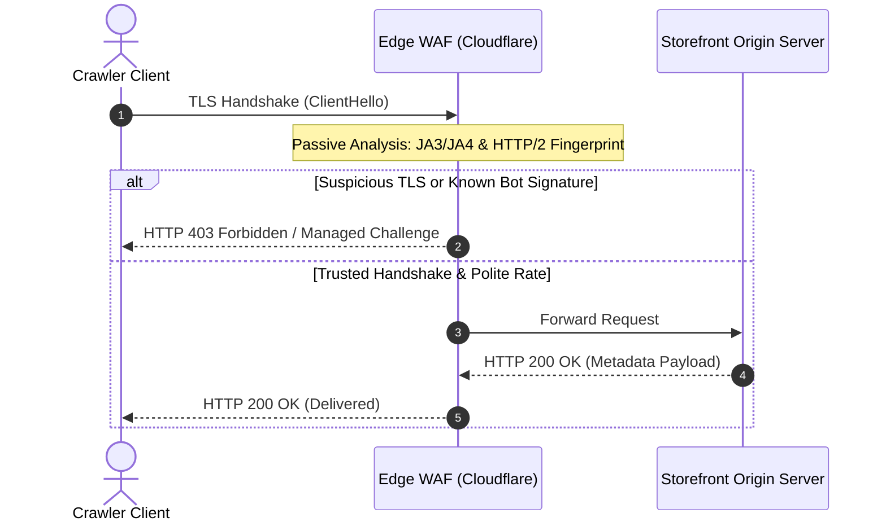

Edge firewalls evaluate incoming connections before the origin web server runs application code. If the firewall flags a client, it serves an `HTTP 403 Forbidden` response or a Cloudflare Managed Challenge.

### Passive Detection: TLS and HTTP/2 Fingerprinting

Early anti-bot systems inspected only HTTP request headers (such as the `User-Agent` string). Modern edge networks identify automated clients passively through transport-layer characteristics[^10].

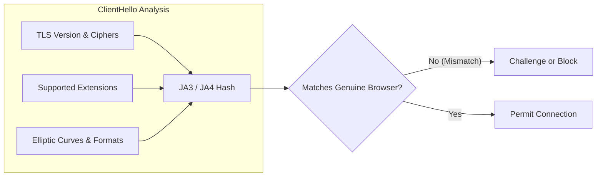

When a client starts an HTTPS connection, it sends a `ClientHello` packet:
- TLS version number.
- Accepted cryptographic cipher suites.
- Extensions and supported elliptic curves.
- Supported point formats.

Security systems hash these parameters into a 32-character string known as a **JA3** or **JA4** fingerprint[^11].

Standard programming libraries (such as Python `requests`, Go `net/http`, or Node.js `https`) emit distinct cryptographic handshakes. If a crawler transmits a Google Chrome `User-Agent` but produces a standard library handshake, the firewall flags the mismatch immediately.

Modern edge firewalls also inspect HTTP/2 connection parameters:
- Header compression settings (`SETTINGS_HEADER_TABLE_SIZE`).
- Stream priority trees and window update intervals.
- Post-Quantum (PQ) key encapsulation mechanisms (such as X25519Kyber768).

Standard headless scripts fail to simulate these subtle network behaviors.

### Headless Browser Fragility and Pass-Through Media Delivery

Deploying headless browsers (such as Puppeteer or Playwright) with stealth plugins creates severe performance and stability bottlenecks[^12]:

| Metric | Headless Browser (Chromium) | Lightweight HTTP Client (API-First) |
| :--- | :--- | :--- |
| **Memory per Task** | 80 to 250 MB | 2 to 5 MB |
| **Execution Latency** | 3,000 to 8,000 ms (DOM execution) | 50 to 300 ms (direct socket read) |
| **Max Concurrency (16GB RAM)** | 40 to 80 pages | 2,000+ parallel streams |
| **Stability** | High crash rate and memory leaks | Stable long-running daemon |
| **Perimeter Evasion Fragility** | Constant breakage on challenge updates | Predictable contract via API keys |

Deploying automated CAPTCHA solvers or proxy rotators to defeat barriers creates severe legal liability under access laws[^13].

### Zero-Binary Media Delivery Versus Hotlink Blocking

Storefront content delivery networks (including BOOTH and Gumroad) actively prevent client direct image hotlinking. They enforce signed HMAC tokens, `Referer` validation, and return `HTTP 403 Forbidden` to external `` elements.

To eliminate media copyright liability and storage overhead, the v0 pre-production architecture enforces a strict **Zero-Binary Metadata Invariant**:
1. The catalog never stores binary images, thumbnails, or BLOB caches in local SQLite (`media_cache` BLOB storage is obsolete and rejected).
2. Outbound media references are stored and served purely as verified origin CDN URLs and deep links.
3. If an optional pass-through media gateway is deployed downstream for clients unable to fetch origin assets directly, it operates strictly in-memory without persistent disk or object storage.

### YouTube Embed Filtering in Observation Adapters

Media extraction parsers frequently observe YouTube iframe or embed links (`youtube.com/embed/`, `youtu.be/`). 

Modern observation adapters (`src/node/observation_adapter.ts`) do strict URI scheme and host classification:
- YouTube embed links are parsed directly into dedicated `youtube_urls` metadata arrays.
- Static preview images are validated and parsed into image URL metadata arrays.
- This clean separation ensures typed metadata delivery without enqueuing HTML video links into image pointer pipelines or attempting native binary image transcoding.

### The API-First Invariant and Zero-Bypass Ethics

Compliant indexers operate on the **API-First Invariant**:
- If an official API exists, the crawler queries that API.
- If an edge firewall presents a challenge barrier, the crawler treats this as a technical refusal of service.
- The crawler never deploys CAPTCHA bypass farms, residential proxy rotators, or memory injection hooks.

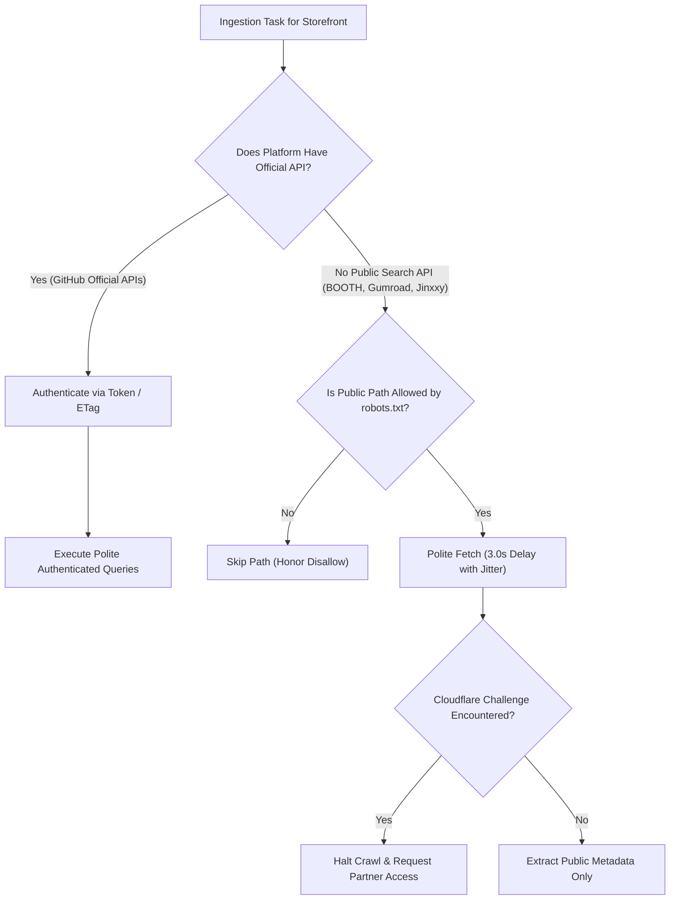

When an indexer encounters a barrier on a closed platform, the engineering team contacts platform administrators or restricts indexing to verified public metadata manifests.

***

## 7. Operational Storage and SQLite WAL Optimizations

A web crawler generates high write traffic. The engine stores URLs, HTTP status codes, response headers, and document payloads.

Traditional relational database servers introduce network latency and connection overhead. For single-node crawlers indexing under one million entities, embedded storage like SQLite gives superior performance when configured correctly[^14].

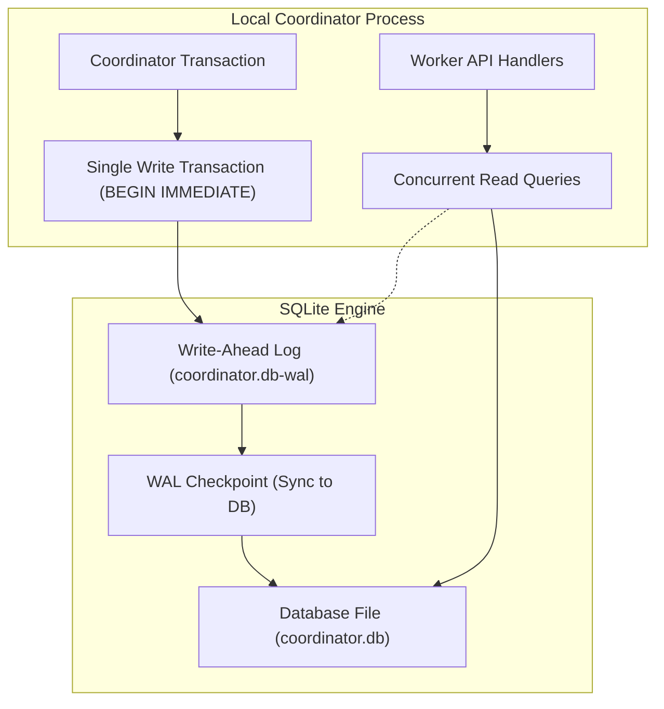

### SQLite Configuration for High Write Throughput

Standard SQLite configurations lock the entire database file during writes. To support high write throughput alongside concurrent query handling, the engine applies these settings:

#### Write-Ahead Logging (WAL Mode)
```sql
PRAGMA journal_mode = WAL;
```
In WAL mode, SQLite writes changes to a separate `-wal` file sequentially. Writers do not block readers, and readers do not block writers[^15].

#### Synchronous Normal
```sql
PRAGMA synchronous = NORMAL;
```
In `NORMAL` mode, the operating system syncs the WAL file during checkpoints rather than on every transaction commit. This reduces disk I/O wait times while keeping database integrity against application crashes.

#### Memory Cache and Page Size
```sql
PRAGMA page_size = 4096;
PRAGMA cache_size = -64000; -- Allocates 64 MB of RAM for cache
PRAGMA temp_store = MEMORY;
```
Storing temporary tables and indices in RAM prevents unnecessary disk churn.

#### SQLite Concurrency and Test Suite Isolation Invariants
In coordinator storage (`src/worker/local_sqlite.ts`), the database sets:
```sql
PRAGMA busy_timeout = 10000;
```
This instructs SQLite to wait up to 10 seconds for locks. 

In version 0 pre-production, automated test suites strictly decouple execution from live databases (`coordinator.db`, `node.db`, or legacy files):
- Use in-memory SQLite instances (`:memory:`).
- Use dedicated ephemeral database files in temporary directories, deleted after the test run.
- Avoid concurrent read/write locks against live application database files during automated test and CI runs.

***

## 8. The CQRS Pattern and Crash Recovery

To protect crawl investments, the database separates raw network observations from derived business projections[^16].

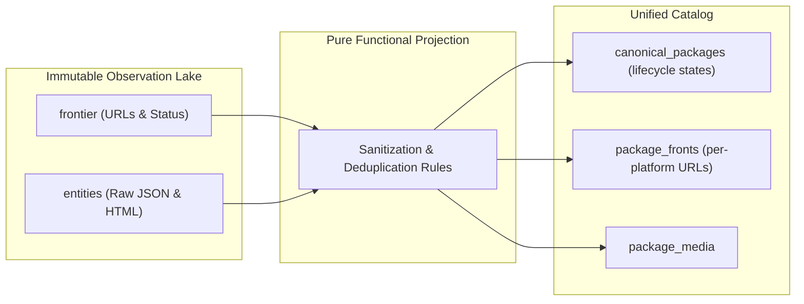

### The Observation Lake Invariant

The crawler treats remote HTTP responses as an append-only event log:
- The `entities` table stores the raw payload, URL, timestamp, and HTTP headers.
- The engine never mutates raw observations.

### Derived Catalog Projections and Schema Unification

The catalog schema projects raw observations into unified relational tables:
- `canonical_packages`: The central deduplicated package entity with lifecycle states (`active`, `quarantined`, `delisted`). Legacy tables (`vetted_entities`, `merged_packages`) are deprecated.
- `package_fronts`: Per-storefront URLs, vendor details, and localized pricing tiers.
- `curator_overrides`: Community and administrative overrides applied dynamically during projection runs.

When developers improve deduplication logic or classification filters, they do not re-crawl the web. They recompute projections directly from raw local observations.

### Process Lifecycle, Coordinator Leases, and Crash Recovery

Crawler and coordinator run as resilient background services that survive network drops, restarts, and interruptions[^17].

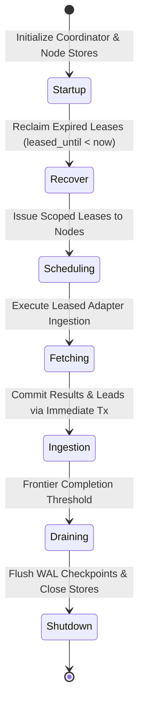

To coordinate work across processes without OS process lock collisions (`ProcessLock`), the coordinator issues bounded-time execution leases:
- Transactions use `BEGIN IMMEDIATE` in `src/worker/local_sqlite.ts` to prevent race conditions during lease claims.
- Each lease carries a bounded duration (`leased_until`) and an opaque lease token.
- Active crawler nodes emit periodic heartbeats to extend leases while tasks execute.

If a crawler node crashes or disconnects, the lease expires automatically. This eliminates deadlocks without manual lockfile cleanup.

When a process halts abruptly, tasks left in `leased` state are reclaimed automatically on startup or during maintenance sweeps:
```sql
UPDATE frontier SET status = 'pending', lease_token = NULL, leased_until = NULL 
WHERE status = 'leased' AND leased_until < datetime('now');
```
This resets orphaned tasks to `pending` without losing frontier history or corrupting database state.

### Structured Log Rotation and Session Archival

Monolithic log appending creates unbounded disk growth. The logging subsystem divides output by session and date:
- Session prefixes: Output streams write to `session_<pid>_<iso>.log`.
- Daily rotation: Log files rotate at UTC midnight.
- Gzip compression: Rotated logs compress asynchronously (`.log.gz`) during idle scheduler intervals.

### Frontier Queue Completion Dynamics

To monitor queue progression, the engine tracks the frontier queue completion ratio:

$$S = \frac{\text{Processed URLs}}{\text{Total Discovered URLs}}$$

Ratio $S$ measures queue draining progression rather than total ecosystem completeness. When the frontier queue drains ($S \to 1.0$), the coordinator halts active leasing and transitions to temporal staleness re-seeding or polite idle polling.

***

## 9. Edge Synchronization and Distributed Catalog Delivery

A centralized crawler engine processes documents and writes structured catalog entities to a local SQLite database. Serving global read queries directly from a single origin server introduces high latency and server load.

To give sub-100ms query latency worldwide, the architecture replicates sanitized catalog projections to a distributed edge network powered by Cloudflare Workers and Cloudflare D1[^18].

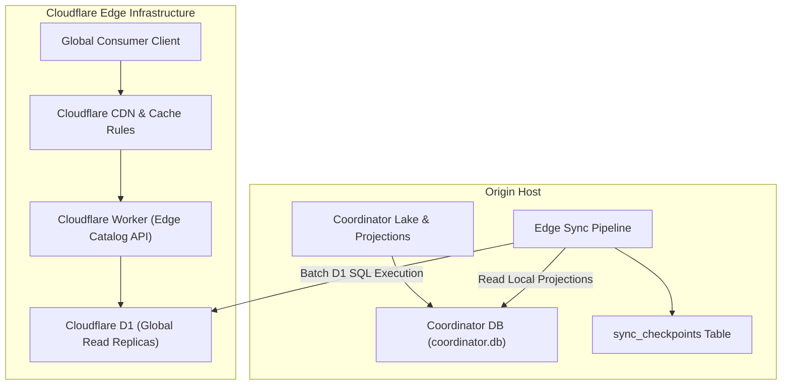

### Monotonic High-Watermark Synchronization Mechanics

Replicating tens of thousands of catalog records across HTTP network boundaries requires efficient incremental tracking. The synchronization pipeline uses a monotonic high-watermark algorithm[^17].

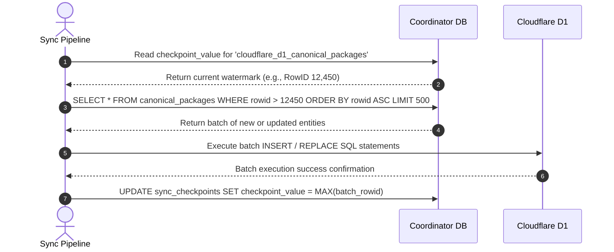

The database persists synchronization state in the `sync_checkpoints` table:
```sql
CREATE TABLE IF NOT EXISTS sync_checkpoints (
    checkpoint_key TEXT PRIMARY KEY,
    checkpoint_value INTEGER NOT NULL,
    updated_at TEXT NOT NULL DEFAULT (datetime('now'))
);
```

By querying records where `rowid > checkpoint_value`, the synchronization utility transfers only newly inserted or modified packages. This reduces bandwidth consumption and API compute units.

### The Full-Wipe Projection Data Loss Pitfall and Recovery

Periodic database sanitation pipelines that execute full-wipe table rebuilds create a critical failure mode in watermark replication:

```sql
DELETE FROM canonical_packages;
DELETE FROM package_fronts;
```

When SQLite executes a full table `DELETE`, it resets auto-incrementing `rowid` sequences back to 1.

The synchronization tool checks whether the local table was wiped:
```typescript
if (watermarkRowId > maxRowInDb) {
  watermarkRowId = 0; // Table was wiped and rebuilt with fewer rows
}
```

If the sanitized catalog is rebuilt with more records than the existing watermark (for example, previous watermark was 10,000 and the rebuilt catalog has 16,500 rows), the condition `10,000 > 16,500` evaluates to `false`.

The synchronization tool assumes it is ahead of the database. It permanently skips rows 1 through 10,000, omitting those records from Cloudflare D1.

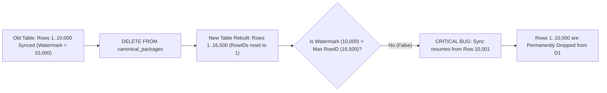

To prevent edge data loss, the system enforces three invariants:
1. **Forced Watermark Reset Flag**: The sync pipeline gives an explicit flag (`--reset-watermark`) to reset checkpoints to 0 after full projection rebuilds.
2. **Deterministic High-Watermark Verification SQL**:
   ```sql
   SELECT MAX(rowid) AS local_max_rowid FROM canonical_packages;
   SELECT checkpoint_value FROM sync_checkpoints WHERE checkpoint_key = 'cloudflare_d1_canonical_packages';
   ```
3. **Deterministic UUID Tracking**: The database architecture migrates from mutable SQLite auto-increment `rowid` keys to deterministic UUIDs or generation epoch numbers.

### Cloudflare CDN Edge Cache Rules

To protect edge database resources, Cloudflare edge proxies enforce five tiered cache rules[^19]:

| Rule | Route Pattern | Edge Cache TTL | Browser TTL | Stale-While-Revalidate | Description |
| :--- | :--- | :--- | :--- | :--- | :--- |
| **Rule 1** | `/api/v1/packages/catalog.json` | 1 hour | 15 minutes | 24 hours | Immutable canonical package feed |
| **Rule 2** | `/api/v1/packages/search*` | 5 minutes | 1 minute | 10 minutes | Dynamic search and query responses |
| **Rule 3** | `/api/v1/media/*` | 7 days | 1 day | 30 days | Ephemeral downscaled thumbnail cache |
| **Rule 4** | `/v1/reports` | Bypass Cache | Bypass Cache | None | Ingestion endpoint for curator reports |
| **Rule 5** | `/v1/opt-out` | Bypass Cache | Bypass Cache | None | Creator opt-out submission endpoint |

These rules make sure read-heavy public catalog queries are served from the Cloudflare edge cache, shielding origin infrastructure from traffic spikes.

### Edge Gateway WAF and Ingress Protection

Edge gateways enforce Web Application Firewall (WAF) rate limits to protect public APIs against distributed scraping and denial-of-service attacks[^20]:
- **Public Search Queries**: Rate limit of 60 requests per minute per IP address.
- **Reporting Endpoints**: Rate limit of 10 requests per minute per IP address.
- **Bearer Token Verification**: All mutations (`POST /v1/reports`) require canonical `API_SECRET_TOKEN` validation. Requests with missing or invalid tokens are rejected at the edge gateway before querying application workers.

***

## References

[^1]: A. Heydon and M. Najork, "Mercator: A scalable, extensible Web crawler," *World Wide Web*, vol. 2, no. 4, pp. 219-229, Dec. 1999.

[^2]: M. Najork and A. Heydon, "High-performance web crawling," Compaq Systems Research Center, Res. Rep. 173, Sep. 2001.

[^3]: D. Peng and F. Dabek, "Large-scale incremental processing using distributed transactions and notifications," in *Proc. 9th USENIX Symp. Operating Systems Design and Implementation (OSDI)*, Vancouver, BC, Canada, 2010, pp. 251-264.

[^4]: J. S. Turner, "New directions in communications (or which way to the information age?)," *IEEE Communications Magazine*, vol. 24, no. 10, pp. 8-15, Oct. 1986.

[^5]: V. Jacobson, "Congestion avoidance and control," in *Proc. ACM SIGCOMM '88 Symp. Communications Architectures and Protocols*, Stanford, CA, USA, 1988, pp. 314-329.

[^6]: J. Cho and H. Garcia-Molina, "The Evolution of the Web and Implications for an Incremental Crawler," in *Proc. 26th Int. Conf. Very Large Data Bases (VLDB)*, Cairo, Egypt, 2000, pp. 200-209.

[^7]: Amazon Web Services, "Exponential Backoff And Jitter," AWS Architecture Blog, 2015. [Online]. Available: https://aws.amazon.com/blogs/architecture/exponential-backoff-and-jitter/

[^8]: M. Koster, G. Illyes, H. Zeller, and L. Sassman, "Robots Exclusion Protocol," IETF Standards Track RFC 9309, Sep. 2022. [Online]. Available: https://www.rfc-editor.org/info/rfc9309

[^9]: Cloudflare Inc., "Cloudflare Bot Management: Comprehensive Protection Against Malicious Bots," Whitepaper, 2024. [Online]. Available: https://www.cloudflare.com/products/bot-management/

[^10]: J. Althouse, J. Atkinson, and J. Atkins, "Open Sourcing JA3," Salesforce Engineering Blog, 2017; and J. Althouse, "JA4+ Network Fingerprinting," Fox-IT / NCC Group, 2023. [Online]. Available: https://github.com/Fox-IT/ja4

[^11]: J. Althouse, "JA4+ Network Fingerprinting," Fox-IT / NCC Group, 2023. [Online]. Available: https://github.com/Fox-IT/ja4

[^12]: Scrapfly Engineering, "Cloudflare Turnstile and Anti-Bot Architecture," Scrapfly Technical Documentation, 2024. [Online]. Available: https://scrapfly.io/docs/scrape-api/anti-scraping/cloudflare

[^13]: U.S. District Court for the Northern District of California, *Meta Platforms, Inc. v. Bright Data Ltd.*, Case No. 3:23-cv-00077-EMC, Jan. 23, 2024.

[^14]: SQLite Development Team, "SQLite As An Application File Format," sqlite.org, 2024. [Online]. Available: https://www.sqlite.org/appfileformat.html

[^15]: SQLite Development Team, "Write-Ahead Logging," sqlite.org, 2024. [Online]. Available: https://www.sqlite.org/wal.html

[^16]: M. Fowler, "CQRS (Command Query Responsibility Segregation)," martinfowler.com, 2011. [Online]. Available: https://martinfowler.com/bliki/CQRS.html

[^17]: M. Kleppmann, *Designing Data-Intensive Applications: The Big Ideas Behind Reliable, Scalable, and Maintainable Systems*, Sebastopol, CA, USA: O'Reilly Media, 2017.

[^18]: Cloudflare Inc., "Cloudflare D1: Serverless SQL Database at the Edge," Cloudflare Documentation, 2024. [Online]. Available: https://developers.cloudflare.com/d1/

[^19]: Cloudflare Inc., "Cloudflare Cache Rules and CDN Caching Architecture," Cloudflare Documentation, 2024. [Online]. Available: https://developers.cloudflare.com/cache/how-to/cache-rules/

[^20]: Cloudflare Inc., "Cloudflare Web Application Firewall (WAF) Rate Limiting," Cloudflare Documentation, 2024. [Online]. Available: https://developers.cloudflare.com/waf/rate-limiting-rules/
