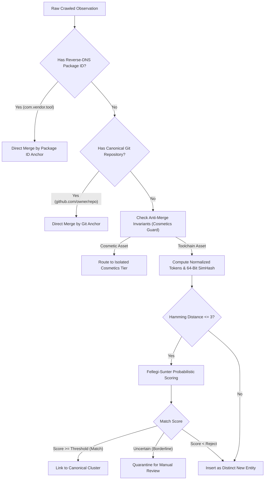
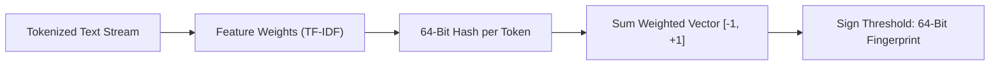
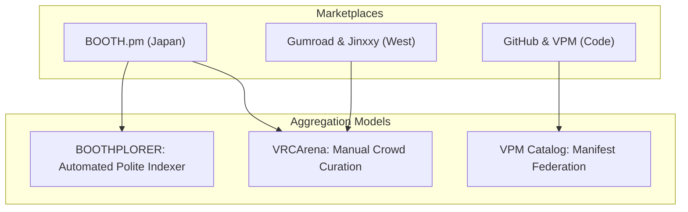
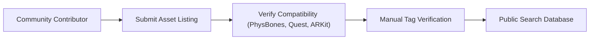
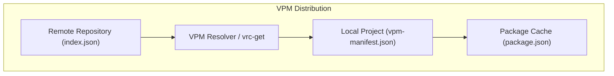

# Entity Resolution, Deduplication, and VRChat Ecosystem Case Studies

This guide explains near-duplicate detection, 64-bit SimHash algorithms, Fellegi-Sunter record linkage, package identity matching, and VRChat discovery architectures.

***

## 1. The Multi-Storefront Entity Disambiguation Problem

In the VRChat ecosystem, developers distribute software packages across multiple platforms simultaneously. A developer can host source code on GitHub, distribute packages through VPM feeds, and sell support tiers on BOOTH and Gumroad.

Naive crawlers create duplicate entries because each storefront uses different URLs, pricing structures, and titles. Authors also add marketing banners and decorative brackets:
- Listing A: `【VRChat / Modular Avatar】Face Tracking Setup v2`
- Listing B: `nadena.dev.modular-avatar (GitHub Release 1.9.2)`
- Listing C: `[Tool] Face Tracking Auto-Setup for Kikyo (Gumroad)`

To unify these listings into a single catalog record, raw observations emitted by node observation adapters (`src/node/observation_adapter.ts`) feed into hierarchical entity resolution[^1].



***

## 2. The Deterministic Anchor Lattice and Schema Deduplication

The engine evaluates candidate links with a strict deterministic priority order:

1. **Primary Anchor: Reverse-DNS Identifier**:
   The VRChat Package Manager mandates reverse-DNS names (such as `com.llealloo.audiolink`, `nadena.dev.modular-avatar`)[^2]. These identifiers are globally unique. Any storefront listing that references this identifier links to that canonical entity.

2. **Secondary Anchor: Canonical Repository URL**:
   When developers link their storefront to an upstream repository, the crawler normalizes the Git URL:
   - Strip `.git` suffixes.
   - Lowercase hostname and path.
   - Strip branch parameters and commit hashes.
   If two listings share the normalized repository URL, the engine groups them together.

3. **Tertiary Anchor: Normalized Title and Author**:
   When machine identifiers are missing, the engine cleans titles:
   - Strip marketing prefixes: `【VRChat】`, `【無料】`, `[Tool]`.
   - Remove emojis, version numbers, and avatar base names.
   - Convert full-width Japanese alphanumeric characters to half-width ASCII.

### Relational Schema Normalization and Field Deduplication

To eliminate architectural debt and column collisions, the unified database eliminates redundant mirrors:
- `canonical_packages` projects canonical metadata without duplicating per-platform URLs across flat columns and JSON arrays.
- `package_fronts` stores platform-specific URL rows, pricing tiers, and vendor links.
- `curator_overrides` coalesces override fields cleanly, deprecating legacy collisions between `name_override` and `title_override`.

***

## 3. Near-Duplicate Document Detection: The 64-Bit SimHash Algorithm

To detect near-duplicate package descriptions and metadata pages, search engines use SimHash[^3].



### SimHash Mathematical Computation

Manku, Jain, and Das Sarma established SimHash as an industry standard for web crawling:
1. Extract features (word tokens) from the document: $f_1, f_2, \dots, f_m$.
2. Compute a 64-bit cryptographic hash for each feature: $h(f_i)$.
3. Assign a weight $w_i$ based on token frequency (TF-IDF).
4. Set a vector $V$ of 64 zeros. For each bit $b \in [0, 63]$:
   - If bit $b$ of $h(f_i)$ is 1, add $w_i$ to $V[b]$.
   - If bit $b$ of $h(f_i)$ is 0, subtract $w_i$ from $V[b]$.
5. Generate the final 64-bit fingerprint:
   - Fingerprint bit $b = 1$ if $V[b] > 0$.
   - Fingerprint bit $b = 0$ if $V[b] \le 0$.

### Fast Hamming Distance Lookup

Two documents are near-duplicates if their fingerprints differ by $k \le 3$ bits.

Comparing a new fingerprint against millions of stored fingerprints takes too long with brute force. Manku et al. solved this with table partitioning:
- Split the 64-bit fingerprint into 4 tables of 16 bits each.
- By the Pigeonhole Principle, if two fingerprints differ by at most 3 bits, at least one 16-bit table must match exactly.
- The engine uses the matching 16 bits as an integer key in a hash table.
- This technique identifies candidates in sub-millisecond time.

### Avatar Cosmetics Collision Risks and Anti-Merge Rules

VRChat assets share identical boilerplate descriptions and compatibility tokens ("Kikyo", "Manuka", "PhysBones", "Unity 2022"). Stripping brackets and formatting causes 64-bit SimHash ($k \le 3$) to falsely merge distinct clothing, hair, or texture packages.

To protect catalog integrity, the engine enforces strict anti-merge invariants:
1. **Toolchain Catalog Isolation**: The engine penalizes apparel (-15 points) and hair (-15 points) to exclude them from toolchain clustering.
2. **Identity Verification**: Two listings with identical SimHash fingerprints do not merge unless they share identical author signatures or matching storefront accounts.
3. **Isolated Taxonomy Tier**: Any future cosmetic indexing requires a separate taxonomy tier with base-avatar associations, air-gapped from developer tools.

***

## 4. The Fellegi-Sunter Probabilistic Linkage Model and Timestamp Rubric

Ivan Fellegi and Alan Sunter created the mathematical foundation for record linkage in 1969[^4].

### Decision Rule

Let $A$ and $B$ represent two records from different storefronts. The engine compares their fields to produce a comparison vector $\gamma$.

The decision rule tests the likelihood ratio:

$$R = \frac{P(\gamma \mid (A,B) \in M)}{P(\gamma \mid (A,B) \in U)}$$

- $M$ is the set of true matches.
- $U$ is the set of true non-matches.

The engine classifies record pairs into three outcomes:
1. If $R \ge T_{\mu}$, the pair is an automatic **Match**.
2. If $T_{\lambda} < R < T_{\mu}$, the pair enters **Quarantine** for human review.
3. If $R \le T_{\lambda}$, the pair is an automatic **Non-Match**.

### String Distance Metrics

For author names and titles, the engine calculates the Jaro-Winkler string similarity[^5]. Jaro-Winkler measures character transpositions while giving higher weight to shared prefixes. A threshold of 0.88 reliably detects creator alias variants while preventing false merges.

### Timestamp Confidence Rubric

Accurate temporal sorting requires unambiguous creation timestamps. The engine assigns `origin_created_at` with a strict three-state confidence rubric:
- `'confirmed'`: The timestamp is read directly from platform metadata (such as GitHub API `created_at` or BOOTH microdata).
- `'inferred'`: The timestamp is derived from the earliest verified release tag, Git commit, or initial archival observation.
- `'unknown'`: Explicitly set to `NULL` with `created_at_confidence = 'unknown'`.

The engine never substitutes local crawl fetch times for missing origin publication dates. Downstream user interfaces handle null dates with explicit sorting semantics (`ORDER BY origin_created_at NULLS LAST`).

***

## 5. Overview of the VRChat Discovery Landscape

The VRChat asset ecosystem spans thousands of independent creators. Marketplace fragmentation separates artists and users across geographic regions:
- Japanese creators distribute character models and accessories primarily on BOOTH.pm[^6].
- Western creators sell avatars, clothing, and systems on Gumroad and Jinxxy[^7].
- Software developers publish open-source shaders, Udon libraries, and Editor tools on GitHub and VPM repositories[^8].



Discovering compatible assets remains complex. A clothing mesh made for the "Kikyo" avatar base does not fit "Manuka" or "Shinano" without modification.

***

## 6. Platform Ecosystem Case Studies

### Case Study 1: BOOTHPLORER

BOOTHPLORER acts as an English-language search directory for BOOTH.pm listings[^9].

- **Scope**: Indexes more than 128,000 items and 2,000 avatar bases.
- **Taxonomy Normalization**: Maps Japanese tag variants (`MA対応`, `PhysBones対応`) to structured search filters.
- **The Zero-Binary Rule**: BOOTHPLORER stores zero 3D models, textures, or `.unitypackage` files.
- **Traffic Redirection**: Every search card routes buyers directly to the creator's BOOTH store page for purchase.
- **Respectful Politeness**: Runs request rates below 0.33 Hz (3 to 5 second delays) with randomized intervals. Honors creator exclusion requests without friction.

BOOTHPLORER gained community trust by acting strictly as a discovery multiplier for creators.

### Case Study 2: VRCArena

VRCArena uses a crowd-sourced curation architecture for VRChat avatar discovery[^10].



VRCArena chose a manual submission model over automated crawlers for specific reasons:
1. **Metadata Noise**: Automated HTML scrapers collect irrelevant marketing slogans and decorative brackets.
2. **Missing Compatibility Flags**: Automated tools cannot inspect 3D files to confirm ARKit face tracking or Quest shader performance.
3. **Piracy Risks**: Automated scraping often ingests stolen or re-uploaded packages from unverified shops.

Both VRCArena and this crawler are open source, and VRCArena's `robots.txt` records `User-agent: * Allow: /`. While RFC 9309 gives operational crawling conventions and decisions such as *Meta Platforms, Inc. v. Bright Data Ltd.* evaluated unauthenticated web access under specific contractual records, the Project does not treat these sources as universal legal authorization.

Deploying an automated HTML DOM scraper against VRCArena remains prohibited for three architectural reasons:
- **Aggregator Fragility**: VRCArena is a secondary curated index linking out to BOOTH, Gumroad, and itch. Scraping rendered HTML parses secondary redirects and stale caches rather than primary source records.
- **Server Load on Community Infrastructure**: Scraping rendered HTML pages imposes unnecessary rendering and bandwidth costs on a volunteer, donor-funded non-profit project.
- **Taxonomy Collisions**: VRCArena centers on avatars and base models (Rexouium, Avali, Kikyo), whereas this crawler is strictly tuned for toolchains and VPM libraries. Ingesting cosmetics without strict isolation triggers SimHash false merges.

The crawler strictly rejects automated HTML DOM scraping. If integration is pursued, the system relies on bilateral open-source API federation or static dataset dumps governed by scoped source-access profiles and typed category filtering.

### Case Study 3: GumRadar

In 2024, developer Girff built GumRadar to analyze discovery signals on Gumroad[^11].

GumRadar studied how Gumroad ranks digital products:
- Gumroad ranks products by sales velocity, review recency, and seller verification status.
- Raw HTML scraping triggered immediate edge blocks.
- GumRadar switched to polite polling of public seller catalog endpoints with exponential backoff.

GumRadar confirmed that monitoring public catalog metadata yields accurate discovery rankings without harvesting private seller data.

### Case Study 4: The VRChat Package Manager (VPM) Federation

The VRChat Package Manager (VPM) distributes software tools, shaders, and runtime libraries[^12].



The VPM standard relies on three machine-readable JSON documents:
1. **`index.json`**:
   The central repository catalog. It lists available packages, version histories, and download URLs.
2. **`package.json`**:
   The package manifest. It specifies dependencies through `vpmDependencies`:
   ```json
   {
     "name": "nadena.dev.modular-avatar",
     "version": "1.10.1",
     "vpmDependencies": {
       "com.vrchat.avatars": ">=3.5.0"
     }
   }
   ```
3. **`vpm-manifest.json`**:
   The project lockfile. It records installed packages and version constraints.

Community tools like `vrc-get` demonstrate that parsing federated `index.json` manifests yields faster, deterministic discovery compared to HTML web scraping[^13]. Modern node observation adapters (`src/node/observation_adapter.ts`) implement this pattern directly, validating manifest listings and build recipes into bounded protocol payloads.

Crawling the unindexed open web for arbitrary `index.json` files without domain-level seed constraints is computationally infeasible. `vpm-manifest.json` is project-local state, not a public feed target. Unbounded web spiders produce high noise, hit bot-walls, and risk infinite spider loops.

The engine rejects open-ended web crawling. Discovery expands strictly through federated registry seeding:
- Parsing approved publisher-hosted community repository listings.
- Extracting VPM repository URLs from verified creator documentation.
- Polling federated index endpoints with conditional HTTP caching.

### Creator Norms and Anti-AI Licensing

VRChat artists include strict licensing clauses in storefront listings[^14]:
- **No Mesh Extraction**: Buyers must not extract 3D sub-components to bypass individual commercial licenses.
- **No Machine Learning Ingestion**: Models, textures, and renders must not enter training datasets for generative artificial intelligence.

Discovery engines must respect these boundaries. Violating creator licensing destroys community goodwill and triggers legal action.

***

## References

[^1]: P. Christen, *Data Matching: Concepts and Techniques for Record Linkage, Entity Resolution, and Duplicate Detection*, Berlin, Germany: Springer-Verlag, 2012.

[^2]: VRChat Inc., "VRChat Package Manager Package Manifest Specification," VRChat Documentation, 2024. [Online]. Available: https://vcc.docs.vrchat.com/vpm/packages/

[^3]: G. S. Manku, A. Jain, and A. Das Sarma, "Detecting Near-Duplicates for Web Crawling," in *Proc. 16th Int. Conf. World Wide Web (WWW)*, Banff, Alberta, Canada, 2007, pp. 141-150.

[^4]: I. P. Fellegi and A. B. Sunter, "A Theory for Record Linkage," *Journal of the American Statistical Association*, vol. 64, no. 328, pp. 1183-1210, Dec. 1969.

[^5]: W. E. Winkler, "String Comparator Metrics and Enhanced Decision Rules in the Fellegi-Sunter Model of Record Linkage," in *Proc. Section on Survey Research Methods*, American Statistical Association, 1990, pp. 354-359.

[^6]: pixiv Inc., "About BOOTH," booth.pm, 2024. [Online]. Available: https://booth.pm

[^7]: Jinxxy, "Introducing Jinxxy Marketplace," Reddit announcement, 2021. [Online]. Available: https://www.reddit.com/r/VRchat/comments/qsc7ws/introducing_jinxxy_marketplace_indexing_for/

[^8]: vrchat-community, "vpm-listing-curated: A curated listing of community VPM packages," GitHub, 2024. [Online]. Available: https://github.com/vrchat-community/vpm-listing-curated

[^9]: BOOTHPLORER, "A directory for VRChat assets on BOOTH," boothplorer.com, 2024. [Online]. Available: https://boothplorer.com

[^10]: The VRCArena Project, "VRCArena Documentation and Curation Standards," vrcarena.com, 2024. [Online]. Available: https://www.vrcarena.com

[^11]: Girff, "I Tracked Gumroad's Hidden Signals - And Built GumRadar," Medium, 2024. [Online]. Available: https://girff.medium.com/i-tracked-gumroads-hidden-signals-and-built-gumradar-to-make-them-visible-9cc4faff8b3c

[^12]: VRChat Inc., "VRChat Creator Companion and Package Management," VRChat Documentation, 2024. [Online]. Available: https://vcc.docs.vrchat.com

[^13]: anatawa12, "vrc-get: An open-source command line tool for VRChat Package Manager," GitHub, 2024. [Online]. Available: https://github.com/vrc-get/vrc-get

[^14]: Automaton Media, "pixiv to tackle the issue of AI art misuse, imitation, data collection," May 2023. [Online]. Available: https://automaton-media.com/en/nongaming-news/20230511-18820/
