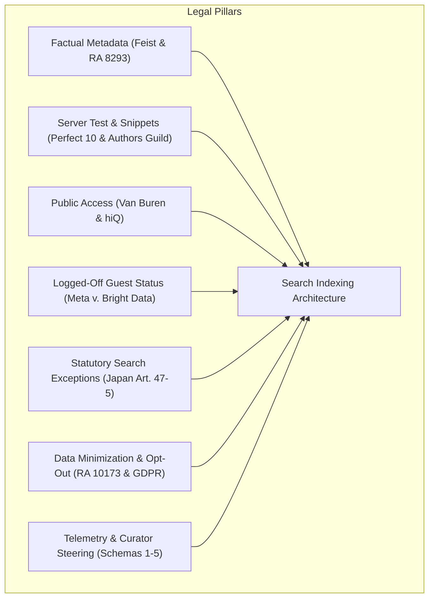
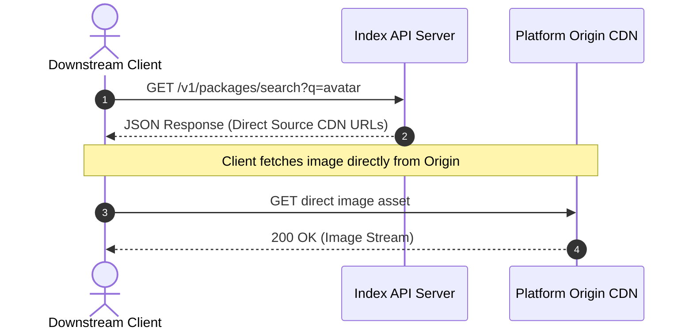
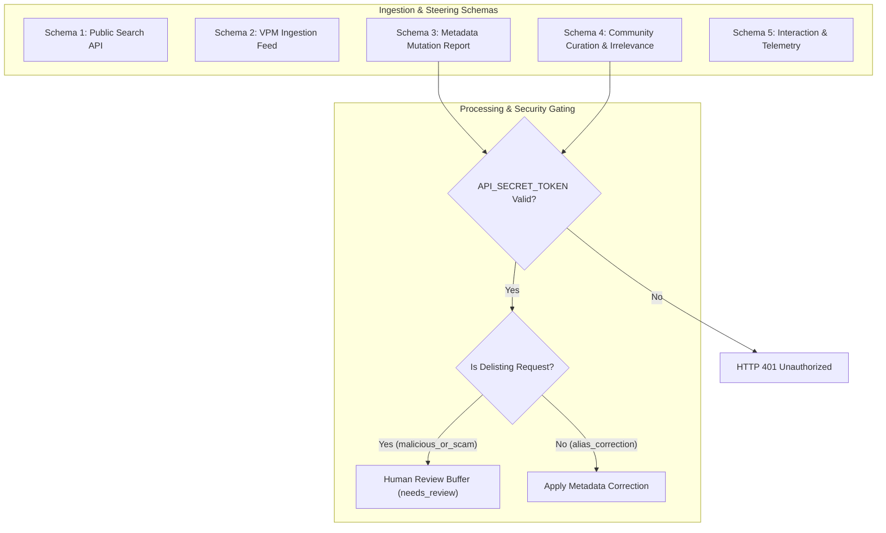
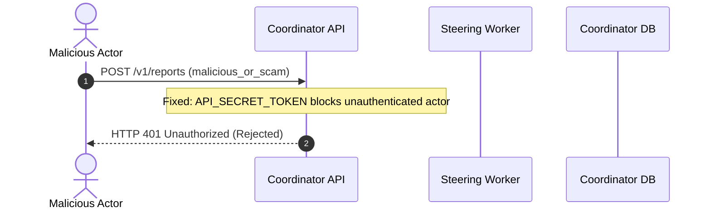

# Legal Jurisprudence, Contractual Assent, Telemetry Governance, and Search Indexing

This guide documents legal precedents, statutory exceptions, contractual frameworks, and telemetry governance for public search engine indexing.

***

## 1. Overview of Legal Foundations and Telemetry Governance

A public search engine does not get prior licenses for the web. It operates under legal exceptions, copyright limits, fair access principles, and responsible data governance.

This volume consolidates legal jurisprudence and operational telemetry governance into six core areas:
1. **Copyright Limits on Factual Metadata**: 17 U.S.C. 102(b), Philippine RA 8293, and the *Feist* doctrine.
2. **Transformative Search and the Server Test**: *Kelly v. Arriba Soft*, *Perfect 10 v. Amazon*, and *Authors Guild v. Google*.
3. **Computer Access and Anti-Hacking Law**: CFAA 18 U.S.C. 1030, *Van Buren*, and *hiQ v. LinkedIn*.
4. **Contract Formation and Logged-Off Access**: *Meta v. Bright Data*, *Register.com v. Verio*, and *Southwest v. Kiwi.com*.
5. **International Search Exceptions**: Japanese Copyright Act Articles 30-4 and 47-5, and EU statutory exceptions.
6. **Data Privacy, Curator Steering, and Telemetry**: Philippine RA 10173, EU GDPR, Schemas 1 through 5, and differential privacy.

***

## 2. Copyright Boundaries: Facts Versus Expression

### The Feist Doctrine and Factual Information
Under United States copyright law (17 U.S.C. 102(b)) and Philippine law (Republic Act No. 8293, Section 175), copyright protection does not cover facts. It does not cover procedures, systems, methods of operation, concepts, or discoveries[^1].

In *Feist Publications, Inc. v. Rural Telephone Service Co.* (499 U.S. 340), the U.S. Supreme Court ruled that raw telephone listings lack copyright protection. An indexer can copy and arrange raw factual data without infringement.

### Application to VRChat Package Metadata
The crawler indexes only objective facts from public web pages:
- Package reverse-DNS identifiers (`com.author.tool`).
- Semantic version numbers (`1.2.3`).
- Upstream prices and currency symbols.
- Platform compatibility flags (`Unity 2022`, `PhysBones`, `Quest`).
- Direct Source Storefront URLs.

Individual factual data elements lack copyright protection. But an original selection, arrangement, or compilation structure receives independent protection (RA 8293, Section 173.2). Creative marketing descriptions, artwork, and character backstories carry copyright protection. The crawler extracts only structured metadata summaries (`og:description`, JSON-LD) and normalized lead sentences to identify package functions. Under *Authors Guild v. Google, Inc.* (804 F.3d 202), short functional search snippets do not substitute for expressive storefront text[^2]. The Project avoids arbitrary character cutoffs that lack statutory basis.

***

## 3. Visual Search Indexing and the Server Test Split

### Transformative Fair Use Precedents
In *Kelly v. Arriba Soft Corp.* (336 F.3d 811), the Ninth Circuit ruled that search engine thumbnails are transformative fair use[^3]. Thumbnails serve as visual pointers to help users locate images. They do not substitute for artistic enjoyment of full images.

In *Authors Guild v. Google, Inc.* (804 F.3d 202), the Second Circuit affirmed that displaying small search snippets is transformative fair use. The search tool helps users find books without creating a market substitute.

### The Ninth Circuit Server Test
In *Perfect 10, Inc. v. Amazon.com, Inc.* (508 F.3d 1146), the Ninth Circuit established the **Server Test**[^4]. A platform displays or distributes a work only if the work is stored on its own computer hardware. In-line linking or routing to third-party image URLs does not create direct copyright liability.

### The Server Test Circuit Split
The Server Test does not apply nationwide. In *Goldman v. Breitbart News Network* (271 F. Supp. 3d 495) and *Nicklen v. Sinclair Broadcast Group* (551 F. Supp. 3d 188), the Southern District of New York rejected the Server Test[^5],[^6]. The court held that framing or embedding an image can violate the display right, even when hosted on a third-party server.

In *Hunley v. Instagram, LLC* (73 F.4th 1060), the Ninth Circuit maintained the Server Test for Instagram embeds, but noted nationwide criticism[^7].

To survive in all jurisdictions, an indexer cannot rely only on the Server Test. It must also ground operations in *Kelly v. Arriba Soft Corp.* transformative fair use:
- The indexer serves as a pure pointer service, delivering direct Source CDN URLs and media links (images, videos, embeds, GIFs) as metadata attachments.
- It avoids storing permanent image binary copies in files or database tables, deprecating local SQLite BLOB caches.
- Interfacing client applications handle caching and rendering under their own operational and legal frameworks.

***

## 4. Computer Access Law and Anti-Hacking Boundaries

### The CFAA Gates-Up Precedent
The Computer Fraud and Abuse Act (18 U.S.C. 1030) penalizes access to protected computers "without authorization" or "exceeding authorized access."

In *Van Buren v. United States* (141 S. Ct. 1638), the U.S. Supreme Court adopted a gates-up versus gates-down test[^8]. A user violates the statute only by accessing areas within a system to which technical barriers block access. Violating a written use policy on permitted areas does not violate the CFAA.

In *hiQ Labs, Inc. v. LinkedIn Corp.* (31 F.4th 1180), the Ninth Circuit applied this rule to public web scraping[^9]. Crawling public websites that have no password walls does not constitute access without authorization under the CFAA.

### The Zero-Bypass Safeguard
The crawler operates strictly on the public web. It obeys these technical boundaries:
- It uses zero password credentials or session cookies.
- It does not bypass CAPTCHA screens or Cloudflare challenges.
- It halts operations immediately when an origin responds with HTTP 403 or 429.
- It treats access barriers as an explicit technical refusal of service.

***

## 5. Contractual Assent and Logged-Off Access

### The Meta Platforms v. Bright Data Precedent
In *Meta Platforms, Inc. v. Bright Data Ltd.* (No. 23-cv-00077-EMC, N.D. Cal. Jan. 23, 2024), the court evaluated logged-off scraping under specific record facts[^10]:
- Meta's Terms of Service bound registered account holders while logged into the platform.
- The court found logged-off scraping of public data did not breach the user agreement under those specific facts.
- Public visitors who never agree to Terms of Service do not form a clickwrap contract.
- But *Bright Data* does not establish a universal legal authorization to scrape public websites. Contractual enforceability depends on specific platform terms and jurisdiction.

### Limits from Southwest Airlines and Register.com
Courts enforce terms against automated crawlers under specific conditions:
- In *Register.com, Inc. v. Verio, Inc.* (356 F.3d 393), repeated queries with actual knowledge of restrictions formed a contract[^11].
- In *Southwest Airlines Co. v. Kiwi.com, Inc.* (N.D. Tex. 2021), Kiwi had actual notice via cease-and-desist letters and agreed to terms during ticket purchases[^12].

As internal risk-reduction measures regarding contractual assent claims, the project adopts these operational practices:
1. **Logged-Out Execution**: The crawler operates strictly in an unauthenticated guest state without personal accounts.
2. **No Commercial Transactions**: The software does not purchase items, execute checkout flows, or register user profiles.
3. **Prompt Delisting**: The Maintainer halts crawling and excludes records from canonical feeds upon receipt of an objection from a platform or creator.

***

## 6. International Statutory Exceptions

### The Japanese Copyright Act (Articles 30-4 and 47-5)
Storefronts like BOOTH.pm operate under Japanese jurisdiction. The Japanese Copyright Act includes explicit search engine exceptions[^13]:
- **Article 30-4 (Data Analysis Exception)**: Allows processing of works for machine data analysis where there is no intent to enjoy creative expression.
- **Article 47-5 (Information Retrieval Exception)**: Allows minor exploitation of works for computerized information retrieval and search engines.
- **The Economic Prejudice Proviso**: Article 47-5 does not apply if exploitation unreasonably prejudices the economic interests of the copyright holder.
- **Contract Separation**: Statutory copyright exceptions do not create affirmative contractual licenses. BOOTH guidelines conditionally permit information-analysis scraping, while reserving restrictions for load, rights harm, or other damage. Common terms and republication still need source-specific review.

The crawler respects this balance:
- It routes all checkout traffic to the original creator on BOOTH.pm.
- It enforces strict rate limits (3.0 to 5.0 seconds per request).
- It preserves creator attribution and store links.

### Philippine Intellectual Property and E-Commerce Law
The maintainer resides in the Republic of the Philippines. Local statutes govern the project:
- **Republic Act No. 8293, Section 175**: Raw data and factual specifications carry no copyright protection.
- **Republic Act No. 8293, Section 173.2**: Original selection, coordination, and schema arrangement in a database receive compilation protection.
- **Republic Act No. 8792 (E-Commerce Act), Section 30**: Supplies liability limitations for online search directories and network intermediaries[^14].

***

## 7. Data Privacy and Statutory Rights

### Statutory Framework (Philippine RA 10173 and GDPR)
Public creator handles, store links, and usernames can constitute personal data under the Philippine Data Privacy Act of 2012 (Republic Act No. 10173) and the EU General Data Protection Regulation (GDPR)[^15].

Where applicable, the project processes this data under the **Legitimate Interest** basis:
- Republic Act No. 10173, Section 12(f).
- GDPR, Article 6(1)(f), where GDPR territorial scope applies under Article 3.

The legitimate interest is package discovery, creator attribution, and community toolchain interoperability, balanced against privacy interests.

### Creator Rights and Delisting Channels
Data subjects have statutory rights to information, objection, access, rectification, and erasure (blocking).

The project supplies three delisting pathways:
1. **Direct Delisting Email**: Creators can email the maintainer with a 48-hour response target.
2. **Non-Scraping Domain Verification**: Creators can add a DNS TXT record (`vrc-opt-out=<vendor-id>`) or a signed Git commit.
3. **Automated API Endpoint**: The server gives an automated delisting interface (`POST /v1/opt-out`).

Matching records change immediately to `lifecycle = 'delisted'` and leave canonical public feeds.

***

## 8. Platform Terms of Service Comparison Matrix

| Platform | Primary Terms Clause | Search Engine Status | Required Pacing | Project Compliance Posture |
| :--- | :--- | :--- | :--- | :--- |
| **BOOTH.pm (pixiv Inc.)** | July 2026 guideline conditionally permits information-analysis scraping; other terms unresolved | Art. 47-5 / 30-4 can apply, not blanket authorization | 1.5s baseline (0.8s to 5.0s adaptive) | No live seed approved; review source profile, robots, and field-level publication. |
| **Gumroad, Inc.** | Terms Section 14(e) | **Search engine exception**: Permits spiders creating searchable indices, excluding caches | 3.0s baseline (2.5s to 12.0s adaptive) | Relies on search index exception, subject to periodic terms review. Excludes binary caches. |
| **Jinxxy Technologies** | Terms Section 8.2 & 23 (unauthorized scraper ban) | No written exception | 1.2s baseline (0.8s to 6.0s adaptive) | **Unresolved Contractual Risk**: Logged-out access, polite pacing, immediate opt-out target. |
| **itch.io (itch corp.)** | Terms Section 3 restricts collecting information about others; robots disallow `/search` | No general catalog access conclusion | 1.5s baseline pacing | No live seed approved; authenticated account API is not an open cross-publisher catalog API. |
| **GitHub, Inc.** | Acceptable Use Policy | API-first policy with archival and research allowances | Token bucket rate limits | Uses official REST and GraphQL APIs; planned conditional ETag validation. |
| **VRCArena** | Open-source community directory; `robots.txt Allow: /` | Directory indexing permitted | API federation only | **Zero HTML DOM scraping**; uses bilateral API or static catalog dumps. |

***

## 9. Telemetry Governance, Multi-Tier Schemas, and Curator Steering

A production search indexer must support bidirectional communication with downstream clients, community curators, and developers. Feedback loops guide crawl priorities, correct metadata misclassifications, and identify broken listings.

The system formalizes interaction through five structured reporting schemas[^16]:

### Schemas 1 Through 5 Specifications

1. **Schema 1: Public Search API Feed**:
   Distributes sanitized package records to downstream desktop applications and search frontends:
   - Unique canonical identifier (`canonical_id`).
   - Package display title, author, and description summary.
   - VPM package details (reverse-DNS name, latest semver, download URLs).
   - Direct outbound creator storefront deep links.

2. **Schema 2: VPM Repository Package Ingestion**:
   Distinguishes published repository listings (`index.json`) from package manifests (`package.json`). A project's `vpm-manifest.json` is not a public repository feed:
   - Package manifests matching official VRChat Creator Companion standards.
   - Dependency trees declared in `vpmDependencies`.
   - Upstream Git release tags and package archive URLs.

3. **Schema 3: Package Metadata Mutation Report**:
   Allows verified package authors and administrators to propose factual corrections:
   - Title, display author, and license overrides.
   - Invariant Git repository associations.
   - Storefront listing links.

4. **Schema 4: Community Curation and Irrelevance Report**:
   Collects community feedback and issue flags:
   - Categorization corrections (e.g., reclassifying misidentified avatar clothing).
   - Compatibility flags (PhysBones, Quest performance).
   - Irrelevance branches (`not_vrchat_related`, `outdated_broken`, `malicious_or_scam`).

5. **Schema 5: Downstream Interaction and Search Telemetry**:
   Collects privacy-preserving aggregated engagement metrics from downstream applications:
   - Aggregate search query keywords.
   - Click-through frequency counts per listing.
   - Bookmark additions and removals.
   - Missing keyword search results to seed future discovery.

### Threat Modeling: Autonomous Delisting Attacks and Secret Drift

Allowing external feedback endpoints to mutate live database records introduces severe security risks[^17]:

- **Secret Drift Vulnerability**: When servers read `const apiToken = config.apiToken || process.env.API_SECRET_TOKEN`, running with unset tokens bypassed authentication checks entirely.
- **Autonomous Delisting Attack**: Anonymous actors could transmit Schema 4 reports with `branch = 'irrelevance'` and reason `malicious_or_scam`. Uninspected steering loops would set `lifecycle = 'delisted'`, purging valid creator packages without human review.

To eliminate this vulnerability, the system enforces:
1. **Canonical Secret Mandate**: The server enforces `API_SECRET_TOKEN` across all environments. Unauthenticated requests receive `HTTP 401 Unauthorized` unconditionally. Legacy variable names are removed.
2. **Human Review Quarantine Buffer (`pending`)**: Destructive lifecycle mutations never execute autonomously. Claims of malice or scams enter a quarantine buffer (`status = 'pending'`) for manual curator review.

### Privacy Preservation in Downstream Search Telemetry

Collecting interaction telemetry must not compromise user privacy. Schema 5 operates under differential privacy principles[^18]:
- **No Personal Identifiers**: Client guidelines exclude usernames, IP addresses, hardware serials, and personal session tokens from application telemetry.
- **Rolling Batch Aggregations**: Downstream clients aggregate search query frequencies over rolling 24-hour windows.
- **Threshold Pruning**: Queries with fewer than 5 occurrences are dropped before transmission. This prevents re-identification through unique search phrases.

***

## 10. Downstream Governance and Mandatory Covenants

Downstream applications that consume API feeds or SQLite databases agree to these covenants:
1. **Mandatory Storefront Attribution**: Applications must display direct links to the original creator storefront on all search cards.
2. **No Commercial Paywalls**: Downstreams must not gate indexed factual metadata behind payment walls.
3. **Functional Snippet Boundary**: Downstreams must display only short functional summaries or normalized lead text. Downstreams must not scrape or redistribute full creative marketing texts.
4. **Privacy-Minimized Application Telemetry**: Downstreams must strip all IP addresses, user accounts, and session tokens from telemetry feeds (Schema 5).
5. **Anti-AI Covenant**: Downstreams must not use exported catalogs, visual hashes, or metadata feeds to train generative artificial intelligence models. This restriction governs Project-distributed outputs and does not claim ownership of underlying facts obtained independently.

### Invariant Checklist for Engineering Review
- [x] Unauthenticated logged-out crawling only.
- [x] Binary package exclusion policy (`.unitypackage`, `.vpmz`, `.zip`, `.blend`, `.fbx`).
- [x] RFC 9309 `robots.txt` compliance with 24-hour directive caching.
- [x] AIMD rate limiting with decorrelated jitter.
- [x] Three-state timestamp rubric (`confirmed`, `inferred`, `unknown` with NULL).
- [x] Direct Source Storefront URL deep-linking on all API endpoints.
- [x] Anti-AI data covenant on exported catalogs and APIs.
- [x] Verified non-scraping delisting pathways with 24 to 48 hour response target.
- [x] Authenticated curator steering with `API_SECRET_TOKEN` and human review quarantine.

***

## References

### Judicial Precedents (United States)
[^1]: U.S. Supreme Court, *Feist Publications, Inc. v. Rural Telephone Service Co.*, 499 U.S. 340, 111 S. Ct. 1282, 113 L. Ed. 2d 358 (1991).

[^2]: U.S. Court of Appeals for the Second Circuit, *Authors Guild v. Google, Inc.*, 804 F.3d 202 (2d Cir. 2015).

[^3]: U.S. Court of Appeals for the Ninth Circuit, *Kelly v. Arriba Soft Corp.*, 336 F.3d 811 (9th Cir. 2003).

[^4]: U.S. Court of Appeals for the Ninth Circuit, *Perfect 10, Inc. v. Amazon.com, Inc.*, 508 F.3d 1146 (9th Cir. 2007).

[^5]: U.S. District Court for the Southern District of New York, *Goldman v. Breitbart News Network, LLC*, 271 F. Supp. 3d 495 (S.D.N.Y. 2018).

[^6]: U.S. District Court for the Southern District of New York, *Nicklen v. Sinclair Broadcast Group, Inc.*, 551 F. Supp. 3d 188 (S.D.N.Y. 2021).

[^7]: U.S. Court of Appeals for the Ninth Circuit, *Hunley v. Instagram, LLC*, 73 F.4th 1060 (9th Cir. 2023).

[^8]: U.S. Supreme Court, *Van Buren v. United States*, 593 U.S. 374, 141 S. Ct. 1638, 210 L. Ed. 2d 26 (2021).

[^9]: U.S. Court of Appeals for the Ninth Circuit, *hiQ Labs, Inc. v. LinkedIn Corp.*, 31 F.4th 1180 (9th Cir. 2022).

[^10]: U.S. District Court for the Northern District of California, *Meta Platforms, Inc. v. Bright Data Ltd.*, No. 3:23-cv-00077-EMC, 2024 WL 245903 (N.D. Cal. Jan. 23, 2024).

[^11]: U.S. Court of Appeals for the Second Circuit, *Register.com, Inc. v. Verio, Inc.*, 356 F.3d 393 (2d Cir. 2004).

[^12]: U.S. District Court for the Northern District of Texas, *Southwest Airlines Co. v. Kiwi.com, Inc.*, No. 3:21-cv-00098, 2021 WL 4952481 (N.D. Tex. Oct. 25, 2021).

### Statutory Authorities
[^13]: Agency for Cultural Affairs of Japan, Copyright Act of Japan, Act No. 48 of 1970, Articles 30-4 and 47-5 (Amended 2018); and Japanese Civil Code, Act No. 89 of 1896, Article 548-2.

[^14]: Republic of the Philippines, Republic Act No. 8293, Sections 173.2 and 175 (1997); and Republic Act No. 8792, Section 30 (2000).

[^15]: Republic of the Philippines, Republic Act No. 10173, Sections 12 and 16 (2012); and European Parliament and Council, Regulation (EU) 2016/679 (GDPR), Articles 3 and 6(1)(f), 2016.

### Standards, Telemetry, and Security Sources
[^16]: VRChat Creator Community, "API Endpoints, Steering Feedback, and Internal Reporting Schemas (Schemas 1-5)," Technical Specification, 2024.

[^17]: OWASP Foundation, "OWASP Top 10 API Security Risks," OWASP Standard, 2023. [Online]. Available: https://owasp.org/API-Security/

[^18]: C. Dwork and A. Roth, "The Algorithmic Foundations of Differential Privacy," *Foundations and Trends in Theoretical Computer Science*, vol. 9, no. 3-4, pp. 211-407, 2014.
