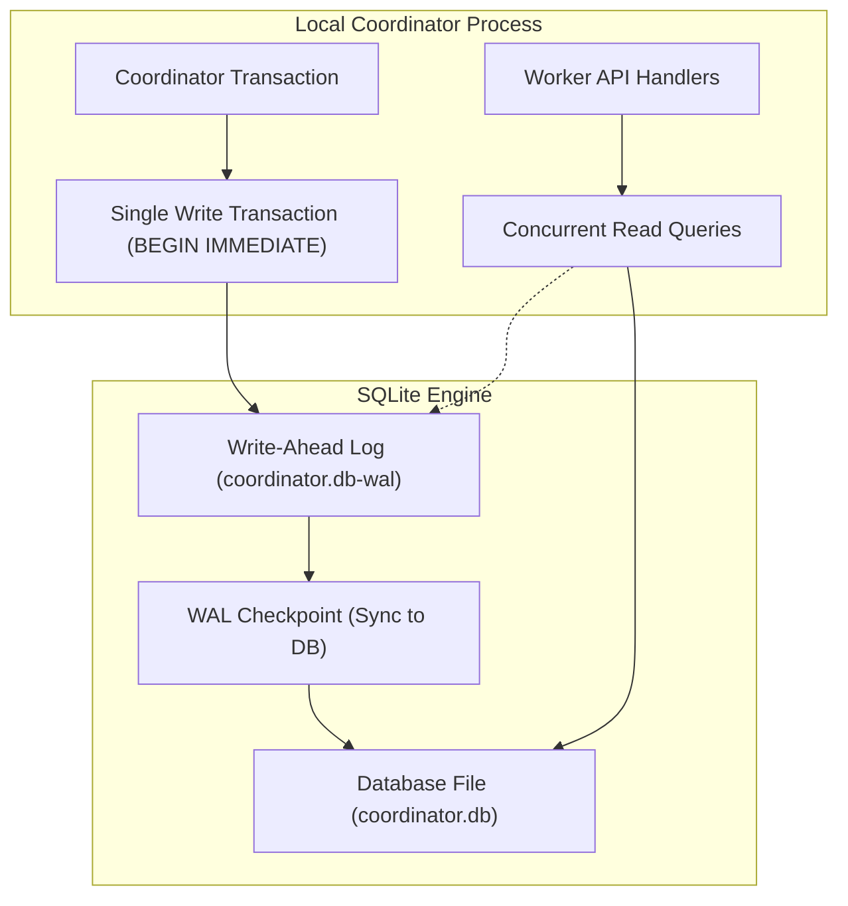
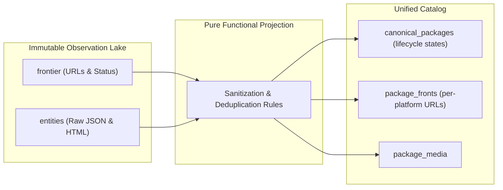
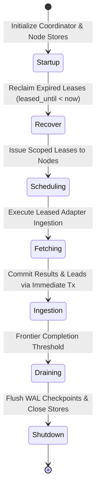

# Operational Storage, SQLite WAL Optimizations, and Fault-Tolerant Crawl Recovery
This guide will detail high-throughput SQLite WAL storage, CQRS raw observation caching, process locks, and crash recovery.

***

## 1. The Storage Challenge in Crawling Systems

A web crawler will generate high write traffic. The engine will store URLs, HTTP status codes, response headers, and document payloads.

Traditional relational database servers introduce network latency and connection overhead. For single-node crawlers indexing under one million entities, embedded storage like SQLite gives superior performance when configured correctly[^1].



---

## 2. SQLite Configuration for High-Concurrency Write Throughput

Standard SQLite configurations lock the entire database file during writes. To support high write throughput alongside concurrent query handling, the engine applies these settings:

### Write-Ahead Logging (WAL Mode)
```sql
PRAGMA journal_mode = WAL;
```
In WAL mode, SQLite writes changes to a separate `-wal` file sequentially. Writers do not block readers, and readers do not block writers[^2].

### Synchronous Normal
```sql
PRAGMA synchronous = NORMAL;
```
In `NORMAL` mode, the operating system syncs the WAL file during checkpoints rather than on every transaction commit. This reduces disk I/O wait times while keeping database integrity against application crashes.

### Memory Cache and Page Size
```sql
PRAGMA page_size = 4096;
PRAGMA cache_size = -64000; -- Allocates 64 MB of RAM for cache
PRAGMA temp_store = MEMORY;
```
Storing temporary tables and indices in RAM prevents unnecessary disk churn.

### SQLite Concurrency and Test Suite Isolation Invariants
In coordinator storage (`src/worker/local_sqlite.ts`), the database sets:
```sql
PRAGMA busy_timeout = 10000;
```
This instructs SQLite to wait up to 10 seconds for locks. 

In version 0 pre-production, automated test suites strictly decouple execution from live databases (`coordinator.db`, `node.db`, or legacy files):
- Use in-memory SQLite instances (`:memory:`).
- Use dedicated ephemeral database files in temporary directories, deleted after the test run.
- Avoid concurrent read/write locks against live application database files during automated test and CI runs.

---

## 3. The CQRS Pattern: Raw Observation Lake Versus Derived Projections

To protect crawl investments, the database will separate raw network observations from derived business projections[^3].



### The Observation Lake Invariant
The crawler will treat remote HTTP responses as an append-only event log:
- The `entities` table will store the raw payload, URL, timestamp, and HTTP headers.
- The engine will never mutate raw observations.

### Derived Catalog Projections and Schema Unification
The catalog schema will project raw observations into unified relational tables:
- `canonical_packages`: The central deduplicated package entity with lifecycle states (`active`, `quarantined`, `delisted`). Legacy tables (`vetted_entities`, `merged_packages`) are deprecated.
- `package_fronts`: Per-storefront URLs, vendor details, and localized pricing tiers.
- `curator_overrides`: Community and administrative overrides applied dynamically during projection runs.

When developers improve deduplication logic or classification filters, they will not re-crawl the web. They will recompute projections directly from raw local observations.

### Edge Sync Watermark Recovery and Full-Wipe Projection Risks
Periodic projection scripts that execute `DELETE FROM canonical_packages` reset SQLite auto-incrementing rowids to 1.

In edge delta synchronization pipelines, watermark resets trigger if the stored watermark exceeds the maximum row ID in the table (`watermarkRowId > maxRowInDb`). If a table is rebuilt with more rows than the previous watermark, the reset check fails. The synchronization tool will skip rows 1 through the watermark, silently dropping packages from Cloudflare D1.

To prevent edge data loss:
- The sync pipeline provides an explicit forced reset option (`--reset-watermark`).
- Production verification checks ensure watermark row alignment with remote D1 before completing sync sweeps.
- Projections migrate to deterministic UUID keys or projection epoch counters instead of mutable auto-increment row IDs.

---

## 4. Process Lifecycle, Coordinator Leases, and Crash Recovery

Crawler and coordinator run as resilient background services that survive network drops, restarts, and interruptions[^4].



### Coordinator Leases and Heartbeat Expiry
To coordinate work across processes without OS process lock collisions (`ProcessLock`), the coordinator issues bounded-time execution leases:
- Transactions use `BEGIN IMMEDIATE` in `src/worker/local_sqlite.ts` to prevent race conditions during lease claims.
- Each lease carries a bounded duration (`leased_until`) and an opaque lease token.
- Active crawler nodes emit periodic heartbeats to extend leases while tasks execute.

If a crawler node crashes or disconnects, the lease expires automatically, eliminating deadlock without manual lockfile cleanup.

### Crash Recovery Invariant
When a process halts abruptly, tasks left in `leased` state are reclaimed automatically on startup or during maintenance sweeps:
```sql
UPDATE frontier SET status = 'pending', lease_token = NULL, leased_until = NULL 
WHERE status = 'leased' AND leased_until < datetime('now');
```
This resets orphaned tasks to `pending` without losing frontier history or corrupting database state.

### Structured Log Rotation and Session Archival
Monolithic log appending creates unbounded disk growth. The logging subsystem divides output by session and date:
- Session prefixes: Output streams write to `session_<pid>_<iso>.log`.
- Daily rotation: Log files rotate at UTC midnight.
- Gzip compression: Rotated logs compress asynchronously (`.log.gz`) during idle scheduler intervals.

### Frontier Queue Completion Dynamics
To monitor queue progression, the engine tracks the frontier queue completion ratio:

$$S = \frac{\text{Processed URLs}}{\text{Total Discovered URLs}}$$

As established in system architecture reviews, $S$ measures queue draining and processing progression rather than total ecosystem completeness. When the frontier queue drains ($S \to 1.0$), the coordinator halts active leasing and transitions to temporal staleness re-seeding or polite idle polling.

***

## References

[^1]: SQLite Development Team, "SQLite As An Application File Format," sqlite.org, 2024. [Online]. Available: https://www.sqlite.org/appfileformat.html

[^2]: SQLite Development Team, "Write-Ahead Logging," sqlite.org, 2024. [Online]. Available: https://www.sqlite.org/wal.html

[^3]: M. Fowler, "CQRS (Command Query Responsibility Segregation)," martinfowler.com, 2011. [Online]. Available: https://martinfowler.com/bliki/CQRS.html

[^4]: M. Kleppmann, *Designing Data-Intensive Applications: The Big Ideas Behind Reliable, Scalable, and Maintainable Systems*, Sebastopol, CA, USA: O'Reilly Media, 2017.
