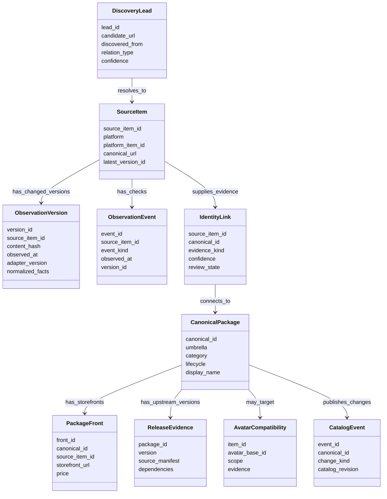
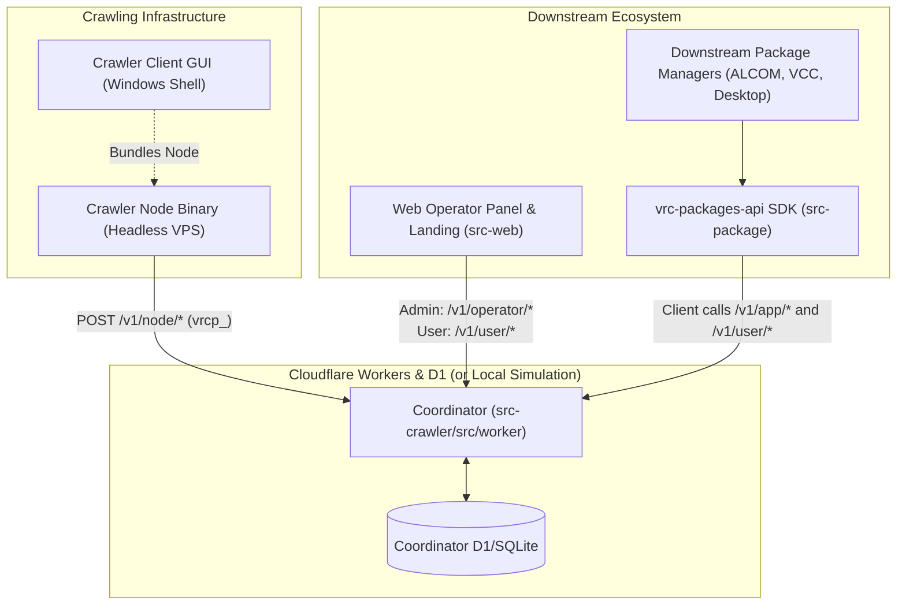
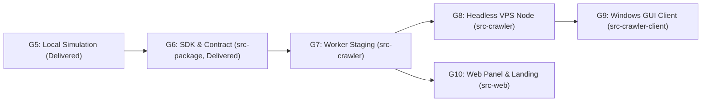

# Implementation plan: capability gates toward the canonical catalog

> **Status:** Staged implementation baseline derived from the owner's comments in `DIRECTION.md` on 2026-09-27. This is a work plan, not a claim that the capabilities exist. `DIRECTION.md` retains the owner's wording and unresolved choices. The owner selected a fully local coordinator simulation with real-source node ingestion and Worker-portable code. No Cloudflare account setup is part of the current milestone. The crawler node remains a standalone binary for VPS or desktop use. The new coordinator starts with a fresh database. `bin/crawler_state.db` is prototype evidence for read-only tests and dry runs, not an automatic migration source. All seven current drivers are enabled by default in local development, subject to source-specific access checks before a live run.
>
> **Release rule:** A gate closes only when its observable acceptance conditions pass on production code paths. The historic completion of Phases 1–4 remains recorded. Any new defect is tracked against a current capability gate.

**Current G3/G5 checkpoint (2026-09-28):** The seven original capabilities remain selected by default. An eighth `shopify` capability now has only a coordinator-leased, bounded product-sitemap discovery path. It creates pending same-origin product leads under a separate scoped profile and robots/lease checks. It has no approved merchant, product metadata parser, auto-queue promotion, or live smoke. Selecting a capability grants no fetch authority.

## 1. Product decisions now driving the work

| Decision | Implementation consequence | Remaining qualification |
| --- | --- | --- |
| `canonical_packages` is the final accepted, deduplicated catalog bucket | Keep one public catalog identity. Add an umbrella field with **Tools**, **Assets**, and **Avatars**, plus category-specific subtype data and relationships. | Research the vocabulary against a labeled sample. Platform tags are evidence, not the taxonomy itself. |
| Tools include world/avatar creation tools, scripts, VPM/UPM, and VRChat-specific standalone desktop/runtime applications; Assets include shaders, props, models, gimmicks; Avatars include bases and cosmetics | Discovery and classification can use umbrella-specific paths. But all accepted items reach the same final catalog. A desktop application is an item kind, not a source platform or automatically a VPM package. | Some items cross umbrellas. Define multi-label and related-product handling rather than silently choosing one or merging an app with its Unity/VPM integration. |
| VRChat-targeted desktop/runtime tools get a distinct catalog category tag within **Tools** | Use a provisional `vrchat-desktop-tool` tag with evidence-backed subtypes. Do not create a fourth umbrella or an eighth source driver merely for desktop software. Require a specific VRChat focus, not generic VR/OSC compatibility or a keyword hit. | Confirm the final public tag name and subtype vocabulary in the G4 labeled corpus. Generic VR utilities remain leads unless publisher evidence shows a specific VRChat target. |
| Cosmetics and avatar bases are in scope | Replace blanket asset rejection with an umbrella-aware decision tree. Record avatar compatibility and universal applicability. | Humanoid/furry and named avatar bases require an evidence-backed vocabulary. |
| Broad discovery is a goal | Admit curated lists, dependencies, creator links, search results, and manifests as typed leads. | Each lead still needs a supported source and evidence before publication. |
| Source coverage is not closed at the present seven drivers | Track newly found directories and storefronts as typed candidates. Do not equate a community search index with a publisher storefront or an in-game avatar index. Add Shopify-hosted merchant fronts and possible custom-domain catalog fronts to the G3/G4 source/identity work without treating all custom domains as Shopify or first-party. | Nexyy, Payhip, Sellfy, avtr.zip, Shopify merchants, and independently operated catalog fronts have different roles and open access/identity questions. See [`docs/research/markets/ADDITIONAL_MARKET_SOURCE_RESEARCH.md`](../research/markets/ADDITIONAL_MARKET_SOURCE_RESEARCH.md). |
| Historical changes and an event log are wanted | Store a new source version only when meaningful content changes. Log each fetch/check and state transition without duplicating unchanged payloads. | Full raw-content retention and deletion exceptions need source-specific research. |
| The project indexes and links to authoritative VPM repositories | Preserve upstream package IDs, versions, dependencies, and repository URLs as evidence. Do not fabricate installable releases. | Decide whether `/v1/vpm/index.json` has any valid role after this change. |
| All seven current drivers are selected by default for local development | Keep source policy evaluation separate from driver selection. A driver can be selected yet unable to issue live requests until its access profile permits them. The reason must be visible. | Permission is being pursued for Jinxxy. [Terms §§8.2 and 23](https://jinxxy.com/terms-of-service) address automated access and systematic directory-building. The documented [Creator API](https://support.jinxxy.com/hc/en-us/articles/28052364650637-How-can-I-access-the-Creator-API) is store-scoped rather than a documented public catalog interface. Resolve public-discovery scope. Do not treat default selection or the Creator API as authorization. |
| The new coordinator starts with an empty database | Do not auto-migrate prototype records or preserve their identifiers as authoritative. Use `bin/crawler_state.db` read-only for schema comparison and controlled replay fixtures. | A future explicit import is optional, with a mapping and provenance review first. |
| Distributed crawler nodes and a Cloudflare coordinator are the intended destination | Define node/job/result contracts early. Run the coordinator and catalog locally first, using real source data through the nodes. | Cloudflare storage/coordination choices follow a workload and limits spike. No live Cloudflare setup now. |
| Capability gates replace a simple Phase 5 percentage | Make dependencies, exit tests, and open research visible. Map old Phase 5 tasks into gates. | Retain historical task IDs as references, not as the new order of execution. |

**Status of this table:** The first column reflects the owner's comments. The second column is the proposed implementation translation. A research qualification remains open even when the product direction is settled.

## 2. Logical data flow and ownership

The diagram is a logical class map. Table names and exact columns are proposed and can change after the Gate 2 schema spike.

### 2.1 Data logistics rules

1. A lead gives a reason to inspect a destination. It is never proof that copied title, price, or version is correct. Store the source and relation type of the lead for later source ranking.
2. A source item represents one upstream listing, manifest, repository, or product. It has a stable source identity even when URL, title, or fetched representation changes.
3. On a successful fetch, normalize meaningful fields. Compute a digest over canonical serialized content and compare it to the latest version. A hash identifies a change. It does not compress or replace the historical payload. Insert a version when content changes. Record a lightweight check event for unchanged content, `304`, errors, challenges, and policy blocks.
4. In one transaction, insert the changed version or event. Advance `SourceItem.latest_version_id`. The latest pointer can change. Historical version rows remain intact under the applicable retention policy.
5. The final `CanonicalPackage` uses a stable opaque ID for non-VPM items. Preserve upstream VPM identifiers and previous aliases separately. Keep a merge and split history so operators can reverse a mistaken match without reusing IDs.
6. Similarity methods, including SimHash and pHash, propose identity links. Publication requires stronger signals appropriate to the umbrella: upstream package ID, creator-declared cross-link, matching source repository, or reviewed storefront relationship. Visual similarity alone cannot attach a BOOTH front to an unrelated VPM package.
7. `PackageFront` remains relational internally because each storefront has its own URL, price, availability, and update history. The API can serialize fronts as a JSON array inside a canonical package. Storing `platforms_json` as a second authoritative store would cause drift.
8. Avatar bases are canonical items. A cosmetic or tool can relate to zero, one, or multiple bases. The value `universal` is an explicit compatibility scope, not an avatar name. Compatibility claims retain source and uncertainty.
9. `ReleaseEvidence` comes from real upstream VPM manifests or other verified release sources. The catalog can display version history while linking users to the origin repository. It must not synthesize `1.0.0` to make an index look like a package repository.
10. Opt-out creates a crawl exclusion and a public suppression event immediately. Observed disappearance or repeated `404` creates a lifecycle review or archived state by policy. History retention or deletion is resolved separately from public suppression. Downstream consumers receive a tombstone either way.
11. A projection is the currently published interpretation of evidence. The owner can call this the *canonical catalog view* in public documentation. Replay or rebuild is needed only when taxonomy, identity links, overrides, or source policy changes. Ordinary crawls update affected catalog items incrementally.
12. The local export is a test and isolation product unless a separate consumer need is accepted. The canonical publication path is the API or edge catalog. One typed contract must generate or validate both outputs.

Catalog deltas must be driven by a monotonic `CatalogEvent` sequence. It covers additions, updates, front changes, merges, splits, and tombstones. A catalog **generation** changes only when an incompatible replay or reset requires every consumer to reload. A normal projection run with no changed output must not create a new generation. This avoids relying on SQLite row IDs that can be reused after rebuilds.

For creator delisting, the owner prefers the API with bio or product-description token verification. Signed Git commits are removed from the target workflow unless a separate need emerges. A verified opt-out blocks future crawl jobs, not just public display. Do not treat a missing product as a creator request: require source-specific evidence and repeated checks before marking it delisted. The historical record remains private unless a reviewed deletion obligation applies.

Origin publication time can be **confirmed** by the source or **inferred** from related evidence such as a release, image, or video. Preserve the evidence and confidence level. `observed_at` and the time the canonical catalog last changed remain separate. This allows consumer applications to sort without mistaking crawl time for original publication time.

### 2.2 Field transformation example

| Input | Stored evidence | Catalog decision | Public field |
| --- | --- | --- | --- |
| Storefront page title | Source item version with URL and timestamp | Clean display name; record cleanup rule and version | `displayName` |
| VPM manifest ID and version | Verified package/release evidence | Link to stable canonical item if identity signals pass | `vpmId`, available versions, origin repository link |
| Storefront price | Time-stamped front evidence | Keep price on that front; do not overwrite prices on other fronts | `fronts[].price` |
| Avatar compatibility claim | Creator/platform text or structured tag with source | Normalize avatar alias; mark named, universal, or uncertain | `compatibility[]` |
| Description body | Source text and parsed segments, subject to source retention policy | Extract description apart from headers, dividers, links, and boilerplate; produce public summary under reviewed policy | `summary` and origin link |
| User feedback | Report with application identity and trust state | Suggest, review, or apply an override according to an explicit authority rule | Revision plus visible provenance where appropriate |

## 3. Capability gates and order of work

The gates are ordered by dependency. Research tasks can run while earlier implementation proceeds. But a gate cannot close with an unresolved decision that changes its schema or public behavior.

| Gate | Deliverable | Main work | Exit evidence |
| --- | --- | --- | --- |
| **G0 — Decision baseline** | Accepted product vocabulary and contract map | Incorporate owner comments into explicit decisions. Define Tools, Assets, Avatars, source tiers, node, operator, application identities, and document roles. Audit architectural disagreements and defect claims in `DIRECTION.md` §15 against current split-driver files. Link all current FIXMEs via `docs/scratch/decisions/current/FIXME_GATE_MAP.md` (28 on 2026-09-27) to gate work. | Owner-readable decision record. Every current discrepancy marked open, resolved, or stale. No contradictory active Phase 5 instructions. |
| **G1 — Safe current operation** | Reliable single-node baseline | Remove default admin secret. Correct recrawl exclusions. Centralize challenge and 429 outcome handling. Handle opt-out redirects with per-hop SSRF checks. Stop unused WebP work. Fix `media_id` absence. Make tests hermetic. | Missing secret cannot authorize protected routes. Blocked or opted-out URLs stay blocked after recrawl. Challenge never becomes product data. 429 respects bounded backoff. Compiled smoke tests pass. |
| **G2 — Data logistics** | Versioned source evidence and stable catalog identity | Define schema and relationship diagram. Choose DB abstraction after a small spike. Introduce source items, change-only versions, events, identity links, catalog revisions, fronts, compatibility, and tombstones. Separate public summaries from source text. | Change, unchanged, deleted, renamed, merged, and split fixtures replay correctly. One changed item produces one version and one catalog delta. No wrong storefront merge occurs in the labeled corpus. |
| **G3 — Adapter and discovery contracts** | Narrow, testable platform adapters | Shared driver runtime, fetch interface, parser primitives, validation, lead graph, source-specific access profiles, dependency traversal, creator links, and curated-list source tracing. For VPM, distinguish published listings, package manifests, build recipes, and project-local state. Quarantine malformed releases with diagnostics rather than silently dropping a source or publishing partial truth. Research VRChat-specific standalone applications through approved publisher metadata paths without treating "desktop" as a crawl host or assuming VPM/Unity distribution. | Same fixtures produce typed leads and observations for all drivers. No adapter writes catalog tables directly. Ambiguous links remain leads. Source switches work per profile. Project `vpm-manifest.json` is never a public seed. Desktop-app evidence is not coerced into VPM releases. |
| **G4 — Classification and publication** | Unified catalog under three umbrellas | Empirical taxonomy corpus. Umbrella-specific classifier and deduplication policy. Avatar-base aliases and compatibility. Real VPM version evidence. Source field ranking. Incremental public catalog, fronts, and epoch-aware deltas. Include standalone VRChat applications and their optional integrations in the labeled corpus. | Representative multilingual tools, assets, and avatars classified with measured errors. Cosmetic or tool and desktop-app or integration false merges rejected. API and export agree on the same catalog revision. Consumers recover after reset. |
| **G5 — Local coordinator simulation** | Local Worker-like coordinator plus two or more standalone crawler nodes | Define registration, per-driver capability grants, job pull or lease, origin pacing, idempotent result submission, heartbeat, credential rotation or revocation, and delisting propagation. Run against local SQLite and in-memory services first. Then ingest permitted real-source observations. Every node and coordinator exchange uses the same versioned API payload schema and runtime validation as a web request, including in-process tests. | Concurrent nodes never exceed the configured rate of an origin. Revoked or wrong-scope tokens fail. Duplicate result submissions do not duplicate evidence. Coordinator loss stops new fetches. Delisting blocks all nodes. The node binary runs without Cloudflare credentials. Malformed or wrong-version payloads fail identically in-process and over loopback HTTP. |
| **G6 — Worker portability and local release conformance** | Worker-compatible core plus local production-like evidence | Keep coordinator request/response and storage interfaces free of Bun-only or Node-only imports. Supply local adapters. Check a Worker build. Measure likely Cloudflare limits and costs. Rebuild target docs and separate implementation conformance evidence. Actual Cloudflare staging is deferred until the owner opts in. | Local end-to-end tests meet G5, compiled node tests, database recovery, cursor reset, source switches, and documented runbook. Worker build check passes. `LEGAL.md` target clauses have corresponding conformance states. Cloudflare deployment is not required for this gate. |

The present process lock protects local duplicate starts when a node runs as a single instance. Gate 5 verifies that the lock protects local duplicate starts, while leases protect the distributed origin from excess requests. These mechanisms solve different problems.

The owner's updated local pre-production exit target requires **two binaries, two process-specific configs, two local databases, and loopback API communication** while ingesting reviewed real sources. The current coordinator/node smoke proves separate processes, two versioned non-secret launch-directory configs, and schema-validated loopback traffic. It does not prove the full artifact topology. Top-level `node/main.ts` and `worker/main.ts` load their own configs. But node database ownership and implementation remain open. Authenticated operator API issuance is only a local credential-bootstrap slice, not a remote registration trust flow. Keep Cloudflare deployment and its account keys outside this gate. Migrate the desired `src-crawler/`, `worker/`, and `node/` layout by import/build/test slices rather than a single repository move. Defer `src-web/` until coordinator and node contracts are stable. See `DIRECTION.md` §1.5 and the owner questions in `docs/scratch/decisions/DEFERRED_OWNER_DECISIONS.md`.

### 3.1 Core Invariants Established by Gates G0–G5

1. **Origin Lease Scheduler**: Nodes cannot fetch without an unexpired coordinator lease (`POST /v1/node/jobs/claim`). Origin politeness floors (`min_delay_ms`) are enforced globally.
2. **Fail-Closed Availability**: Coordinator loss immediately halts all node fetching; nodes never generate uncoordinated requests.
3. **Source Access Authorization**: Every URL requires an active `SourceAccessProfile` before robots preflight and before lease claim.
4. **RFC 9309 Robots Compliance**: Robots rules are evaluated against cached 24-hour snapshots with DNS pinning.
5. **Capability-Encoded Credentials**: Node tokens (`vrcp_<64-hex><4-hex>`) encode permitted platform capabilities in their 4-hex bitmask suffix. Claims for unpermitted capabilities are rejected.
6. **Zero-Knowledge Token Persistence**: All tokens (node, app, registrant) are stored strictly as SHA-256 hashes (`token_hash`) and never re-exposed.
7. **Append-Only Observation Digest**: New `source_versions` rows are created only when normalized observation digests change; unchanged fetches record lightweight check events.
8. **Monotonic Event Sequence**: Catalog deltas follow a monotonic event stream preserving catalog generation epochs across consumer syncs.

## 8. Historical code change priorities delivery status (audited 2026-10-01)

The foundation priorities reflecting workforce distribution, capability-encoded node tokens, downstream sampling, and delisting have been delivered and verified on the clean-slate baseline (**269 passing tests across 31 files**):

| Priority | Focus Area | Gate | Scope & Tasks | Status | Evidence |
| :--- | :--- | :--- | :--- | :--- | :--- |
| **P1** | **API Specification Alignment** | G5/G6 | Aligned candidate specifications (`SPECIFICATION_CRAWLER_NETWORK.md`, `SPECIFICATION_CRAWLER_CLIENT.md`, `SPECIFICATION_WEBSITE.md`, `API_ROUTES.md`) with authoritative wire routes. | **COMPLETED & VERIFIED** | `docs/source/` docs |
| **P2** | **Public Consumer Catalog Endpoints** | G4/G6 | Implemented unauthenticated public catalog read routes (`GET /v1/catalog`, `GET /v1/catalog/delta`) on `LocalCoordinatorStore` and D1 `Coordinator` with cursor/epoch preservation. | **COMPLETED & VERIFIED** | `public_handler.ts`, 269 tests |
| **P3** | **Capability-Encoded Node Tokens & Workforce Balancing** | G5 | Implemented workforce distribution logic and capability encoding in `vrcp_<auth_token><capability>` (73 chars). Enforced capability matching at lease claim time. | **COMPLETED & VERIFIED** | `workforce_distribution.test.ts` |
| **P4** | **Downstream Registration, Search & Feedback Signals** | G4/G6 | Implemented downstream app registration (`/v1/apps/register`), search (`/v1/catalog/search`), random sampling (`/v1/catalog/random`), and demand feedback ingestion (`/v1/apps/feedback`). | **COMPLETED & VERIFIED** | `downstream_handler.ts` |
| **P5** | **Creator Delisting & Takedown Routes** | G1/G2 | Added registrant-authenticated delisting and unauthenticated proof-gated opt-out routes (`/v1/registrant/delist`, `/v1/delist`) with `creator_opt_outs` logging and immediate queue suppression. | **COMPLETED & VERIFIED** | `registrant_handler.ts`, `local_sqlite.ts`, D1 |

---

## 9. Architectural Vision & Subsystem Boundaries

The version 0 pre-production system consists of five distinct components:

1. **Coordinator (`src-crawler/src/worker/`)**:
   - Central authority running on Cloudflare Workers backed by D1 (local loopback simulation in Bun).
   - Manages crawler node workforce distribution and capability-encoded tokens (`vrcp_<auth_token><capability>`).
   - Anti-"bot-net" job balancing & origin rate limit management (central origin lease scheduler).
   - Report ingestion & moderation (`POST /v1/app/reports`).
   - Canonical package arbiter.
   - Bounded search service (`GET /v1/app/index`, `POST /v1/app/index/search`) with `queryOrigin` attribution.

2. **Crawler Node (`src-crawler/src/node/`)**:
   - Compiled binary for headless VPS (Linux / Windows).
   - Polls coordinator for job leases (`POST /v1/node/jobs/claim`).
   - Executes authorized jobs, obeying robots and leased source profiles.
   - Resilient, never shuts down, fail-closed on coordinator loss, logs all activities and crawled sites.
   - Configured with token and ID issued by coordinator.

3. **Crawler Client (`src-crawler-client/`)**:
   - Windows GUI shell bundling the Crawler Node binary.
   - User configuration for node ID and token, live connection status, and local activity log viewer.

4. **Shared SDK / API Client (`src-package/` — `vrc-packages-api`)**:
   - NPM package providing strongly typed schemas, assertions, and a high-level client SDK (`VrcPackagesClient`) for downstream consumers (ALCOM, VCC, web apps, desktop managers).
   - Decoupled from coordinator and crawler internals.

5. **Web Operator Panel & Landing Page (`src-web/`)**:
   - SvelteKit landing page, ToS/Legal, node binary distribution and registry, downstream application registry, database statistics.
   - Firebase Auth paired with Cloudflare.
   - Two distinct roles: **Admin Operator** (infrastructure management) vs **Registrant** (self-service token and application management).

---

## 10. Helper & Contract Refactoring Matrix (`src-crawler` → `src-package`)

To prevent tight coupling between crawler execution machinery and downstream consumers, types and helpers currently residing in `src-crawler/src/shared/` are partitioned as follows:

| Symbol / Module | Current Location | Target Location (`src-package`) | Action | Rationale |
| :--- | :--- | :--- | :--- | :--- |
| Symbol / Module | Current Location | Target Location (`src-package`) | Action | Rationale |
| :--- | :--- | :--- | :--- | :--- |
| `DownstreamProtocol` Consumer Schemas | `src-crawler/src/shared/protocol/downstream_protocol.ts` | `src-package/src/protocol/downstream.ts` | **Migrate / Export** | Defines public consumer wire contracts for `/v1/app/*` and `/v1/user/*` (excluding node registration). |
| `CatalogProtocol` Schemas | `src-crawler/src/shared/protocol/catalog_protocol.ts` | `src-package/src/protocol/catalog.ts` | **Migrate / Export** | Public delta sync feed contracts (`CatalogDelta`, `CatalogDeltaCursor`). |
| `CatalogPackage` & Front Schemas | `src-crawler/src/shared/protocol/operator_protocol.ts` | `src-package/src/types/package.ts` | **Extract / Export** | Public consumer representation of packages, fronts, and accepted links. |
| Taxonomy Vocabulary Enums | `src-crawler/src/shared/taxonomy/taxonomy.ts` | `src-package/src/taxonomy/taxonomy.ts` | **Migrate / Export** | Umbrellas (`tools`, `assets`, `avatars`) and `DesktopToolSubtype` enums/evidence schemas used by consumers. |
| Crawling Taxonomy Heuristics | `src-crawler/src/shared/taxonomy/taxonomy.ts` | `src-crawler/src/shared/taxonomy/taxonomy.ts` | **Retain in crawler** | Ingestion heuristics (`classifyDesktopTool`, `inferSupportedOS`, `deriveCategoryFromTags`) must not be exposed to downstream packages. |
| Avatar Compatibility Schemas | `src-crawler/src/shared/taxonomy/avatar_compatibility.ts` | `src-package/src/taxonomy/avatar.ts` | **Migrate / Export** | Pure consumer data schema (`AvatarCompatibilitySchema`) for queried compatibility records. |
| Avatar Scraping Regexes | `src-crawler/src/shared/taxonomy/avatar_compatibility.ts` | `src-crawler/src/shared/taxonomy/avatar_compatibility.ts` | **Retain in crawler** | Storefront scraping regexes and `extractAvatarCompatibility` heuristic retained strictly in crawler. |
| VPM SemVer Helpers | `src-crawler/src/shared/taxonomy/vpm_version.ts` | `src-package/src/taxonomy/version.ts` | **Migrate / Export** | Version parsing and comparison utilities for package managers. |
| Consumer Token Validators | `src-crawler/src/shared/identity_config.ts` | `src-package/src/auth/tokens.ts` | **Export** | Allows downstream clients to validate app (`vrcp_app_`) and user (`vrcp_usr_`) token formats. |
| Node Tokens & Registration | `src-crawler/src/shared/identity_config.ts` | `src-crawler/src/shared/` | **Retain in crawler** | `NODE_TOKEN_*`, `isNodeToken`, and `RegisterNode*` belong strictly to crawling infrastructure. |
| Strongly Typed API Client | *(New)* | `src-package/src/client.ts` | **Implement** | `VrcPackagesClient` providing typed fetch, query attribution (`user_authored` vs `app_automated`), delta sync consumer, and error handling. |
| `NodeProtocol` (Claim/Heartbeat/Result) | `src-crawler/src/shared/protocol/node_protocol.ts` | `src-crawler/src/shared/protocol/node_protocol.ts` | **Retain in crawler** | Node-to-coordinator internal wire protocol; consumers do not use this. |
| `OperatorProtocol` (Leads/Rules/Profiles) | `src-crawler/src/shared/protocol/operator_protocol.ts` | `src-crawler/src/shared/protocol/operator_protocol.ts` | **Retain in crawler** | Administrative infrastructure contracts. |
| Robots & RFC 9309 Parsers | `src-crawler/src/shared/robots/` | `src-crawler/src/shared/robots/` | **Retain in crawler** | Crawler-only execution policy. |
| Source Policy & IP Pinning | `src-crawler/src/shared/policy/` | `src-crawler/src/shared/policy/` | **Retain in crawler** | Ingestion safety covenants; never exposed to downstream apps. |

---

## 11. Forward Capability Gates: G6 to G10

### Gate G6 — Shared Contract Extraction & Client SDK (`src-package`) — DELIVERED
**Goal:** Deliver a fully typed, zero-dependency (or minimal Zod-only) client library in `src-package` (`vrc-packages-api`) that standardizes API interactions for all downstream applications, while strictly retaining crawler-specific heuristics and node management inside `src-crawler`.
- **Slice 6.1 (Contract Scaffolding):** Setup `src-package` tsconfig, build scripts, and export paths (`package.json`). *(Delivered)*
- **Slice 6.2 (Schema Migration):** Migrated consumer schemas (`downstream`, `catalog`, `taxonomy`, `avatar`, `version`) while retaining all crawler ingestion heuristics (`classifyDesktopTool`, `extractAvatarCompatibility`, `deriveCategoryFromTags`, `inferSupportedOS`) and node credentials inside `src-crawler`. *(Delivered)*
- **Slice 6.3 (Strongly Typed Client SDK & Full Protocol Support):** Implemented `VrcPackagesClient` class supporting:
  - Downstream Application Protocol (`/v1/app/*`):
    - `client.index.query({ query?, umbrella?, category?, platform?, limit? })`
    - `client.index.search({ query, queryOrigin: "user_authored" | "app_automated", ... })`
    - `client.index.syncDeltas({ cursor? })`
    - `client.index.random({ limit?, umbrella? })`
    - `client.app.register({ appName, ... })`
    - `client.reports.submit({ reportType, ... })`
  - User Protocol (`/v1/user/*` and `/v1/delist`):
    - `client.user.delist({ targetUrl?, canonicalId?, reason, ... })`
    - `client.user.registerApp({ appName, ... })`
    - `client.user.registerNode({ nodeId, requestedCapabilities?, reason? })`
  - Operator Protocol (`/v1/operator/*`):
    - `client.operator.leads.list / approve / reject`
    - `client.operator.sourceProfiles.list / create / disable`
    - `client.operator.autoQueueRules.list / create / disable`
    - `client.operator.nodes.issue({ nodeId, capabilities?, reason })`
    - `client.operator.catalog.list({ limit?, cursor? })`
    - `client.operator.takedowns.list / verify({ verdict, notes? })`
  - **Negative Boundary Enforced**: Strict exclusion of `/v1/node/*` (job leasing, origin lock, heartbeat, fact submission) and node credentials from `src-package`. Crawler node protocol remains internal to `src-crawler`. *(Delivered)*
- **Slice 6.4 (Test Suite):** Unit tests in `src-package/tests/` verifying request serialization, query attribution enforcement, delta stream parsing, error unwrapping, operator wire schemas and cursors, and client methods. *(Delivered)*
- **Exit Evidence:**
  - `bun test` in `src-package` passes 31/31 tests (100%).
  - `tsc --noEmit` in `src-package` passes with 0 errors.
  - `bun run build` in `src-package` bundles to `dist/index.js` (233 KB) cleanly.
  - Zero `/v1/node/*` paths, node tokens, or crawler scraping heuristics exported in `src-package`.
  - `bun test` in `src-crawler` passes 276/276 tests (100%); `tsc --noEmit` clean.

### Gate G7 — Coordinator Cloudflare Staging Readiness (`src-crawler`)
**Goal:** Finalize coordinator wire routes according to `API_ROUTES.md` and verify edge portability with Cloudflare Workers + D1.
- **Slice 7.1 (Namespace Realignment):** Realign routes in `handler.ts`, `operator_handler.ts`, `downstream_handler.ts`, and `user_handler.ts` into unified namespaces:
  - `/v1/user/*` (combine user apps/nodes and creator delisting). *(Delivered)*
  - `/v1/app/*` (combine catalog, search, deltas, and registration). *(Delivered)*
  - Consolidated `POST /v1/app/reports` handling both demand signals and content reports. *(Delivered)*
- **Slice 7.2 (Operator Takedown Controls):** Implemented `GET /v1/operator/takedowns` and `POST /v1/operator/takedowns/{id}/verify` for creator opt-out auditing and proof verification, restoring suppressed items on rejection across SQLite and D1. *(Delivered)*
- **Slice 7.3 (Gated App Registration):** Enforce registrant or operator bearer token authentication on `POST /v1/app/register`. *(Delivered)*
- **Slice 7.4 (Bounded Search with Query Attribution):** Update `searchCatalogPackages` in `local_sqlite.ts` and D1 `coordinator.ts` to enforce bounded top-K limits (no unbounded pagination) and log `queryOrigin` signals. *(Delivered)*
- **Slice 7.5 (Worker & D1 Parity Suite):** Run automated parity tests between local SQLite and D1 in-memory mock verifying identical behavior for all endpoints. *(Delivered)*
- **Exit Evidence:** All routes match `API_ROUTES.md`; zero Bun/Node runtime leaks in core handlers; `bun test --cwd src-crawler` passes 276 tests (100%); `tsc --noEmit` clean.

### Gate G8 — Headless Resilient Crawler Node VPS Binary (`src-crawler`)
**Goal:** Deliver a compiled, autonomous Crawler Node binary for headless Linux/Windows VPS deployment that leases jobs from the coordinator and never crashes.
- **Slice 8.1 (Daemon Lifecycle):** Implement continuous polling loop with exponential backoff on empty job queue or coordinator unavailability (fail-closed, zero outbound fetches on loss of coordinator).
- **Slice 8.2 (Capability Leasing):** Verify node claims only platforms permitted by its capability-encoded token (`vrcp_<token><cap>`).
- **Slice 8.3 (Driver Isolation & Pacing):** Integrate driver fetch engines with origin politeness floors and robots TTL compliance.
- **Slice 8.4 (Structured Activity Logging):** Implement structured local activity and crawl logs.
- **Slice 8.5 (Headless Binary Compilation):** Build standalone binary (`vrc-crawler-node`) using `bun build --compile` for Linux x64 and Windows x64.
- **Exit Evidence:** Standalone binary runs on headless VPS without coordinator credentials; recovers gracefully from network disconnection; zero data loss; logs all crawled sites.

### Gate G9 — Windows GUI Crawler Client Shell (`src-crawler-client`)
**Goal:** Deliver a lightweight Windows GUI desktop wrapper bundling the Crawler Node binary.
- **Slice 9.1 (Process Management):** Launch, monitor, and gracefully terminate the bundled `vrc-crawler-node` subprocess.
- **Slice 9.2 (Credential Configuration):** Settings dialog for coordinator URL, node ID, and coordinator-issued token.
- **Slice 9.3 (Telemetry & Activity UI):** Real-time display of node status, active origin lease, crawl speed, and activity logs.
- **Exit Evidence:** Runnable Windows application; launches child node cleanly; displays real-time telemetry; graceful shutdown without orphaned node processes.

### Gate G10 — Web Operator Panel & Landing Page (`src-web`)
**Goal:** Deliver public landing page and authenticated operator/registrant dashboard using Firebase Auth + Cloudflare.
- **Slice 10.1 (Public Landing & Legal):** Landing page explaining the project, ToS/Legal compliance, crawler node binary distribution, and live database metrics.
- **Slice 10.2 (Firebase Authentication):** Firebase Auth paired with Cloudflare Workers; token validation middleware distinguishing **Admin Operator** from **Registrant**.
- **Slice 10.3 (Registrant Self-Service Portal):** GUI to register downstream applications, generate node tokens, and submit content delistings.
- **Slice 10.4 (Admin Operator Dashboard):** GUI to inspect/approve discovery leads, manage source-access profiles, configure auto-queue rules, and review takedowns.
- **Exit Evidence:** End-to-end authentication flow; operator actions successfully invoke `/v1/operator/*`; registrant actions invoke `/v1/user/*`; responsive UI passing accessibility and STE audits.

