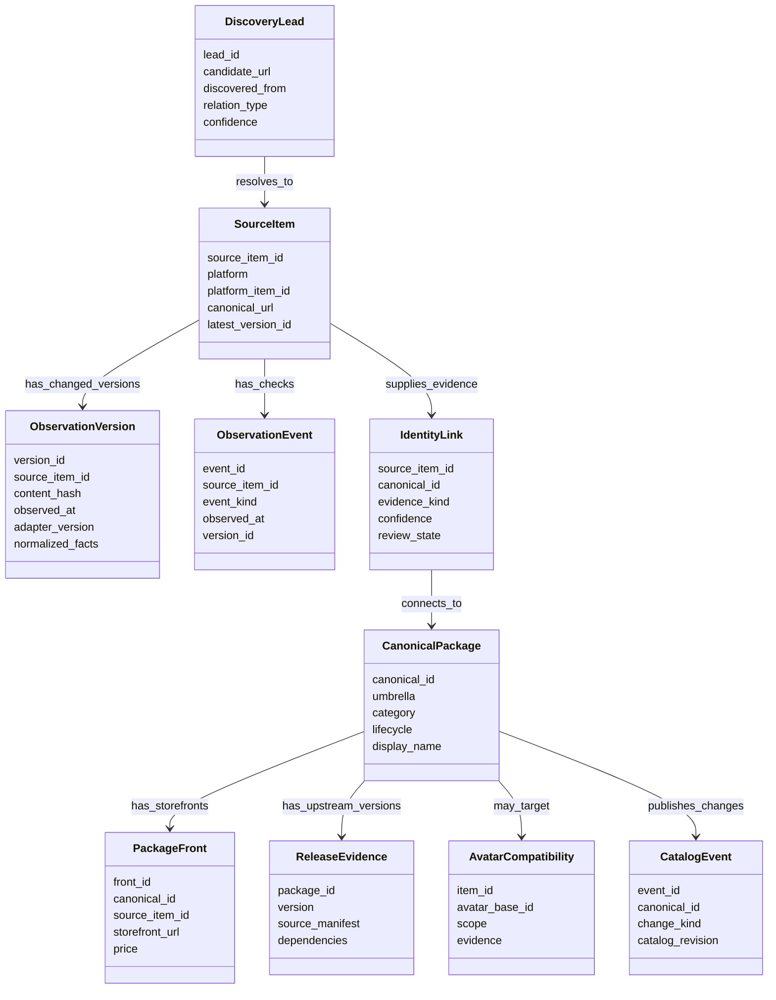
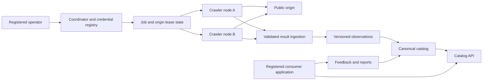

# Implementation plan: capability gates toward the canonical catalog

> **Status:** Staged implementation baseline derived from the owner's comments in `DIRECTION.md` on 2026-09-27. This is a work plan, not a claim that the capabilities exist. `DIRECTION.md` retains the owner's wording and unresolved choices. The owner selected a fully local coordinator simulation with real-source node ingestion and Worker-portable code. No Cloudflare account setup is part of the current milestone. The crawler node remains a standalone binary for VPS or desktop use. The new coordinator starts with a fresh database. `bin/crawler_state.db` is prototype evidence for read-only tests and dry runs, not an automatic migration source. All seven current drivers are enabled by default in local development, subject to source-specific access checks before a live run.
>
> **Release rule:** A gate closes only when its observable acceptance conditions pass on production code paths. The historic completion of Phases 1–4 remains recorded. Any new defect is tracked against a current capability gate.

**Current G3/G5 checkpoint (2026-09-28):** The seven original capabilities remain selected by default. An eighth `shopify` capability now has only a coordinator-leased, bounded product-sitemap discovery path. It creates pending same-origin product leads under a separate scoped profile and robots/lease checks. It has no approved merchant, product metadata parser, auto-queue promotion, or live smoke. Selecting a capability grants no fetch authority.

## 1. Product decisions now driving the work

| Decision | Implementation consequence | Remaining qualification |
| --- | --- | --- |
| `canonical_packages` is the final accepted, deduplicated catalog bucket | Keep one public catalog identity. Add an umbrella field with **Tools**, **Assets**, and **Avatars**, plus category-specific subtype data and relationships. | Research the vocabulary against a labeled sample. Platform tags are evidence, not the taxonomy itself. |
| Tools include world/avatar creation tools, scripts, VPM/UPM, and VRChat-specific standalone desktop/runtime applications; Assets include shaders, props, models, gimmicks; Avatars include bases and cosmetics | Discovery and classification can use umbrella-specific paths. But all accepted items reach the same final catalog. A desktop application is an item kind, not a source platform or automatically a VPM package. | Some items cross umbrellas. Define multi-label and related-product handling rather than silently choosing one or merging an app with its Unity/VPM integration. |
| VRChat-targeted desktop/runtime tools get a distinct catalog category tag within **Tools** | Use a provisional `vrchat-desktop-tool` tag with evidence-backed subtypes. Do not create a fourth umbrella or an eighth source driver merely for desktop software. Require a specific VRChat focus, not generic VR/OSC compatibility or a keyword hit. | Confirm the final public tag name and subtype vocabulary in the G4 labeled corpus. Generic VR utilities remain leads unless publisher evidence shows a specific VRChat target. |
| Cosmetics and avatar bases are in scope | Replace blanket asset rejection with an umbrella-aware decision tree. Record avatar compatibility and universal applicability. | Humanoid/furry and named avatar bases require an evidence-backed vocabulary. |
| Broad discovery is a goal | Admit curated lists, dependencies, creator links, search results, and manifests as typed leads. | Each lead still needs a supported source and evidence before publication. |
| Source coverage is not closed at the present seven drivers | Track newly found directories and storefronts as typed candidates. Do not equate a community search index with a publisher storefront or an in-game avatar index. Add Shopify-hosted merchant fronts and possible custom-domain catalog fronts to the G3/G4 source/identity work without treating all custom domains as Shopify or first-party. | Nexyy, Payhip, Sellfy, avtr.zip, Shopify merchants, and independently operated catalog fronts have different roles and open access/identity questions. See [`docs/research/markets/ADDITIONAL_MARKET_SOURCE_RESEARCH.md`](../../research/markets/ADDITIONAL_MARKET_SOURCE_RESEARCH.md). |
| Historical changes and an event log are wanted | Store a new source version only when meaningful content changes. Log each fetch/check and state transition without duplicating unchanged payloads. | Full raw-content retention and deletion exceptions need source-specific research. |
| The project indexes and links to authoritative VPM repositories | Preserve upstream package IDs, versions, dependencies, and repository URLs as evidence. Do not fabricate installable releases. | Decide whether `/v1/vpm/index.json` has any valid role after this change. |
| All seven current drivers are selected by default for local development | Keep source policy evaluation separate from driver selection. A driver can be selected yet unable to issue live requests until its access profile permits them. The reason must be visible. | Permission is being pursued for Jinxxy. [Terms §§8.2 and 23](https://jinxxy.com/terms-of-service) address automated access and systematic directory-building. The documented [Creator API](https://support.jinxxy.com/hc/en-us/articles/28052364650637-How-can-I-access-the-Creator-API) is store-scoped rather than a documented public catalog interface. Resolve public-discovery scope. Do not treat default selection or the Creator API as authorization. |
| The new coordinator starts with an empty database | Do not auto-migrate prototype records or preserve their identifiers as authoritative. Use `bin/crawler_state.db` read-only for schema comparison and controlled replay fixtures. | A future explicit import is optional, with a mapping and provenance review first. |
| Distributed crawler nodes and a Cloudflare coordinator are the intended destination | Define node/job/result contracts early. Run the coordinator and catalog locally first, using real source data through the nodes. | Cloudflare storage/coordination choices follow a workload and limits spike. No live Cloudflare setup now. |
| Capability gates replace a simple Phase 5 percentage | Make dependencies, exit tests, and open research visible. Map old Phase 5 tasks into gates. | Retain historical task IDs as references, not as the new order of execution. |

**Status of this table:** The first column reflects the owner's comments. The second column is the proposed implementation translation. A research qualification remains open even when the product direction is settled.

## 2. Logical data flow and ownership

The diagram is a logical class map. Table names and exact columns are proposed and can change after the Gate 2 schema spike.

### 2.1 Data logistics rules

1. A lead gives a reason to inspect a destination. It is never proof that copied title, price, or version is correct. Store the source and relation type of the lead for later source ranking.
2. A source item represents one upstream listing, manifest, repository, or product. It has a stable source identity even when URL, title, or fetched representation changes.
3. On a successful fetch, normalize meaningful fields. Compute a digest over canonical serialized content and compare it to the latest version. A hash identifies a change. It does not compress or replace the historical payload. Insert a version when content changes. Record a lightweight check event for unchanged content, `304`, errors, challenges, and policy blocks.
4. In one transaction, insert the changed version or event. Advance `SourceItem.latest_version_id`. The latest pointer can change. Historical version rows remain intact under the applicable retention policy.
5. The final `CanonicalPackage` uses a stable opaque ID for non-VPM items. Preserve upstream VPM identifiers and previous aliases separately. Keep a merge and split history so operators can reverse a mistaken match without reusing IDs.
6. Similarity methods, including SimHash and pHash, propose identity links. Publication requires stronger signals appropriate to the umbrella: upstream package ID, creator-declared cross-link, matching source repository, or reviewed storefront relationship. Visual similarity alone cannot attach a BOOTH front to an unrelated VPM package.
7. `PackageFront` remains relational internally because each storefront has its own URL, price, availability, and update history. The API can serialize fronts as a JSON array inside a canonical package. Storing `platforms_json` as a second authoritative store would cause drift.
8. Avatar bases are canonical items. A cosmetic or tool can relate to zero, one, or multiple bases. The value `universal` is an explicit compatibility scope, not an avatar name. Compatibility claims retain source and uncertainty.
9. `ReleaseEvidence` comes from real upstream VPM manifests or other verified release sources. The catalog can display version history while linking users to the origin repository. It must not synthesize `1.0.0` to make an index look like a package repository.
10. Opt-out creates a crawl exclusion and a public suppression event immediately. Observed disappearance or repeated `404` creates a lifecycle review or archived state by policy. History retention or deletion is resolved separately from public suppression. Downstream consumers receive a tombstone either way.
11. A projection is the currently published interpretation of evidence. The owner can call this the *canonical catalog view* in public documentation. Replay or rebuild is needed only when taxonomy, identity links, overrides, or source policy changes. Ordinary crawls update affected catalog items incrementally.
12. The local export is a test and isolation product unless a separate consumer need is accepted. The canonical publication path is the API or edge catalog. One typed contract must generate or validate both outputs.

Catalog deltas must be driven by a monotonic `CatalogEvent` sequence. It covers additions, updates, front changes, merges, splits, and tombstones. A catalog **generation** changes only when an incompatible replay or reset requires every consumer to reload. A normal projection run with no changed output must not create a new generation. This avoids relying on SQLite row IDs that can be reused after rebuilds.

For creator delisting, the owner prefers the API with bio or product-description token verification. Signed Git commits are removed from the target workflow unless a separate need emerges. A verified opt-out blocks future crawl jobs, not just public display. Do not treat a missing product as a creator request: require source-specific evidence and repeated checks before marking it delisted. The historical record remains private unless a reviewed deletion obligation applies.

Origin publication time can be **confirmed** by the source or **inferred** from related evidence such as a release, image, or video. Preserve the evidence and confidence level. `observed_at` and the time the canonical catalog last changed remain separate. This allows consumer applications to sort without mistaking crawl time for original publication time.

### 2.2 Field transformation example

| Input | Stored evidence | Catalog decision | Public field |
| --- | --- | --- | --- |
| Storefront page title | Source item version with URL and timestamp | Clean display name; record cleanup rule and version | `displayName` |
| VPM manifest ID and version | Verified package/release evidence | Link to stable canonical item if identity signals pass | `vpmId`, available versions, origin repository link |
| Storefront price | Time-stamped front evidence | Keep price on that front; do not overwrite prices on other fronts | `fronts[].price` |
| Avatar compatibility claim | Creator/platform text or structured tag with source | Normalize avatar alias; mark named, universal, or uncertain | `compatibility[]` |
| Description body | Source text and parsed segments, subject to source retention policy | Extract description apart from headers, dividers, links, and boilerplate; produce public summary under reviewed policy | `summary` and origin link |
| User feedback | Report with application identity and trust state | Suggest, review, or apply an override according to an explicit authority rule | Revision plus visible provenance where appropriate |

## 3. Capability gates and order of work

The gates are ordered by dependency. Research tasks can run while earlier implementation proceeds. But a gate cannot close with an unresolved decision that changes its schema or public behavior.

| Gate | Deliverable | Main work | Exit evidence |
| --- | --- | --- | --- |
| **G0 — Decision baseline** | Accepted product vocabulary and contract map | Incorporate owner comments into explicit decisions. Define Tools, Assets, Avatars, source tiers, node, operator, application identities, and document roles. Audit architectural disagreements and defect claims in `DIRECTION.md` §15 against current split-driver files. Link all current FIXMEs via `docs/scratch/decisions/current/FIXME_GATE_MAP.md` (28 on 2026-09-27) to gate work. | Owner-readable decision record. Every current discrepancy marked open, resolved, or stale. No contradictory active Phase 5 instructions. |
| **G1 — Safe current operation** | Reliable single-node baseline | Remove default admin secret. Correct recrawl exclusions. Centralize challenge and 429 outcome handling. Handle opt-out redirects with per-hop SSRF checks. Stop unused WebP work. Fix `media_id` absence. Make tests hermetic. | Missing secret cannot authorize protected routes. Blocked or opted-out URLs stay blocked after recrawl. Challenge never becomes product data. 429 respects bounded backoff. Compiled smoke tests pass. |
| **G2 — Data logistics** | Versioned source evidence and stable catalog identity | Define schema and relationship diagram. Choose DB abstraction after a small spike. Introduce source items, change-only versions, events, identity links, catalog revisions, fronts, compatibility, and tombstones. Separate public summaries from source text. | Change, unchanged, deleted, renamed, merged, and split fixtures replay correctly. One changed item produces one version and one catalog delta. No wrong storefront merge occurs in the labeled corpus. |
| **G3 — Adapter and discovery contracts** | Narrow, testable platform adapters | Shared driver runtime, fetch interface, parser primitives, validation, lead graph, source-specific access profiles, dependency traversal, creator links, and curated-list source tracing. For VPM, distinguish published listings, package manifests, build recipes, and project-local state. Quarantine malformed releases with diagnostics rather than silently dropping a source or publishing partial truth. Research VRChat-specific standalone applications through approved publisher metadata paths without treating "desktop" as a crawl host or assuming VPM/Unity distribution. | Same fixtures produce typed leads and observations for all drivers. No adapter writes catalog tables directly. Ambiguous links remain leads. Source switches work per profile. Project `vpm-manifest.json` is never a public seed. Desktop-app evidence is not coerced into VPM releases. |
| **G4 — Classification and publication** | Unified catalog under three umbrellas | Empirical taxonomy corpus. Umbrella-specific classifier and deduplication policy. Avatar-base aliases and compatibility. Real VPM version evidence. Source field ranking. Incremental public catalog, fronts, and epoch-aware deltas. Include standalone VRChat applications and their optional integrations in the labeled corpus. | Representative multilingual tools, assets, and avatars classified with measured errors. Cosmetic or tool and desktop-app or integration false merges rejected. API and export agree on the same catalog revision. Consumers recover after reset. |
| **G5 — Local coordinator simulation** | Local Worker-like coordinator plus two or more standalone crawler nodes | Define registration, per-driver capability grants, job pull or lease, origin pacing, idempotent result submission, heartbeat, credential rotation or revocation, and delisting propagation. Run against local SQLite and in-memory services first. Then ingest permitted real-source observations. Every node and coordinator exchange uses the same versioned API payload schema and runtime validation as a web request, including in-process tests. | Concurrent nodes never exceed the configured rate of an origin. Revoked or wrong-scope tokens fail. Duplicate result submissions do not duplicate evidence. Coordinator loss stops new fetches. Delisting blocks all nodes. The node binary runs without Cloudflare credentials. Malformed or wrong-version payloads fail identically in-process and over loopback HTTP. |
| **G6 — Worker portability and local release conformance** | Worker-compatible core plus local production-like evidence | Keep coordinator request/response and storage interfaces free of Bun-only or Node-only imports. Supply local adapters. Check a Worker build. Measure likely Cloudflare limits and costs. Rebuild target docs and separate implementation conformance evidence. Actual Cloudflare staging is deferred until the owner opts in. | Local end-to-end tests meet G5, compiled node tests, database recovery, cursor reset, source switches, and documented runbook. Worker build check passes. `LEGAL.md` target clauses have corresponding conformance states. Cloudflare deployment is not required for this gate. |

The present process lock protects local duplicate starts when a node runs as a single instance. Gate 5 verifies that the lock protects local duplicate starts, while leases protect the distributed origin from excess requests. These mechanisms solve different problems.

The owner's updated local pre-production exit target requires **two binaries, two process-specific configs, two local databases, and loopback API communication** while ingesting reviewed real sources. The current coordinator/node smoke proves separate processes, two versioned non-secret launch-directory configs, and schema-validated loopback traffic. It does not prove the full artifact topology. Top-level `node/main.ts` and `worker/main.ts` load their own configs. But node database ownership and implementation remain open. Authenticated operator API issuance is only a local credential-bootstrap slice, not a remote registration trust flow. Keep Cloudflare deployment and its account keys outside this gate. Migrate the desired `src-crawler/`, `worker/`, and `node/` layout by import/build/test slices rather than a single repository move. Defer `src-web/` until coordinator and node contracts are stable. See `DIRECTION.md` §1.5 and the owner questions in `docs/scratch/decisions/DEFERRED_OWNER_DECISIONS.md`.

### 3.1 Clarifications from the owner's comments

| Comment | Concrete plan response |
| --- | --- |
| Why keep `package_fronts` when canonical packages can carry JSON? | Store independently changing storefront records once, then assemble the JSON view for consumers. A front price, URL, or availability can change without rewriting the identity of the canonical item. |
| What does the delta cursor problem mean? | A client can ask for changes after record 15,000. If a catalog rebuild restarts numbering at 1, the client sees no new records forever. Bind the cursor to a catalog generation and use a monotonic event sequence for ordinary changes. Instruct clients to reload only when the generation becomes incompatible. |
| What does the media proxy do? | A direct image URL can fail in a browser when an origin restricts hotlinking. The proxy fetches an allowed image and streams it to the requesting client without saving the bytes. Gate 1 removes the separate crawl-time WebP conversion whose output is discarded. Gate 4 researches whether proxy transformation remains necessary. |
| Was BlurHash removed? | No. Current `image_proxy.ts` still computes and stores BlurHash text and pHash metadata. The removed storage was the persistent WebP image BLOB. Gate 1 tests and documents the actual media path. |
| Why consider an IP parsing package? | The server hand-parses IPv4/IPv6 ranges for opt-out and media fetch SSRF checks. A package can validate address syntax and ranges. DNS pinning and redirect checks remain project policy. This is a correctness spike, not a change to which websites are discovered. |
| Why was IANA fetched? | `IanaRegistry` is used while accepting or classifying external domains linked to packages. Gate 3 tests real domains and special-use suffixes, then chooses whether an offline public-suffix package is more reliable than the current live fetch or fallback. |
| How will versions and names stay consistent? | Add one version registry (a checked-in JSON or typed module) for application build, public API, catalog schema, report schema, and terms notice. Upstream package versions remain data, never configuration. Canonical display names can change while stable IDs and aliases remain. |
| What happens to logging? | Gate 1 evaluates a small logger package against the existing one and implements one active `latest.log`, with prior session and day files moved to an archive. Rotation and shutdown behavior get compiled-binary tests. Do not replace the logger merely to add a package. |
| Can saturation be reused? | Rename the existing `done/discovered` value to queue completion. Gate 4 can add source-specific coverage measures where the denominator is known. Infer no unknown ecosystem-wide percent indexed or stop threshold. |
| Can indirect feedback refine ranking? | Add typed, aggregate signals from consumer applications only after the application credential and report authority model is settled. Ranking signals can suggest review or alter a documented score. They cannot silently rewrite creator-claimed identity, links, or source evidence. |
| Can VRCArena help identify avatar bases? | Treat its catalog as a research comparison or discovery lead if access and terms permit. Validate base identity and compatibility against creator-controlled or other accepted source evidence before publication. |

### 3.2 Small database abstraction comparison

| Approach | Main benefit | Main cost | Gate 2 trial |
| --- | --- | --- | --- |
| Centralized raw SQL plus typed repositories | Transparent SQLite behavior, minimal dependencies, straightforward Bun runtime | Types and migrations need careful manual discipline | Implement source version transaction, fronts, and catalog revision with one schema owner |
| Typed query builder | Types for queries and joins without fully hiding SQL | Additional tooling and generated types; Bun compilation needs validation | Implement the same slice and compare schema drift and error reporting |
| Full ORM | One model can describe relations and migrations; potentially faster broad schema changes in version 0 | Abstraction leakage for FTS5, bulk upserts, and SQLite-specific behavior; larger dependency surface | Use only if the trial demonstrably simplifies the actual queries and compiled artifact |

The choice must be based on a written comparison of the same vertical slice, rather than database size or line count alone.

### 3.3 Immediate defect placement

| Existing item | Gate | Acceptance focus |
| --- | --- | --- |
| TODO Task 2.3, Turnstile FIXME | G1 | Header and body challenge detection, no success accounting, retry and backoff state |
| `DIRECTION.md` §15 (OVERLOOKED-11, -12, -14, -16) | G1 | Dead WebP work, recrawl safety, redirect validation, null media identity |
| OVERLOOKED-13 and -17 | G4 | Epoch-bound delta cursor and all public fronts |
| OVERLOOKED-15 | G4 | No fabricated VPM SemVer |
| OVERLOOKED-18 | G6 | Bounded and batched edge publication |
| OVERLOOKED-19 | G0/G2 | Define report review state separately from package lifecycle; remove or use the enum accordingly |
| TODO 5.1 (federated VPM discovery) | G3/G4 | Leads to authoritative manifests, real package and version evidence |
| TODO 5.2 (cosmetics) | G2/G4 | Avatar base and compatibility model, then discovery and classification |
| TODO 5.3 (temporal provenance) | G2/G4 | Versioned observations, event log, field evidence, lifecycle |
| TODO 5.4 (crawler nodes) | G5/G6 | Protocol simulation before Cloudflare deployment |

## 4. Network boundary to simulate

The operator credential registers and manages nodes. A node credential is scoped to allowed drivers, origins, and operations. A per-job lease limits what nodes fetch and report. Consumer application credentials permit catalog and report functions by separate scopes. None of these are Cloudflare account or D1 administration tokens. Origin websites receive transparent unauthenticated crawler requests unless an origin gives another permitted access method.

The local coordinator enforces origin leases and shared backoff. Adding nodes increases source coverage without increasing the request rate of an origin. A `429` changes the retry state of an origin and uses `Retry-After` when present. It does not permanently disable a driver. Challenge responses and platform objections have distinct outcomes. Coordinator unavailability prevents new job claims. Result submission uses job IDs and idempotency keys so retries are safe. [Cloudflare Queues documents at-least-once delivery](https://developers.cloudflare.com/queues/reference/delivery-guarantees/) if Queues become part of the implementation later.

**Discovery and dispatch direction:** A node discovers candidate links while executing an assigned driver task. The node submits typed leads with provenance. The coordinator validates those leads, applies source and path policy, deduplicates jobs, queues eligible jobs, and issues fetch leases to capable nodes. Driver-specific fetching and parsing run on nodes. The coordinator decides which driver runs, where, and when. Local SQLite jobs and claim/lease APIs act as a durable queue for the prototype. Cloudflare Queues is a possible later delivery mechanism, not an assumed requirement or a substitute for origin leases. The current implementation has only a narrow VPM recipe/listing lead path, not general node-discovered jobs across all drivers.

**Accepted hybrid lead and access control (2026-09-28):** A lead matching a reviewed source rule can be auto-queued. An unknown host, path, or lead kind remains pending for operator review. Both manually seeded and auto-queued jobs require a separate scoped, active source-access profile before robots refresh or a fetch lease. The local coordinator implements that boundary with authenticated, audited profile management, exact origin/path/purpose matching, lease binding, a pacing floor, and submission-time retention checks. No old job receives an implicit grant. A separate authenticated, versioned **operator API** reviews leads and manages rules/profiles. A future dashboard can call it from the Worker or an adjacent control application. Node credentials have no administrative rights and a queue product supplies no source policy. This is partial G3/G5 implementation. Source-by-source reviews, legacy direct-driver paths, retention/removal, public projection, and old-DB operational migration remain open. See [source-access gate design](current/SOURCE_ACCESS_AND_SAFETY.md).

**Local transport fidelity:** The coordinator core exposes a `Request → Response` handler with one authoritative schema/validator set under `src-crawler/src/shared/`. In-process tests pass serialized JSON through that handler, not typed objects into internal methods. The standalone crawler-node binary calls the same routes over loopback HTTP during local simulation. Authentication headers, protocol version, payload size, status/error bodies, leases, and idempotency keys are validated at this boundary. Internal repositories can use typed functions after validation. A contract test must replay identical valid and invalid payloads through both in-process and HTTP transports and compare results. The schema package choice is part of the G3 package spike. Do not maintain a second handwritten validator with different behavior.

Cloudflare is the target hosting environment, but storage mapping remains a measured decision. D1 suits relational catalog data. A strongly consistent coordinator store can be required for per-origin leases. Cloudflare documents [transactional, strongly consistent Durable Object storage](https://developers.cloudflare.com/durable-objects/concepts/what-are-durable-objects/) and [D1 query and size limits](https://developers.cloudflare.com/d1/platform/limits/). Gate 5 tests the protocol locally before selecting the production combination.

## 5. Research and policy gates

| Topic | Concrete investigation | Decision produced | Blocks |
| --- | --- | --- | --- |
| Jinxxy | Resolve how Terms §§8.2 and 23 apply to public-entry queries and third-party directory-building. Ask whether a public catalog API or written discovery arrangement exists. Document that the published Creator API is store-scoped. Check current robots paths, rate, and retention rules. Preserve dated first-party evidence. | Distinct research and production source profiles with an actual discovery mechanism, allowed endpoints, retained fields, and stop conditions. Do not infer an API replacement from browser traffic alone. | Production Jinxxy switch in G6. |
| Gumroad/BOOTH retention | Review current primary terms and the exact representations retained: normalized facts, full text, raw payload, history, BlurHash, and proxy output. | Per-source retention and publication policy. | Source evidence schema and production enablement. |
| Description/copyright | Build a corpus of real descriptions. Identify boilerplate, creator prose, links, changelogs, and technical facts. Obtain legal review for public excerpt policy. | Text segmentation, summary rule, and retained or public fields. Remove the arbitrary 256-character claim unless justified. | Public summary contract in G4. |
| Deletion/delisting | Compare creator opt-out, platform objection, observed removal, copyright notice, and privacy request. | Immediate crawl and public suppression, archival retention, and deletion exceptions. | G2 lifecycle and G4 tombstones. |
| VRChat/VPM ecosystem | Inspect official VPM formats and client behavior (including vrc-get/ALCOM), version/yanked/prerelease semantics, dependencies, repository subscriptions, and common creator distribution patterns. See `docs/research/markets/VPM_TEMPLATE_RESEARCH.md` and `docs/research/markets/VRC_GET_ECOSYSTEM_RESEARCH.md`. | Source-specific version model and approved public listing seeds, without confusing local project/user-package state with a feed or implementing a speculative resolver. | G3/G4 VPM work. |
| VRChat-targeted desktop/runtime tools | Inventory publisher-backed examples outside Unity/VPM (companion clients, OSC control, face/body tracking bridges, accessibility/streaming utilities). Start with [VRChat's OSC resources](https://docs.vrchat.com/docs/osc-resources) and publisher repositories, then sample false positives. Broader VR-related tools qualify only when publisher evidence shows a specific VRChat target. Distinguish a downloadable app, plugin/module, SDK package, generic VR utility, and a creator storefront front. Review the access and redistribution terms of each host. See [`docs/research/markets/DESKTOP_TOOL_DISCOVERY_RESEARCH.md`](../../research/markets/DESKTOP_TOOL_DISCOVERY_RESEARCH.md). | Distinct Tools category tag, desktop subtype/OS/integration fields, authoritative version/update evidence, source profiles, lead-to-observation rules, and labeled app-versus-integration identity cases. Research only until those decisions are recorded. No new live crawl seed is implied. | G3 discovery, G4 taxonomy/identity, and representative G5 pre-production evidence; `TODO.md` Task 5.5. |
| Additional directories, storefronts, and in-game avatar indexes | Investigate [Nexyy](https://nexyy.com/) as a lead-only cross-store index, Payhip as a storefront-adapter candidate, Sellfy as an unverified storefront lead, and [avtr.zip](https://avtr.zip/) as a public in-game avatar index that can link through creator profiles to self-hosted sites or storefronts. See [`docs/research/markets/ADDITIONAL_MARKET_SOURCE_RESEARCH.md`](../../research/markets/ADDITIONAL_MARKET_SOURCE_RESEARCH.md). | Source profiles and permission/retention checks. Explicit link-chain provenance and typed lead-to-job mapping. Publisher-front and in-game-avatar identity boundaries. Representative positive and missing-link fixtures. Do not add a live driver or treat copied facts from an index as publisher evidence. | G3/G4/G5; `TODO.md` Task 5.6. |
| Avatar taxonomy | Sample actual listings across languages and avatar communities, including humanoid/furry, bundles, universal items, and named bases. | Umbrella and subtype vocabulary and compatibility confidence rules. | G2 compatibility and G4 classification. |
| Deduplication | Label false merges and true mirrors, including reported wrong BOOTH-to-VPM links. Evaluate exact IDs, declared links, text, and pHash separately. | Match thresholds and human review boundary. | G2 identity and G4 publication. |
| Feedback/modeling | Compare deterministic rules with a small supervised model on a labeled, rights-cleared corpus. Inspect anti-training covenants before any training. | Evaluate whether semantic correction is useful and allowed. Initially advisory only and never authoritative for creator-claimed data. | Optional after G4. |
| Packages | Spike parser, validator, public suffix/IP/robots, resilience, BlurHash, and logger candidates in Bun compiled binaries. Inspect licenses and maintenance. The first [robots matcher spike](../../research/SPIKES.md) adopted strict RFC matching in the legacy helper, but leaves fetch, status, cache, and scheduling to the coordinator. | Adopt or retain decision with parity tests and rationale. Never mistake a matcher for a complete robots policy. | Relevant G1/G3 changes. |
| Database abstraction | Implement the same small source-version/front/revision slice using raw SQL with centralized schema and one typed alternative. | Choice based on clarity, schema drift, transaction safety, Bun support, and generated types. | G2 implementation. |

Current [Gumroad terms](https://gumroad.com/terms) describe a revocable public-search-index exception that excludes caches or archives. Retaining complete source text and historical payloads needs a specific review before becoming a general production rule. The rule for the project cannot be inferred from one platform.

## 6. Documentation changes at each gate

| Document | Planned role and change |
| --- | --- |
| `DIRECTION.md` | Keep owner comments and accepted decisions. Link to the specific gate/decision once resolved. Do not rewrite comments into assistant conclusions. |
| `TODO.md` | Preserve Phases 1–4 as delivery history. Replace Phase 5 percentage language with gate IDs, work items, and observable exits. Move legal research and historical audit prose to their proper documents. |
| `DIRECTION.md §15` | Revalidate old paths and each OVERLOOKED item. Keep open defects with reproduction and evidence. Mark resolved or stale items explicitly. |
| `LEGAL.md` | Retain the owner's desired projected post-v1.0 covenants. Make their effective scope clear, with a separate conformance record for current implementation. Present tense can state target obligations. It cannot serve as evidence that code already conforms. |
| `current/CONFORMANCE.md` | Clause/requirement → current code path → test or live evidence → status → gap/gate. `TODO.md` says what to build. This file says what was demonstrated. |
| `README.md` and `docs/` | One concise purpose and pipeline explanation. Current build/run instructions. Target architecture linked separately. Remove repeated stale metrics, deleted paths, and ambiguous jargon. |
| `AGENTS.md` / `DELEGATES.md` | Tell future agents which files define decisions, how to add dependencies, how to avoid false tests, and how to report a new disagreement without adding a parallel design. |

The requested present-tense legal target can be drafted as an operative specification for the future service. It must clearly identify when it becomes effective. Claiming that unimplemented protections are already operating would mislead users. It would also weaken the code-to-policy verification the project needs.

## 7. First cross-boundary slice after G1 safety work

G1 safety work and small `src-crawler/src/node/` and `src-crawler/src/shared/` boundary extractions can proceed immediately. The first coordinator slice must be narrow enough to validate the architecture before broad migration, entirely locally:

1. Build a local coordinator `Request → Response` contract with one source policy and one mock node. Include a scoped token, origin lease, job ID, and idempotent result. Serialize and validate the same API schemas in-process and over loopback HTTP. Keep the handler and core storage interfaces Worker-portable, with local runtime/SQLite adapters for execution.
2. Feed one existing VPM manifest and one storefront fixture through a shared fetch outcome and adapter result type.
3. Persist a changed observation version, an unchanged check event, one source-to-canonical identity link, and one catalog revision in an isolated SQLite database.
4. Expose the canonical item with its fronts through a versioned delta contract. Prove a cursor reset after a catalog rebuild.
5. Expand only after the slice demonstrates correct replay, no false cross-umbrella merge, policy-driven driver enablement, and a compiled Bun smoke run.

This slice gives concrete evidence for database, driver, and coordinator choices before replacing current implementations across every platform.
