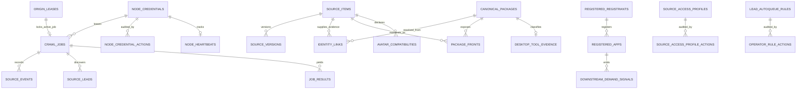

# Database & Logging Schema Specification (Candidate Source Document)

> **Document Status:** Candidate Source — v0 Pre-Production Architecture  
> **Last Updated:** 2026-10-01  
> **Target Subsystems:** Coordinator storage (Cloudflare D1, including local workerd D1) · Node storage (`node.db` by default) · Activity logging
> **Code Source:** `src-web/src/worker/storage/d1/` · `src-crawler/src/storage/` · `src-crawler/src/shared/protocol/`

---

## 1. Overview & Storage Topologies

The system maintains a strict physical and logical boundary between the central **Coordinator** and autonomous **Crawler Nodes**:

1. **Coordinator Storage (`coordinator.db` / Cloudflare D1):**
   - The authoritative source of truth for workforce credentials, origin rate limits, robots caches, discovery leads, source versions, and the canonical catalog graph.
   - The local Worker uses D1 through Wrangler/workerd. `src-web/tests/support/local_sqlite.ts` is a test comparator, not a coordinator service.
2. **Crawler Node Local Storage (`node_state.db`):**
   - Node-local SQLite WAL database tracking local execution runs, in-flight task journals, and failure diagnostics.
   - Fully isolated: nodes have **no direct connection** to the coordinator database. Communication occurs exclusively over validated HTTP wire protocols.
3. **Structured Activity Logging:**
   - Standardized, machine-readable JSON logging format for both Coordinator edge functions and Headless Crawler Node processes.

---

## 2. Entity-Relationship Model



---

## 3. Coordinator Database Schema (`coordinator.db` / D1)

### 3.1 Authentication, Principals & Workforce Distribution

#### `registered_registrants`
Stores verified user identities provisioned by the Web Operator Panel (Firebase Auth).
```sql
CREATE TABLE registered_registrants (
  registrant_id TEXT PRIMARY KEY,
  registrant_name TEXT NOT NULL,
  token_hash TEXT NOT NULL,               -- SHA-256 digest of vrcp_reg_<64-hex>
  contact_email TEXT,
  created_at TEXT NOT NULL,               -- ISO-8601
  revoked_at TEXT                         -- ISO-8601 or NULL
);
CREATE INDEX idx_registered_registrants_token ON registered_registrants(token_hash);
```

#### `registered_apps`
Stores registered downstream client applications (e.g., ALCOM, VCC, web frontends).
```sql
CREATE TABLE registered_apps (
  app_id TEXT PRIMARY KEY,
  app_name TEXT NOT NULL,
  token_hash TEXT NOT NULL,               -- SHA-256 digest of vrcp_app_<64-hex>
  contact_email TEXT,
  permissions_json TEXT NOT NULL,         -- JSON array: ["catalog:read", "demand:feedback", ...]
  created_at TEXT NOT NULL,
  revoked_at TEXT
);
CREATE INDEX idx_registered_apps_token_hash ON registered_apps(token_hash);
```

#### `node_credentials`
Stores authorized Crawler Nodes and their capability bitmask permissions.
```sql
CREATE TABLE node_credentials (
  node_id TEXT PRIMARY KEY,
  token_hash TEXT NOT NULL,               -- SHA-256 digest of vrcp_<64-hex><4-hex>
  capabilities_json TEXT NOT NULL,        -- JSON array: ["booth", "github", "vpm"]
  revoked_at TEXT
);
CREATE TABLE node_credential_actions (
  action_id INTEGER PRIMARY KEY AUTOINCREMENT,
  node_id TEXT NOT NULL REFERENCES node_credentials(node_id),
  actor TEXT NOT NULL,                    -- "operator-api" or "registrant:<id>"
  action TEXT NOT NULL,                   -- "issued" | "revoked"
  reason TEXT NOT NULL,
  occurred_at TEXT NOT NULL
);
```

#### `node_heartbeats`
Liveness registry for connected Crawler Nodes.
```sql
CREATE TABLE node_heartbeats (
  node_id TEXT PRIMARY KEY REFERENCES node_credentials(node_id),
  last_seen_at TEXT NOT NULL,
  state TEXT NOT NULL CHECK(state IN ('idle', 'fetching')),
  active_job_id TEXT
);
```

---

### 3.2 Origin Rate Limiting & Politeness Fences

#### `origin_leases`
Enforces origin-wide politeness floors across distributed nodes.
```sql
CREATE TABLE origin_leases (
  origin TEXT PRIMARY KEY,                -- e.g., "https://booth.pm"
  active_job_id TEXT REFERENCES crawl_jobs(job_id),
  lease_expires_at TEXT,
  next_allowed_at TEXT NOT NULL,          -- Enforces min_delay_ms floor
  min_delay_ms INTEGER NOT NULL
);
```

#### `origin_robots` & `origin_robots_refresh_leases`
Cached RFC 9309 robots.txt snapshots (24-hour TTL) and refresh mutexes.
```sql
CREATE TABLE origin_robots (
  origin TEXT PRIMARY KEY,
  snapshot_id TEXT NOT NULL,
  status_code INTEGER NOT NULL,
  body TEXT NOT NULL,
  fetched_at TEXT NOT NULL,
  expires_at TEXT NOT NULL
);
CREATE TABLE origin_robots_refresh_leases (
  origin TEXT PRIMARY KEY,
  lease_id TEXT NOT NULL,
  lease_expires_at TEXT NOT NULL
);
```

#### `suppressed_urls`
Global URL blocklist populated by creator delistings or administrative sanctions.
```sql
CREATE TABLE suppressed_urls (
  url TEXT PRIMARY KEY,
  reason TEXT NOT NULL,
  suppressed_at TEXT NOT NULL
);
```

---

### 3.3 Triage, Policies & The Crawl Queue

#### `source_access_profiles`
The mandatory legal/safety gatekeeper. A node cannot lease a job without an active profile.
```sql
CREATE TABLE source_access_profiles (
  profile_id TEXT PRIMARY KEY,
  platform TEXT NOT NULL,
  origin TEXT NOT NULL,
  path_scope TEXT NOT NULL,
  query_scope TEXT,
  method TEXT NOT NULL CHECK(method = 'GET'),
  purpose TEXT NOT NULL CHECK(purpose IN ('discovery', 'metadata')),
  min_delay_ms INTEGER NOT NULL,
  expires_at TEXT NOT NULL,
  review_reference TEXT NOT NULL,
  reason TEXT NOT NULL,
  retain_classes_json TEXT NOT NULL,      -- JSON array of EvidenceKind
  publish_classes_json TEXT NOT NULL,
  created_at TEXT NOT NULL,
  disabled_at TEXT
);
CREATE INDEX idx_source_access_profiles_scope
  ON source_access_profiles(platform, origin, purpose, disabled_at, expires_at);
```

#### `lead_autoqueue_rules`
Automates promotion of discovered links into `crawl_jobs`.
```sql
CREATE TABLE lead_autoqueue_rules (
  rule_id TEXT PRIMARY KEY,
  lead_kind TEXT NOT NULL,                -- "discovery" | "metadata"
  origin TEXT NOT NULL,
  path_scope TEXT NOT NULL,
  min_delay_ms INTEGER NOT NULL,
  expires_at TEXT NOT NULL,
  review_reference TEXT NOT NULL,
  reason TEXT NOT NULL,
  created_at TEXT NOT NULL,
  disabled_at TEXT
);
CREATE INDEX idx_lead_autoqueue_rules_scope
  ON lead_autoqueue_rules(lead_kind, origin, disabled_at, expires_at);
```

#### `source_leads`
Candidate discovery leads emitted by nodes during crawl runs.
```sql
CREATE TABLE source_leads (
  lead_key TEXT PRIMARY KEY,              -- SHA-256 of target_url
  discovered_from_url TEXT NOT NULL,
  discovered_from_job_id TEXT NOT NULL REFERENCES crawl_jobs(job_id),
  discovered_from_item_key TEXT,
  kind TEXT NOT NULL,
  target_url TEXT NOT NULL,
  claimed_package_id TEXT,
  status TEXT NOT NULL CHECK(status IN ('pending_review', 'approved', 'rejected')),
  first_seen_at TEXT NOT NULL,
  last_seen_at TEXT NOT NULL,
  first_seen_node_id TEXT,
  first_seen_lease_id TEXT,
  first_seen_profile_id TEXT,
  last_seen_node_id TEXT,
  last_seen_lease_id TEXT,
  last_seen_profile_id TEXT
);
CREATE INDEX idx_source_leads_status ON source_leads(status, kind);
CREATE INDEX idx_source_leads_page ON source_leads(status, first_seen_at, lead_key);
```

#### `crawl_jobs`
Durable priority queue for platform fetch tasks.
```sql
CREATE TABLE crawl_jobs (
  job_id TEXT PRIMARY KEY,
  platform TEXT NOT NULL,
  url TEXT NOT NULL UNIQUE,
  origin TEXT NOT NULL,
  state TEXT NOT NULL CHECK(state IN ('pending', 'leased', 'done', 'backoff', 'blocked')),
  next_fetch_at TEXT NOT NULL,
  claimed_by TEXT REFERENCES node_credentials(node_id),
  lease_id TEXT,
  lease_expires_at TEXT,
  etag TEXT,
  last_modified TEXT,
  created_at TEXT NOT NULL,
  robots_deferred_until TEXT,
  source_rule_id TEXT,
  job_purpose TEXT NOT NULL DEFAULT 'metadata' CHECK(job_purpose IN ('discovery', 'metadata')),
  lease_profile_id TEXT
);
CREATE INDEX idx_crawl_jobs_ready ON crawl_jobs(state, next_fetch_at, platform);
CREATE INDEX idx_crawl_jobs_origin_due ON crawl_jobs(origin, next_fetch_at, state);
```

#### `job_seed_actions` (implemented locally, 2026-10-03)

Manual operator enqueue writes this record in the same transaction as queue and pacing changes. Failed actions do not create success records. Matching repeated requests record separate operator actions without resetting job state. This record does not authorize source access.

```sql
CREATE TABLE job_seed_actions (
  action_id TEXT PRIMARY KEY,
  job_id TEXT NOT NULL REFERENCES crawl_jobs(job_id),
  actor TEXT NOT NULL,
  reason TEXT NOT NULL,
  occurred_at TEXT NOT NULL
);
```

#### `job_results`
Deduplication and idempotency journal for node result submissions.
```sql
CREATE TABLE job_results (
  lease_id TEXT PRIMARY KEY,
  job_id TEXT NOT NULL REFERENCES crawl_jobs(job_id),
  node_id TEXT NOT NULL,
  idempotency_key TEXT NOT NULL,
  request_digest TEXT NOT NULL,
  response_json TEXT NOT NULL,
  submitted_at TEXT NOT NULL
);
```

---

### 3.4 Ingestion, Facts & Observation History

#### `source_items`
Unique upstream storefront or repository items.
```sql
CREATE TABLE source_items (
  source_key TEXT PRIMARY KEY,            -- Canonical item hash
  platform TEXT NOT NULL,
  source_url TEXT NOT NULL,
  latest_digest TEXT NOT NULL,            -- SHA-256 of normalized observation payload
  latest_version_no INTEGER NOT NULL,
  gone_at TEXT                            -- Tombstone timestamp if observed 404/deleted
);
```

#### `source_versions`
Immutable append-only version log. Rows are inserted only when payload digest changes.
```sql
CREATE TABLE source_versions (
  version_id TEXT PRIMARY KEY,
  source_key TEXT NOT NULL REFERENCES source_items(source_key),
  version_no INTEGER NOT NULL,
  digest TEXT NOT NULL,
  payload_json TEXT NOT NULL,             -- Normalized extracted facts
  observed_at TEXT NOT NULL,
  complete INTEGER NOT NULL DEFAULT 1 CHECK(complete IN (0, 1)),
  contributor_node_id TEXT,
  submission_lease_id TEXT,
  source_profile_id TEXT,
  UNIQUE(source_key, version_no)
);
```

#### `source_events` & `source_issues`
Audit trail of fetch checks, unchanged 304 observations, and parser errors.
```sql
CREATE TABLE source_events (
  event_id INTEGER PRIMARY KEY AUTOINCREMENT,
  job_id TEXT NOT NULL REFERENCES crawl_jobs(job_id),
  source_key TEXT,
  kind TEXT NOT NULL,                     -- "fetched_changed" | "fetched_unchanged" | "error"
  observed_at TEXT NOT NULL,
  version_id TEXT,
  contributor_node_id TEXT,
  submission_lease_id TEXT,
  source_profile_id TEXT
);

CREATE TABLE source_issues (
  issue_id INTEGER PRIMARY KEY AUTOINCREMENT,
  job_id TEXT NOT NULL REFERENCES crawl_jobs(job_id),
  source_item_key TEXT NOT NULL,
  version_key TEXT,
  code TEXT NOT NULL,                     -- Diagnostic issue code
  observed_at TEXT NOT NULL,
  contributor_node_id TEXT,
  submission_lease_id TEXT,
  source_profile_id TEXT
);
```

---

### 3.5 The Canonical Catalog & Identity Graph

#### `canonical_packages`
Deduplicated package entities presented to downstream consumers.
```sql
CREATE TABLE canonical_packages (
  canonical_id TEXT PRIMARY KEY,          -- Opaque stable package ID
  umbrella TEXT NOT NULL CHECK(umbrella IN ('tools', 'assets', 'avatars')),
  category TEXT NOT NULL,
  lifecycle TEXT NOT NULL CHECK(lifecycle IN ('active', 'deprecated', 'quarantined', 'delisted')),
  display_name TEXT NOT NULL,
  vpm_id TEXT,                            -- Optional official VPM package identifier
  created_at TEXT NOT NULL,
  updated_at TEXT NOT NULL
);
CREATE INDEX idx_canonical_packages_updated ON canonical_packages(updated_at ASC, canonical_id ASC);
CREATE INDEX idx_canonical_packages_created ON canonical_packages(created_at DESC, canonical_id DESC);
```

#### `identity_links`
Evidence-backed links connecting `source_items` to `canonical_packages`.
```sql
CREATE TABLE identity_links (
  link_id TEXT PRIMARY KEY,
  source_key TEXT NOT NULL REFERENCES source_items(source_key),
  canonical_id TEXT NOT NULL REFERENCES canonical_packages(canonical_id),
  evidence_kind TEXT NOT NULL CHECK(evidence_kind IN (
    'vpm_id', 'repository_match', 'cross_storefront_link', 'curator_verified', 'simhash_match'
  )),
  confidence REAL NOT NULL CHECK(confidence >= 0.0 AND confidence <= 1.0),
  review_state TEXT NOT NULL CHECK(review_state IN ('provisional', 'accepted', 'rejected')),
  created_at TEXT NOT NULL,
  reviewed_at TEXT
);
```

#### `package_fronts`
Storefront occurrences and prices associated with a canonical package.
```sql
CREATE TABLE package_fronts (
  front_id TEXT PRIMARY KEY,
  canonical_id TEXT NOT NULL REFERENCES canonical_packages(canonical_id) ON DELETE CASCADE,
  source_key TEXT NOT NULL REFERENCES source_items(source_key) ON DELETE CASCADE,
  platform TEXT NOT NULL,
  storefront_url TEXT NOT NULL,
  price REAL,
  currency TEXT,
  availability TEXT NOT NULL DEFAULT 'available',
  observed_at TEXT NOT NULL,
  UNIQUE(canonical_id, source_key)
);
CREATE INDEX idx_package_fronts_canonical ON package_fronts(canonical_id);
```

#### `avatar_compatibilities`
Normalized avatar base compatibility declarations.
```sql
CREATE TABLE avatar_compatibilities (
  compatibility_id TEXT PRIMARY KEY,
  source_key TEXT NOT NULL REFERENCES source_items(source_key) ON DELETE CASCADE,
  target_avatar_base TEXT NOT NULL,
  scope TEXT NOT NULL CHECK(scope IN ('named_base', 'universal', 'uncertain')),
  confidence TEXT NOT NULL CHECK(confidence IN ('creator_declared', 'keyword_inferred', 'unverified')),
  evidence_source TEXT NOT NULL,
  created_at TEXT NOT NULL
);
CREATE INDEX idx_avatar_compat_source_key ON avatar_compatibilities(source_key);
CREATE INDEX idx_avatar_compat_target_base ON avatar_compatibilities(target_avatar_base);
```

#### `desktop_tool_evidence`
Evidence assertions for VRChat-specific standalone desktop applications.
```sql
CREATE TABLE desktop_tool_evidence (
  canonical_id TEXT PRIMARY KEY REFERENCES canonical_packages(canonical_id) ON DELETE CASCADE,
  tool_subtype TEXT NOT NULL CHECK(tool_subtype IN (
    'companion_client', 'osc_control', 'tracking_bridge', 'streaming_accessibility', 'utility'
  )),
  supported_os TEXT NOT NULL,
  particular_vrchat_target INTEGER NOT NULL CHECK(particular_vrchat_target IN (0, 1)),
  evidence_url TEXT NOT NULL,
  publisher_claim TEXT NOT NULL,
  confidence REAL NOT NULL,
  created_at TEXT NOT NULL
);
```

---

### 3.6 Signals, Takedowns & Meta

#### `downstream_demand_signals`
Search misses, zero-hit queries, and category refresh demand emitted by downstream apps.
```sql
CREATE TABLE downstream_demand_signals (
  signal_id TEXT PRIMARY KEY,
  app_id TEXT NOT NULL REFERENCES registered_apps(app_id),
  signal_type TEXT NOT NULL CHECK(signal_type IN ('search_miss', 'refresh_demand', 'popularity_signal')),
  query TEXT,
  zero_hits INTEGER NOT NULL DEFAULT 0,
  requested_platform TEXT,
  target_url TEXT,
  category TEXT,
  metadata_json TEXT,
  recorded_at TEXT NOT NULL,
  resolved_at TEXT
);
CREATE INDEX idx_downstream_demand_platform ON downstream_demand_signals(requested_platform, resolved_at);
```

#### `creator_opt_outs`
Audit log of all delistings and takedown actions.
```sql
CREATE TABLE creator_opt_outs (
  takedown_id TEXT PRIMARY KEY,
  target_url TEXT,
  canonical_id TEXT,
  requester_type TEXT NOT NULL CHECK(requester_type IN ('unauthenticated_creator', 'registrant', 'admin_operator')),
  requester_id TEXT,
  reason TEXT NOT NULL,
  proof_kind TEXT CHECK(proof_kind IN ('storefront_bio_token', 'dns_txt', 'manual_notice')),
  proof_value TEXT,
  contact_email TEXT,
  recorded_at TEXT NOT NULL
);
CREATE INDEX idx_opt_outs_target_url ON creator_opt_outs(target_url);
CREATE INDEX idx_opt_outs_canonical_id ON creator_opt_outs(canonical_id);
```

#### `coordinator_meta`
Metadata store for coordinator epoch, initialization status, and settings.
```sql
CREATE TABLE coordinator_meta (
  key TEXT PRIMARY KEY,
  value TEXT NOT NULL
);
```

---

## 4. Crawler Node Local Database Schema (`node_state.db`)

Crawler Nodes persist run journals and task state in a dedicated local SQLite database (`node_state.db`).

```sql
CREATE TABLE node_metadata (
  key TEXT PRIMARY KEY,
  value TEXT NOT NULL
);

CREATE TABLE node_runs (
  run_id TEXT PRIMARY KEY,                -- e.g., "run_<timestamp>_<hex>"
  started_at TEXT NOT NULL,
  finished_at TEXT,
  status TEXT NOT NULL CHECK(status IN ('running', 'completed', 'failed')),
  tasks_completed INTEGER NOT NULL DEFAULT 0,
  tasks_failed INTEGER NOT NULL DEFAULT 0
);

CREATE TABLE node_tasks (
  task_id TEXT PRIMARY KEY,
  run_id TEXT NOT NULL REFERENCES node_runs(run_id) ON DELETE CASCADE,
  job_id TEXT NOT NULL,
  lease_id TEXT NOT NULL,
  platform TEXT NOT NULL,
  url TEXT NOT NULL,
  claimed_at TEXT NOT NULL,
  status TEXT NOT NULL CHECK(status IN ('claimed', 'fetching', 'submitting', 'completed', 'failed')),
  http_status INTEGER,
  duration_ms INTEGER,
  bytes_fetched INTEGER,
  outcome_kind TEXT,
  submitted_at TEXT,
  accepted INTEGER,                       -- 1 if coordinator accepted, 0 otherwise
  error_message TEXT
);
CREATE INDEX idx_node_tasks_job ON node_tasks(job_id);
CREATE INDEX idx_node_tasks_run ON node_tasks(run_id);
```

---

## 5. Structured Activity Logging Schema

Both Coordinator edge functions and Crawler Node headless processes emit structured JSON logs.

### 5.1 Schema Specification

```typescript
export interface StructuredLogEvent {
  timestamp: string;                      // ISO-8601
  level: "debug" | "info" | "warn" | "error";
  component: "coordinator" | "crawler-node" | "crawler-client" | "sdk";
  message: string;
  meta?: {
    nodeId?: string;
    jobId?: string;
    leaseId?: string;
    platform?: string;
    origin?: string;
    url?: string;
    status?: number;
    durationMs?: number;
    error?: {
      name: string;
      message: string;
      stack?: string;
    };
    [key: string]: unknown;
  };
}
```

### 5.2 Example Log Lines

**Coordinator Job Lease Event:**
```json
{
  "timestamp": "2026-10-01T10:55:00.123Z",
  "level": "info",
  "component": "coordinator",
  "message": "Issued origin lease to node",
  "meta": {
    "nodeId": "node-vps-01",
    "jobId": "c8a4124a-714a-4e4b-9e45-123456789abc",
    "leaseId": "f1b23456-789a-bcde-f012-3456789abcde",
    "origin": "https://booth.pm",
    "minDelayMs": 3000
  }
}
```

**Crawler Node Fetch Completion:**
```json
{
  "timestamp": "2026-10-01T10:55:03.456Z",
  "level": "info",
  "component": "crawler-node",
  "message": "Crawl task completed successfully",
  "meta": {
    "nodeId": "node-vps-01",
    "jobId": "c8a4124a-714a-4e4b-9e45-123456789abc",
    "url": "https://booth.pm/en/items/1234567",
    "status": 200,
    "durationMs": 412,
    "bytesFetched": 58920,
    "outcomeKind": "success"
  }
}
```
# Pending catalog removal reports

App ownership is recorded in `user_app_ownership`: `app_id` is a primary key and registered-app foreign key; `user_id` is a required registered-user foreign key. An index covers user ID and app ID. User-owned app creation writes this relation atomically with the credential record. Existing and operator-created apps have no implied owner. Ownership transfers and backfill are not implemented.

`catalog_reports` stores app-authenticated removal requests separately from `downstream_demand_signals` and creator opt-outs. Fields: `report_id` (primary key), `app_id` (registered-app foreign key), `report_type` (`removal_request`), validated `payload_json`, `review_status` (`pending`, `accepted`, `rejected`; initially pending), and `recorded_at`. An index covers review status, time and ID. Storage rejects writes from revoked or missing apps. No review endpoint or automatic suppression is provided by this table.
