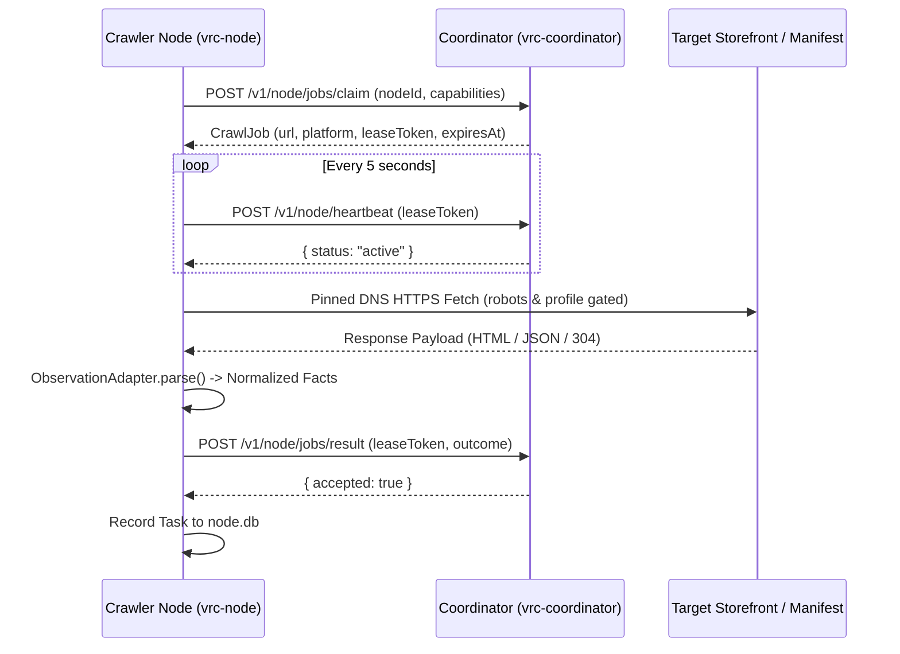

# Crawler Node & Crawler Client Specification (Candidate)

> **Document Status:** Post-Production Candidate Specification  
> **Target Subsystem:** Headless Crawler Node Daemon (`src-crawler`) and Desktop GUI Crawler Client (`src-crawler-client`)  
> **Source Directory:** `src-crawler/src/node/` and `src-crawler-client/`

---

## 1. Overview and Terminology Disambiguation

This specification distinguishes between two operational deployment models:

### 1.1 Crawler Node (`src-crawler`)
- **Role:** Compiled binary for a headless VPS such as Linux to run (and Windows daemon CLI `dist/local-node/vrc-node.exe`).
- **Core Behaviors:**
  - Authenticated polling of the coordinator for job leasing via `/v1/node/jobs/claim`.
  - Accepts jobs leased by the coordinator matching its capability profile.
  - Crawls assigned jobs under strict origin pacing, pinned DNS, and robots adherence.
  - Sends execution results to coordinator: success (normalized facts), rate limit (429 backoff), or failure (diagnostics).
  - **Zero-Downtime Resilience**: Designed to never shut down; resilient against dataloss, network interruptions, or coordinator unavailability (failing closed without generating uncoordinated traffic spikes).
  - **Comprehensive Structured Logging**: All activities, actions, and crawled websites are systematically recorded to local logs (`logs/`).
  - Configured via `node.config.json` with node ID and capability-encoded secret token provided by the coordinator.
  - Emits local telemetry to `node.db` (`node_runs`, `node_tasks`).

### 1.2 Crawler Client (`src-crawler-client`)
- **Role:** Desktop GUI shell for Windows that bundles the compiled `Crawler Node` binary within.
- **Purpose:** Enables community contributors to run a node on personal Windows desktop machines without interacting with a headless terminal or manually configuring JSON files.
- **Architecture:** Wraps `vrc-node.exe` as a supervised child process, exposes intuitive setup/status panels, displays live crawl progress and local metrics, and manages token provisioning from the coordinator portal.

---

## 2. Core Execution Lifecycle

1. **Lease Claiming (`POST /v1/node/jobs/claim`)**:
   - The node polls the coordinator for an available job that matches its declared capabilities (`vpm`, `github`, `booth`, `shopify`).
   - If no jobs are due, the node sleeps for the `retryAfterMs` duration sent by the coordinator.
2. **Periodic Heartbeat (`POST /v1/node/heartbeat`)**:
   - A timer renews the active lease every 5 seconds.
   - If the coordinator becomes unreachable, the node aborts in-flight processing and fails closed.
3. **Observation Parsing**:
   - The node parses outbound responses in memory with `src-crawler/src/node/adapters/observation_adapter.ts`.
   - The node never downloads or stores binary archives (`.unitypackage`, `.zip`, `.fbx`).
   - It limits description length to functional metadata summaries.
4. **Result Submission (`POST /v1/node/jobs/result`)**:
   - The node submits structured observation facts, discovered leads, or access failure diagnostics.

---

## 3. Outbound Transport and Network Safety Guardrails

- **Pinned DNS Resolution**: `public_metadata_fetch.ts` resolves origin IP addresses before socket creation. It rejects loopback, link-local, private, and cloud metadata addresses (anti-SSRF).
- **Hard Payload Ceiling**: The node aborts stream consumption if a response exceeds 2 MB.
- **Circuit Breakers and Jitter**: Consecutive rate limits (`429`) or Cloudflare challenges trip an in-memory circuit breaker. The circuit breaker applies exponential backoff with decorrelated jitter (30s base, 1h maximum).
- **RFC 9309 Compliance**: The node checks robots rules and transmits declared `User-Agent: VRCDiscoveryBot/1.0` headers.

---

## 4. Local Telemetry Schema (`node.db`)

The node records local telemetry without modifying the canonical catalog:
- `node_runs`: Records start time, completion status, node ID, coordinator endpoint, and total duration.
- `node_tasks`: Records target URL, platform, HTTP status code, duration in milliseconds, outcome, and coordinator acceptance confirmation.
