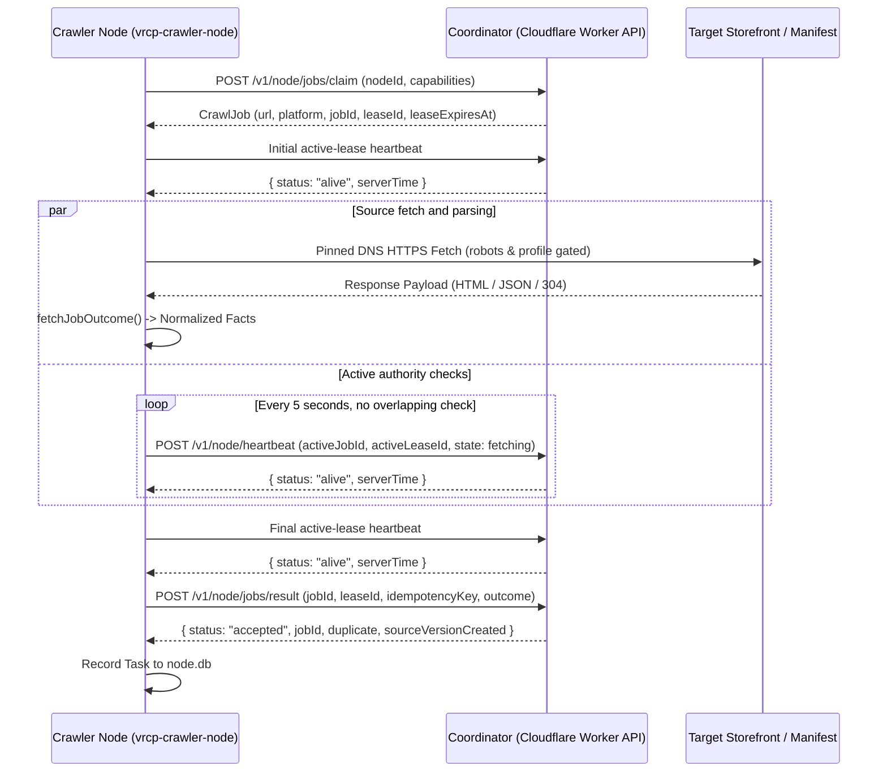

# Crawler Node & Crawler Client Specification (Candidate)

> **Document Status:** Current source reference with open recovery and GUI integration gaps
> **Target Subsystem:** Headless Crawler Node Daemon (`src-crawler`) and Desktop GUI Crawler Client (`src-crawler-client`)  
> **Source Directory:** `src-crawler/src/` (entry `main.ts`, functional subfolders) and `src-crawler-client/`

This reference describes inspected code. Recent shutdown and transport changes have fixtures, but runtime verification remains deferred. They do not establish release readiness.

---

## 1. Overview and Terminology Disambiguation

This specification distinguishes between two operational deployment models:

### 1.1 Crawler Node (`src-crawler`)
- **Role:** Compiled binary for a headless VPS such as Linux to run (and Windows daemon CLI `dist/local-node/vrcp-crawler-node.exe`).
- **Core Behaviors:**
  - Authenticated polling of the coordinator for job leasing via `/v1/node/jobs/claim`.
  - Accepts jobs leased by the coordinator matching its capability profile.
  - Crawls assigned jobs under strict origin pacing, pinned DNS, and robots adherence.
  - Sends execution results to coordinator: success (normalized facts), rate limit (429 backoff), or failure (diagnostics).
  - **Recovery Boundary:** The daemon retries coordinator failures and stops unauthorized fetches. Task logs exist, but a durable result outbox does not. Restart-safe submission remains incomplete.
  - **Structured Logging**: Execution logs and local task records exist. Complete activity coverage remains unverified.
  - `node.config.json` contains the node ID and selected capabilities. The coordinator issues the secret token. Supply it separately through `NODE_TOKEN`.
  - Emits local telemetry to `node.db` (`node_runs`, `node_tasks`).

### 1.2 Crawler Client (`src-crawler-client`)
- **Current implementation:** Tauri with a SvelteKit static frontend. The Rust shell exposes a starter `greet` command and the opener plugin.
- **Not implemented:** Bundled node binary, child-process supervision, node setup, telemetry panels or coordinator token provisioning.
- **Owner intent:** A Windows GUI shell that bundles and controls the crawler node. Initialization alone does not deliver this integration.

### 1.3 Node log files

- Logger construction computes paths but creates no files, timers or exit hooks. The first log write starts those resources.
- An unused logger leaves existing logs unchanged when it rotates or closes. Help and version commands create no node state.
- Active logs use `LoggerOptions.logsDir`, then `CRAWLER_LOGS_DIR`, then `logs` beneath the current working directory.
- Session-only logging does not archive or clear an existing `latest.log`. Active latest-log rotation and shutdown retain their archive behavior.
- The 2026-10-06 crawler gate passed 140 tests and 860 assertions, type checks and a development binary build.
- Compiled help and version checks created no outputs in an isolated fixture. This does not prove active runtime output placement.
- The default runtime path still needs a source, installed-binary and Docker review before repository-root output sign-off.
- Concurrent writes during rotation, disk failures and synchronous exit flushing remain separate reliability risks.

---

## 2. Core Execution Lifecycle

1. **Lease Claiming (`POST /v1/node/jobs/claim`)**:
   - The node polls for a job that matches its declared capabilities. `PlatformSchema` defines ten capabilities, including storefront and registry drivers.
   - If no jobs are due, the node sleeps for the `retryAfterMs` duration sent by the coordinator.
2. **Periodic Heartbeat (`POST /v1/node/heartbeat`)**:
   - A timer checks active lease authority every 5 seconds. The heartbeat does not extend the lease deadline.
   - A failed authority check cancels source processing. Detection waits for the periodic check and its bounded retries. It is not instantaneous.
3. **Observation Parsing**:
   - The node parses outbound responses in memory with `src-crawler/src/adapters/observation_adapter.ts`.
   - The node never downloads or stores binary archives (`.unitypackage`, `.zip`, `.fbx`).
   - It limits description length to functional metadata summaries.
4. **Result Submission (`POST /v1/node/jobs/result`)**:
   - The node submits structured observation facts, discovered leads, or access failure diagnostics.
   - The client validates the receipt schema and requires its jobId to match the submitted job. Retries preserve the serialized request.
   - This check does not add a durable outbox. Restart recovery, terminal rejection handling and bounded result retention remain open.

---

## 3. Outbound Transport and Network Safety Guardrails

- **Pinned DNS Resolution**: `public_metadata_fetch.ts` resolves origin IP addresses before socket creation. It rejects loopback, link-local, private, and cloud metadata addresses (anti-SSRF).
- **Origin Metadata Ceiling**: `public_metadata_fetch.ts` aborts a response above 2,000,000 bytes. This cap does not apply to coordinator JSON.
- **Coordinator Endpoint**: The client requires HTTPS, except for HTTP on loopback. It rejects embedded URL credentials and fragments.
- **Coordinator Redirects and Errors**: Calls use manual redirects and reject 3xx responses. Failed bodies are canceled without JSON parsing or body content in errors/logs.
- **Coordinator Success Bodies**: The client parses successful JSON, then applies the response schema. No streaming byte ceiling exists for these bodies.
- **Coordinator Retries**: Defaults are two retries and a 250 ms base delay, with a 2,000 ms delay cap. Options require nonnegative safe integers.
- **Request Timeouts**: Each heartbeat attempt uses 5 seconds. Each claim/result attempt uses 30 seconds. Shutdown does not cancel these coordinator calls.
- **Access Outcomes**: The adapter reports rate limits, challenges and other failures to the coordinator. Coordinator origin pacing controls subsequent leases. No separate node circuit-breaker guarantee is established here.
- **RFC 9309 Boundary**: The coordinator checks robots snapshots at claim, heartbeat and result submission. The node sends the configured crawler User-Agent. Production robots refresh remains unfinished.

---

## 4. Local Telemetry Schema (`node.db` by default)

The node records local execution telemetry and task journals without modifying the coordinator catalog. For exact SQLite table schemas, column types, and structured logging formats, see [`DATABASE_SCHEMAS.md`](DATABASE_SCHEMAS.md).

## 5. Shutdown and recovery boundary

SIGINT, SIGTERM and the stdin commands stop/exit/shutdown request daemon cancellation. During start(), a 100 ms poll checks the configured node.stop file. The poll also runs during active fetches and reconnect waits. Final cleanup clears it.

Stop cancels source fetches and prevents execution after a pending claim or idle heartbeat returns. An in-flight result submission can still commit. The CLI waits for the daemon loop before closing SQLite and logs. Fatal one-shot errors retain failed status and exit code 1.

Task transitions and run counters share local SQLite transactions. Receipt validation checks the schema and job identity. This bookkeeping does not persist the result payload or idempotency key. Abrupt process death and lost acknowledgments still lack a durable outbox.
