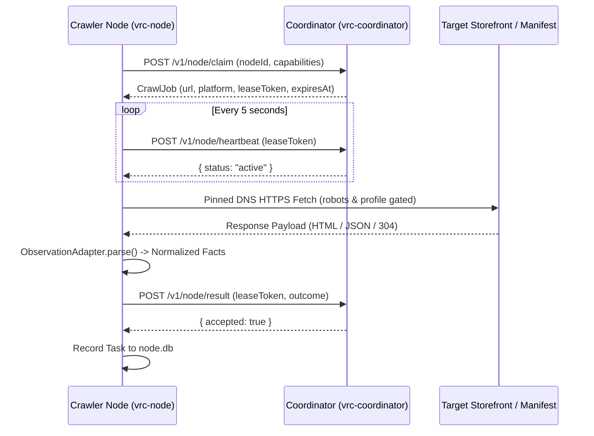

# Crawler Client Specification (Candidate)

> **Document Status:** Post-Production Candidate Specification  
> **Target Subsystem:** Crawler Node Client Architecture and Local Node Telemetry  
> **Source Directory:** `src-crawler/src/node/` and `src-crawler-client/`

---

## 1. Overview and Architectural Role

The **Crawler Client** (crawler node) is a lightweight background worker. It executes outbound HTTP fetches leased by the coordinator. It runs as a standalone binary:
- **Executable:** `dist/local-node/vrc-node.exe` (Windows x64) / `vrc-node-linux`
- **Working Directory Files:** Emits `node.config.json` and `node.db` in its launch directory. It runs next to the coordinator without filename or lock contention.

---

## 2. Core Execution Lifecycle

1. **Lease Claiming (`POST /v1/node/claim`)**:
   - The node polls the coordinator for an available job that matches its declared capabilities (`vpm`, `github`, `booth`, `shopify`).
   - If no jobs are due, the node sleeps for the `retryAfterMs` duration sent by the coordinator.
2. **Periodic Heartbeat (`POST /v1/node/heartbeat`)**:
   - A timer renews the active lease every 5 seconds.
   - If the coordinator becomes unreachable, the node aborts in-flight processing and fails closed.
3. **Observation Parsing**:
   - The node parses outbound responses in memory with `src/node/observation_adapter.ts`.
   - The node never downloads or stores binary archives (`.unitypackage`, `.zip`, `.fbx`).
   - It limits description length to functional metadata summaries.
4. **Result Submission (`POST /v1/node/result`)**:
   - The node submits structured observation facts, discovered leads, or access failure diagnostics.

---

## 3. Outbound Transport and Network Safety Guardrails

- **Pinned DNS Resolution**: `public_metadata_fetch.ts` resolves origin IP addresses before socket creation. It rejects loopback, link-local, private, and cloud metadata addresses (anti-SSRF).
- **Hard Payload Ceiling**: The node aborts stream consumption if a response exceeds 2 MB.
- **Circuit Breakers and Jitter**: Consecutive rate limits (`429`) or Cloudflare challenges trip an in-memory circuit breaker. The circuit breaker applies exponential backoff with decorrelated jitter (30s base, 1h maximum).
- **RFC 9309 Compliance**: The node checks robots rules and transmits declared `User-Agent: VRCDiscoveryBot/1.0` headers.

---

## 4. Local Telemetry Schema (`node.db`)

The node records local telemetry without modifying the canonical catalog:
- `node_runs`: Records start time, completion status, node ID, coordinator endpoint, and total duration.
- `node_tasks`: Records target URL, platform, HTTP status code, duration in milliseconds, outcome, and coordinator acceptance confirmation.
