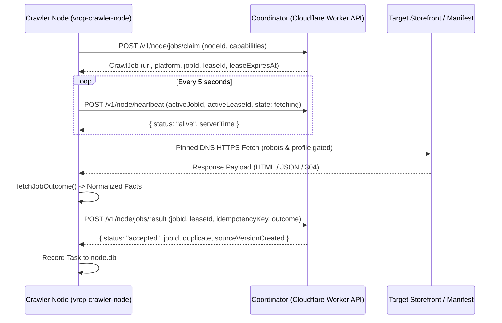

# Crawler Node & Crawler Client Specification (Candidate)

> **Document Status:** Current source reference with open recovery and GUI integration gaps
> **Target Subsystem:** Headless Crawler Node Daemon (`src-crawler`) and Desktop GUI Crawler Client (`src-crawler-client`)  
> **Source Directory:** `src-crawler/src/` (entry `main.ts`, functional subfolders) and `src-crawler-client/`

---

## 1. Overview and Terminology Disambiguation

This specification distinguishes between two operational deployment models:

### 1.1 Crawler Node (`src-crawler`)
- **Role:** Compiled binary for a headless VPS such as Linux to run (and Windows daemon CLI `dist/local-node/vrcp-crawler-node.exe`).
- **Core Behaviors:**
  - Authenticated polling of the coordinator for job leasing via `/v1/node/jobs/claim`.
  - Accepts jobs leased by the coordinator matching its capability profile.
  - Crawls assigned jobs under strict origin pacing, pinned DNS, and robots adherence.
  - Sends execution results to coordinator: success (normalized facts), rate limit (429 backoff), or failure (diagnostics).
  - **Recovery Boundary:** The daemon retries coordinator failures and stops unauthorized fetches. Task logs exist, but a durable result outbox does not. Restart-safe submission remains incomplete.
  - **Structured Logging**: Execution logs and local task records exist. Complete activity coverage remains unverified.
  - `node.config.json` contains the node ID and selected capabilities. The coordinator issues the secret token. Supply it separately through `NODE_TOKEN`.
  - Emits local telemetry to `node.db` (`node_runs`, `node_tasks`).

### 1.2 Crawler Client (`src-crawler-client`)
- **Current implementation:** Tauri with a SvelteKit static frontend. The Rust shell exposes a starter `greet` command and the opener plugin.
- **Not implemented:** Bundled node binary, child-process supervision, node setup, telemetry panels or coordinator token provisioning.
- **Owner intent:** A Windows GUI shell that bundles and controls the crawler node. Initialization alone does not deliver this integration.

---

## 2. Core Execution Lifecycle

1. **Lease Claiming (`POST /v1/node/jobs/claim`)**:
   - The node polls the coordinator for an available job that matches its declared capabilities (`vpm`, `github`, `booth`, `shopify`).
   - If no jobs are due, the node sleeps for the `retryAfterMs` duration sent by the coordinator.
2. **Periodic Heartbeat (`POST /v1/node/heartbeat`)**:
   - A timer checks active lease authority every 5 seconds. The heartbeat does not extend the lease deadline.
   - If the coordinator becomes unreachable, the node aborts in-flight processing and fails closed.
3. **Observation Parsing**:
   - The node parses outbound responses in memory with `src-crawler/src/adapters/observation_adapter.ts`.
   - The node never downloads or stores binary archives (`.unitypackage`, `.zip`, `.fbx`).
   - It limits description length to functional metadata summaries.
4. **Result Submission (`POST /v1/node/jobs/result`)**:
   - The node submits structured observation facts, discovered leads, or access failure diagnostics.
   - The client validates the receipt schema and requires its jobId to match the submitted job. Retries preserve the serialized request.
   - This check does not add a durable outbox. Restart recovery, terminal rejection handling and bounded result retention remain open.

---

## 3. Outbound Transport and Network Safety Guardrails

- **Pinned DNS Resolution**: `public_metadata_fetch.ts` resolves origin IP addresses before socket creation. It rejects loopback, link-local, private, and cloud metadata addresses (anti-SSRF).
- **Hard Payload Ceiling**: The node aborts stream consumption if a response exceeds 2 MB.
- **Access Outcomes**: The adapter reports rate limits, challenges and other failures to the coordinator. Coordinator origin pacing controls subsequent leases. No separate node circuit-breaker guarantee is established here.
- **RFC 9309 Boundary**: The coordinator checks robots snapshots at claim, heartbeat and result submission. The node sends the configured crawler User-Agent. Production robots refresh remains unfinished.

---

## 4. Local Telemetry Schema (`node.db` by default)

The node records local execution telemetry and task journals without modifying the coordinator catalog. For exact SQLite table schemas, column types, and structured logging formats, see [`DATABASE_SCHEMAS.md`](DATABASE_SCHEMAS.md).
