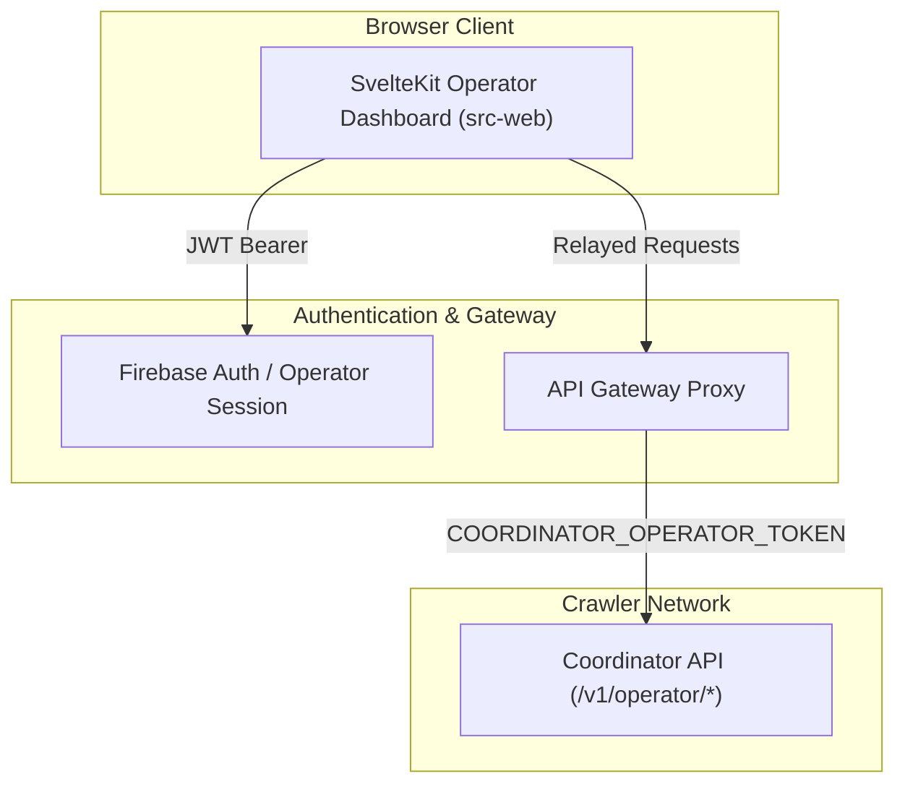

# Web Platform and Operator Dashboard Specification (Candidate)

> **Document Status:** Post-Production Candidate Specification  
> **Target Subsystem:** Web Frontend, Operator Control Plane, and Downstream Registry Dashboard  
> **Source Directory:** `src-web/`

---

## 1. Overview and Architectural Role

The **Web Platform** (`src-web`) gives a two-surface user interface and operator control plane for the discovery engine:
1. **Public Informational Portal (Unauthenticated)**:
   - Homepage that describes engine purpose, scope, and zero-binary principles.
   - Transparent policies: RFC 9309 robots compliance, `User-Agent` contact details, and creator rights covenants.
   - Creator self-service opt-out steps and automated delisting status tracker.
   - Public API documentation and terms notice (`LEGAL.md`).
2. **Authenticated Operator Dashboard**:
   - Live telemetry and health metrics of active coordinator instances and decentralized crawler nodes.
   - Discovery lead triage: interface to review, approve, or reject pending candidate leads.
   - Auto-queue rules editor: configures path-scoped, rate-limited, expiring rules.
   - Source-access profile manager: grants reviewed permissions for specific target domains and paths.
   - Canonical catalog explorer: inspects projected packages, versions, and multi-storefront identity links.

---

## 2. Decoupled Two-Tier Architecture

- **Air-Gapped Isolation**: User accounts, private lists, and authentication state stay isolated on `src-web`. The coordinator backend keeps zero user tables.
- **Operator Token Relay**: The dashboard calls coordinator `/v1/operator/*` routes through an authenticated relay that supplies the 256-bit `COORDINATOR_OPERATOR_TOKEN`.
- **Downstream Package Consumers**: External package managers (ALCOM, VCC) query the public catalog stream without operator privileges.

---

## 3. Technology Stack and Key Guidelines

- **Framework:** Svelte / SvelteKit with TypeScript.
- **Styling:** Tailwind CSS with strict baseline UI standards (clear visual hierarchy, accessible contrast ratios, tabular numbers for metrics).
- **Protocol Package:** Imports strongly-typed DTOs and API clients from workspace package `vrc-packages-api` (`src-package/`).
