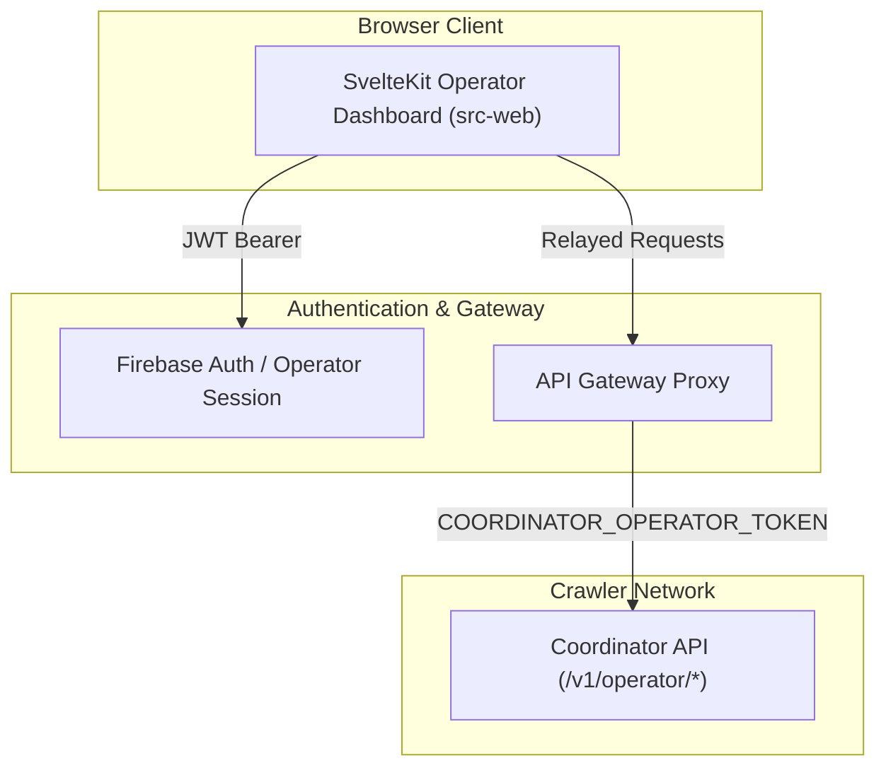

# Web Platform and Operator Dashboard Specification (Candidate)

> **Document Status:** Post-Production Candidate Specification  
> **Target Subsystem:** Web Frontend, Operator Control Plane, and Downstream Registry Dashboard  
> **Source Directory:** `src-web/`

---

## 1. Overview and Architectural Role

The **Web Platform** (`src-web`) serves as the public landing page, legal portal, and authenticated Operator Control Panel:

1. **Public Informational Portal & Landing Page (Unauthenticated)**:
   - **Landing Page**: Explains the discovery engine's purpose, scope, unauthenticated indexing architecture, and zero-binary principles.
   - **Terms of Service (ToS) & Legal Disclosures**: Publishes in-band covenants, RFC 9309 robots compliance, `User-Agent` contact details, and fair-use indexing boundaries (`LEGAL.md`).
   - **Node Binary Distribution**: Distributes compiled headless Crawler Node binaries (`vrcp-crawler-node` for Linux VPS and Windows CLI) and the Windows GUI Crawler Client.
   - **Database Statistics**: Displays live aggregated statistics and metrics of the canonical database (package counts, platform fronts, freshness, and crawl coverage).
   - **Creator Self-Service Opt-Out**: Provides instructions and validation tracking for non-scraping delisting requests.
   - **Public API Documentation**: Documents the public catalog endpoints (`/v1/catalog`, `/v1/catalog/delta`).

2. **Authenticated Web Platform (Firebase Auth + Cloudflare Bridge)**:
   - **Registrant Self-Service Portal (`/v1/user/*`)**:
     - **Node Token Issuance**: Generates capability-encoded node tokens (`vrcp_<token><cap>`) for contributor VPS instances or Windows Crawler Clients.
     - **Downstream Application Registry**: Registers downstream applications and issues application credentials (`vrcp_app_`).
     - **Self-Service Delisting**: Enables creators to delist packages they own directly on their behalf (authenticated identity serves as proof).
   - **Admin Operator Control Panel (`/v1/operator/*`)**:
     - **Crawl Permission Oversight**: Reviews and manages scoped `SourceAccessProfile` records.
     - **Auto-Queue Rules Editor**: Configures expiring, path-scoped lead promotion rules.
     - **Discovery Lead Triage**: Interface to review, approve, or reject pending candidate leads.
     - **Takedown Review**: Reviews proof for unauthenticated creator delisting submissions.
     - **Cloudflare & Edge Infrastructure Oversight**: Manages worker bindings and deployment parameters.

For route specifics and request/response payloads, see [`API_ROUTES.md`](API_ROUTES.md).

---

## 2. Decoupled Two-Tier Architecture

- **Air-Gapped Isolation**: User accounts, private lists, and authentication state stay isolated on `src-web`. The coordinator backend keeps zero user tables.
- **Operator Token Relay**: The dashboard calls coordinator `/v1/operator/*` routes through an authenticated relay that supplies the 256-bit `COORDINATOR_OPERATOR_TOKEN`.
- **Downstream Package Consumers**: External package managers (ALCOM, VCC) query the public catalog stream without operator privileges.

---

## 3. Technology Stack and Key Guidelines

- **Framework:** Svelte / SvelteKit with TypeScript.
- **Styling:** Tailwind CSS with strict baseline UI standards (clear visual hierarchy, accessible contrast ratios, tabular numbers for metrics).
- **Protocol Package:** Imports strongly-typed DTOs and API clients from workspace package `vrc-packages-api` (`src-package/`).
