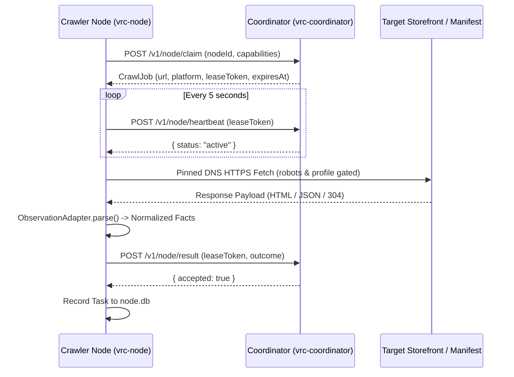

# Crawler Client Specification (Candidate)

> **Document Status:** Post-Production Candidate Specification  
> **Target Subsystem:** Crawler Node Client Architecture & Local Node Telemetry  
> **Source Directory:** `src-crawler/src/node/` and `src-crawler-client/`

---

## 1. Overview & Architectural Role

The **Crawler Client** (crawler node) is a lightweight, decentralized background worker responsible for executing outbound HTTP fetches leased by the coordinator. It runs as a standalone binary:
- **Executable:** `dist/local-node/vrc-node.exe` (Windows x64) / `vrc-node-linux`
- **Working Directory Files:** Emits `node.config.json` and `node.db` in its launch directory, coexisting safely alongside the coordinator without filename or lock contention.

---

## 2. Core Execution Lifecycle

1. **Lease Claiming (`POST /v1/node/claim`)**:
   - The node polls the coordinator for an available job matching its declared capabilities (`vpm`, `github`, `booth`, `shopify`, etc.).
   - If no jobs are due, the node sleeps for the coordinator-returned `retryAfterMs` window.
2. **Periodic Heartbeat (`POST /v1/node/heartbeat`)**:
   - A background timer renews the active lease every 5 seconds. If the coordinator becomes unreachable, the node aborts in-flight processing and fails closed.
3. **Observation Parsing**:
   - Outbound responses are parsed purely in-memory using `src/node/observation_adapter.ts`.
   - Never downloads or caches binary archives (`.unitypackage`, `.zip`, `.fbx`).
   - Limits description length to functional metadata summaries.
4. **Result Submission (`POST /v1/node/result`)**:
   - Submits structured observation facts, discovered leads, or access failure diagnostics.

---

## 3. Outbound Transport & Network Safety Guardrails

- **Pinned DNS Resolution**: `public_metadata_fetch.ts` resolves origin IP addresses before socket creation, rejecting loopback, link-local, private, and cloud metadata addresses (anti-SSRF).
- **Hard Payload Ceiling**: Responses larger than 2 MB are aborted immediately during stream consumption.
- **Circuit Breakers & Jitter**: Consecutive rate limits (`429`) or Cloudflare challenges trip an in-memory circuit breaker with exponential backoff and decorrelated jitter (30s base, capped at 1h).
- **RFC 9309 Compliance**: Checks robots rules and declared `User-Agent: VRCDiscoveryBot/1.0` headers.

---

## 4. Local Telemetry Schema (`node.db`)

The node records its own operational telemetry locally without mutating the canonical catalog:
- `node_runs`: Tracks start time, completion status, node ID, coordinator endpoint, and total duration.
- `node_tasks`: Detailed record of every executed job: target URL, platform, HTTP status code, duration in milliseconds, outcome classification, and coordinator acceptance confirmation.
