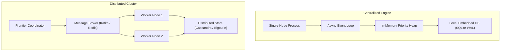
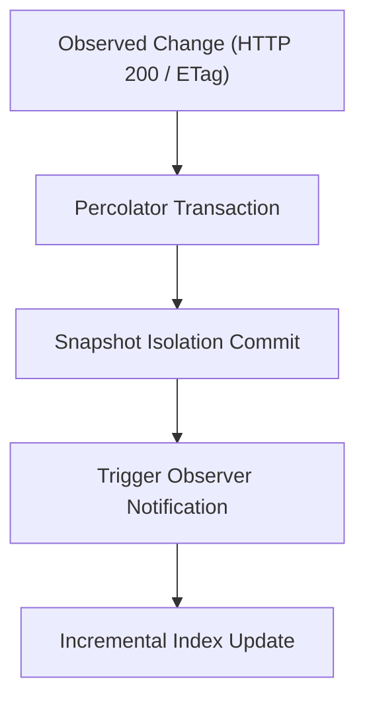

# Web Crawler Architectures: Frontier Design, Memory Hierarchy, and Incremental Processing
This guide explains high-throughput crawler architectures, frontier queue management, and incremental processing pipelines.

***

## 1. Architectural Topologies: Centralized Versus Distributed

Web crawlers collect documents across network endpoints. System designers choose between two core topologies: centralized architectures and distributed clusters.

### Centralized Single-Node Engines
A centralized crawler runs on a single host. It uses an asynchronous event loop or lightweight worker threads.

Centralized crawlers suit focused domain crawls, such as indexing 50,000 package manifests. They avoid network serialization overhead between cluster nodes. Modern single-node crawlers process hundreds of requests per second using embedded databases like SQLite in WAL mode.

### Distributed Multi-Node Clusters
Distributed crawlers partition the URL space across multiple worker nodes. A central coordinator assigns URL hashes to specific nodes.

Distributed architectures suit large-scale crawls exceeding 100 million pages. But distributed crawlers require message brokers, coordination locks, and network storage. This infrastructure increases operational complexity.

| Architecture Dimension | Centralized Engine (e.g., Colly / Node.js) | Distributed Cluster (e.g., Apache Nutch) |
| :--- | :--- | :--- |
| **Node Count** | 1 server | Multi-node cluster |
| **Throughput Ceiling** | 500 to 2,000 requests per second | 10,000+ requests per second |
| **Infrastructure Needs** | Local disk and RAM | ZooKeeper, Kafka, Hadoop/HDFS |
| **Operational Cost** | Low (single virtual machine) | High (multi-instance maintenance) |
| **Failure Recovery** | Process restart from local log | Node failover and partition rebalancing |

---

## 2. The Mercator Frontier: Priority and Politeness Queues

The URL frontier controls crawl order. The frontier must balance two competing goals:
1. **Priority**: Crawling high-value, relevant documents first.
2. **Politeness**: Avoiding request bursts to any single origin host.

Allan Heydon and Marc Najork solved this dilemma in the Mercator crawler[^1].

### The Two-Level Queue Mechanism
Mercator splits frontier management into two tiers:

1. **FIFO Priority Queues (F-Queues)**:
   The crawler assigns newly discovered URLs to an F-Queue based on priority. High-priority feeds (such as root repository manifests) enter high-priority queues. Cosmetic product listings enter lower-priority queues.

2. **Per-Host Politeness Queues (B-Queues)**:
   The crawler maps URLs to B-Queues based on domain name (`booth.pm`, `gumroad.com`, `api.github.com`). Each B-Queue holds URLs for exactly one host.

3. **The Ready Queue and Host Min-Heap**:
   A min-heap stores each active host along with its `next_fetch_time`. When a worker thread requests a URL, it pops the top host from the heap. If `next_fetch_time` is in the future, the worker sleeps until the host is ready.

This mechanism gives a mathematical guarantee: the crawler never fires concurrent requests to the same host[^2].

---

## 3. Frontier Memory Hierarchy and Disk Buffering

Frontier queues for millions of URLs cannot fit in main memory. Najork and Heydon designed a two-level memory hierarchy[^2].

- **RAM Buffers**: Main memory holds the head and tail of each B-Queue.
- **Disk Backing**: The body of each queue resides in sequential append-only disk files.
- **Batch Transfer**: When a RAM buffer empties, the engine reads the next block of URLs from disk.

This design prevents random disk access. Disk I/O remains sequential, preserving disk performance.

---

## 4. Incremental Crawling: The Google Caffeine Architecture

Traditional search engines used batch processing. The crawler fetched pages for weeks, saved them to disk, and ran batch MapReduce jobs.

In 2010, Daniel Peng and Frank Dabek published Percolator, the engine powering Google Caffeine[^3].

### The Percolator Model
Percolator replaced batch MapReduce with incremental notifications:
- **Distributed Transactions**: Percolator adds two-phase commits and snapshot isolation on top of Bigtable.
- **Observers**: Developers write observer functions that trigger when table columns change.
- **Eventual Consistency**: When the crawler updates a package manifest, Percolator triggers an observer. The observer updates search indexes in seconds.

Caffeine reduced average index document age by 50 percent[^3]. For VRChat package discovery, an incremental pipeline updates package versions immediately when a Git release publishes.

***

## References

[^1]: A. Heydon and M. Najork, "Mercator: A scalable, extensible Web crawler," *World Wide Web*, vol. 2, no. 4, pp. 219-229, Dec. 1999.

[^2]: M. Najork and A. Heydon, "High-performance web crawling," Compaq Systems Research Center, Res. Rep. 173, Sep. 2001.

[^3]: D. Peng and F. Dabek, "Large-scale incremental processing using distributed transactions and notifications," in *Proc. 9th USENIX Symp. Operating Systems Design and Implementation (OSDI)*, Vancouver, BC, Canada, 2010, pp. 251-264.
