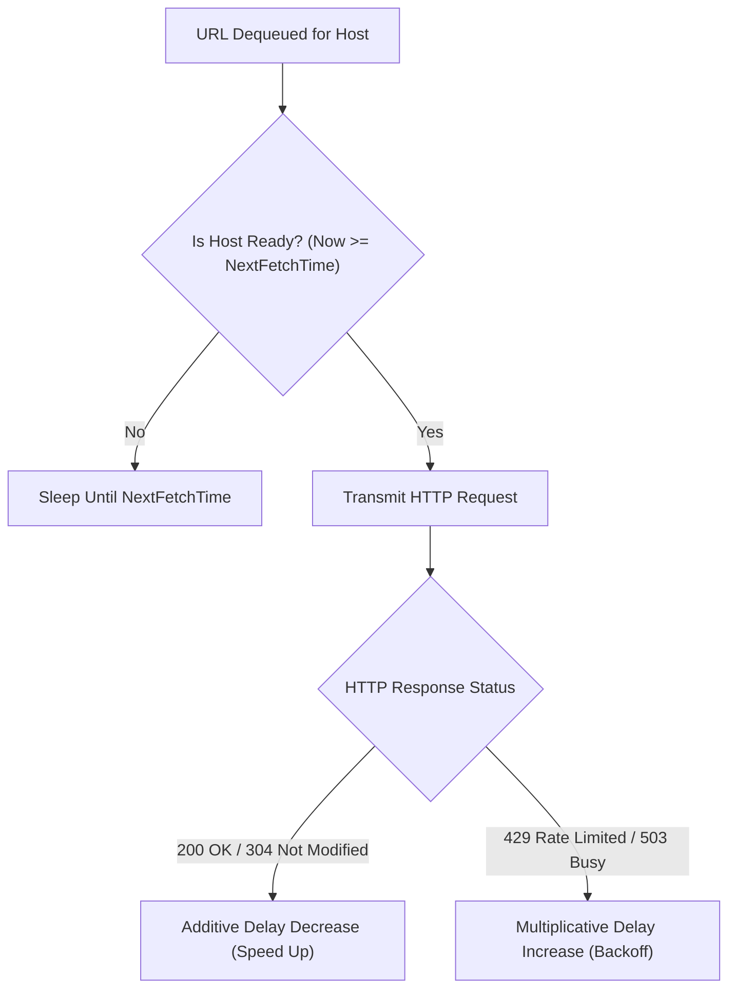
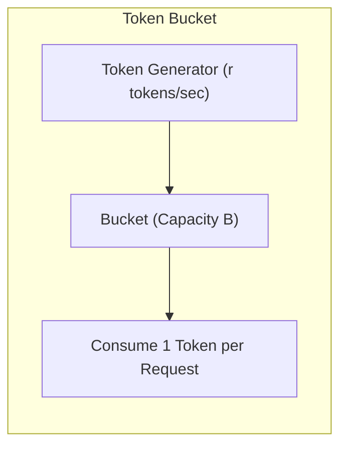
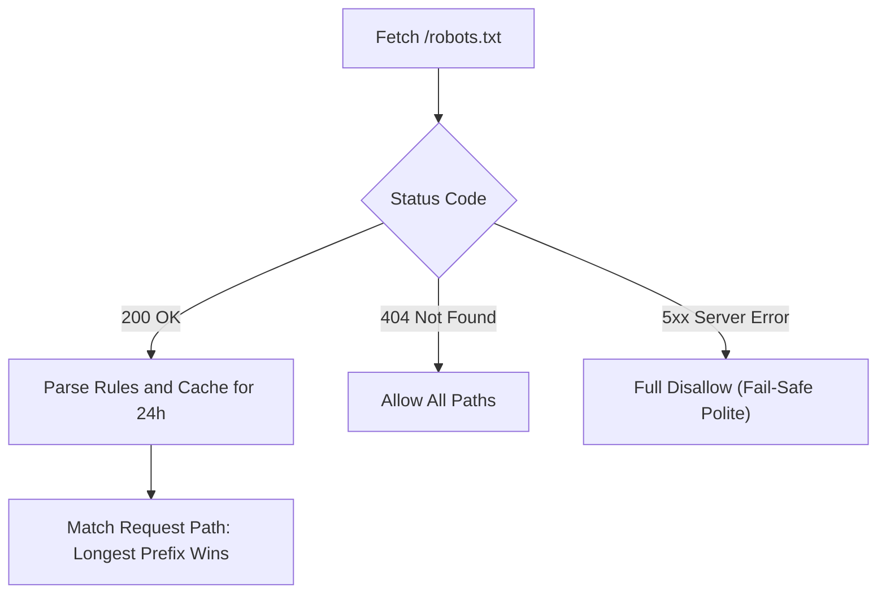

# Politeness Dynamics, Adaptive Rate Limiting, and RFC 9309 Protocol Compliance
This guide defines adaptive rate limiting algorithms, token bucket mechanics, RFC 9309 robots exclusion rules, and backoff jitter.

***

## 1. The Politeness Problem in Search Engine Crawling

Web crawlers request documents from remote web servers. Without rate limiting, a fast crawler can fire hundreds of parallel connections at an origin host.

This burst traffic causes server brownouts and degrades performance for human users[^1]. In response, edge firewalls and load balancers block the crawler with `HTTP 429 Too Many Requests` or `HTTP 403 Forbidden`.

A production crawler must enforce the **Politeness Invariant**:
- At most one request is in flight to any host at any given millisecond.
- Inter-request delays must match or exceed origin capacity.

---

## 2. Token Bucket and Leaky Bucket Algorithms

System designers use bucket algorithms to regulate request flow[^2].

### The Token Bucket Model
A token bucket permits small bursts while maintaining a strict average rate:
- Tokens accumulate in a bucket of capacity $B$ at rate $r$ tokens per second.
- To send an HTTP request, the worker must consume one token.
- If the bucket is empty, the worker must wait for the next token.

For storefronts like BOOTH and Gumroad, set capacity $B = 1$ and rate $r = 1.0$ request per second. Setting $B = 1$ eliminates burst traffic entirely.

### The Leaky Bucket Model
A leaky bucket buffers requests in a FIFO queue and releases them at a constant speed. This algorithm eliminates request clumps. It produces a smooth stream of outgoing packets.

---

## 3. Adaptive Congestion Control: The AIMD Algorithm

Static delays cannot adapt to dynamic server load. The crawler must adapt request rates using **Additive Increase / Multiplicative Decrease (AIMD)**[^3].

### Additive Increase (Normal Health)
When the server returns successful status codes (`HTTP 200 OK` or `HTTP 304 Not Modified`), the crawler slightly decreases delay:

$$T_{\text{delay}} = \max\left(T_{\min}, T_{\text{delay}} - \delta\right)$$

- $T_{\min}$: Absolute floor (such as 1,000 milliseconds for storefronts, 200 milliseconds for GitHub raw CDN).
- $\delta$: Additive reduction step (such as 50 milliseconds).

### Multiplicative Decrease (Congestion Detected)
When the server returns `HTTP 429 Too Many Requests` or `HTTP 503 Service Unavailable`, the crawler multiplies the delay:

$$T_{\text{delay}} = \min\left(T_{\max}, T_{\text{delay}} \times \beta\right)$$

- $\beta$: Multiplicative backoff factor (standard: $\beta = 2.0$).
- $T_{\max}$: Maximum delay ceiling (such as 300,000 milliseconds or 5 minutes).

### Exponential Backoff with Decorrelated Jitter
When multiple crawler workers run simultaneously, synchronized retry loops create thundering herd problems. Adding randomized jitter breaks synchronization[^4].

$$\Delta \tau = \text{random\_between}\left(T_{\min}, T_{\text{delay}} \times 3\right)$$

Random jitter spreads requests across the timeline, allowing the origin server to recover smoothly.

---

## 4. RFC 9309 Robots Exclusion Protocol Compliance

In September 2022, the IETF published RFC 9309 as the official Internet standard for `robots.txt`[^5].

### Parsing Invariants under RFC 9309
A compliant crawler must obey these formal standard rules:

1. **Location and Name**:
   The exclusion file must reside at `/robots.txt` in the root of the URI authority. The filename must be all lowercase.
2. **User-Agent Matching**:
   The crawler matches product-specific product tokens (such as `VRCDiscoveryBot`). If no specific group matches, the crawler falls back to the wildcard group (`User-agent: *`).
3. **Longest Prefix Matching Rule**:
   When both `Allow` and `Disallow` rules match a path, the rule with the longer character length takes precedence:
   - `Allow: /items/free/` (12 characters)
   - `Disallow: /items/` (8 characters)
   - Result: `/items/free/model.json` is allowed.
4. **Cache Lifetime**:
   Crawlers must refresh `/robots.txt` entries within 24 hours. If an origin server returns `HTTP 5xx`, the crawler must treat the entire site as disallowed until the server recovers.

***

## References

[^1]: A. Heydon and M. Najork, "Mercator: A scalable, extensible Web crawler," *World Wide Web*, vol. 2, no. 4, pp. 219-229, Dec. 1999.

[^2]: J. S. Turner, "New directions in communications (or which way to the information age?)," *IEEE Communications Magazine*, vol. 24, no. 10, pp. 8-15, Oct. 1986.

[^3]: V. Jacobson, "Congestion avoidance and control," in *Proc. ACM SIGCOMM '88 Symp. Communications Architectures and Protocols*, Stanford, CA, USA, 1988, pp. 314-329.

[^4]: Amazon Web Services, "Exponential Backoff And Jitter," AWS Architecture Blog, 2015. [Online]. Available: https://aws.amazon.com/blogs/architecture/exponential-backoff-and-jitter/

[^5]: M. Koster, G. Illyes, H. Zeller, and L. Sassman, "Robots Exclusion Protocol," IETF Standards Track RFC 9309, Sep. 2022. [Online]. Available: https://www.rfc-editor.org/info/rfc9309
