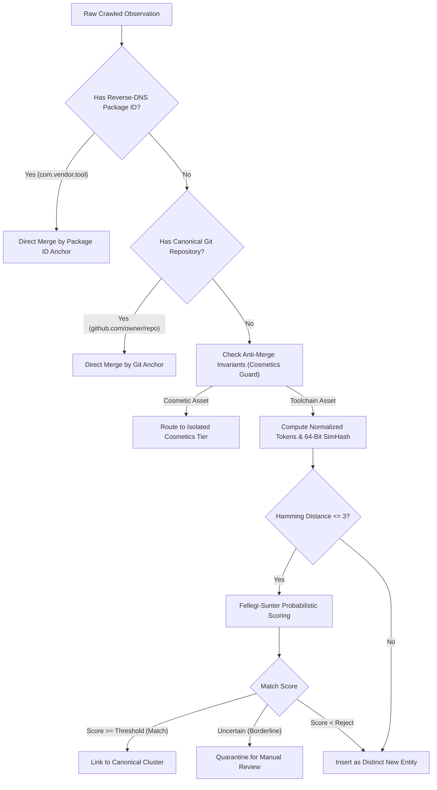
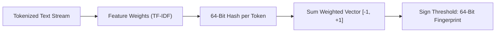

# Entity Resolution, Deduplication, and SimHash Algorithms for Cross-Storefront Packages
This guide will define near-duplicate detection, 64-bit SimHash fingerprinting, Fellegi-Sunter record linkage, and package identity matching.

***

## 1. The Multi-Storefront Entity Disambiguation Problem

In the VRChat ecosystem, developers will distribute software packages across multiple platforms simultaneously. A developer might host source code on GitHub, distribute packages through VPM feeds, and sell support tiers on BOOTH and Gumroad.

Naive crawlers will create duplicate entries because each storefront uses different URLs, pricing structures, and titles. Authors will also add marketing banners and decorative brackets:
- Listing A: `【VRChat / Modular Avatar】Face Tracking Setup v2`
- Listing B: `nadena.dev.modular-avatar (GitHub Release 1.9.2)`
- Listing C: `[Tool] Face Tracking Auto-Setup for Kikyo (Gumroad)`

To unify these listings into a single catalog record, the engine will use hierarchical entity resolution[^1].

---

## 2. The Deterministic Anchor Lattice and Schema Deduplication

The engine will evaluate candidate links using a strict deterministic priority order:

1. **Primary Anchor: Reverse-DNS Identifier**:
   The VRChat Package Manager mandates reverse-DNS names (such as `com.llealloo.audiolink`, `nadena.dev.modular-avatar`)[^2]. These identifiers are globally unique. Any storefront listing that references this identifier will link to that canonical entity.

2. **Secondary Anchor: Canonical Repository URL**:
   When developers link their storefront to an upstream repository, the crawler will normalize the Git URL:
   - Strip `.git` suffixes.
   - Lowercase hostname and path.
   - Strip branch parameters and commit hashes.
   If two listings share the normalized repository URL, the engine will group them together.

3. **Tertiary Anchor: Normalized Title and Author**:
   When machine identifiers are missing, the engine will clean titles:
   - Strip marketing prefixes: `【VRChat】`, `【無料】`, `[Tool]`.
   - Remove emojis, version numbers, and avatar base names.
   - Convert full-width Japanese alphanumeric characters to half-width ASCII.

### Relational Schema Normalization and Field Deduplication
To eliminate architectural debt and column collisions, the unified database will eliminate redundant mirrors:
- `canonical_packages` will project canonical metadata without duplicating per-platform URLs across flat columns and JSON arrays.
- `package_fronts` will store platform-specific URL rows, pricing tiers, and vendor links.
- `curator_overrides` will coalesce override fields cleanly, deprecating legacy collisions between `name_override` and `title_override`.

---

## 3. Near-Duplicate Document Detection: The 64-Bit SimHash Algorithm

To detect near-duplicate package descriptions and metadata pages, search engines will use SimHash[^3].

### SimHash Mathematical Computation
Manku, Jain, and Das Sarma established SimHash as the industry standard for web crawling:
1. Extract features (word tokens) from the document: $f_1, f_2, \dots, f_m$.
2. Compute a 64-bit cryptographic hash for each feature: $h(f_i)$.
3. Assign a weight $w_i$ based on token frequency (TF-IDF).
4. Initialize a vector $V$ of 64 zeros. For each bit $b \in [0, 63]$:
   - If bit $b$ of $h(f_i)$ is 1, add $w_i$ to $V[b]$.
   - If bit $b$ of $h(f_i)$ is 0, subtract $w_i$ from $V[b]$.
5. Generate the final 64-bit fingerprint:
   - Fingerprint bit $b = 1$ if $V[b] > 0$.
   - Fingerprint bit $b = 0$ if $V[b] \le 0$.

### Fast Hamming Distance Lookup
Two documents will be considered near-duplicates if their fingerprints differ by $k \le 3$ bits.

Comparing a new fingerprint against millions of stored fingerprints takes too long with brute force. Manku et al. solved this by table partitioning:
- Split the 64-bit fingerprint into 4 tables of 16 bits each.
- By the Pigeonhole Principle, if two fingerprints differ by at most 3 bits, at least one 16-bit table must match exactly.
- The engine will use the matching 16 bits as an integer key in a hash table.
- This technique will identify candidates in sub-millisecond time.

### Avatar Cosmetics Collision Risks and Anti-Merge Rules
VRChat assets share identical boilerplate descriptions and compatibility tokens ("Kikyo", "Manuka", "PhysBones", "Unity 2022"). Stripping brackets and formatting causes 64-bit SimHash ($k \le 3$) to falsely merge distinct clothing, hair, or texture packages.

To protect catalog integrity, the engine will enforce strict anti-merge invariants:
1. **Toolchain Catalog Isolation**: The engine will penalize apparel (-15 points) and hair (-15 points) to exclude them from toolchain clustering.
2. **Identity Verification**: Two listings with identical SimHash fingerprints will not merge unless they share identical author signatures or matching storefront accounts.
3. **Isolated Taxonomy Tier**: Any future cosmetic indexing will require a separate taxonomy tier with base-avatar associations, air-gapped from developer tools.

---

## 4. The Fellegi-Sunter Probabilistic Linkage Model and Timestamp Rubric

Ivan Fellegi and Alan Sunter created the mathematical foundation for record linkage in 1969[^4].

### Decision Rule
Let $A$ and $B$ represent two records from different storefronts. The engine will compare their fields to produce a comparison vector $\gamma$.

The decision rule tests the likelihood ratio:

$$R = \frac{P(\gamma \mid (A,B) \in M)}{P(\gamma \mid (A,B) \in U)}$$

- $M$ is the set of true matches.
- $U$ is the set of true non-matches.

The engine will classify record pairs into three outcomes:
1. If $R \ge T_{\mu}$, the pair is an automatic **Match**.
2. If $T_{\lambda} < R < T_{\mu}$, the pair enters **Quarantine** for human review.
3. If $R \le T_{\lambda}$, the pair is an automatic **Non-Match**.

### String Distance Metrics
For author names and titles, the engine will calculate the Jaro-Winkler string similarity[^5]. Jaro-Winkler measures character transpositions while giving higher weight to shared prefixes. A threshold of 0.88 reliably detects creator alias variants while preventing false merges.

### Timestamp Confidence Rubric
Accurate temporal sorting requires unambiguous creation timestamps. The engine will assign `origin_created_at` using a strict three-state confidence rubric:
- `'confirmed'`: The timestamp is scraped directly from platform metadata (such as GitHub API `created_at` or BOOTH microdata).
- `'inferred'`: The timestamp is derived from the earliest verified release tag, Git commit, or initial archival observation.
- `'unknown'`: Explicitly set to `NULL` with `created_at_confidence = 'unknown'`.

The engine will never substitute local crawl fetch times for missing origin publication dates. Downstream user interfaces will handle null dates via explicit sorting semantics (`ORDER BY origin_created_at NULLS LAST`).

***

## References

[^1]: P. Christen, *Data Matching: Concepts and Techniques for Record Linkage, Entity Resolution, and Duplicate Detection*, Berlin, Germany: Springer-Verlag, 2012.

[^2]: VRChat Inc., "VRChat Package Manager Package Manifest Specification," VRChat Documentation, 2024. [Online]. Available: https://vcc.docs.vrchat.com/vpm/packages/

[^3]: G. S. Manku, A. Jain, and A. Das Sarma, "Detecting Near-Duplicates for Web Crawling," in *Proc. 16th Int. Conf. World Wide Web (WWW)*, Banff, Alberta, Canada, 2007, pp. 141-150.

[^4]: I. P. Fellegi and A. B. Sunter, "A Theory for Record Linkage," *Journal of the American Statistical Association*, vol. 64, no. 328, pp. 1183-1210, Dec. 1969.

[^5]: W. E. Winkler, "String Comparator Metrics and Enhanced Decision Rules in the Fellegi-Sunter Model of Record Linkage," in *Proc. Section on Survey Research Methods*, American Statistical Association, 1990, pp. 354-359.
