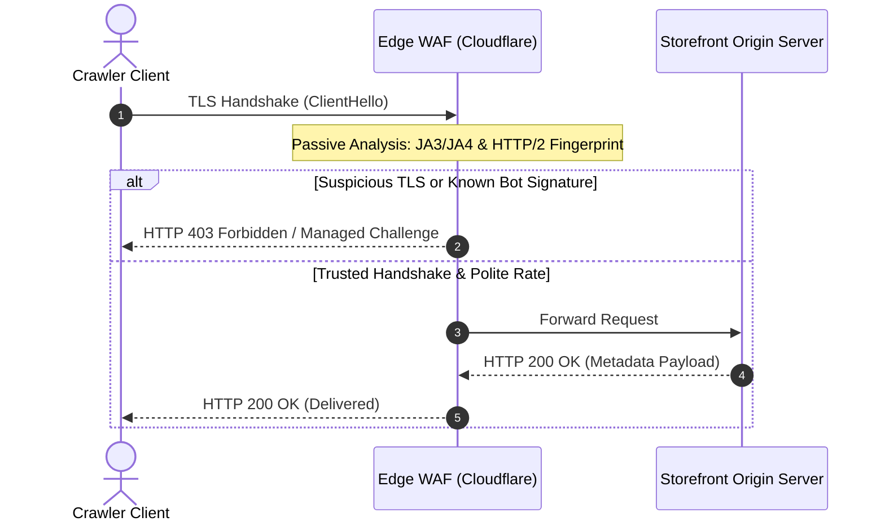
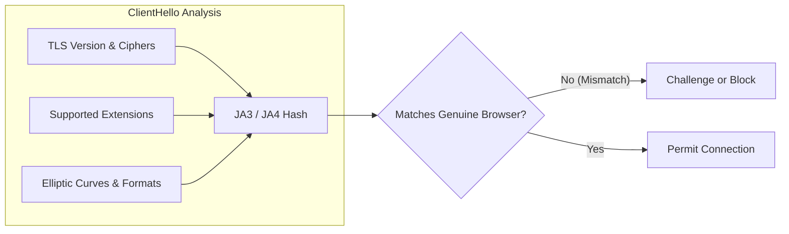
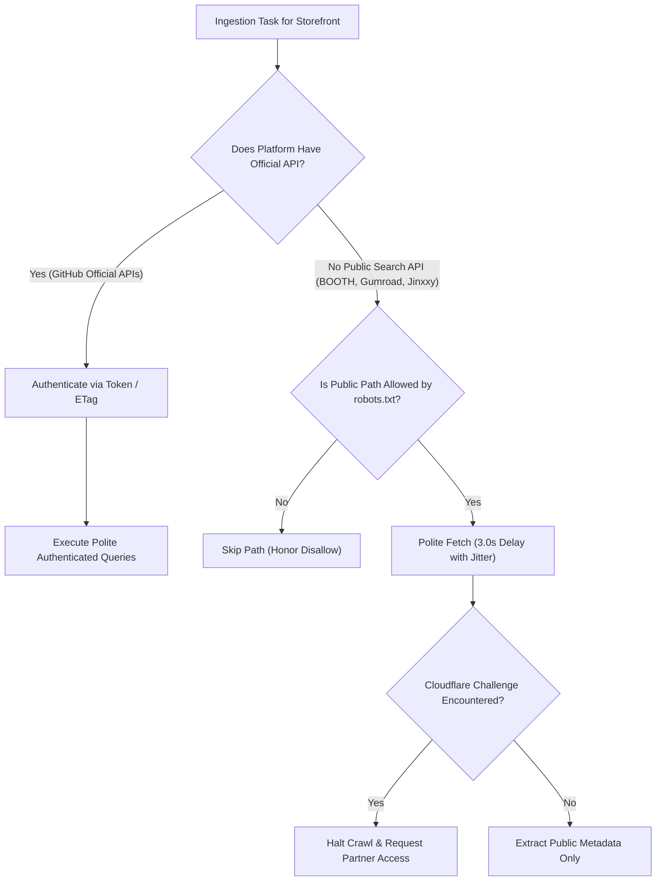

# Anti-Bot Perimeter Mechanics, TLS Fingerprinting, and the API-First Invariant
This guide will analyze Cloudflare Turnstile, JA3/JA4 TLS fingerprinting, headless browser overhead, and API-first ingestion.

***

## 1. The Modern Perimeter Security Architecture

Digital storefronts will protect their servers against automated scraping. Platforms like BOOTH, Gumroad, and Jinxxy will use edge Web Application Firewalls (WAFs) and perimeter defense networks[^1].

Edge firewalls evaluate incoming connections before the origin web server runs application code. If the firewall flags a client, it will serve an `HTTP 403 Forbidden` response or a Cloudflare Managed Challenge.

### The Cloudflare Turnstile Challenge Trap on HTTP 200
Cloudflare Managed Challenges frequently return status code `HTTP 200 OK` accompanied by an HTML payload containing Turnstile scripts.

If an engine does not inspect payload contents, it will misidentify this challenge barrier as genuine document content. The engine will parse challenge scripts as product descriptions and will trigger freshness acceleration loops.

Production engines will inspect incoming payloads for challenge signatures (`cf-mitigated: challenge`, `challenges.cloudflare.com/turnstile`). When detected, the engine will treat the response as an access barrier rather than indexable content.

---

## 2. Passive Detection: TLS and HTTP/2 Fingerprinting

Early anti-bot systems inspected only HTTP request headers (such as the `User-Agent` string). Modern edge networks will identify automated clients passively through transport-layer characteristics[^2].

### The JA3 and JA4 TLS Fingerprints
When a client starts an HTTPS connection, it will send a `ClientHello` packet:
- TLS version number.
- Accepted cryptographic cipher suites.
- Extensions and supported elliptic curves.
- Supported point formats.

Security systems will hash these parameters into a 32-character string known as a **JA3** or **JA4** fingerprint[^3].

Standard programming libraries (such as Python `requests`, Go `net/http`, or Node.js `https`) emit distinct cryptographic handshakes. If a crawler transmits a Google Chrome `User-Agent` but produces a standard library handshake, the firewall flags the mismatch immediately.

### HTTP/2 and Post-Quantum Key Shares
Modern edge firewalls will also inspect HTTP/2 connection parameters:
- Header compression settings (`SETTINGS_HEADER_TABLE_SIZE`).
- Stream priority trees and window update intervals.
- Post-Quantum (PQ) key encapsulation mechanisms (such as X25519Kyber768).

Standard headless scripts fail to simulate these subtle network behaviors.

---

## 3. Headless Browser Fragility and Pass-Through Media Delivery

Some developers deploy headless browsers (such as Puppeteer or Playwright) with stealth plugins to bypass challenges. In production search pipelines, this practice introduces severe performance and stability bottlenecks[^4].

| Metric | Headless Browser (Chromium) | Lightweight HTTP Client (API-First) |
| :--- | :--- | :--- |
| **Memory per Task** | 80 to 250 MB | 2 to 5 MB |
| **Execution Latency** | 3,000 to 8,000 ms (DOM execution) | 50 to 300 ms (direct socket read) |
| **Max Concurrency (16GB RAM)** | 40 to 80 pages | 2,000+ parallel streams |
| **Stability** | High crash rate and memory leaks | Stable long-running daemon |
| **Perimeter Evasion Fragility** | Constant breakage on challenge updates | Predictable contract via API keys |

Deploying automated CAPTCHA solvers or proxy rotators to defeat barriers creates severe legal liability under access laws[^5].

### Ephemeral Pass-Through Image Proxying Versus Hotlink Blocking
Storefront content delivery networks (including BOOTH and Gumroad) actively prevent client direct image hotlinking. They enforce signed HMAC tokens, `Referer` validation, and return `HTTP 403 Forbidden` to external `` elements.

To reduce media copyright exposure and storage overhead, the architectural roadmap plans a transition toward an ephemeral pass-through image proxy (AGENT.md CR-19/CR-21):
1. In the current implementation, `ImageProxyService` fetches storefront preview images, downscales them to $480 \times 270$ WebP format, stores binary thumbnails in local SQLite (`media_cache.webp_data`), and serves them via `/v1/media/:id`.
2. Under the planned architectural deprecation, the service will phase out persistent BLOB caching in favor of ephemeral in-memory downscaling or direct origin URL redirection.
3. Volatile processing will stream the optimized image directly to the client without persistent disk or object storage.

### YouTube Embed Filtering at the Frontier
Media extraction parsers will frequently observe YouTube iframe or embed links (`youtube.com/embed/`, `youtu.be/`). Passing HTML embed targets into binary image processing queues causes Sharp image workers to crash with unhandled exceptions.

The crawler will enforce strict protocol and MIME preflight verification. Media links containing YouTube domains will route directly to `youtube_urls` metadata arrays. The system will never enqueue YouTube URLs into the image proxy service.

---

## 4. The API-First Invariant and Zero-Bypass Ethics

Compliant indexers will operate on the **API-First Invariant**:
- If an official API exists, the crawler will query that API.
- If an edge firewall presents a challenge barrier, the crawler will treat this as a technical refusal of service.
- The crawler will never deploy CAPTCHA bypass farms, residential proxy rotators, or memory injection hooks.

When an indexer hits a barrier on a closed platform, the engineering team will contact platform administrators or will restrict indexing to verified public metadata manifests.

***

## References

[^1]: Cloudflare Inc., "Cloudflare Bot Management: Comprehensive Protection Against Malicious Bots," Whitepaper, 2024. [Online]. Available: https://www.cloudflare.com/products/bot-management/

[^2]: J. Althouse, J. Atkinson, and J. Atkins, "Open Sourcing JA3," Salesforce Engineering Blog, 2017; and J. Althouse, "JA4+ Network Fingerprinting," Fox-IT / NCC Group, 2023. [Online]. Available: https://github.com/Fox-IT/ja4

[^3]: J. Althouse, "JA4+ Network Fingerprinting," Fox-IT / NCC Group, 2023. [Online]. Available: https://github.com/Fox-IT/ja4

[^4]: Scrapfly Engineering, "Cloudflare Turnstile and Anti-Bot Architecture," Scrapfly Technical Documentation, 2024. [Online]. Available: https://scrapfly.io/docs/scrape-api/anti-scraping/cloudflare

[^5]: U.S. District Court for the Northern District of California, *Meta Platforms, Inc. v. Bright Data Ltd.*, Case No. 3:23-cv-00077-EMC, Jan. 23, 2024.
