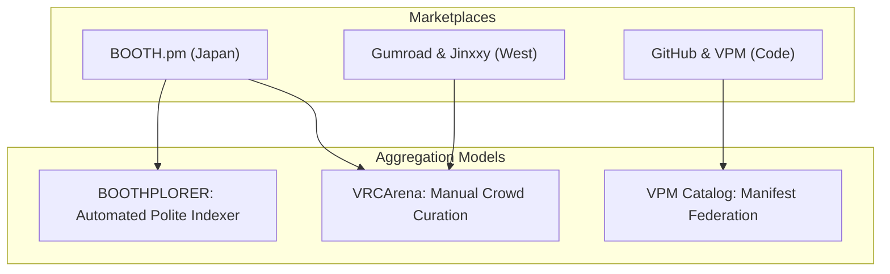
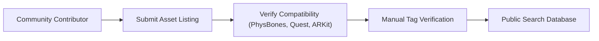
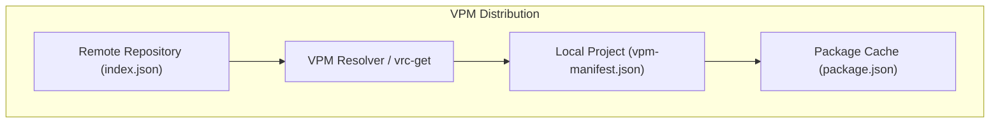

# VRChat Discovery Ecosystem: Case Studies of BOOTHPLORER, VRCArena, GumRadar, and VPM Registries
This guide will review discovery architectures, community curation models, and metadata patterns across the VRChat ecosystem.

***

## 1. Overview of the VRChat Discovery Landscape

The VRChat asset ecosystem will span thousands of independent creators. Marketplace fragmentation separates artists and users across geographic regions:
- Japanese creators will distribute character models and accessories primarily on BOOTH.pm[^1].
- Western creators will sell avatars, clothing, and systems on Gumroad and Jinxxy[^2].
- Software developers will publish open-source shaders, Udon libraries, and Editor tools on GitHub and VPM repositories[^3].



Discovering compatible assets will remain complex. A clothing mesh made for the "Kikyo" avatar base will not fit "Manuka" or "Shinano" without modification.

---

## 2. Case Study 1: BOOTHPLORER

BOOTHPLORER acts as an English-language search directory for BOOTH.pm listings[^4].

### Architectural Characteristics
- **Scope**: Indexes more than 128,000 items and 2,000 avatar bases.
- **Taxonomy Normalization**: Maps Japanese tag variants (`MA対応`, `PhysBones対応`) to structured search filters.
- **The Zero-Binary Rule**: BOOTHPLORER will store zero 3D models, textures, or `.unitypackage` files.
- **Traffic Redirection**: Every search card will route buyers directly to the creator's BOOTH store page for purchase.
- **Respectful Politeness**: Runs request rates below 0.33 Hz (3 to 5 second delays) with randomized intervals. Honors creator exclusion requests without friction.

BOOTHPLORER gained community trust by acting strictly as a discovery multiplier for creators.

---

## 3. Case Study 2: VRCArena

VRCArena uses a crowd-sourced curation architecture for VRChat avatar discovery[^5].



### Why VRCArena Rejects Automated DOM Scraping
VRCArena chose a manual submission model over automated crawlers for specific reasons:
1. **Metadata Noise**: Automated HTML scrapers collect irrelevant marketing slogans and decorative brackets.
2. **Missing Compatibility Flags**: Automated tools cannot inspect 3D files to confirm ARKit face tracking or Quest shader performance.
3. **Piracy Risks**: Automated scraping often ingests stolen or re-uploaded packages from unverified shops.

### The Grounding Truth Verdict on VRCArena Ingestion
Both VRCArena and this crawler are open source, and VRCArena's `robots.txt` records `User-agent: * Allow: /`. While RFC 9309 provides operational crawling conventions and decisions such as *Meta Platforms, Inc. v. Bright Data Ltd.* evaluated unauthenticated web access under specific contractual records, the Project does not treat these sources as universal legal authorization.

However, deploying an automated HTML DOM scraper against VRCArena will remain prohibited for three architectural reasons:
- **Aggregator Fragility**: VRCArena is a secondary curated index linking out to BOOTH, Gumroad, and itch. Scraping rendered HTML parses secondary redirects and stale caches rather than primary source records.
- **Server Load on Community Infrastructure**: Scraping rendered HTML pages imposes unnecessary SSR rendering and bandwidth costs on a volunteer, donor-funded non-profit project.
- **Taxonomy Collisions**: VRCArena centers on avatars and base models (Rexouium, Avali, Kikyo), whereas this crawler is strictly tuned for toolchains and VPM libraries. Ingesting cosmetics without strict isolation triggers SimHash false merges.

The crawler will strictly reject automated HTML DOM scraping. If integration is pursued, the system will rely on bilateral open-source API federation or static dataset dumps with a strict toolchain-only whitelist.

---

## 4. Case Study 3: GumRadar

In 2024, developer Girff built GumRadar to analyze discovery signals on Gumroad[^6].

### Technical Findings
GumRadar studied how Gumroad ranks digital products:
- Gumroad ranks products by sales velocity, review recency, and seller verification status.
- Raw HTML scraping triggered immediate edge blocks.
- GumRadar switched to polite polling of public seller catalog endpoints with exponential backoff.

GumRadar confirmed that monitoring public catalog metadata yields accurate discovery rankings without harvesting private seller data.

---

## 5. Case Study 4: The VRChat Package Manager (VPM) Federation

The VRChat Package Manager (VPM) distributes software tools, shaders, and runtime libraries[^7].



### Manifest Specifications
The VPM standard relies on three machine-readable JSON documents:
1. **`index.json`**:
   The central repository catalog. It lists available packages, version histories, and download URLs.
2. **`package.json`**:
   The package manifest. It specifies dependencies through `vpmDependencies`:
   ```json
   {
     "name": "nadena.dev.modular-avatar",
     "version": "1.10.1",
     "vpmDependencies": {
       "com.vrchat.avatars": ">=3.5.0"
     }
   }
   ```
3. **`vpm-manifest.json`**:
   The project lockfile. It records installed packages and version constraints.

Community tools like `vrc-get` show that parsing federated `index.json` manifests gives faster and more reliable discovery than HTML web scraping[^8].

### The Open-Web Discovery Fallacy Versus Federated Seeding
Crawling the unindexed open web for arbitrary `index.json` or `vpm-manifest.json` files without domain-level seed constraints is computationally infeasible. Unbounded web spiders produce astronomical noise, hit bot-walls, and risk infinite spider loops.

The engine will reject open-ended web crawling. Discovery will expand strictly through federated registry seeding:
- Parsing verified community package lists (e.g., ALCOM community listings).
- Extracting VPM repository URLs from verified creator documentation.
- Polling federated index endpoints with conditional HTTP caching.

---

## 6. Creator Norms and Anti-AI Licensing

VRChat artists include strict licensing clauses in storefront listings[^9].
- **No Mesh Extraction**: Buyers will not extract 3D sub-components to bypass individual commercial licenses.
- **No Machine Learning Ingestion**: Models, textures, and renders will not enter training datasets for generative artificial intelligence.

Discovery engines will respect these boundaries. Violating creator licensing destroys community goodwill and triggers legal action.

***

## References

[^1]: pixiv Inc., "About BOOTH," booth.pm, 2024. [Online]. Available: https://booth.pm

[^2]: Jinxxy, "Introducing Jinxxy Marketplace," Reddit announcement, 2021. [Online]. Available: https://www.reddit.com/r/VRchat/comments/qsc7ws/introducing_jinxxy_marketplace_indexing_for/

[^3]: vrchat-community, "vpm-listing-curated: A curated listing of community VPM packages," GitHub, 2024. [Online]. Available: https://github.com/vrchat-community/vpm-listing-curated

[^4]: BOOTHPLORER, "A directory for VRChat assets on BOOTH," boothplorer.com, 2024. [Online]. Available: https://boothplorer.com

[^5]: The VRCArena Project, "VRCArena Documentation and Curation Standards," vrcarena.com, 2024. [Online]. Available: https://www.vrcarena.com

[^6]: Girff, "I Tracked Gumroad's Hidden Signals - And Built GumRadar," Medium, 2024. [Online]. Available: https://girff.medium.com/i-tracked-gumroads-hidden-signals-and-built-gumradar-to-make-them-visible-9cc4faff8b3c

[^7]: VRChat Inc., "VRChat Creator Companion and Package Management," VRChat Documentation, 2024. [Online]. Available: https://vcc.docs.vrchat.com

[^8]: anatawa12, "vrc-get: An open-source command line tool for VRChat Package Manager," GitHub, 2024. [Online]. Available: https://github.com/vrc-get/vrc-get

[^9]: Automaton Media, "pixiv to tackle the issue of AI art misuse, imitation, data collection," May 2023. [Online]. Available: https://automaton-media.com/en/nongaming-news/20230511-18820/
