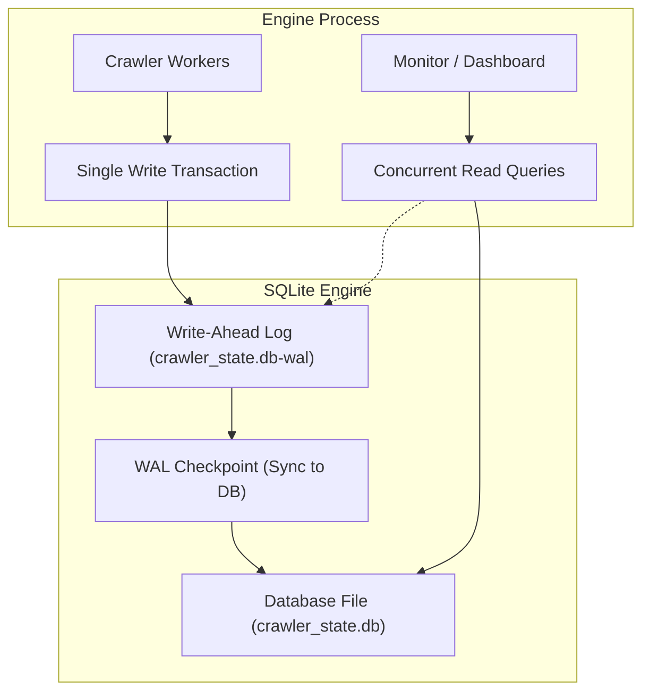
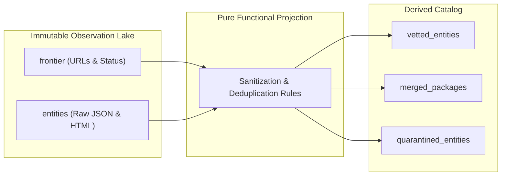
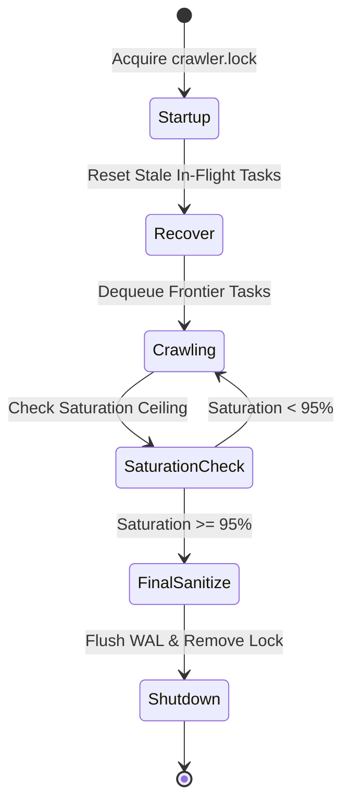

# Operational Storage, SQLite WAL Optimizations, and Fault-Tolerant Crawl Recovery
This guide details high-throughput SQLite WAL storage, CQRS raw observation caching, process locks, and crash recovery.

***

## 1. The Storage Challenge in Crawling Systems

A web crawler generates high write traffic. The engine stores URLs, HTTP status codes, response headers, and document payloads.

Traditional relational database servers introduce network latency and connection overhead. For single-node crawlers indexing under one million entities, embedded storage like SQLite gives superior performance when configured correctly[^1].



---

## 2. SQLite Configuration for High-Concurrency Write Throughput

Standard SQLite configurations lock the entire database file during writes. To support hundreds of writes per second alongside concurrent dashboard queries, apply these settings:

### Write-Ahead Logging (WAL Mode)
```sql
PRAGMA journal_mode = WAL;
```
In WAL mode, SQLite writes changes to a separate `-wal` file sequentially. Writers do not block readers, and readers do not block writers[^2].

### Synchronous Normal
```sql
PRAGMA synchronous = NORMAL;
```
In `NORMAL` mode, the operating system syncs the WAL file during checkpoints rather than on every transaction commit. This reduces disk I/O wait times while keeping database integrity against application crashes.

### Memory Cache and Page Size
```sql
PRAGMA page_size = 4096;
PRAGMA cache_size = -64000; -- Allocates 64 MB of RAM for cache
PRAGMA temp_store = MEMORY;
```
Storing temporary tables and indices in RAM prevents unnecessary disk churn.

---

## 3. The CQRS Pattern: Raw Observation Lake Versus Derived Projections

To protect crawl investments, the database separates raw network observations from derived business projections[^3].



### The Observation Lake Invariant
The crawler treats remote HTTP responses as an append-only event log:
- The `entities` table stores the raw payload, URL, timestamp, and HTTP headers.
- The engine never mutates raw observations.

### Derived Catalog Projections
Tables like `merged_packages` and `vetted_entities` represent functional projections of the raw data.
When developers improve deduplication logic or classification filters, they do not re-crawl the web. They wipe the derived tables and recompute the catalog directly from local raw observations in seconds.

---

## 4. Process Lifecycle, Lock Files, and Crash Recovery

Crawlers run as background services for days. They must survive system reboots and sudden power interruptions[^4].



### Process Lock Files
To prevent duplicate instances from corrupting the database, the engine writes an atomic lock file (`crawler.lock`) at startup. The lock file records:
- Operating system Process ID (PID).
- Startup timestamp.
- Monotonic heartbeat timestamp updated every 10 seconds.

If a new process starts, it checks the lock file. If the PID is dead, the process reclaims the lock safely.

### Crash Recovery Invariant
If a machine halts abruptly, tasks left in `processing` status become orphaned. On startup, the engine runs recovery SQL:
```sql
UPDATE frontier SET status = 'pending' WHERE status = 'processing';
```
This resets orphaned tasks without losing frontier state.

### The 95 Percent Saturation Stop Sequence
To prevent infinite crawler loops in circular web graphs, the engine monitors discovery saturation:

$$S = \frac{\text{Processed URLs}}{\text{Total Discovered URLs}}$$

When saturation crosses 95 percent ($S \ge 0.95$), the engine halts frontier seeding. It finishes in-flight requests, runs the final sanitization pass, flushes SQLite checkpoints, and shuts down cleanly.

***

## References

[^1]: SQLite Development Team, "SQLite As An Application File Format," sqlite.org, 2024. [Online]. Available: https://www.sqlite.org/appfileformat.html

[^2]: SQLite Development Team, "Write-Ahead Logging," sqlite.org, 2024. [Online]. Available: https://www.sqlite.org/wal.html

[^3]: M. Fowler, "CQRS (Command Query Responsibility Segregation)," martinfowler.com, 2011. [Online]. Available: https://martinfowler.com/bliki/CQRS.html

[^4]: M. Kleppmann, *Designing Data-Intensive Applications: The Big Ideas Behind Reliable, Scalable, and Maintainable Systems*, Sebastopol, CA, USA: O'Reilly Media, 2017.
