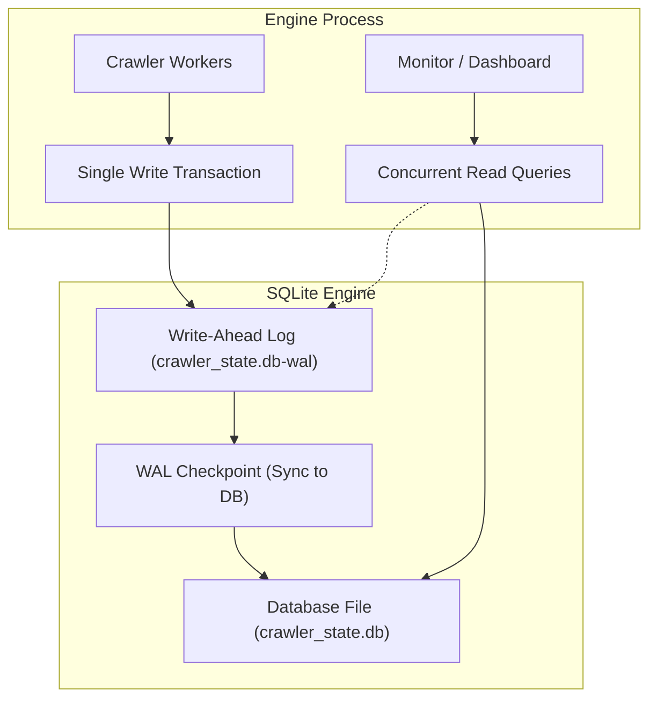
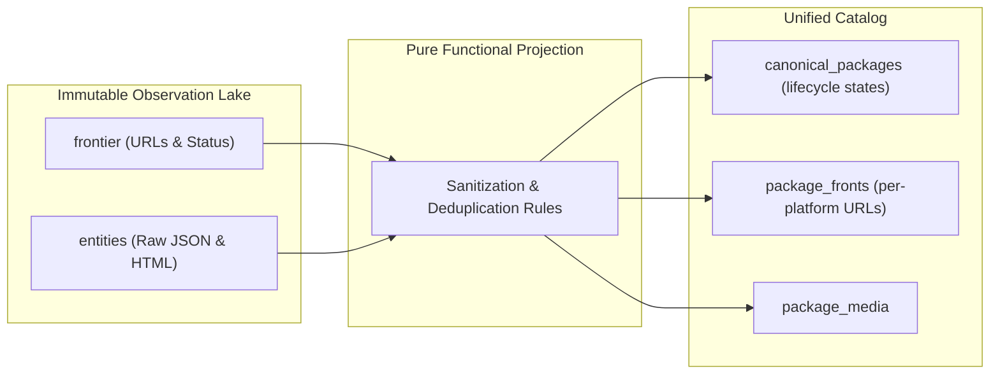
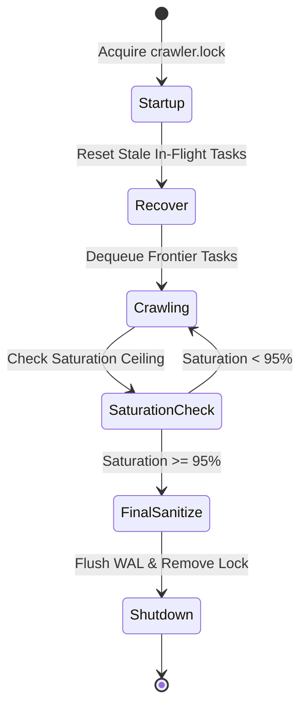

# Operational Storage, SQLite WAL Optimizations, and Fault-Tolerant Crawl Recovery
This guide will detail high-throughput SQLite WAL storage, CQRS raw observation caching, process locks, and crash recovery.

***

## 1. The Storage Challenge in Crawling Systems

A web crawler will generate high write traffic. The engine will store URLs, HTTP status codes, response headers, and document payloads.

Traditional relational database servers introduce network latency and connection overhead. For single-node crawlers indexing under one million entities, embedded storage like SQLite gives superior performance when configured correctly[^1].



---

## 2. SQLite Configuration for High-Concurrency Write Throughput

Standard SQLite configurations lock the entire database file during writes. To support hundreds of writes per second alongside concurrent dashboard queries, the engine will apply these settings:

### Write-Ahead Logging (WAL Mode)
```sql
PRAGMA journal_mode = WAL;
```
In WAL mode, SQLite will write changes to a separate `-wal` file sequentially. Writers will not block readers, and readers will not block writers[^2].

### Synchronous Normal
```sql
PRAGMA synchronous = NORMAL;
```
In `NORMAL` mode, the operating system syncs the WAL file during checkpoints rather than on every transaction commit. This reduces disk I/O wait times while keeping database integrity against application crashes.

### Memory Cache and Page Size
```sql
PRAGMA page_size = 4096;
PRAGMA cache_size = -64000; -- Allocates 64 MB of RAM for cache
PRAGMA temp_store = MEMORY;
```
Storing temporary tables and indices in RAM will prevent unnecessary disk churn.

### SQLite Concurrency and Test Suite Isolation Invariants
In `src/db.ts`, the database sets:
```sql
PRAGMA busy_timeout = 10000;
```
This instructs SQLite to wait up to 10 seconds for locks. 

When multiple test files or background processes execute concurrently against the live 357 MB database `dist/crawler_state.db`, exclusive transaction locks (such as catalog exports) cause concurrent tasks to enter busy wait. If a test runner sets a 5,000ms timeout, tests fail spuriously before the 10,000ms busy wait expires.

Automated test suites must isolate their execution environment:
- Use in-memory SQLite instances (`:memory:`).
- Use dedicated ephemeral database files for isolated test runs.
- Avoid concurrent read/write locks against the production database file during automated CI runs.

---

## 3. The CQRS Pattern: Raw Observation Lake Versus Derived Projections

To protect crawl investments, the database will separate raw network observations from derived business projections[^3].



### The Observation Lake Invariant
The crawler will treat remote HTTP responses as an append-only event log:
- The `entities` table will store the raw payload, URL, timestamp, and HTTP headers.
- The engine will never mutate raw observations.

### Derived Catalog Projections and Schema Unification
The catalog schema will project raw observations into unified relational tables:
- `canonical_packages`: The central deduplicated package entity with lifecycle states (`active`, `quarantined`, `delisted`). Legacy tables (`vetted_entities`, `merged_packages`) are deprecated.
- `package_fronts`: Per-storefront URLs, vendor details, and localized pricing tiers.
- `curator_overrides`: Community and administrative overrides applied dynamically during projection runs.

When developers improve deduplication logic or classification filters, they will not re-crawl the web. They will recompute projections directly from raw local observations.

### Edge Sync Watermark Recovery and Full-Wipe Projection Risks
Periodic projection scripts that execute `DELETE FROM canonical_packages` reset SQLite auto-incrementing rowids to 1.

In edge synchronization tools (such as `vrc-sync.exe`), watermark resets only trigger if the stored watermark exceeds the maximum row ID in the table (`watermarkRowId > maxRowInDb`). If a table is rebuilt with more rows than the previous watermark, the reset check fails. The synchronization tool will skip rows 1 through the watermark, silently dropping packages from Cloudflare D1.

To prevent edge data loss:
- The sync utility will provide a manual forced reset flag (`--reset-watermark`).
- Production pipelines will verify watermark row alignment with remote D1 before completing sync sweeps.
- Projections will migrate to deterministic UUID keys or projection epoch counters instead of mutable auto-increment row IDs.

---

## 4. Process Lifecycle, Lock Files, and Crash Recovery

Crawlers will run as background services for days. They will survive system reboots and sudden power interruptions[^4].



### Process Lock Files
To prevent duplicate instances from corrupting the database, the engine will write an atomic lock file (`crawler.lock`) at startup. The lock file will record:
- Operating system Process ID (PID).
- Startup timestamp.
- Monotonic heartbeat timestamp updated every 10 seconds.

If a new process starts, it will check the lock file. If the PID is dead, the process will reclaim the lock safely.

### Crash Recovery Invariant
If a machine halts abruptly, tasks left in `processing` status become orphaned. On startup, the engine will run recovery SQL:
```sql
UPDATE frontier SET status = 'pending' WHERE status = 'processing';
```
This will reset orphaned tasks without losing frontier state.

### Structured Log Rotation and Session Archival
Monolithic log appending creates unbounded disk growth. The logging subsystem will divide output by session and date:
- Session prefixes: Output streams will write to `session_<pid>_<iso>.log`.
- Daily rotation: Log files will rotate at UTC midnight.
- Gzip compression: Rotated logs will compress asynchronously (`.log.gz`) during idle scheduler intervals.

### The 95 Percent Saturation Stop Sequence
To prevent infinite crawler loops in circular web graphs, the engine will monitor discovery saturation:

$$S = \frac{\text{Processed URLs}}{\text{Total Discovered URLs}}$$

When saturation crosses 95 percent ($S \ge 0.95$), the engine will halt frontier seeding. It will finish in-flight requests, run the final sanitization pass, flush SQLite checkpoints, and shut down cleanly.

***

## References

[^1]: SQLite Development Team, "SQLite As An Application File Format," sqlite.org, 2024. [Online]. Available: https://www.sqlite.org/appfileformat.html

[^2]: SQLite Development Team, "Write-Ahead Logging," sqlite.org, 2024. [Online]. Available: https://www.sqlite.org/wal.html

[^3]: M. Fowler, "CQRS (Command Query Responsibility Segregation)," martinfowler.com, 2011. [Online]. Available: https://martinfowler.com/bliki/CQRS.html

[^4]: M. Kleppmann, *Designing Data-Intensive Applications: The Big Ideas Behind Reliable, Scalable, and Maintainable Systems*, Sebastopol, CA, USA: O'Reilly Media, 2017.
