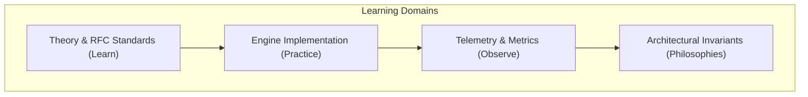
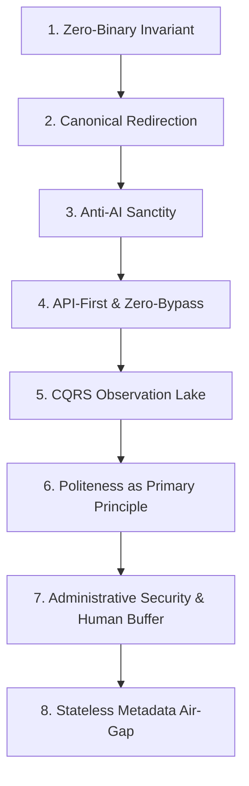

# Curriculum Guide: Topics to Learn, Practice, Observe, and Core Philosophies
This guide will outline the theoretical concepts, practical exercises, telemetry signals, and core philosophies for compliant search engine engineering.

***

## 1. Overview of the Curriculum

Building a high-throughput, compliant search indexer will require knowledge across computer science and law. Engineers must understand network protocols, graph theory, queue dynamics, and copyright jurisprudence.

This curriculum organizes the necessary knowledge into four structured domains:
1. **Topics to Learn**: Foundational theories, RFC standards, and legal precedents.
2. **Topics to Practice**: Practical programming implementations and stress tests.
3. **Topics to Observe**: Real-time telemetry signals and health metrics.
4. **Core Philosophies**: Non-negotiable architectural invariants.



---

## 2. Topics to Learn: Theory, Standards, and Jurisprudence

Engineers will study eight theoretical foundations:

### 1. Frontier Queue Scheduling
Study the Mercator two-level priority and politeness queue model[^1]. Learn how FIFO priority queues (F-queues) and per-host politeness queues (B-queues) prevent server overload. Learn min-heap structures for host ready-time scheduling.

### 2. Web Graph Topology and Traps
Study the Bow-Tie structure of the web graph[^2]. Learn to identify strongly connected components, tendrils, and disconnected tubes. Study crawler traps, infinite calendar loops, and combinatoric faceted search paths.

### 3. Crawl Budget and Refresh Policies
Study Poisson change models for web documents[^3]. Learn the mathematical trade-off between index freshness and crawling coverage under strict network rate limits.

### 4. Internet RFC Standards
- **RFC 9309**: The Robots Exclusion Protocol standard[^4]. Study path matching rules, longest prefix precedence, User-Agent matching, and 24-hour cache lifecycles.
- **RFC 9110**: HTTP Semantics[^5]. Study status codes (`429 Too Many Requests`, `503 Service Unavailable`, `304 Not Modified`), `Retry-After` header parsing, and conditional ETag validation.
- **RFC 3986**: Uniform Resource Identifier (URI) Generic Syntax[^6]. Study URI normalization, scheme and host lowercasing, path segment resolution, and tracking parameter removal.

### 5. Congestion Control and Rate Limiting
Study the Additive Increase / Multiplicative Decrease (AIMD) algorithm[^7]. Learn how AIMD converges to fairness and stability. Study token bucket and leaky bucket traffic shapers[^8]. Study randomized decorrelated jitter to break request synchronization[^9].

### 6. Sub-Linear Duplicate Detection
Study locality-sensitive hashing and 64-bit SimHash algorithms[^10]. Learn random hyperplane rounding and table permutation indexing under the Pigeonhole Principle. Study the Fellegi-Sunter record linkage model and Jaro-Winkler string similarity[^11],[^12].

### 7. Storage Engine Architecture
Study SQLite Write-Ahead Logging (WAL mode) and synchronous disk flush modes[^13],[^14]. Study Command Query Responsibility Segregation (CQRS) and event sourcing[^15]. Learn to separate immutable observation lakes from derived catalog projections.

### 8. Statutory Case Law and Jurisprudence
- *Feist Publications, Inc. v. Rural Telephone Service Co.*: Non-copyrightability of factual directories and metadata specifications[^16].
- *hiQ Labs, Inc. v. LinkedIn Corp.* and *Van Buren v. United States*: Computer Fraud and Abuse Act (CFAA) boundaries on public web data[^17],[^18].
- *Meta Platforms, Inc. v. Bright Data Ltd.*: Enforceability of terms of service against logged-off data collection[^19].
- *Kelly v. Arriba Soft Corp.* and Japanese Copyright Act Article 47-5: Fair use, thumbnails, and economic prejudice provisos[^20],[^21].

---

## 3. Topics to Practice: Practical Engineering Exercises

Engineers will build and test these six core components:

1. **Verify the Authoritative Test Suite**:
   Run the ground-truth test suite using Bun:
   ```bash
   bun test
   ```
   Verify that all 57 tests across 12 files pass with 0 failures (including `tests/schema_unification.test.ts` and `tests/gumroad_driver.test.ts`).
2. **Build Test Isolation Fixtures**:
   Decouple test execution from the production database `dist/crawler_state.db`. Ensure tests instantiate ephemeral in-memory databases (`:memory:`) to eliminate SQLite `busy_timeout` contention.
3. **Build a Min-Heap Politeness Scheduler**:
   Implement a domain scheduler that enforces a strict delay ceiling (such as 3.0 seconds on storefronts). Add randomized jitter and ensure no two requests fire concurrently to the same host.
4. **Build Socket Guardrails with Streaming Aborts**:
   Write HTTP client middleware that inspects `Content-Type` headers before reading data streams. Abort TCP sockets immediately if the response contains binary types (`.unitypackage`, `.fbx`, `.blend`) or exceeds 5 MB.
5. **Build a SimHash Pipeline with CJK Shingling**:
   Build a text normalization pipeline. Strip decorative marketing brackets, normalize full-width Japanese characters to half-width ASCII, and generate 2-gram character shingles.
6. **Implement Disjoint-Set Entity Clustering**:
   Implement a Disjoint-Set Union (DSU) graph algorithm to merge cross-platform product listings by reverse-DNS identifiers and canonical repository URLs.

---

## 4. Topics to Observe: Real-Time Operational Telemetry

Engineers will monitor these six operational telemetry signals:

1. **HTTP Status Code Histograms**:
   Track counts of `200 OK`, `304 Not Modified`, `403 Forbidden`, `404 Not Found`, `429 Rate Limited`, and `503 Unavailable` per domain.
2. **Moving Average Latency (EWMA)**:
   Track the Exponentially Weighted Moving Average of round-trip times per host. Rising response times signal server load before errors occur.
3. **Frontier Discovery Saturation Index ($S$)**:
   Monitor the ratio $S = \text{Processed URLs} / \text{Discovered URLs}$. When saturation exceeds 95 percent ($S \ge 0.95$), halt frontier expansion.
4. **Quarantine Discard Yield**:
   Track the percentage of crawled records moved to quarantine. A healthy filter identifies cosmetic assets and flags 55 to 65 percent of raw listings.
5. **Edge Sync High-Watermark Alignment**:
   Monitor row alignment between local `canonical_packages` and Cloudflare D1 checkpoints. Ensure no rows are skipped following full-wipe projection rebuilds.
6. **Perimeter Challenge Flags**:
   Inspect response headers for Cloudflare challenge indicators (`cf-mitigated: challenge`). When detected, halt raw fetching and switch to partner credentials.

---

## 5. The Eight Core Philosophies of Search Crawling

Every component in this search engine will obey eight foundational philosophies:



1. **The Zero-Binary Invariant**:
   An indexer points users to information. It will never store, mirror, or redistribute creative 3D models, textures, or binary archives.
2. **The Canonical Traffic Redirection Invariant**:
   An indexer is a partner to creators. It will route all commercial intent directly to the artist's original store page for checkout.
3. **The Anti-AI Sanctity**:
   Respect creator ownership of their art. Maintain a strict barrier against machine learning dataset compilation.
4. **The API-First and Zero-Bypass Principle**:
   Use official APIs when available. If edge security blocks access, treat it as a refusal of service. Never deploy CAPTCHA bypass farms or proxy rotators.
5. **The CQRS Immutable Observation Lake**:
   Store raw network data immutably. Program code is disposable and recomputable, network requests and origin server trust are limited resources.
6. **Politeness as a Primary Principle**:
   Rate limits and backoff jitter are not optional settings. They form the core architecture of the engine.
7. **Administrative Security and Human Review Gating**:
   All administrative reports will require authentication via `API_SECRET_TOKEN`. The system will quarantine destructive actions into a human-review buffer (`needs_review`) and will never apply automated delisting without human oversight.
8. **Stateless Metadata Catalog Air-Gap**:
   The crawler engine and public catalog will remain an unauthenticated, stateless, read-only index. User accounts, authentication, bookmarks, and personalization engines will remain strictly air-gapped in external consumer applications.

***

## References

[^1]: A. Heydon and M. Najork, "Mercator: A scalable, extensible Web crawler," *World Wide Web*, vol. 2, no. 4, pp. 219-229, Dec. 1999.

[^2]: A. Broder, R. Kumar, F. Maghoul, P. Raghavan, S. Rajagopalan, R. Stata, A. Tomkins, and J. Wiener, "Graph structure in the Web," *Computer Networks*, vol. 33, no. 1-6, pp. 309-320, 2000.

[^3]: J. Cho and H. Garcia-Molina, "The Evolution of the Web and Implications for an Incremental Crawler," in *Proc. 26th Int. Conf. Very Large Data Bases (VLDB)*, Cairo, Egypt, 2000, pp. 200-209.

[^4]: M. Koster, G. Illyes, H. Zeller, and L. Sassman, "Robots Exclusion Protocol," IETF Standards Track RFC 9309, Sep. 2022. [Online]. Available: https://www.rfc-editor.org/info/rfc9309

[^5]: R. Fielding, M. Nottingham, and J. Reschke, "HTTP Semantics," IETF Standards Track RFC 9110, Jun. 2022. [Online]. Available: https://www.rfc-editor.org/info/rfc9110

[^6]: T. Berners-Lee, R. Fielding, and L. Masinter, "Uniform Resource Identifier (URI): Generic Syntax," IETF RFC 3986 / STD 66, Jan. 2005. [Online]. Available: https://www.rfc-editor.org/info/rfc3986

[^7]: V. Jacobson, "Congestion avoidance and control," in *Proc. ACM SIGCOMM '88 Symp. Communications Architectures and Protocols*, Stanford, CA, USA, 1988, pp. 314-329.

[^8]: J. S. Turner, "New directions in communications (or which way to the information age?)," *IEEE Communications Magazine*, vol. 24, no. 10, pp. 8-15, Oct. 1986.

[^9]: Amazon Web Services, "Exponential Backoff And Jitter," AWS Architecture Blog, 2015. [Online]. Available: https://aws.amazon.com/blogs/architecture/exponential-backoff-and-jitter/

[^10]: G. S. Manku, A. Jain, and A. Das Sarma, "Detecting Near-Duplicates for Web Crawling," in *Proc. 16th Int. Conf. World Wide Web (WWW)*, Banff, Alberta, Canada, 2007, pp. 141-150.

[^11]: I. P. Fellegi and A. B. Sunter, "A Theory for Record Linkage," *Journal of the American Statistical Association*, vol. 64, no. 328, pp. 1183-1210, Dec. 1969.

[^12]: W. E. Winkler, "String Comparator Metrics and Enhanced Decision Rules in the Fellegi-Sunter Model of Record Linkage," in *Proc. Section on Survey Research Methods*, American Statistical Association, 1990, pp. 354-359.

[^13]: SQLite Development Team, "SQLite As An Application File Format," sqlite.org, 2024. [Online]. Available: https://www.sqlite.org/appfileformat.html

[^14]: SQLite Development Team, "Write-Ahead Logging," sqlite.org, 2024. [Online]. Available: https://www.sqlite.org/wal.html

[^15]: M. Fowler, "CQRS (Command Query Responsibility Segregation)," martinfowler.com, 2011. [Online]. Available: https://martinfowler.com/bliki/CQRS.html

[^16]: U.S. Supreme Court, *Feist Publications, Inc. v. Rural Telephone Service Co.*, 499 U.S. 340, 1991.

[^17]: U.S. Court of Appeals for the Ninth Circuit, *hiQ Labs, Inc. v. LinkedIn Corp.*, 31 F.4th 1180, 2022.

[^18]: U.S. Supreme Court, *Van Buren v. United States*, 141 S. Ct. 1638, 2021.

[^19]: U.S. District Court for the Northern District of California, *Meta Platforms, Inc. v. Bright Data Ltd.*, Case No. 3:23-cv-00077-EMC, Jan. 23, 2024.

[^20]: U.S. Court of Appeals for the Ninth Circuit, *Kelly v. Arriba Soft Corp.*, 336 F.3d 811, 2003.

[^21]: Agency for Cultural Affairs of Japan, "Copyright Act of Japan," Article 47-5, amended 2018.
