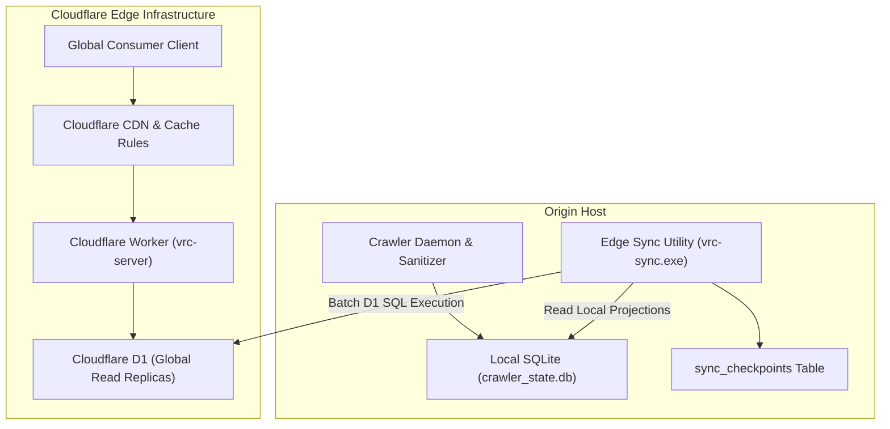
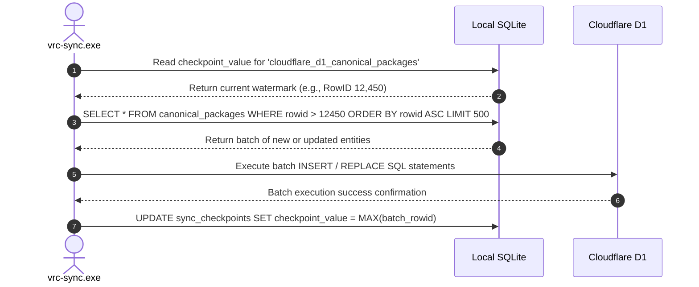
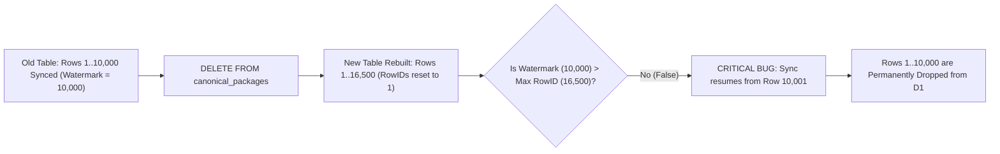

# Edge Synchronization, High-Watermark Replication, and Distributed Catalog Delivery
This guide will explain SQLite-to-Cloudflare D1 incremental synchronization, watermark recovery mechanics, edge cache rules, and distributed catalog delivery.

***

## 1. The Edge Distribution Architecture

A centralized crawler engine will process documents and will write structured catalog entities to a local SQLite database. Serving global read queries directly from a single origin server introduces high latency and server load.

To provide sub-100ms query latency worldwide, the architecture will replicate sanitized catalog projections to a distributed edge network powered by Cloudflare Workers and Cloudflare D1[^1].



---

## 2. Monotonic High-Watermark Synchronization Mechanics

Replicating tens of thousands of catalog records across HTTP network boundaries requires efficient incremental tracking. The synchronization utility (`vrc-sync.exe`) will use a monotonic high-watermark algorithm[^2].



### Checkpoint Storage and Monotonic Increments
The database will persist synchronization state in the `sync_checkpoints` table:
```sql
CREATE TABLE IF NOT EXISTS sync_checkpoints (
    checkpoint_key TEXT PRIMARY KEY,
    checkpoint_value INTEGER NOT NULL,
    updated_at TEXT NOT NULL DEFAULT (datetime('now'))
);
```

By querying records where `rowid > checkpoint_value`, the synchronization utility will transfer only newly inserted or modified packages. This reduces bandwidth consumption and API compute units.

---

## 3. The Full-Wipe Projection Data Loss Pitfall and Recovery

Periodic database sanitation pipelines that execute full-wipe table rebuilds create a critical failure mode in watermark replication:

```sql
DELETE FROM canonical_packages;
DELETE FROM package_fronts;
```

### The Watermark Paradox
When SQLite executes a full table `DELETE`, it resets auto-incrementing `rowid` sequences back to 1.

The synchronization tool checks whether the local table was wiped:
```typescript
if (watermarkRowId > maxRowInDb) {
  watermarkRowId = 0; // Table was wiped and rebuilt with fewer rows
}
```

If the sanitized catalog is rebuilt with more records than the existing watermark (for example, previous watermark was 10,000 and the rebuilt catalog has 16,500 rows), the condition `10,000 > 16,500` will evaluate to `false`.

The synchronization tool will assume it is ahead of the database. It will permanently skip rows 1 through 10,000, omitting those records from Cloudflare D1.



### Operational Recovery and Architectural Invariants
To prevent silent data omission across distributed edge replicas, the system will enforce three invariants:
1. **The Forced Watermark Reset Flag**:
   The synchronization tool will expose an explicit flag (`vrc-sync.exe --reset-watermark`) to reset checkpoints to 0 after full projection rebuilds.
2. **Deterministic High-Watermark Verification SQL**:
   Site reliability engineers will verify local and remote alignment:
   ```sql
   -- Local high-watermark check
   SELECT MAX(rowid) AS local_max_rowid FROM canonical_packages;
   SELECT checkpoint_value FROM sync_checkpoints WHERE checkpoint_key = 'cloudflare_d1_canonical_packages';
   ```
3. **Deterministic UUID Tracking**:
   The database architecture will migrate from mutable SQLite auto-increment `rowid` keys to deterministic UUIDs or generation epoch numbers.

---

## 4. Ephemeral Pass-Through Image Delivery Versus Object Storage

Storefront platforms (including BOOTH and Gumroad) enforce strict hotlinking defenses. They validate HTTP `Referer` headers and generate signed HMAC tokens, returning `HTTP 403 Forbidden` to external client browsers.

Persisting thousands of high-resolution images in Cloudflare R2 object storage incurs high storage costs and creates copyright liability.

```mermaid
flowchart LR
    Client["Client Browser"] -->|GET /api/v1/media/thumb| Proxy["Ephemeral Image Proxy (vrc-server)"]
    Proxy -->|Fetch with Upstream Headers| CDN["Storefront Origin CDN"]
    CDN -->|Original Image Buffer| Proxy
    Proxy -->|Downscale Buffer in RAM (Sharp)| Proxy
    Proxy -->|Stream Optimized WebP| Client
```

The system will deploy an ephemeral in-memory proxy:
- The proxy will fetch upstream images using authenticated server headers.
- The proxy will downscale and convert the buffer to WebP in volatile RAM.
- The proxy will stream the buffer directly to the client with an HTTP `Cache-Control` header.
- The system will never write image binaries to persistent object stores.

---

## 5. Cloudflare CDN Edge Cache Rules

To protect edge database resources, Cloudflare edge proxies will enforce five tiered cache rules[^3]:

| Rule | Route Pattern | Edge Cache TTL | Browser TTL | Stale-While-Revalidate | Description |
| :--- | :--- | :--- | :--- | :--- | :--- |
| **Rule 1** | `/api/v1/packages/catalog.json` | 1 hour | 15 minutes | 24 hours | Immutable canonical package feed |
| **Rule 2** | `/api/v1/packages/search*` | 5 minutes | 1 minute | 10 minutes | Dynamic search and query responses |
| **Rule 3** | `/api/v1/media/*` | 7 days | 1 day | 30 days | Ephemeral downscaled thumbnail cache |
| **Rule 4** | `/v1/reports` | Bypass Cache | Bypass Cache | None | Ingestion endpoint for curator reports |
| **Rule 5** | `/v1/opt-out` | Bypass Cache | Bypass Cache | None | Creator opt-out submission endpoint |

These rules ensure that read-heavy public catalog queries are served from the Cloudflare edge cache, shielding origin infrastructure from traffic spikes.

---

## 6. Web Application Firewall (WAF) and Ingress Protection

Edge gateways will enforce Web Application Firewall (WAF) rate limits to protect public APIs against distributed scraping and denial-of-service attacks[^4]:
- **Public Search Queries**: Rate limit of 60 requests per minute per IP address.
- **Reporting Endpoints**: Rate limit of 10 requests per minute per IP address.
- **Bearer Token Verification**: All mutations (`POST /v1/reports`) will require canonical `API_SECRET_TOKEN` validation. Requests with missing or invalid tokens will be rejected at the edge gateway before querying application workers.

***

## References

[^1]: Cloudflare Inc., "Cloudflare D1: Serverless SQL Database at the Edge," Cloudflare Documentation, 2024. [Online]. Available: https://developers.cloudflare.com/d1/

[^2]: M. Kleppmann, *Designing Data-Intensive Applications: The Big Ideas Behind Reliable, Scalable, and Maintainable Systems*, Sebastopol, CA, USA: O'Reilly Media, 2017.

[^3]: Cloudflare Inc., "Cloudflare Cache Rules and CDN Caching Architecture," Cloudflare Documentation, 2024. [Online]. Available: https://developers.cloudflare.com/cache/how-to/cache-rules/

[^4]: Cloudflare Inc., "Cloudflare Web Application Firewall (WAF) Rate Limiting," Cloudflare Documentation, 2024. [Online]. Available: https://developers.cloudflare.com/waf/rate-limiting-rules/
