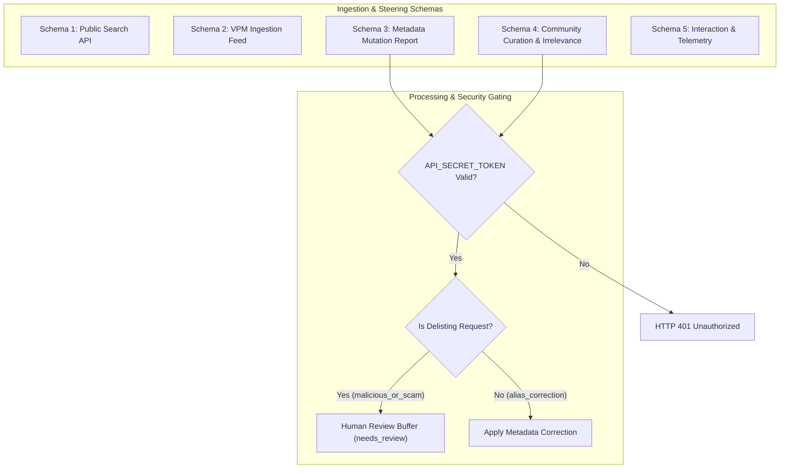
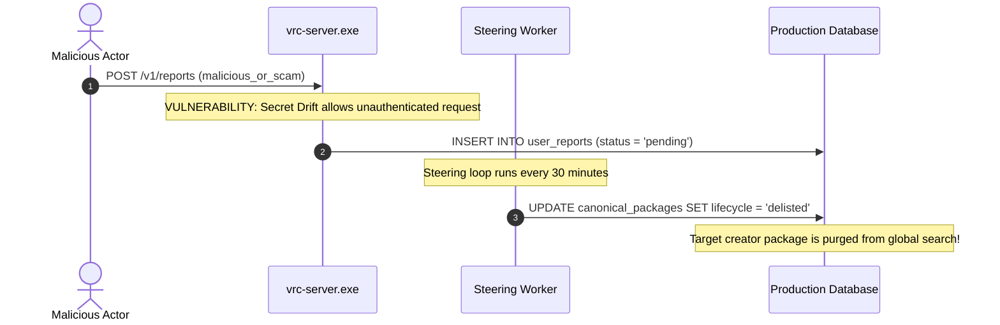

# Telemetry Governance, Multi-Tier Reporting Schemas, and Curator Steering
This guide will explain reporting schemas 1 through 5, curator steering loops, threat modeling against delisting attacks, and privacy-preserving search telemetry.

***

## 1. The Multi-Tier Reporting Architecture

A production search indexer must support bidirectional communication with downstream clients, community curators, and developers. Feedback loops will guide crawl priorities, correct metadata misclassifications, and identify broken listings.

The system will formalize interaction through five structured reporting schemas[^1]:



---

## 2. Comprehensive Schema Specifications

The ecosystem will define five standardized contract schemas:

### Schema 1: Public Search API Feed
Schema 1 will distribute sanitized package records to downstream desktop applications and search frontends:
- Unique canonical identifier (`canonical_id`).
- Package display title, author, and description summary.
- VPM package details (reverse-DNS name, latest semver, download URLs).
- Direct outbound creator storefront deep links.

### Schema 2: VPM Repository Package Ingestion
Schema 2 will parse machine-readable repository manifests (`index.json` and `vpm-manifest.json`):
- Package manifests matching official VRChat Creator Companion standards.
- Dependency trees declared in `vpmDependencies`.
- Upstream Git release tags and package archive URLs.

### Schema 3: Package Metadata Mutation Report
Schema 3 will allow verified package authors and administrators to propose factual corrections:
- Title, display author, and license overrides.
- Invariant Git repository associations.
- Storefront listing links.

### Schema 4: Community Curation and Irrelevance Report
Schema 4 will collect community feedback and issue flags:
- Categorization corrections (e.g., reclassifying misidentified avatar clothing).
- Compatibility flags (PhysBones, Quest performance).
- Irrelevance branches (`not_vrchat_related`, `outdated_broken`, `malicious_or_scam`).

### Schema 5: Downstream Interaction and Search Telemetry
Schema 5 will collect privacy-preserving aggregated engagement metrics from downstream applications:
- Aggregate search query keywords.
- Click-through frequency counts per listing.
- Bookmark additions and removals.
- Missing keyword search results to seed future discovery.

---

## 3. Threat Modeling: Autonomous Delisting Sabotage and Secret Drift

Allowing external feedback endpoints to mutate live database records introduces severe security risks. A critical vulnerability analysis of the Schema 4 ingestion path reveals two attack vectors[^2]:

### The Secret Drift Failure Mode
In earlier revisions, documentation in `AGENT.md` stated that the server authenticated reports using `CRAWLER_API_TOKEN`. 

However, production code in `src/server/index.ts` read:
```typescript
const apiToken = config.apiToken || process.env.API_SECRET_TOKEN;
```

When administrators configured the documented variable (`CRAWLER_API_TOKEN`), the server ran with `API_SECRET_TOKEN` unset. When unset, the authentication check was bypassed entirely, leaving the endpoint open to unauthenticated anonymous requests.

### The Autonomous Delisting Attack
In unauthenticated deployments, an anonymous actor could transmit a Schema 4 payload:
```json
POST /v1/reports
{
  "branch": "irrelevance",
  "irrelevanceReason": "malicious_or_scam",
  "targetPackageId": "canonical-package-target-uuid"
}
```

The background steering loop would execute `UPDATE canonical_packages SET lifecycle = 'delisted'` every 30 minutes. This allowed rogue actors or competitors to purge legitimate creator assets from the global search index without human verification.



---

## 4. Remediation: Canonical Secrets and Human Review Quarantines

To eliminate delisting attacks and ensure catalog integrity, the system will enforce two mandatory controls:

### Canonical Environment Secret Mandate
The system will declare and enforce `API_SECRET_TOKEN` across all codebases and deployment runbooks:
- The server will reject unauthenticated requests with `HTTP 401 Unauthorized` unconditionally.
- The default configuration template will include `API_SECRET_TOKEN`.
- The obsolete identifier `CRAWLER_API_TOKEN` is permanently removed.

### Human Review Buffer (`needs_review`)
Destructive lifecycle mutations will never execute autonomously:
1. When a report specifies `branch = 'irrelevance'` with reason `malicious_or_scam`, the report will enter a quarantine buffer (`status = 'needs_review'`).
2. The package will remain active until an authorized human curator reviews the claim.
3. The steering worker will reject autonomous delisting mutations, preserving catalog availability.

---

## 5. Privacy Preservation in Downstream Search Telemetry

Collecting interaction telemetry must not compromise user privacy. Schema 5 will operate under strict privacy-preserving invariants[^3]:

### The Zero-PII Mandate
Downstream consumer clients will never transmit personal identifiers:
- No user account identifiers or usernames.
- No IP addresses, device identifiers, or hardware serials.
- No personal session tokens.

### Aggregated Batches and Query Hashing
Telemetry data will be aggregated locally before transmission:
- Downstream clients will aggregate search query frequency over rolling 24-hour windows.
- Individual query strings with low frequency (fewer than 5 occurrences) will be dropped to prevent re-identification through unique search phrases.
- High-frequency search queries will inform crawler seed lists, ensuring the engine discovers trending tools without tracking individual browsing behavior.

***

## References

[^1]: VRChat Creator Community, "API Endpoints, Steering Feedback, and Internal Reporting Schemas (Schemas 1-5)," Technical Specification, 2024.

[^2]: OWASP Foundation, "OWASP Top 10 API Security Risks," OWASP Standard, 2023. [Online]. Available: https://owasp.org/API-Security/

[^3]: C. Dwork and A. Roth, "The Algorithmic Foundations of Differential Privacy," *Foundations and Trends in Theoretical Computer Science*, vol. 9, no. 3-4, pp. 211-407, 2014.
