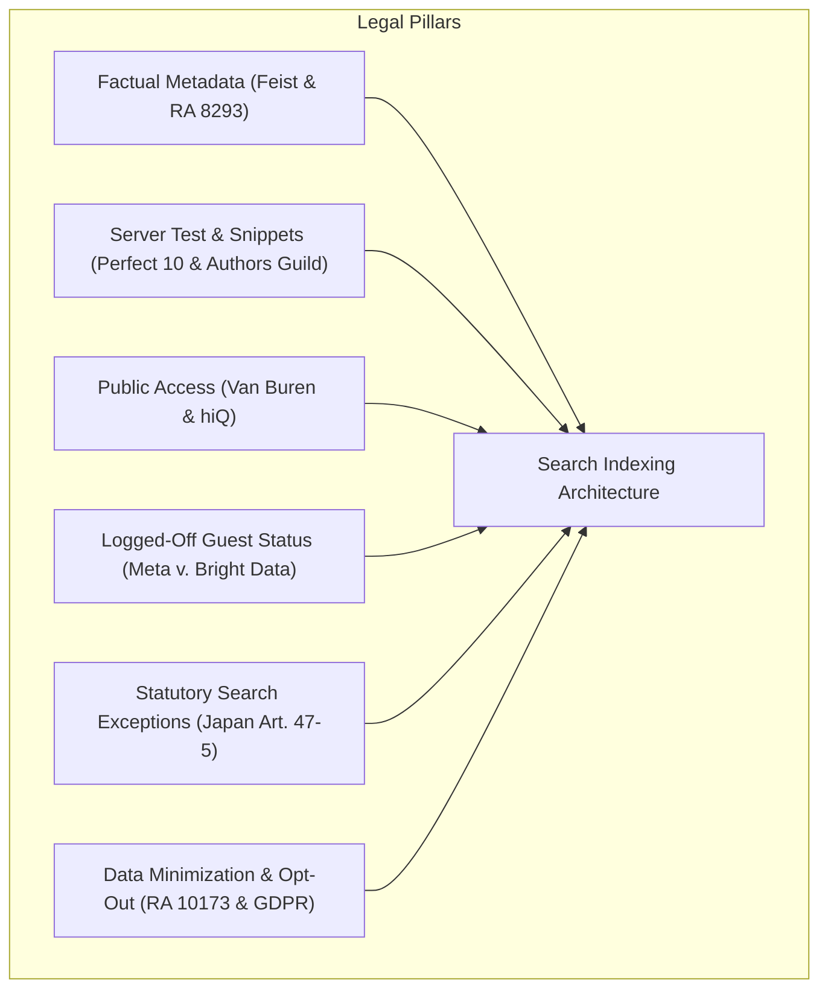
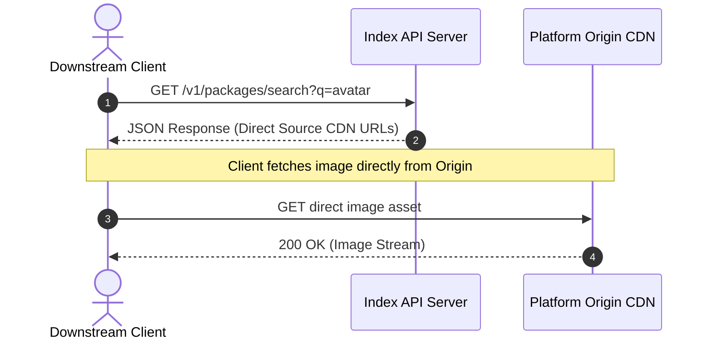
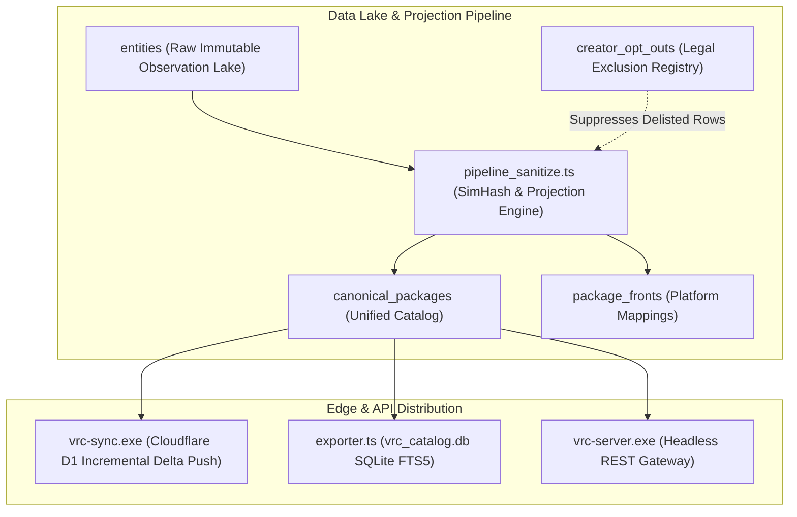

# Legal Jurisprudence, Contractual Assent, and Search Engine Indexing

This guide documents the legal precedents, statutory exceptions, and contractual frameworks for public web indexing.

***

## 1. Overview of Legal Foundations

A public search engine does not get prior licenses for the web. It uses legal exceptions, copyright limits, and fair access principles.

This document reviews six core legal domains:
1. **Copyright Limits on Factual Metadata**: 17 U.S.C. 102(b), Philippine RA 8293, and the *Feist* doctrine.
2. **Transformative Search and the Server Test**: *Kelly v. Arriba Soft*, *Perfect 10 v. Amazon*, and *Authors Guild v. Google*.
3. **Computer Access and Anti-Hacking Law**: CFAA 18 U.S.C. 1030, *Van Buren*, and *hiQ v. LinkedIn*.
4. **Contract Formation and Logged-Off Access**: *Meta v. Bright Data*, *Register.com v. Verio*, and *Southwest v. Kiwi.com*.
5. **International Search Exceptions**: Japanese Copyright Act Articles 30-4 and 47-5, and EU DSM Directive.
6. **Data Privacy and Creator Rights**: Philippine RA 10173, GDPR, and sovereign creator opt-out models.

---

## 2. Copyright Boundaries: Facts Versus Expression

### The Feist Doctrine and Factual Information
Under United States copyright law (17 U.S.C. 102(b)) and Philippine law (Republic Act No. 8293, Section 175), copyright protection does not cover facts. It does not cover procedures, systems, methods of operation, concepts, or discoveries.

In *Feist Publications, Inc. v. Rural Telephone Service Co.* (499 U.S. 340), the U.S. Supreme Court ruled that raw telephone listings lack copyright protection. An indexer can copy and arrange raw factual data without infringement.

### Application to VRChat Package Metadata
The crawler indexes only objective facts from public web pages:
- Package reverse-DNS identifiers (`com.author.tool`).
- Semantic version numbers (`1.2.3`).
- Upstream prices and currency symbols.
- Platform compatibility flags (`Unity 2022`, `PhysBones`, `Quest`).
- Direct Source Storefront URLs.

These fields carry zero copyright protection. Creative marketing descriptions, artwork, and character backstories carry copyright protection. The crawler limits descriptive text to a short functional snippet of at most 256 characters.

---

## 3. Visual Search Indexing and the Server Test

### The Transformative Fair Use Precedents
In *Kelly v. Arriba Soft Corp.* (336 F.3d 811), the Ninth Circuit ruled that search engine thumbnails are transformative fair use. Thumbnails serve as visual pointers to help users locate images. They do not substitute for artistic enjoyment of full images.

In *Authors Guild v. Google, Inc.* (804 F.3d 202), the Second Circuit affirmed that displaying small search snippets is transformative fair use. The search tool helps users find books without creating a market substitute.

### The Ninth Circuit Server Test
In *Perfect 10, Inc. v. Amazon.com, Inc.* (508 F.3d 1146), the Ninth Circuit established the **Server Test**. A platform displays or distributes a work only if the work is stored on its own computer hardware. In-line linking or routing to third-party image URLs does not create direct copyright liability.

### The Server Test Circuit Split
The Server Test does not apply nationwide. In *Goldman v. Breitbart News Network* (271 F. Supp. 3d 495) and *Nicklen v. Sinclair Broadcast Group* (551 F. Supp. 3d 188), the Southern District of New York rejected the Server Test. The court held that framing or embedding an image can violate the display right, even when hosted on a third-party server.

In *Hunley v. Instagram, LLC* (73 F.4th 1060), the Ninth Circuit maintained the Server Test for Instagram embeds, but noted nationwide criticism.

To survive in all jurisdictions, an indexer cannot rely only on the Server Test. It must also ground operations in *Kelly v. Arriba Soft Corp.* transformative fair use:
- The indexer serves as a pure pointer service, delivering direct Source CDN URLs and media links (images, videos, embeds, GIFs) as metadata attachments.
- It avoids storing permanent image binary copies in files or database tables, deprecating local SQLite BLOB caches.
- Interfacing client applications (such as desktop package managers) handle caching and rendering under their own operational and legal frameworks.

---

## 4. Computer Access Law and Anti-Hacking Boundaries

### The CFAA Gates-Up Precedent
The Computer Fraud and Abuse Act (18 U.S.C. 1030) penalizes access to protected computers "without authorization" or "exceeding authorized access."

In *Van Buren v. United States* (141 S. Ct. 1638), the U.S. Supreme Court adopted a gates-up versus gates-down test. A user violates the statute only by accessing areas within a system to which technical barriers block access. Violating a written use policy on permitted areas does not violate the CFAA.

In *hiQ Labs, Inc. v. LinkedIn Corp.* (31 F.4th 1180), the Ninth Circuit applied this rule to public web scraping. Crawling public websites that have no password walls does not constitute access without authorization under the CFAA.

### The Zero-Bypass Safeguard
The crawler operates strictly on the public web. It obeys these technical boundaries:
- It uses zero password credentials or session cookies.
- It does not bypass CAPTCHA screens or Cloudflare challenges.
- It halts operations immediately when an origin responds with HTTP 403 or 429.
- It treats access barriers as an explicit technical refusal of service.

---

## 5. Contractual Assent and Logged-Off Access

### The Meta Platforms v. Bright Data Precedent
In *Meta Platforms, Inc. v. Bright Data Ltd.* (No. 23-cv-00077-EMC, N.D. Cal. Jan. 23, 2024), the court issued summary judgment in favor of Bright Data:
- Meta's Terms of Service bind registered account holders while logged into the platform.
- Scraping public data while logged out does not breach those terms.
- A public visitor who never agrees to Terms of Service does not form a contract.
- Contract survival clauses do not prevent logged-off access to public data.

### Limits from Southwest Airlines and Register.com
Courts enforce terms against automated crawlers under specific conditions:
- In *Register.com, Inc. v. Verio, Inc.* (356 F.3d 393), repeated queries with actual knowledge of restrictions formed a contract.
- In *Southwest Airlines Co. v. Kiwi.com, Inc.* (N.D. Tex. 2021), Kiwi had actual notice via cease-and-desist letters and agreed to terms during ticket purchases.

To prevent contract formation, this project enforces three rules:
1. **Logged-Out Execution**: The crawler runs in an isolated guest state without personal accounts.
2. **Zero Purchases**: The software never buys items, clicks checkout links, or registers user profiles.
3. **Immediate Delisting**: The maintainer halts crawling and purges records upon receipt of an objection from a rights holder.

---

## 6. International Statutory Exceptions

### The Japanese Copyright Act (Articles 30-4 and 47-5)
Storefronts like BOOTH.pm operate under Japanese jurisdiction. The Japanese Copyright Act includes explicit search engine exceptions:
- **Article 30-4 (Data Analysis Exception)**: Allows processing of works for machine data analysis where there is no intent to enjoy creative expression.
- **Article 47-5 (Information Retrieval Exception)**: Allows minor exploitation of works for computerized information retrieval and search engines.
- **The Economic Prejudice Proviso**: Article 47-5 does not apply if exploitation unreasonably prejudices the economic interests of the copyright holder.

The crawler respects this proviso:
- It routes all checkout traffic to the original creator on BOOTH.pm.
- It enforces strict rate limits (3.0 to 5.0 seconds per request).
- It preserves creator attribution and store links.

### Philippine Intellectual Property and E-Commerce Law
The maintainer resides in the Republic of the Philippines. Local statutes govern the project:
- **Republic Act No. 8293, Section 175**: Raw data and factual specifications carry no copyright protection.
- **Republic Act No. 8293, Section 173.2**: Original selection, coordination, and schema arrangement in a database receive compilation protection.
- **Republic Act No. 8792 (E-Commerce Act), Section 30**: Provides safe harbor limits for online search directories and network intermediaries.

---

## 7. Data Privacy and Data-Subject Sovereignty

### Statutory Framework (Philippine RA 10173 and GDPR)
Public creator handles, store links, and usernames can constitute personal data under the Philippine Data Privacy Act of 2012 (Republic Act No. 10173) and the EU General Data Protection Regulation (GDPR).

The project processes this data under the **Legitimate Interest** basis:
- Republic Act No. 10173, Section 12(f).
- GDPR, Article 6(1)(f).

The legitimate interest is package discovery, creator attribution, and community toolchain interoperability.

### Creator Rights and Delisting Channels
Data subjects have statutory rights to information, objection, access, rectification, and erasure (blocking).

The project provides three delisting pathways:
1. **Direct Delisting Email**: Creators can email `slamthedragon@gmail.com` with a 48-hour response SLA.
2. **Non-Scraping Domain Verification**: Creators can add a DNS TXT record (`vrc-opt-out=<vendor-id>`) or a signed Git commit.
3. **Automated API Endpoint**: The server provides an automated delisting interface (`POST /v1/opt-out`).

Matching records change immediately to `lifecycle = 'delisted'` and leave all public feeds.

---

## 8. Platform Terms of Service Comparison Matrix

| Platform | Primary Terms Clause | Search Engine Status | Required Pacing | Project Compliance Posture |
| :--- | :--- | :--- | :--- | :--- |
| **BOOTH.pm (pixiv Inc.)** | Master Terms Art. 14 (commercial extraction and load ban) | Covered under Japanese Copyright Act Art. 47-5 | 3.0 to 5.0 seconds delay | Logged-out access, zero asset storage, direct store redirection. |
| **Gumroad, Inc.** | Terms Section 14(e) | **Explicit search exception**: Permits spiders creating searchable indices, but bans caches/archives | 2.0 to 4.0 seconds delay | Fully compliant: Builds public search index, stores zero file caches. |
| **Jinxxy Technologies** | Terms Section 8.2 & 23 (unauthorized scraper ban) | No written exception | 3.0 to 5.0 seconds delay | Logged-out guest access, RFC 9309 compliance, immediate opt-out SLA. |
| **itch.io (itch corp.)** | Terms Section 3 (harvesting and server degradation ban) | Developer friendly | Conservative pacing | Prefers official developer APIs; routes 100% of traffic to origin store. |
| **GitHub, Inc.** | Acceptable Use Policy | API-first policy with archival and research allowances | Token bucket rate limits | Uses official REST and GraphQL APIs with conditional ETag validation. |
| **VRCArena** | Open-source community directory; `robots.txt Allow: /` | Directory indexing permitted | API federation only | **Zero HTML DOM scraping**; uses bilateral API or static catalog dumps. |

---

## 9. Downstream Governance and Anti-AI Covenants

### Mandatory Downstream Covenants
Downstream applications that consume API feeds or SQLite databases agree to these covenants:
1. **Mandatory Storefront Attribution**: Applications must display direct links to the original creator storefront on all search cards.
2. **No Commercial Paywalls**: Downstreams must not gate indexed factual metadata behind payment walls.
3. **256-Character Snippet Cap**: Downstreams must not display or store more than 256 characters of creative descriptions.
4. **Zero-PII Telemetry**: Downstreams must strip all IP addresses, user accounts, and session tokens from telemetry feeds (Schema 5).
5. **Anti-AI Covenant**: Downstreams must not use exported catalogs, visual hashes, or metadata feeds to train generative artificial intelligence models.

---

## 10. Technical Specifications and Architecture (Reference)

### Invariant Checklist for Engineering Review
- [x] Unauthenticated logged-out crawling only.
- [x] Zero binary downloads (`.unitypackage`, `.vpmz`, `.zip`, `.blend`, `.fbx`).
- [x] RFC 9309 `robots.txt` compliance with 24-hour directive caching.
- [x] AIMD rate limiting with decorrelated jitter.
- [x] Three-state timestamp rubric (`confirmed`, `inferred`, `unknown` with NULL).
- [x] Direct Source Storefront URL deep-linking on all API endpoints.
- [x] Anti-AI data covenant on exported catalogs and APIs.
- [x] Verified non-scraping delisting pathways with 24 to 48 hour SLA.

---

## 11. Table of Authorities and Scholarly References

### Judicial Precedents (United States)
- *Authors Guild v. Google, Inc.*, 804 F.3d 202 (2d Cir. 2015).
- *Feist Publications, Inc. v. Rural Telephone Service Co.*, 499 U.S. 340, 111 S. Ct. 1282, 113 L. Ed. 2d 358 (1991).
- *Goldman v. Breitbart News Network, LLC*, 271 F. Supp. 3d 495 (S.D.N.Y. 2018).
- *hiQ Labs, Inc. v. LinkedIn Corp.*, 31 F.4th 1180 (9th Cir. 2022).
- *Hunley v. Instagram, LLC*, 73 F.4th 1060 (9th Cir. 2023).
- *Kelly v. Arriba Soft Corp.*, 336 F.3d 811 (9th Cir. 2003).
- *Meta Platforms, Inc. v. Bright Data Ltd.*, No. 3:23-cv-00077-EMC, 2024 WL 245903 (N.D. Cal. Jan. 23, 2024).
- *New Kids on the Block v. News America Publishing, Inc.*, 971 F.2d 302 (9th Cir. 1992).
- *Nicklen v. Sinclair Broadcast Group, Inc.*, 551 F. Supp. 3d 188 (S.D.N.Y. 2021).
- *Perfect 10, Inc. v. Amazon.com, Inc.*, 508 F.3d 1146 (9th Cir. 2007).
- *Register.com, Inc. v. Verio, Inc.*, 356 F.3d 393 (2d Cir. 2004).
- *Southwest Airlines Co. v. Kiwi.com, Inc.*, No. 3:21-cv-00098, 2021 WL 4952481 (N.D. Tex. Oct. 25, 2021).
- *Van Buren v. United States*, 593 U.S. 374, 141 S. Ct. 1638, 210 L. Ed. 2d 26 (2021).

### Statutory Authorities
- 17 U.S.C. Section 102(b) (Non-copyrightability of ideas, systems, and facts).
- 17 U.S.C. Section 512(d) (Limitations on liability for information location tools).
- 18 U.S.C. Section 1030 (Computer Fraud and Abuse Act).
- Republic of the Philippines, Republic Act No. 8293, Sections 173.2 and 175 (Intellectual Property Code of the Philippines, 1997).
- Republic of the Philippines, Republic Act No. 8792, Section 30 (Electronic Commerce Act of 2000).
- Republic of the Philippines, Republic Act No. 10173, Sections 12(f) and 16 (Data Privacy Act of 2012).
- Agency for Cultural Affairs of Japan, Copyright Act of Japan, Act No. 48 of 1970, Articles 30-4 and 47-5 (Amended 2018).
- Japanese Civil Code, Act No. 89 of 1896, Article 548-2 (Standard Form Contracts).

### Technical Standards and Scholarly Sources
- IETF RFC 9110, *HTTP Semantics*, June 2022.
- IETF RFC 9309, *Robots Exclusion Protocol*, September 2022.
- A. C. Tricco et al., "PRISMA Extension for Scoping Reviews (PRISMA-ScR): Checklist and Explanation," *Annals of Internal Medicine*, vol. 169, no. 7, pp. 467-473, Oct. 2018.
- General Legal Templates, *Website Terms of Use (CC0 1.0 Universal)*, github.com/General-Legal/legal-templates, 2024.

